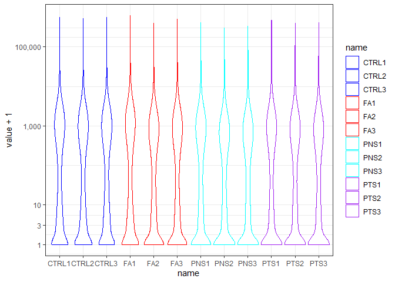

# Exploratory Data Analysis

The goal is to explore if:

-   Are there any outlier samples?

-   Are the count distributions are similar across all samples?

-   Do gene expression variability aligns with experimental conditions?

## Sample pre-processing

First we standardized the sample names. Although the number of samples
is not consecutive, we decided to keep the original numbers for most
samples to be able to trace them back to the fastq files.

The experimental conditions are described as:

Obese male C57B6J

-   **V**: Vehicle

-   **S:** Diet supplemented with Semaglutide

-   **PF:** Pair-fed diet, same calories as semaglutide group


```r
exp_data <- fread(file.path(data_path, "Salmon_EstCount_ENSG.tsv"), header = TRUE)
```

## Count distribution

By looking at the density plots of the expression data it is possible to
determine if any sample is a clear outlier.


```r
exp_data %>%
  pivot_longer(!ENSG) %>%
  ggplot(aes(x=value + 1, color = name)) +
    geom_density() +
    scale_x_continuous(trans = 'log10', labels = scales::comma) + 
  labs(x = "Estimated counts + 1", y = "Density")
```

<!-- -->

Seems like most genes have too few reads so we remove genes without
counts across all samples. Then we repeat the density plot.


```r
exp_data <- exp_data[rowSums(exp_data[, .SD, .SDcols = !"ENSG"] == 0) < ncol(exp_data)-1]
exp_data %>%
  pivot_longer(!ENSG) %>%
  ggplot(aes(x=value + 1, color = name)) +
    geom_density() +
    scale_x_continuous(trans = 'log10', labels = scales::comma)+ 
  labs(x = "Estimated counts + 1", y = "Density")
```

<!-- -->

To identify if any given experimental condition has any spefici bias in
library size, we colored the samples accordingly: blue - vehicle, red -
parid fed, and green - semi.


```r
temp <- exp_data %>%
  pivot_longer(!ENSG) %>%
  mutate(condition = gsub(pattern = "\\d+", replacement = "", x = name)) %>%
  mutate(condition = case_when(
    condition == "CTRL" ~ "blue",
    condition == "FA" ~ "red",
    condition == "PNS" ~ "cyan",
    condition == "PTS" ~ "purple"))


temp %>%
  ggplot(aes(x=value + 1, color= name))+
  geom_density() +
  scale_x_continuous(trans = 'log10', labels = scales::comma) +
  scale_color_manual(values = temp$condition, 
                     breaks = temp$name) 
```

<!-- -->

```r
temp %>%
  ggplot(aes(x = name, y = value + 1, color= name))+
  geom_violin() +
  scale_y_continuous(trans = 'log10', labels = scales::comma, 
                     breaks = c(1, 3, 10, 1000, 100000)) +
  scale_color_manual(values = temp$condition, 
                     breaks = temp$name) 
```

<!-- -->

We can observe that all samples have similar expression trends.

### Filter lowly expressed genes

To increase data quality we removed lowly expressed genes in two steps:

1.  Removed genes with no counts across all samples.

Since we already filtered for 0 counts, we'll try with at least 1 read


```r
# Remove columns with gene information 
exp_mat <- exp_data %>%
  column_to_rownames("ENSG")
# Remove rows with all entries equal zero
exp_mat <- exp_mat[!(rowSums(exp_mat <= 2) == ncol(exp_mat)),]
```

2.  Removed genes with less than two reads in more than 12 samples.


```r
# We use the average 1st quartile as threshold (2.55), round down to 2
# floor(mean(apply(exp_mat, MARGIN = 2, quantile, 0.25)))

# Select genes to keep
min_reads <- 4
min_samples <- 10
genes_to_keep <- apply(exp_mat >= min_reads, 
                       MARGIN = 1, sum) > min_samples

# Final gene count matrix
exp_mat <- exp_mat[genes_to_keep,]
```


Now we repeat the previous visualizations to explore how the count
distributions changed after filtering


```r
exp_mat %>%
  rownames_to_column("ENSG") %>%
  pivot_longer(!ENSG) %>%
  ggplot(aes(x=value + 1, color = name)) +
    geom_density() +
    scale_x_continuous(trans = 'log10', labels = scales::comma)
```

<!-- -->


```r
temp <- exp_mat  %>%
  rownames_to_column("ENSG") %>%
  pivot_longer(!ENSG) %>%
  mutate(condition = gsub(pattern = "\\d+", replacement = "", x = name)) %>%
  mutate(condition = case_when(
    condition == "CTRL" ~ "blue",
    condition == "FA" ~ "red",
    condition == "PNS" ~ "cyan",
    condition == "PTS" ~ "purple"))

temp %>%
  ggplot(aes(x=value + 1, color= name))+
  geom_density() +
  scale_x_continuous(trans = 'log10', labels = scales::comma) +
  scale_color_manual(values = temp$condition, 
                     breaks = temp$name) 
```

<!-- -->

```r
temp %>%
  ggplot(aes(x = name, y = value + 1, color= name))+
  geom_violin() +
  scale_y_continuous(trans = 'log10', labels = scales::comma, 
                     breaks = c(1, 3, 10, 1000, 100000)) +
  scale_color_manual(values = temp$condition, 
                     breaks = temp$name) 
```

<!-- -->

This step made samples distributions to look mostly normal on the
log10 + 1 scale. 

## CPM normalization

Before proceeding to further analysis we need to normalize the gene
counts, we will use *counts per million* (CPM) to adjust for library
size and transform it to log space for better visualization.


```r
# CPM normalization and transform to log2
expr_log2cpm <- cpm(exp_mat, 
                    log = TRUE, 
                    prior.count = 1) %>% 
  data.frame() 

expr_log2cpm %>%
  rownames_to_column(var = "ENSG") %>%
  pivot_longer(!ENSG) %>%
  dplyr::select(!ENSG) %>%
  ggplot(aes(x=value, color= name))+
  geom_density() 
```

<!-- -->

### Violin plots

To directly compare sample gene expression distribution without overlap
between density plots we generated the respective violin plots


```r
temp <- expr_log2cpm %>%
  rownames_to_column("ENSG") %>%
  pivot_longer(!ENSG) %>%
  mutate(condition = gsub(pattern = "\\d+", replacement = "", x = name)) %>%
  mutate(condition = case_when(
    condition == "CTRL" ~ "blue",
    condition == "FA" ~ "red",
    condition == "PNS" ~ "cyan",
    condition == "PTS" ~ "purple"))


temp %>%
  ggplot(aes(x = name, y = value, color= name))+
  geom_violin() +
  scale_y_continuous(breaks = c(1, 3, 10, 1000, 100000)) +
  scale_color_manual(values = temp$condition, 
                     breaks = temp$name) 
```

<!-- -->


### Sample-sample correlation plot

Using normalized counts we generated a plot to observe if there is
correlation within diet groups which would group the samples
accordingly.


```r
# Annotation

# Standardize conditon names
condition <- names(expr_log2cpm) %>% 
  str_extract(pattern = "^(CTRL|FA|PNS|PTS)")

annot <- data.frame(Diet = as.factor(condition),
                    row.names = names(expr_log2cpm))


annot_colors <- list(Diet = c("CTRL" = "blue", 
                              "FA" = "red", 
                              "PNS" = "cyan",
                               "PTS" = "purple"))

# Heatmap            
expr_log2cpm %>%
  cor(method = "spearman") %>%
  pheatmap(annotation_col = annot,
           annotation_row = annot,
           show_rownames = FALSE, 
           annotation_colors = annot_colors, 
           angle_col = 45)
```

<!-- -->


### Principal Component Analysis (PCA)

Another way of determining relationship between the samples is through a
PCA analysis, which reduces the dimentionality of our data to a set of
independent variables (principal components) that represent the major
proportion of variability in our data.


```r
PCs <- prcomp(t(cpm(exp_mat)), center = TRUE, scale = TRUE)
# Scree plot 
fviz_eig(PCs)
```

<!-- -->

```r
# Scatter plot
eig_val <- get_eigenvalue(PCs)
PCs <- cbind(annot, PCs$x[,1:10])
PCs$sample_id <- rownames(PCs)

PCs <- PCs %>%
  mutate(color_class = case_when(
    condition == "CTRL" ~ "blue",
    condition == "FA" ~ "red",
    condition == "PNS" ~ "cyan",
    condition == "PTS" ~ "purple"))

PCs %>%
  ggplot(aes(x = PC1, y = PC2, 
             color = condition)) + 
  geom_point(aes(size = 8)) + 
  scale_color_manual(values = PCs$color_class, 
                     breaks = PCs$Diet) +
  labs(x= paste("PC1 (",round(eig_val$variance.percent[1], 2),"%)", sep = ""),
       y= paste("PC2 (",round(eig_val$variance.percent[2], 2),"%)", sep = ""),
       color = "Condition")+
  guides(size = "none") +
  theme_bw()
```

<!-- -->

```r
PCs %>%
  ggplot(aes(x = PC3, y = PC2, 
             color = Diet)) + 
  geom_point(aes(size = 8)) + 
  scale_color_manual(values = PCs$color_class, 
                     breaks = PCs$Diet) +
  labs(x= paste("PC3 (",round(eig_val$variance.percent[3], 2),"%)", sep = ""),
       y= paste("PC2 (",round(eig_val$variance.percent[2], 2),"%)", sep = ""))+
  guides(size = "none") +
  theme_bw()
```

<!-- -->

The scree plot shows that the three first PCs contain most of the
expression variability in the dataset. Plotting the first two PCs single
out one of the vehicle samples as a potential outlier, in particular
along the fist PCS. There was not any clear clustering of the samples
based on experimental conditions.

#### Clustering and PCA on top variable genes

For scenarios where experimental variability is expected to be low, it
is worth looking at genes with the highest overall variability. If we
expect a few differentially expressed genes, the signal is likely to get
lost among many genes with no expression changes.


```r
temp <- DESeq2::vst(as.matrix(ceiling(exp_mat)))
```

```
## converting counts to integer mode
```

```r
#Top 10% variable
index <- which( rownames(temp) %in% names(sort(apply(X = temp, 
                                                     MARGIN = 1, 
                                                     var), 
                                               decreasing = TRUE)[1:ceiling(nrow(temp) * 0.2)]))
temp <- temp[index,]

PCs <- prcomp(t(temp), center = TRUE, scale = TRUE)
# Scree plot 
fviz_eig(PCs)
```

<!-- -->

```r
# Scatter plot
eig_val <- get_eigenvalue(PCs)
PCs <- cbind(annot, PCs$x[,1:10])
PCs$sample_id <- rownames(PCs)

PCs <- PCs %>%
  mutate(color_class = case_when(
    condition == "CTRL" ~ "blue",
    condition == "FA" ~ "red",
    condition == "PNS" ~ "cyan",
    condition == "PTS" ~ "purple")) 

PCs %>%
  ggplot(aes(x = PC1, y = PC2, 
             color = condition)) + 
  geom_point(aes(size = 8)) + 
  scale_color_manual(values = PCs$color_class, 
                     breaks = PCs$Diet) +
  labs(x= paste("PC1 (",round(eig_val$variance.percent[1], 2),"%)", sep = ""),
       y= paste("PC2 (",round(eig_val$variance.percent[2], 2),"%)", sep = ""))+
  guides(size = "none") +
  theme_bw()
```

<!-- -->

```r
PCs %>%
  ggplot(aes(x = PC3, y = PC2, 
             color = Diet)) + 
  geom_point(aes(size = 8)) + 
  scale_color_manual(values = PCs$color_class, 
                     breaks = PCs$Diet) +
  labs(x= paste("PC3 (",round(eig_val$variance.percent[3], 2),"%)", sep = ""),
       y= paste("PC2 (",round(eig_val$variance.percent[2], 2),"%)", sep = ""))+
  guides(size = "none") +
  theme_bw()
```

<!-- -->

Considering only the top 20% variable genes, most of the expression
differences between samples could be explained by the first two PCs.


## EDA conclusions.

TBD


# DESeq2 analysis

After verifying the data was correctly processed, we performed a differential expression analysis using DESeq2.

The groups tested were:


```r
deseq2_res <- fread("~/GitHub/RNAseq_amelie/output/DEG_results.tsv")
unique(deseq2_res$Group)
```

```
## [1] "FA_vs_Ctrl" "PNS_vs_FA"  "PTS_vs_FA"
```
For this analysis the DEG threshold for the adjusted pvalues is 0.05, and 1 for the log2FC. Thus, a gene needs to show a Fold Change of at least 2 and pass the FDR threshold of 0.05


```r
alpha <- 0.05
log2FC <- 1
```


## Fatty Acid vs Control

This is the baseline expression differences.


```r
de_res <- deseq2_res[Group == "FA_vs_Ctrl"]
de_res[ , Group := NULL]
de_res[ , ensembl_gene_id := NULL]
de_res[ , entrezgene_id := NULL]
setnames(de_res, "external_gene_name", "geneID")
de_res[padj <= alpha, ]
```

<div data-pagedtable="false">
  <script data-pagedtable-source type="application/json">
{"columns":[{"label":["geneID"],"name":[1],"type":["chr"],"align":["left"]},{"label":["baseMean"],"name":[2],"type":["dbl"],"align":["right"]},{"label":["log2FoldChange"],"name":[3],"type":["dbl"],"align":["right"]},{"label":["lfcSE"],"name":[4],"type":["dbl"],"align":["right"]},{"label":["stat"],"name":[5],"type":["dbl"],"align":["right"]},{"label":["pvalue"],"name":[6],"type":["dbl"],"align":["right"]},{"label":["padj"],"name":[7],"type":["dbl"],"align":["right"]}],"data":[{"1":"GCLC","2":"2859.21229","3":"1.0554069","4":"0.09757582","5":"10.816275","6":"2.882547e-27","7":"5.657479e-24"},{"1":"CYP26B1","2":"89.23757","3":"-1.5811948","4":"0.34881363","5":"-4.533065","6":"5.813397e-06","7":"3.680568e-04"},{"1":"PDK4","2":"5054.67923","3":"2.2201564","4":"0.11572319","5":"19.185061","6":"4.933648e-82","7":"5.809864e-78"},{"1":"SLC25A13","2":"714.79534","3":"-0.5264015","4":"0.17537302","5":"-3.001610","6":"2.685556e-03","7":"4.402131e-02"},{"1":"DHX33","2":"1348.30005","3":"-0.3103181","4":"0.08631833","5":"-3.595043","6":"3.243386e-04","7":"8.986850e-03"},{"1":"GDE1","2":"2667.37542","3":"0.2437267","4":"0.08057586","5":"3.024810","6":"2.487891e-03","7":"4.173419e-02"},{"1":"RPUSD1","2":"634.15299","3":"-0.4587406","4":"0.11927890","5":"-3.845949","6":"1.200867e-04","7":"4.208754e-03"},{"1":"CYB561","2":"1440.01300","3":"0.4137241","4":"0.10492022","5":"3.943226","6":"8.039298e-05","7":"3.134794e-03"},{"1":"MGST1","2":"7700.12973","3":"0.2961123","4":"0.08012293","5":"3.695724","6":"2.192607e-04","7":"6.603616e-03"},{"1":"RHOBTB2","2":"2059.52112","3":"-0.6131662","4":"0.10776028","5":"-5.690095","6":"1.269689e-08","7":"1.941799e-06"},{"1":"STARD3NL","2":"868.86789","3":"0.3388662","4":"0.10808760","5":"3.135107","6":"1.717916e-03","7":"3.136462e-02"},{"1":"CD9","2":"1990.08522","3":"-0.2595758","4":"0.08640786","5":"-3.004076","6":"2.663885e-03","7":"4.381272e-02"},{"1":"NUB1","2":"2269.20186","3":"0.3589992","4":"0.11369748","5":"3.157495","6":"1.591309e-03","7":"2.965071e-02"},{"1":"UFL1","2":"1626.69628","3":"0.3105403","4":"0.08306652","5":"3.738453","6":"1.851559e-04","7":"5.898058e-03"},{"1":"SNAI2","2":"1024.03695","3":"-0.6433591","4":"0.12445909","5":"-5.169242","6":"2.350456e-07","7":"2.661440e-05"},{"1":"OSBPL5","2":"3660.97621","3":"-0.5023343","4":"0.09065426","5":"-5.541210","6":"3.003881e-08","7":"4.313866e-06"},{"1":"SLC45A4","2":"267.33482","3":"-0.6264932","4":"0.17457318","5":"-3.588714","6":"3.323134e-04","7":"9.131188e-03"},{"1":"ERP44","2":"2312.33129","3":"0.3062969","4":"0.08819171","5":"3.473080","6":"5.145213e-04","7":"1.275036e-02"},{"1":"ALAS1","2":"1575.75910","3":"0.2682999","4":"0.08119064","5":"3.304567","6":"9.512329e-04","7":"2.029297e-02"},{"1":"GCLM","2":"753.10602","3":"0.6805855","4":"0.13969450","5":"4.871956","6":"1.104986e-06","7":"9.036330e-05"},{"1":"KPNA6","2":"3449.58464","3":"0.2322099","4":"0.07295522","5":"3.182910","6":"1.458031e-03","7":"2.773793e-02"},{"1":"VIM","2":"41456.94394","3":"-0.2747594","4":"0.06224201","5":"-4.414371","6":"1.013039e-05","7":"5.763069e-04"},{"1":"BTN3A1","2":"389.15896","3":"0.7943971","4":"0.16820015","5":"4.722927","6":"2.324738e-06","7":"1.619888e-04"},{"1":"BMAL2","2":"1577.51371","3":"0.3327137","4":"0.08791162","5":"3.784639","6":"1.539319e-04","7":"5.149721e-03"},{"1":"SLC39A9","2":"2678.79104","3":"0.3583505","4":"0.09171253","5":"3.907323","6":"9.332427e-05","7":"3.486372e-03"},{"1":"HMGB3","2":"2180.61986","3":"-0.6216726","4":"0.09373025","5":"-6.632572","6":"3.298882e-11","7":"8.265454e-09"},{"1":"FUT8","2":"368.58920","3":"-0.7243703","4":"0.20848764","5":"-3.474404","6":"5.119898e-04","7":"1.274323e-02"},{"1":"THAP3","2":"384.15252","3":"0.4175273","4":"0.13820222","5":"3.021133","6":"2.518303e-03","7":"4.188635e-02"},{"1":"HSPA5","2":"32137.45548","3":"0.6259218","4":"0.07690123","5":"8.139295","6":"3.975853e-16","7":"2.754097e-13"},{"1":"ROS1","2":"255.25960","3":"-0.6271561","4":"0.20374191","5":"-3.078189","6":"2.082628e-03","7":"3.649558e-02"},{"1":"TSPAN17","2":"834.05474","3":"-0.3096602","4":"0.09471780","5":"-3.269292","6":"1.078168e-03","7":"2.219669e-02"},{"1":"RRM2B","2":"3889.43244","3":"0.2553759","4":"0.07766673","5":"3.288099","6":"1.008663e-03","7":"2.117294e-02"},{"1":"LTBP1","2":"1927.45432","3":"-0.3980824","4":"0.10557017","5":"-3.770785","6":"1.627350e-04","7":"5.368921e-03"},{"1":"CLPTM1L","2":"1647.88134","3":"-0.3233525","4":"0.10256239","5":"-3.152740","6":"1.617459e-03","7":"2.999559e-02"},{"1":"NEDD4L","2":"2875.28771","3":"-0.4168966","4":"0.13269932","5":"-3.141663","6":"1.679911e-03","7":"3.076615e-02"},{"1":"HERPUD1","2":"3239.17739","3":"0.4821428","4":"0.09888721","5":"4.875684","6":"1.084323e-06","7":"8.992243e-05"},{"1":"MSMO1","2":"9608.52119","3":"0.5043699","4":"0.13776653","5":"3.661048","6":"2.511856e-04","7":"7.376462e-03"},{"1":"FOXN3","2":"767.55216","3":"-0.4161749","4":"0.10678526","5":"-3.897306","6":"9.726856e-05","7":"3.578366e-03"},{"1":"MRTO4","2":"836.79334","3":"-0.3029603","4":"0.09103897","5":"-3.327809","6":"8.753176e-04","7":"1.898295e-02"},{"1":"KIF1B","2":"2268.42533","3":"0.3985251","4":"0.09182063","5":"4.340257","6":"1.423163e-05","7":"7.687689e-04"},{"1":"FAM168A","2":"2556.09191","3":"0.2575305","4":"0.07247778","5":"3.553234","6":"3.805256e-04","7":"1.012908e-02"},{"1":"PKP2","2":"1546.99744","3":"-0.4121270","4":"0.10330278","5":"-3.989505","6":"6.621135e-05","7":"2.697941e-03"},{"1":"SEC61A1","2":"11467.67196","3":"0.3583006","4":"0.06583133","5":"5.442707","6":"5.247705e-08","7":"7.022383e-06"},{"1":"CAMK2B","2":"239.70412","3":"-1.5155524","4":"0.26260407","5":"-5.771245","6":"7.868798e-09","7":"1.286986e-06"},{"1":"ZC3H11A","2":"6110.51382","3":"0.3004066","4":"0.06230212","5":"4.821772","6":"1.422883e-06","7":"1.109660e-04"},{"1":"HIPK2","2":"4394.31601","3":"0.4928471","4":"0.11028863","5":"4.468703","6":"7.869533e-06","7":"4.591939e-04"},{"1":"TNPO3","2":"3756.77170","3":"0.1839896","4":"0.06086562","5":"3.022883","6":"2.503790e-03","7":"4.188635e-02"},{"1":"CNN2","2":"10303.84817","3":"-0.1882739","4":"0.06018352","5":"-3.128329","6":"1.758031e-03","7":"3.185011e-02"},{"1":"TRAM2","2":"212.54088","3":"-0.6162471","4":"0.20709047","5":"-2.975739","6":"2.922840e-03","7":"4.682906e-02"},{"1":"ME1","2":"1239.78225","3":"0.3240284","4":"0.10170744","5":"3.185887","6":"1.443110e-03","7":"2.758776e-02"},{"1":"GOLGA5","2":"2587.40437","3":"0.3949652","4":"0.07526499","5":"5.247662","6":"1.540417e-07","7":"1.778426e-05"},{"1":"TRMT11","2":"583.60528","3":"0.5709838","4":"0.15282767","5":"3.736128","6":"1.868755e-04","7":"5.915713e-03"},{"1":"KLF6","2":"5974.61484","3":"-0.4972716","4":"0.10332152","5":"-4.812856","6":"1.487887e-06","7":"1.137750e-04"},{"1":"RASSF1","2":"571.56250","3":"0.4147462","4":"0.13748722","5":"3.016617","6":"2.556130e-03","7":"4.239575e-02"},{"1":"ERLEC1","2":"1964.35304","3":"0.2995966","4":"0.09898067","5":"3.026819","6":"2.471417e-03","7":"4.157629e-02"},{"1":"HES2","2":"424.46471","3":"-0.5233299","4":"0.17114990","5":"-3.057729","6":"2.230215e-03","7":"3.843916e-02"},{"1":"NUCB2","2":"1870.62570","3":"0.4220326","4":"0.11596043","5":"3.639453","6":"2.732175e-04","7":"7.889708e-03"},{"1":"POLB","2":"699.91741","3":"0.2961242","4":"0.09120330","5":"3.246858","6":"1.166865e-03","7":"2.377335e-02"},{"1":"SNX13","2":"1476.97740","3":"0.2845506","4":"0.08984287","5":"3.167203","6":"1.539127e-03","7":"2.909272e-02"},{"1":"TRIB2","2":"214.59243","3":"-1.1368577","4":"0.29347355","5":"-3.873800","6":"1.071515e-04","7":"3.858765e-03"},{"1":"TFRC","2":"3926.79946","3":"0.6271346","4":"0.10872066","5":"5.768312","6":"8.006965e-09","7":"1.291644e-06"},{"1":"SREBF1","2":"4197.30796","3":"-0.7385490","4":"0.17397574","5":"-4.245126","6":"2.184702e-05","7":"1.094768e-03"},{"1":"AFF4","2":"4350.45840","3":"0.4827485","4":"0.10551843","5":"4.575016","6":"4.761839e-06","7":"3.115301e-04"},{"1":"ACADVL","2":"9293.42916","3":"0.4506786","4":"0.15222768","5":"2.960556","6":"3.070841e-03","7":"4.840994e-02"},{"1":"FBXW11","2":"2536.12483","3":"0.2499855","4":"0.07495337","5":"3.335213","6":"8.523402e-04","7":"1.865643e-02"},{"1":"PANX2","2":"242.72011","3":"0.7069844","4":"0.19375766","5":"3.648808","6":"2.634603e-04","7":"7.679478e-03"},{"1":"MGLL","2":"1283.89775","3":"-0.7615446","4":"0.14359144","5":"-5.303551","6":"1.135712e-07","7":"1.393140e-05"},{"1":"NTN4","2":"246.55508","3":"-0.7426706","4":"0.24906677","5":"-2.981813","6":"2.865468e-03","7":"4.609801e-02"},{"1":"LMAN1","2":"10351.94759","3":"0.3969574","4":"0.08281278","5":"4.793431","6":"1.639526e-06","7":"1.237632e-04"},{"1":"ZZEF1","2":"1711.69842","3":"0.3895098","4":"0.10606805","5":"3.672263","6":"2.404121e-04","7":"7.105922e-03"},{"1":"MYDGF","2":"3595.75808","3":"0.3309211","4":"0.07377116","5":"4.485778","6":"7.264831e-06","7":"4.320740e-04"},{"1":"FOSL2","2":"4872.42177","3":"-0.3205051","4":"0.06547259","5":"-4.895257","6":"9.817725e-07","7":"8.406090e-05"},{"1":"FRYL","2":"1182.12823","3":"0.4229228","4":"0.13134915","5":"3.219836","6":"1.282638e-03","7":"2.568766e-02"},{"1":"PLD1","2":"691.19458","3":"0.4684040","4":"0.13011249","5":"3.599992","6":"3.182267e-04","7":"8.859190e-03"},{"1":"MCAM","2":"275.12327","3":"-0.5233197","4":"0.16534165","5":"-3.165081","6":"1.550397e-03","7":"2.921871e-02"},{"1":"FAP","2":"400.00116","3":"-0.6510174","4":"0.14497413","5":"-4.490576","6":"7.103072e-06","7":"4.252402e-04"},{"1":"EDN1","2":"218.34003","3":"-0.4790388","4":"0.15574182","5":"-3.075852","6":"2.099018e-03","7":"3.664876e-02"},{"1":"ITCH","2":"3917.85496","3":"0.3889753","4":"0.06282651","5":"6.191260","6":"5.968527e-10","7":"1.233077e-07"},{"1":"TP53INP2","2":"326.54771","3":"-0.6622567","4":"0.19043542","5":"-3.477592","6":"5.059395e-04","7":"1.268576e-02"},{"1":"SLC1A3","2":"887.42360","3":"-0.8967746","4":"0.24067260","5":"-3.726118","6":"1.944513e-04","7":"6.122616e-03"},{"1":"SAR1A","2":"2772.64954","3":"0.3112165","4":"0.10341438","5":"3.009412","6":"2.617539e-03","7":"4.311069e-02"},{"1":"SLC35C2","2":"1136.16337","3":"0.3601817","4":"0.10979535","5":"3.280483","6":"1.036296e-03","7":"2.156081e-02"},{"1":"RAB21","2":"766.66082","3":"0.6174764","4":"0.12123923","5":"5.093041","6":"3.523653e-07","7":"3.546542e-05"},{"1":"CXCL2","2":"325.97293","3":"-0.7788936","4":"0.26247626","5":"-2.967482","6":"3.002499e-03","7":"4.759519e-02"},{"1":"ME2","2":"1576.41790","3":"0.4270331","4":"0.08946235","5":"4.773328","6":"1.812066e-06","7":"1.333680e-04"},{"1":"HADHA","2":"8845.25867","3":"0.3047137","4":"0.06647893","5":"4.583613","6":"4.570101e-06","7":"3.006565e-04"},{"1":"WDFY1","2":"1245.91162","3":"0.3856866","4":"0.12208468","5":"3.159173","6":"1.582177e-03","7":"2.957414e-02"},{"1":"AKR1B1","2":"12622.58966","3":"0.5286054","4":"0.06501996","5":"8.129895","6":"4.296638e-16","7":"2.810956e-13"},{"1":"FTL","2":"26535.74482","3":"0.8701298","4":"0.11916437","5":"7.301929","6":"2.836704e-13","7":"1.012273e-10"},{"1":"PIR","2":"796.80545","3":"0.7826043","4":"0.10232299","5":"7.648373","6":"2.035386e-14","7":"9.986961e-12"},{"1":"RFX2","2":"425.15919","3":"-0.4524416","4":"0.14193329","5":"-3.187706","6":"1.434061e-03","7":"2.750407e-02"},{"1":"TGDS","2":"491.79166","3":"0.4553904","4":"0.13583384","5":"3.352555","6":"8.006940e-04","7":"1.772363e-02"},{"1":"ATRN","2":"3654.14878","3":"0.2817554","4":"0.06267316","5":"4.495632","6":"6.936370e-06","7":"4.210448e-04"},{"1":"KIF16B","2":"917.03585","3":"0.2995218","4":"0.09367600","5":"3.197423","6":"1.386614e-03","7":"2.694515e-02"},{"1":"PAPOLA","2":"2841.09938","3":"0.4195425","4":"0.08901440","5":"4.713198","6":"2.438591e-06","7":"1.689227e-04"},{"1":"GOLGA3","2":"3577.63077","3":"0.3738410","4":"0.12191158","5":"3.066493","6":"2.165861e-03","7":"3.756286e-02"},{"1":"GLG1","2":"5054.91721","3":"0.1702826","4":"0.05610692","5":"3.034966","6":"2.405630e-03","7":"4.070215e-02"},{"1":"SCFD1","2":"1116.36249","3":"0.3980209","4":"0.12588457","5":"3.161793","6":"1.568011e-03","7":"2.943729e-02"},{"1":"UNC13D","2":"620.24175","3":"0.5950623","4":"0.12196440","5":"4.878984","6":"1.066337e-06","7":"8.992243e-05"},{"1":"DPYSL2","2":"2483.18128","3":"-0.3425458","4":"0.11321256","5":"-3.025687","6":"2.480691e-03","7":"4.167278e-02"},{"1":"TGFB2","2":"288.04121","3":"-0.8123172","4":"0.26704425","5":"-3.041882","6":"2.351037e-03","7":"4.000841e-02"},{"1":"ARCN1","2":"10843.53596","3":"0.4434935","4":"0.08434756","5":"5.257929","6":"1.456866e-07","7":"1.698619e-05"},{"1":"CRAT","2":"1409.17409","3":"-0.2927145","4":"0.07448910","5":"-3.929629","6":"8.507695e-05","7":"3.274073e-03"},{"1":"TBC1D2","2":"2803.76016","3":"-0.2376308","4":"0.06934516","5":"-3.426782","6":"6.107783e-04","7":"1.461895e-02"},{"1":"SCD","2":"42965.43510","3":"-0.7986609","4":"0.06299942","5":"-12.677275","6":"7.903181e-37","7":"3.102262e-33"},{"1":"HNRNPM","2":"3241.57420","3":"-0.2651302","4":"0.08155847","5":"-3.250800","6":"1.150810e-03","7":"2.356858e-02"},{"1":"MISP","2":"912.15328","3":"-0.4812118","4":"0.11958257","5":"-4.024096","6":"5.719456e-05","7":"2.449175e-03"},{"1":"GADD45B","2":"489.18705","3":"-0.8085433","4":"0.13711997","5":"-5.896612","6":"3.710405e-09","7":"6.425548e-07"},{"1":"TBC1D10A","2":"528.52225","3":"0.3035540","4":"0.09863308","5":"3.077609","6":"2.086688e-03","7":"3.651239e-02"},{"1":"KDELR3","2":"1558.45913","3":"0.4312509","4":"0.11492689","5":"3.752393","6":"1.751544e-04","7":"5.664541e-03"},{"1":"XBP1","2":"4066.74572","3":"0.3325621","4":"0.07647989","5":"4.348360","6":"1.371592e-05","7":"7.477718e-04"},{"1":"JOSD1","2":"2120.73789","3":"-0.2927838","4":"0.08159061","5":"-3.588450","6":"3.326494e-04","7":"9.131188e-03"},{"1":"TIMP3","2":"3248.10105","3":"-0.7283181","4":"0.16185013","5":"-4.499954","6":"6.796816e-06","7":"4.168714e-04"},{"1":"HMGXB4","2":"1359.10075","3":"0.3056433","4":"0.07342948","5":"4.162406","6":"3.149118e-05","7":"1.471588e-03"},{"1":"HMOX1","2":"112.81179","3":"1.4795160","4":"0.30456560","5":"4.857791","6":"1.187027e-06","7":"9.509133e-05"},{"1":"ACO2","2":"3868.96259","3":"0.1631239","4":"0.05358375","5":"3.044279","6":"2.332391e-03","7":"3.974854e-02"},{"1":"DAAM1","2":"989.73241","3":"-0.8573760","4":"0.12423133","5":"-6.901447","6":"5.147545e-12","7":"1.595197e-09"},{"1":"SRP54","2":"2075.87175","3":"0.3214328","4":"0.07044106","5":"4.563146","6":"5.039279e-06","7":"3.242762e-04"},{"1":"PROCR","2":"3079.00154","3":"0.2039651","4":"0.05939051","5":"3.434305","6":"5.940759e-04","7":"1.429102e-02"},{"1":"ZMYND8","2":"2010.39310","3":"-0.5281462","4":"0.12528348","5":"-4.215610","6":"2.491042e-05","7":"1.212170e-03"},{"1":"SLCO4A1","2":"460.85334","3":"-0.5441141","4":"0.15270103","5":"-3.563264","6":"3.662716e-04","7":"9.870055e-03"},{"1":"NTSR1","2":"71.23473","3":"-1.1336801","4":"0.30536119","5":"-3.712587","6":"2.051513e-04","7":"6.314604e-03"},{"1":"SEC23B","2":"4171.72005","3":"0.5263456","4":"0.10703808","5":"4.917368","6":"8.771565e-07","7":"7.651404e-05"},{"1":"NOP56","2":"1863.36498","3":"-0.4950575","4":"0.16740283","5":"-2.957282","6":"3.103637e-03","7":"4.878209e-02"},{"1":"CDK5RAP1","2":"1211.82950","3":"0.4086107","4":"0.11582855","5":"3.527720","6":"4.191551e-04","7":"1.093069e-02"},{"1":"PSMD10","2":"660.56539","3":"0.3698905","4":"0.11671418","5":"3.169199","6":"1.528597e-03","7":"2.894013e-02"},{"1":"SLC35A2","2":"947.71543","3":"0.3930321","4":"0.11515389","5":"3.413103","6":"6.422757e-04","7":"1.515609e-02"},{"1":"SRPX2","2":"757.78239","3":"-0.5643128","4":"0.17197981","5":"-3.281273","6":"1.033395e-03","7":"2.154409e-02"},{"1":"FNDC3A","2":"2648.85669","3":"0.3138121","4":"0.08107593","5":"3.870596","6":"1.085698e-04","7":"3.897920e-03"},{"1":"DNAJC3","2":"4650.67375","3":"0.5428962","4":"0.07389247","5":"7.347111","6":"2.025368e-13","7":"7.950243e-11"},{"1":"PARP4","2":"3689.40900","3":"-0.4004603","4":"0.09311135","5":"-4.300875","6":"1.701251e-05","7":"9.024295e-04"},{"1":"PLLP","2":"418.65106","3":"-0.4694935","4":"0.14098932","5":"-3.329993","6":"8.684812e-04","7":"1.886944e-02"},{"1":"POLR2C","2":"1782.87750","3":"0.2919380","4":"0.09168442","5":"3.184161","6":"1.451742e-03","7":"2.766296e-02"},{"1":"HAS3","2":"265.19815","3":"0.7240566","4":"0.18542399","5":"3.904870","6":"9.427611e-05","7":"3.502194e-03"},{"1":"RPGRIP1L","2":"236.09115","3":"0.6366845","4":"0.20772458","5":"3.065041","6":"2.176398e-03","7":"3.763475e-02"},{"1":"CD276","2":"1755.00064","3":"0.4663173","4":"0.08866035","5":"5.259593","6":"1.443747e-07","7":"1.698619e-05"},{"1":"TMEM87A","2":"1371.67209","3":"0.3498998","4":"0.10653610","5":"3.284331","6":"1.022247e-03","7":"2.138184e-02"},{"1":"CEP152","2":"643.88418","3":"1.0339566","4":"0.28879546","5":"3.580238","6":"3.432810e-04","7":"9.401109e-03"},{"1":"SFRP1","2":"9432.80728","3":"-0.3234244","4":"0.10060794","5":"-3.214700","6":"1.305808e-03","7":"2.588753e-02"},{"1":"PLAT","2":"1144.87085","3":"-0.4312037","4":"0.11957788","5":"-3.606049","6":"3.108944e-04","7":"8.716887e-03"},{"1":"RAB2A","2":"2931.99326","3":"0.2969614","4":"0.08175045","5":"3.632535","6":"2.806501e-04","7":"8.045206e-03"},{"1":"EMC2","2":"1108.47967","3":"0.3000795","4":"0.09623430","5":"3.118218","6":"1.819481e-03","7":"3.257938e-02"},{"1":"KCNN4","2":"3457.28742","3":"-0.4129974","4":"0.09343578","5":"-4.420120","6":"9.864598e-06","7":"5.639102e-04"},{"1":"GYS1","2":"1543.66505","3":"-0.3450923","4":"0.11456398","5":"-3.012224","6":"2.593414e-03","7":"4.279074e-02"},{"1":"ETFB","2":"1976.78984","3":"0.3971366","4":"0.09062660","5":"4.382119","6":"1.175306e-05","7":"6.590670e-04"},{"1":"MIER2","2":"1301.23650","3":"0.3735234","4":"0.11928811","5":"3.131271","6":"1.740517e-03","7":"3.163013e-02"},{"1":"PPP2R1A","2":"7129.35579","3":"0.1532348","4":"0.04781949","5":"3.204443","6":"1.353241e-03","7":"2.642748e-02"},{"1":"ARRDC2","2":"488.98488","3":"-0.6766433","4":"0.15983160","5":"-4.233476","6":"2.301067e-05","7":"1.148193e-03"},{"1":"RAB3A","2":"143.97354","3":"1.0300804","4":"0.21668069","5":"4.753910","6":"1.995203e-06","7":"1.432653e-04"},{"1":"CRTC1","2":"1045.94538","3":"-0.3845990","4":"0.09222799","5":"-4.170089","6":"3.044801e-05","7":"1.439983e-03"},{"1":"CAV1","2":"11851.08330","3":"-0.2804987","4":"0.08263222","5":"-3.394544","6":"6.874296e-04","7":"1.586145e-02"},{"1":"HOXA2","2":"34.97514","3":"-1.4720577","4":"0.42141794","5":"-3.493107","6":"4.774360e-04","7":"1.209094e-02"},{"1":"CPVL","2":"545.76205","3":"-0.6195814","4":"0.14728649","5":"-4.206641","6":"2.591947e-05","7":"1.256081e-03"},{"1":"FKBP14","2":"1424.00631","3":"0.3538385","4":"0.11318056","5":"3.126319","6":"1.770097e-03","7":"3.187257e-02"},{"1":"AGFG2","2":"1211.05197","3":"-0.4487038","4":"0.12474069","5":"-3.597092","6":"3.217946e-04","7":"8.937389e-03"},{"1":"TSPAN13","2":"867.40468","3":"0.4290013","4":"0.10494364","5":"4.087921","6":"4.352565e-05","7":"1.948890e-03"},{"1":"SEC61B","2":"1348.25962","3":"0.3724826","4":"0.09567774","5":"3.893096","6":"9.897314e-05","7":"3.597246e-03"},{"1":"PTGR1","2":"1058.14460","3":"0.4992849","4":"0.10096399","5":"4.945178","6":"7.607445e-07","7":"6.786763e-05"},{"1":"SETX","2":"1368.67213","3":"0.3671440","4":"0.09533704","5":"3.851011","6":"1.176313e-04","7":"4.147385e-03"},{"1":"GBF1","2":"4671.93979","3":"0.5690130","4":"0.16385649","5":"3.472630","6":"5.153849e-04","7":"1.275036e-02"},{"1":"DKK1","2":"946.12150","3":"-1.1527794","4":"0.13085818","5":"-8.809380","6":"1.258403e-18","7":"1.139919e-15"},{"1":"PPIF","2":"2106.09595","3":"0.4108100","4":"0.12191239","5":"3.369715","6":"7.524601e-04","7":"1.704033e-02"},{"1":"TSPAN14","2":"2101.52448","3":"-0.4368706","4":"0.07543113","5":"-5.791649","6":"6.969872e-09","7":"1.156017e-06"},{"1":"CSF3","2":"1596.09382","3":"-0.6969111","4":"0.07302872","5":"-9.542973","6":"1.387958e-21","7":"1.485872e-18"},{"1":"GOSR2","2":"579.69798","3":"0.6445242","4":"0.18234083","5":"3.534722","6":"4.082040e-04","7":"1.072993e-02"},{"1":"SYNGR2","2":"1991.49571","3":"0.2561134","4":"0.07602784","5":"3.368679","6":"7.552927e-04","7":"1.707164e-02"},{"1":"DDX5","2":"8025.40962","3":"-0.2403886","4":"0.07212834","5":"-3.332790","6":"8.597983e-04","7":"1.878476e-02"},{"1":"LRRC59","2":"5107.90312","3":"0.4318498","4":"0.12964635","5":"3.330983","6":"8.653997e-04","7":"1.883724e-02"},{"1":"ABCC3","2":"2849.72976","3":"0.6631962","4":"0.15474113","5":"4.285843","6":"1.820475e-05","7":"9.527959e-04"},{"1":"EFNB3","2":"148.66187","3":"-0.5968226","4":"0.19934074","5":"-2.993982","6":"2.753623e-03","7":"4.471584e-02"},{"1":"WFS1","2":"737.24147","3":"0.4939068","4":"0.10915891","5":"4.524658","6":"6.049311e-06","7":"3.789185e-04"},{"1":"SC5D","2":"2627.77734","3":"0.2736403","4":"0.08775961","5":"3.118067","6":"1.820417e-03","7":"3.257938e-02"},{"1":"OSBP","2":"7848.64443","3":"0.2969559","4":"0.07831466","5":"3.791830","6":"1.495413e-04","7":"5.031425e-03"},{"1":"CPT1A","2":"6285.71887","3":"0.7581591","4":"0.07305466","5":"10.377971","6":"3.123430e-25","7":"4.597690e-22"},{"1":"CCDC86","2":"795.23663","3":"-0.4028111","4":"0.13153504","5":"-3.062386","6":"2.195801e-03","7":"3.791460e-02"},{"1":"DDX6","2":"4183.78763","3":"0.2734354","4":"0.06383796","5":"4.283273","6":"1.841642e-05","7":"9.596096e-04"},{"1":"CBL","2":"3518.60334","3":"0.3151312","4":"0.09577343","5":"3.290383","6":"1.000512e-03","7":"2.103934e-02"},{"1":"AMBRA1","2":"1219.87700","3":"0.2967512","4":"0.09285532","5":"3.195845","6":"1.394222e-03","7":"2.700388e-02"},{"1":"CHKA","2":"594.57577","3":"-0.5092742","4":"0.15742532","5":"-3.235021","6":"1.216339e-03","7":"2.452672e-02"},{"1":"MLEC","2":"4197.24114","3":"0.4520334","4":"0.09303348","5":"4.858825","6":"1.180845e-06","7":"9.509133e-05"},{"1":"KRT18","2":"9937.58374","3":"-0.4284224","4":"0.07521202","5":"-5.696196","6":"1.225098e-08","7":"1.898258e-06"},{"1":"TNS2","2":"788.89277","3":"-0.9247117","4":"0.23640221","5":"-3.911603","6":"9.168538e-05","7":"3.449479e-03"},{"1":"CDKN1B","2":"912.64426","3":"0.3562417","4":"0.10533954","5":"3.381842","6":"7.200158e-04","7":"1.643199e-02"},{"1":"ARHGDIB","2":"908.20710","3":"-0.5495261","4":"0.14950458","5":"-3.675647","6":"2.372470e-04","7":"7.058365e-03"},{"1":"VDR","2":"1606.07130","3":"-0.3539186","4":"0.09089981","5":"-3.893502","6":"9.880720e-05","7":"3.597246e-03"},{"1":"RFC5","2":"398.91890","3":"0.4915016","4":"0.15790616","5":"3.112619","6":"1.854355e-03","7":"3.308620e-02"},{"1":"NOP2","2":"1753.74438","3":"-0.4742473","4":"0.15560738","5":"-3.047717","6":"2.305866e-03","7":"3.946785e-02"},{"1":"HINT3","2":"1029.37676","3":"0.2827336","4":"0.08865207","5":"3.189249","6":"1.426427e-03","7":"2.740230e-02"},{"1":"RIPOR2","2":"140.61031","3":"-1.0186041","4":"0.19809868","5":"-5.141903","6":"2.719702e-07","7":"2.911564e-05"},{"1":"CCNC","2":"1699.32489","3":"0.2916011","4":"0.07614692","5":"3.829453","6":"1.284283e-04","7":"4.422139e-03"},{"1":"HBS1L","2":"1563.01300","3":"0.4132842","4":"0.11185843","5":"3.694707","6":"2.201401e-04","7":"6.613188e-03"},{"1":"QKI","2":"1925.08805","3":"-0.2899890","4":"0.07498420","5":"-3.867335","6":"1.100314e-04","7":"3.938390e-03"},{"1":"VEGFA","2":"712.20741","3":"-0.3848617","4":"0.11550274","5":"-3.332057","6":"8.620668e-04","7":"1.879944e-02"},{"1":"PRSS16","2":"405.80924","3":"0.4363518","4":"0.12905605","5":"3.381103","6":"7.219541e-04","7":"1.644435e-02"},{"1":"SPARC","2":"1627.10506","3":"-0.4218119","4":"0.12348737","5":"-3.415831","6":"6.358780e-04","7":"1.509697e-02"},{"1":"RNF130","2":"1143.04252","3":"-0.3278536","4":"0.09550095","5":"-3.432988","6":"5.969696e-04","7":"1.431754e-02"},{"1":"CLINT1","2":"2879.86182","3":"0.3485601","4":"0.07781002","5":"4.479631","6":"7.477232e-06","7":"4.402594e-04"},{"1":"PDE4D","2":"595.73426","3":"-0.4987783","4":"0.09784002","5":"-5.097897","6":"3.434480e-07","7":"3.516908e-05"},{"1":"SEC24A","2":"3506.86529","3":"0.4009574","4":"0.08441286","5":"4.749956","6":"2.034608e-06","7":"1.452093e-04"},{"1":"WWC1","2":"1275.32792","3":"-0.6102991","4":"0.16435807","5":"-3.713229","6":"2.046319e-04","7":"6.314604e-03"},{"1":"DPYSL3","2":"42.11837","3":"2.4051079","4":"0.72913975","5":"3.298555","6":"9.718369e-04","7":"2.058337e-02"},{"1":"HMGXB3","2":"2677.02283","3":"0.3605151","4":"0.08542250","5":"4.220376","6":"2.438952e-05","7":"1.191824e-03"},{"1":"ERGIC1","2":"6991.76853","3":"-0.2544945","4":"0.06761672","5":"-3.763781","6":"1.673633e-04","7":"5.489889e-03"},{"1":"SELENOK","2":"467.51387","3":"0.4971569","4":"0.13004395","5":"3.822992","6":"1.318423e-04","7":"4.526457e-03"},{"1":"AMOTL2","2":"3138.91824","3":"-0.3988404","4":"0.08280101","5":"-4.816855","6":"1.458389e-06","7":"1.122483e-04"},{"1":"HES1","2":"390.69586","3":"-0.9381794","4":"0.17001515","5":"-5.518211","6":"3.424685e-08","7":"4.801082e-06"},{"1":"TFG","2":"3798.25233","3":"0.3216924","4":"0.08655551","5":"3.716602","6":"2.019200e-04","7":"6.311522e-03"},{"1":"SSR3","2":"6304.11138","3":"0.3229055","4":"0.08221224","5":"3.927706","6":"8.576010e-05","7":"3.289612e-03"},{"1":"ZBTB47","2":"341.06455","3":"-0.4900183","4":"0.14628301","5":"-3.349797","6":"8.087094e-04","7":"1.786747e-02"},{"1":"KCNIP3","2":"342.40849","3":"-0.7191379","4":"0.15226084","5":"-4.723065","6":"2.323163e-06","7":"1.619888e-04"},{"1":"TP53I3","2":"646.13217","3":"-0.4949088","4":"0.14324791","5":"-3.454911","6":"5.504740e-04","7":"1.339335e-02"},{"1":"DOK1","2":"155.67510","3":"-0.6971932","4":"0.19552323","5":"-3.565782","6":"3.627733e-04","7":"9.820733e-03"},{"1":"STAT1","2":"1697.74733","3":"0.3280683","4":"0.08032722","5":"4.084149","6":"4.423864e-05","7":"1.973311e-03"},{"1":"COQ10B","2":"480.90655","3":"0.5075375","4":"0.12642393","5":"4.014568","6":"5.955476e-05","7":"2.522722e-03"},{"1":"HPCAL1","2":"1250.72491","3":"-0.4111869","4":"0.09742930","5":"-4.220361","6":"2.439110e-05","7":"1.191824e-03"},{"1":"BIRC6","2":"2257.48485","3":"0.5636960","4":"0.15167680","5":"3.716429","6":"2.020588e-04","7":"6.311522e-03"},{"1":"GORASP2","2":"4339.28574","3":"0.3005153","4":"0.09114296","5":"3.297186","6":"9.765894e-04","7":"2.064689e-02"},{"1":"RND3","2":"1009.49389","3":"-0.6703869","4":"0.13373229","5":"-5.012902","6":"5.361509e-07","7":"5.010883e-05"},{"1":"ERRFI1","2":"2056.94623","3":"-0.7839133","4":"0.16109922","5":"-4.866028","6":"1.138634e-06","7":"9.247277e-05"},{"1":"EDEM3","2":"2148.95937","3":"0.3169684","4":"0.10271375","5":"3.085939","6":"2.029104e-03","7":"3.576127e-02"},{"1":"ASH1L","2":"2746.53592","3":"0.2903185","4":"0.07387195","5":"3.930023","6":"8.493764e-05","7":"3.274073e-03"},{"1":"DOCK7","2":"1337.43918","3":"-0.7484299","4":"0.20024604","5":"-3.737552","6":"1.858209e-04","7":"5.898186e-03"},{"1":"RLF","2":"711.98317","3":"0.3911726","4":"0.10689969","5":"3.659249","6":"2.529554e-04","7":"7.408671e-03"},{"1":"ACADM","2":"531.82169","3":"-0.7070795","4":"0.16085015","5":"-4.395890","6":"1.103200e-05","7":"6.245807e-04"},{"1":"ATP6V0B","2":"1250.87999","3":"0.2878030","4":"0.08718882","5":"3.300916","6":"9.636966e-04","7":"2.044773e-02"},{"1":"PRDX1","2":"7521.88220","3":"0.3093647","4":"0.08394787","5":"3.685200","6":"2.285228e-04","7":"6.830165e-03"},{"1":"CNN3","2":"892.68095","3":"-0.8430233","4":"0.12789368","5":"-6.591595","6":"4.351273e-11","7":"1.067512e-08"},{"1":"IRF6","2":"15037.33339","3":"0.2288367","4":"0.07589320","5":"3.015246","6":"2.567705e-03","7":"4.252784e-02"},{"1":"SLC35A3","2":"328.66527","3":"0.7257116","4":"0.21868177","5":"3.318574","6":"9.047840e-04","7":"1.951417e-02"},{"1":"POLR1G","2":"362.80418","3":"-0.7054374","4":"0.23220594","5":"-3.037982","6":"2.381686e-03","7":"4.035501e-02"},{"1":"SPCS2","2":"2179.80779","3":"0.3726723","4":"0.08271206","5":"4.505658","6":"6.616766e-06","7":"4.101002e-04"},{"1":"SGK1","2":"657.20878","3":"-1.1806688","4":"0.22091729","5":"-5.344393","6":"9.072051e-08","7":"1.148736e-05"},{"1":"CCN2","2":"808.20688","3":"-1.2916459","4":"0.11211078","5":"-11.521157","6":"1.032153e-30","7":"3.038658e-27"},{"1":"TGIF2","2":"796.56578","3":"-0.5102093","4":"0.09590755","5":"-5.319803","6":"1.038794e-07","7":"1.287667e-05"},{"1":"STBD1","2":"750.84713","3":"0.3783265","4":"0.09389866","5":"4.029094","6":"5.599219e-05","7":"2.406438e-03"},{"1":"KLF12","2":"749.90296","3":"0.5612618","4":"0.16142936","5":"3.476826","6":"5.073872e-04","7":"1.268576e-02"},{"1":"RAB14","2":"2814.92894","3":"0.4050469","4":"0.10207012","5":"3.968320","6":"7.238114e-05","7":"2.879596e-03"},{"1":"ALG2","2":"910.18703","3":"0.4228637","4":"0.11247502","5":"3.759624","6":"1.701692e-04","7":"5.551006e-03"},{"1":"DCAF4","2":"328.33383","3":"-0.6302860","4":"0.19438534","5":"-3.242456","6":"1.185042e-03","7":"2.408215e-02"},{"1":"IRF2BPL","2":"1285.76100","3":"-0.3540840","4":"0.08369495","5":"-4.230650","6":"2.330171e-05","7":"1.157810e-03"},{"1":"LTBP2","2":"868.16275","3":"-0.5205051","4":"0.11675319","5":"-4.458167","6":"8.266368e-06","7":"4.795308e-04"},{"1":"TMEM214","2":"4358.57250","3":"0.4345159","4":"0.11283031","5":"3.851056","6":"1.176096e-04","7":"4.147385e-03"},{"1":"FAM98A","2":"1197.18825","3":"0.3163778","4":"0.10039176","5":"3.151432","6":"1.624717e-03","7":"3.003559e-02"},{"1":"SLC17A5","2":"1060.76570","3":"0.3232663","4":"0.09970588","5":"3.242199","6":"1.186112e-03","7":"2.408215e-02"},{"1":"GOT1","2":"2015.00528","3":"0.3285179","4":"0.10225775","5":"3.212645","6":"1.315186e-03","7":"2.598595e-02"},{"1":"DUSP1","2":"7856.15676","3":"-0.3989455","4":"0.07822950","5":"-5.099681","6":"3.402261e-07","7":"3.514476e-05"},{"1":"ARAP3","2":"2133.71786","3":"-0.4916051","4":"0.09967700","5":"-4.931981","6":"8.139977e-07","7":"7.207246e-05"},{"1":"MSANTD2","2":"365.03679","3":"-0.5446371","4":"0.16828299","5":"-3.236436","6":"1.210325e-03","7":"2.444732e-02"},{"1":"UFM1","2":"2449.94411","3":"0.4725746","4":"0.10036883","5":"4.708380","6":"2.496934e-06","7":"1.719526e-04"},{"1":"SIL1","2":"1409.20123","3":"0.3911940","4":"0.10953521","5":"3.571399","6":"3.550791e-04","7":"9.634590e-03"},{"1":"APAF1","2":"422.38367","3":"0.4386591","4":"0.14352777","5":"3.056266","6":"2.241120e-03","7":"3.852764e-02"},{"1":"AKAP1","2":"1559.25632","3":"-0.4138236","4":"0.09141143","5":"-4.527045","6":"5.981423e-06","7":"3.766697e-04"},{"1":"SLC35B1","2":"908.49369","3":"0.3267221","4":"0.09546597","5":"3.422394","6":"6.207232e-04","7":"1.482685e-02"},{"1":"SEC22A","2":"464.37632","3":"0.5156487","4":"0.12111965","5":"4.257350","6":"2.068643e-05","7":"1.056047e-03"},{"1":"CAT","2":"668.85562","3":"0.7078874","4":"0.17392592","5":"4.070051","6":"4.700283e-05","7":"2.065447e-03"},{"1":"ANXA11","2":"2928.12856","3":"-0.3029668","4":"0.08621812","5":"-3.513957","6":"4.414849e-04","7":"1.137621e-02"},{"1":"BICC1","2":"253.51138","3":"-0.5044333","4":"0.14649205","5":"-3.443418","6":"5.744113e-04","7":"1.391825e-02"},{"1":"PKN1","2":"3638.28893","3":"-0.3392678","4":"0.07224485","5":"-4.696083","6":"2.651976e-06","7":"1.815678e-04"},{"1":"PI3","2":"195.68419","3":"1.3096713","4":"0.20629770","5":"6.348453","6":"2.174902e-10","7":"4.925317e-08"},{"1":"ZNFX1","2":"939.59730","3":"-0.3704019","4":"0.09986462","5":"-3.709040","6":"2.080462e-04","7":"6.350109e-03"},{"1":"SNRNP27","2":"470.65494","3":"0.3562975","4":"0.11622005","5":"3.065715","6":"2.171504e-03","7":"3.760534e-02"},{"1":"CDKN1A","2":"21317.32187","3":"0.9557203","4":"0.15536049","5":"6.151630","6":"7.669063e-10","7":"1.505181e-07"},{"1":"SSR1","2":"4245.48202","3":"0.4499974","4":"0.09476743","5":"4.748439","6":"2.049922e-06","7":"1.454210e-04"},{"1":"RAB17","2":"341.87428","3":"-0.7426399","4":"0.24849264","5":"-2.988579","6":"2.802780e-03","7":"4.527508e-02"},{"1":"CD70","2":"2088.08599","3":"-0.4045768","4":"0.10106135","5":"-4.003279","6":"6.247045e-05","7":"2.598621e-03"},{"1":"C3","2":"22455.75530","3":"-0.4947710","4":"0.08144357","5":"-6.075016","6":"1.239753e-09","7":"2.393333e-07"},{"1":"SH2D3A","2":"2162.84525","3":"-0.3611983","4":"0.09594524","5":"-3.764629","6":"1.667965e-04","7":"5.486581e-03"},{"1":"RRBP1","2":"10172.86801","3":"0.2924294","4":"0.09767628","5":"2.993863","6":"2.754694e-03","7":"4.471584e-02"},{"1":"TBC1D20","2":"1702.46816","3":"0.2993573","4":"0.08555787","5":"3.498887","6":"4.672040e-04","7":"1.190865e-02"},{"1":"AGO3","2":"688.59693","3":"0.5269393","4":"0.16406868","5":"3.211700","6":"1.319522e-03","7":"2.602796e-02"},{"1":"NR1D1","2":"1359.26938","3":"0.3966691","4":"0.12899090","5":"3.075171","6":"2.103818e-03","7":"3.664876e-02"},{"1":"SLC35E1","2":"3638.14577","3":"0.2303253","4":"0.06849396","5":"3.362709","6":"7.718175e-04","7":"1.731223e-02"},{"1":"AKAP9","2":"1763.26242","3":"0.3895379","4":"0.13140587","5":"2.964387","6":"3.032863e-03","7":"4.800403e-02"},{"1":"KDR","2":"425.90608","3":"-0.9967839","4":"0.27441415","5":"-3.632407","6":"2.807897e-04","7":"8.045206e-03"},{"1":"A4GALT","2":"680.45257","3":"-0.4918496","4":"0.15211917","5":"-3.233317","6":"1.223615e-03","7":"2.463127e-02"},{"1":"CDC42EP1","2":"1322.61641","3":"-0.6960147","4":"0.08694516","5":"-8.005215","6":"1.192584e-15","7":"7.021936e-13"},{"1":"DNAJB9","2":"1420.39108","3":"0.7397711","4":"0.12365519","5":"5.982532","6":"2.196955e-09","7":"4.021395e-07"},{"1":"CALU","2":"14614.64197","3":"0.3598725","4":"0.10123358","5":"3.554873","6":"3.781613e-04","7":"1.009802e-02"},{"1":"COPB1","2":"9442.69661","3":"0.3190344","4":"0.08090192","5":"3.943471","6":"8.031064e-05","7":"3.134794e-03"},{"1":"CD68","2":"1712.91629","3":"0.2849718","4":"0.09033239","5":"3.154702","6":"1.606618e-03","7":"2.984154e-02"},{"1":"GDF15","2":"2734.66811","3":"0.5855289","4":"0.07510370","5":"7.796272","6":"6.376289e-15","7":"3.413054e-12"},{"1":"YIPF2","2":"3932.23723","3":"0.3621984","4":"0.09293724","5":"3.897236","6":"9.729667e-05","7":"3.578366e-03"},{"1":"ARHGEF16","2":"667.14614","3":"-0.4001214","4":"0.12562022","5":"-3.185167","6":"1.446703e-03","7":"2.761164e-02"},{"1":"PPAN","2":"815.15970","3":"-0.4881315","4":"0.12868184","5":"-3.793321","6":"1.486459e-04","7":"5.015627e-03"},{"1":"LRP3","2":"292.15706","3":"-0.7249566","4":"0.18614990","5":"-3.894477","6":"9.841072e-05","7":"3.597246e-03"},{"1":"MTRFR","2":"669.49823","3":"0.2702666","4":"0.09128165","5":"2.960799","6":"3.068421e-03","7":"4.840994e-02"},{"1":"ULBP2","2":"96.15367","3":"0.6912860","4":"0.22233969","5":"3.109144","6":"1.876305e-03","7":"3.342719e-02"},{"1":"SLC6A6","2":"4580.15085","3":"0.7666250","4":"0.11350350","5":"6.754197","6":"1.436284e-11","7":"3.844018e-09"},{"1":"TNS4","2":"21718.34660","3":"-0.3199818","4":"0.07778394","5":"-4.113726","6":"3.893232e-05","7":"1.783918e-03"},{"1":"PRKAB2","2":"1663.23053","3":"0.4277382","4":"0.12323498","5":"3.470915","6":"5.186879e-04","7":"1.277839e-02"},{"1":"CARD6","2":"154.42878","3":"-1.0261508","4":"0.20147631","5":"-5.093158","6":"3.521473e-07","7":"3.546542e-05"},{"1":"TMEM128","2":"327.79331","3":"0.3940211","4":"0.12295601","5":"3.204569","6":"1.352647e-03","7":"2.642748e-02"},{"1":"POPDC3","2":"398.18159","3":"0.4511630","4":"0.12850399","5":"3.510887","6":"4.466138e-04","7":"1.147906e-02"},{"1":"SEC61G","2":"1402.11554","3":"0.2677312","4":"0.08935059","5":"2.996412","6":"2.731772e-03","7":"4.449991e-02"},{"1":"TRIM47","2":"949.79662","3":"-0.7796418","4":"0.15573809","5":"-5.006108","6":"5.554148e-07","7":"5.109816e-05"},{"1":"ANKEF1","2":"365.94179","3":"-0.5442569","4":"0.16151145","5":"-3.369773","6":"7.523014e-04","7":"1.704033e-02"},{"1":"DSTYK","2":"1416.69091","3":"0.2810525","4":"0.07884575","5":"3.564586","6":"3.644311e-04","7":"9.842984e-03"},{"1":"STARD13","2":"1051.37718","3":"-0.4318545","4":"0.10850241","5":"-3.980137","6":"6.887552e-05","7":"2.768185e-03"},{"1":"PDZD2","2":"3067.91411","3":"0.4248825","4":"0.12976599","5":"3.274221","6":"1.059537e-03","7":"2.192814e-02"},{"1":"SBF2","2":"2697.12170","3":"0.4630367","4":"0.11361203","5":"4.075596","6":"4.589661e-05","7":"2.031874e-03"},{"1":"LOXL2","2":"1243.30437","3":"-0.4445737","4":"0.14492418","5":"-3.067630","6":"2.157639e-03","7":"3.747544e-02"},{"1":"LAMTOR5","2":"1126.29223","3":"0.3038338","4":"0.10056653","5":"3.021222","6":"2.517569e-03","7":"4.188635e-02"},{"1":"KCTD1","2":"944.57274","3":"-0.4856794","4":"0.09449060","5":"-5.139976","6":"2.747742e-07","7":"2.915082e-05"},{"1":"PHC2","2":"3065.34370","3":"-0.3813538","4":"0.06171609","5":"-6.179164","6":"6.444186e-10","7":"1.308392e-07"},{"1":"SLC43A3","2":"1197.02825","3":"-0.3454765","4":"0.10130013","5":"-3.410424","6":"6.486185e-04","7":"1.518515e-02"},{"1":"FADS2","2":"1959.13180","3":"-0.2997740","4":"0.09051786","5":"-3.311766","6":"9.270904e-04","7":"1.987790e-02"},{"1":"TMED7","2":"1122.68294","3":"0.3569295","4":"0.10605171","5":"3.365618","6":"7.637250e-04","7":"1.716341e-02"},{"1":"PRR5L","2":"286.50323","3":"-1.1370046","4":"0.23665549","5":"-4.804471","6":"1.551608e-06","7":"1.178822e-04"},{"1":"KRT7","2":"37082.99361","3":"-0.5618539","4":"0.07665641","5":"-7.329510","6":"2.309951e-13","7":"8.774835e-11"},{"1":"MDM2","2":"5289.31338","3":"0.5364733","4":"0.11129293","5":"4.820372","6":"1.432906e-06","7":"1.110125e-04"},{"1":"KCNK1","2":"1092.65686","3":"0.4787176","4":"0.11117466","5":"4.305995","6":"1.662365e-05","7":"8.857924e-04"},{"1":"URB2","2":"487.35451","3":"-0.7205265","4":"0.14270637","5":"-5.049015","6":"4.440948e-07","7":"4.322034e-05"},{"1":"GLUL","2":"10049.11646","3":"-1.1039914","4":"0.17491577","5":"-6.311560","6":"2.762365e-10","7":"6.024003e-08"},{"1":"NIBAN1","2":"80.13899","3":"-1.2756655","4":"0.38235286","5":"-3.336357","6":"8.488418e-04","7":"1.861445e-02"},{"1":"EIF4E2","2":"1868.53605","3":"0.2732084","4":"0.08688876","5":"3.144347","6":"1.664582e-03","7":"3.053289e-02"},{"1":"COG3","2":"1962.29033","3":"0.4542025","4":"0.09279676","5":"4.894594","6":"9.850887e-07","7":"8.406090e-05"},{"1":"SCEL","2":"1112.21615","3":"-0.9439494","4":"0.17846616","5":"-5.289235","6":"1.228293e-07","7":"1.475957e-05"},{"1":"SPRY2","2":"456.40959","3":"-0.4352778","4":"0.14638968","5":"-2.973418","6":"2.945027e-03","7":"4.712043e-02"},{"1":"RCBTB2","2":"81.28027","3":"-0.9961259","4":"0.33398717","5":"-2.982527","6":"2.858790e-03","7":"4.605351e-02"},{"1":"TNS3","2":"2072.14076","3":"-0.4806486","4":"0.11290690","5":"-4.257035","6":"2.071560e-05","7":"1.056047e-03"},{"1":"KAT7","2":"1329.75526","3":"0.2917497","4":"0.07453278","5":"3.914381","6":"9.063634e-05","7":"3.441780e-03"},{"1":"RPS6KC1","2":"870.29305","3":"0.3984186","4":"0.11457497","5":"3.477362","6":"5.063738e-04","7":"1.268576e-02"},{"1":"YME1L1","2":"5095.21134","3":"0.1815980","4":"0.05542772","5":"3.276304","6":"1.051754e-03","7":"2.181620e-02"},{"1":"TXN","2":"5050.05258","3":"0.3746795","4":"0.08288843","5":"4.520288","6":"6.175565e-06","7":"3.847801e-04"},{"1":"KLF4","2":"372.11760","3":"-0.8150330","4":"0.25274805","5":"-3.224686","6":"1.261110e-03","7":"2.529955e-02"},{"1":"CDK5RAP2","2":"1629.42441","3":"0.3490380","4":"0.11136678","5":"3.134130","6":"1.723645e-03","7":"3.142049e-02"},{"1":"SLC31A1","2":"2207.04351","3":"0.4232304","4":"0.08639166","5":"4.898973","6":"9.633904e-07","7":"8.341828e-05"},{"1":"ZNF189","2":"169.56158","3":"-0.5729783","4":"0.17050233","5":"-3.360531","6":"7.779292e-04","7":"1.739171e-02"},{"1":"MYC","2":"12379.63338","3":"-0.7747989","4":"0.07226833","5":"-10.721140","6":"8.099871e-27","7":"1.362630e-23"},{"1":"ALDH1B1","2":"491.20264","3":"-0.6123288","4":"0.12614466","5":"-4.854180","6":"1.208862e-06","7":"9.618620e-05"},{"1":"DENND4C","2":"1471.26116","3":"0.4873732","4":"0.08814178","5":"5.529423","6":"3.212851e-08","7":"4.558377e-06"},{"1":"PIM1","2":"638.90731","3":"0.6051387","4":"0.17832187","5":"3.393519","6":"6.900072e-04","7":"1.586145e-02"},{"1":"VARS2","2":"1655.47922","3":"-0.4015653","4":"0.12164830","5":"-3.301035","6":"9.632884e-04","7":"2.044773e-02"},{"1":"FGFBP1","2":"2446.64516","3":"-0.5990539","4":"0.19710584","5":"-3.039250","6":"2.371679e-03","7":"4.024336e-02"},{"1":"RAB30","2":"675.66687","3":"1.0110758","4":"0.30999852","5":"3.261550","6":"1.108047e-03","7":"2.277202e-02"},{"1":"GGH","2":"856.76056","3":"0.3294578","4":"0.10300945","5":"3.198326","6":"1.382280e-03","7":"2.690534e-02"},{"1":"SORL1","2":"543.80434","3":"-0.5852788","4":"0.18534086","5":"-3.157851","6":"1.589368e-03","7":"2.965071e-02"},{"1":"SLTM","2":"1435.10711","3":"-0.3810374","4":"0.09257372","5":"-4.116042","6":"3.854334e-05","7":"1.772994e-03"},{"1":"THBS1","2":"14930.67819","3":"-0.5796063","4":"0.10796493","5":"-5.368469","6":"7.940804e-08","7":"1.027150e-05"},{"1":"BCAR3","2":"3323.43690","3":"-0.2166616","4":"0.07218784","5":"-3.001358","6":"2.687782e-03","7":"4.402131e-02"},{"1":"SELENOI","2":"1534.30109","3":"0.6076127","4":"0.14850618","5":"4.091498","6":"4.285958e-05","7":"1.926391e-03"},{"1":"HADHB","2":"4987.80573","3":"0.4852918","4":"0.06663221","5":"7.283141","6":"3.261353e-13","7":"1.129579e-10"},{"1":"CYP1B1","2":"3249.29744","3":"0.5293448","4":"0.11404663","5":"4.641477","6":"3.459280e-06","7":"2.314573e-04"},{"1":"RAB1A","2":"3662.59964","3":"0.2744791","4":"0.07069748","5":"3.882445","6":"1.034115e-04","7":"3.746997e-03"},{"1":"PREB","2":"1062.65789","3":"0.4534980","4":"0.09482287","5":"4.782581","6":"1.730586e-06","7":"1.281722e-04"},{"1":"STAT4","2":"183.31718","3":"-0.9467843","4":"0.20777906","5":"-4.556688","6":"5.196657e-06","7":"3.325861e-04"},{"1":"CIR1","2":"1176.36918","3":"0.2962825","4":"0.09830802","5":"3.013818","6":"2.579826e-03","7":"4.266858e-02"},{"1":"KIF21A","2":"1092.22319","3":"0.3301041","4":"0.09517417","5":"3.468421","6":"5.235262e-04","7":"1.287066e-02"},{"1":"DUSP6","2":"1163.49105","3":"-0.5066767","4":"0.13747782","5":"-3.685516","6":"2.282395e-04","7":"6.830165e-03"},{"1":"NUP58","2":"4078.67226","3":"0.3026817","4":"0.09009666","5":"3.359522","6":"7.807746e-04","7":"1.741364e-02"},{"1":"STON2","2":"484.89253","3":"0.7946078","4":"0.19844566","5":"4.004158","6":"6.223872e-05","7":"2.598621e-03"},{"1":"JDP2","2":"301.97679","3":"-0.7845525","4":"0.21649445","5":"-3.623892","6":"2.902030e-04","7":"8.234772e-03"},{"1":"ETFA","2":"3844.67393","3":"0.4223615","4":"0.07230075","5":"5.841731","6":"5.166124e-09","7":"8.816851e-07"},{"1":"TPM1","2":"1414.50634","3":"-0.3502625","4":"0.11194454","5":"-3.128893","6":"1.754662e-03","7":"3.183806e-02"},{"1":"TGFB1I1","2":"700.44598","3":"-0.3396249","4":"0.11123556","5":"-3.053204","6":"2.264119e-03","7":"3.880970e-02"},{"1":"RUSF1","2":"1899.20811","3":"0.4066264","4":"0.10671516","5":"3.810390","6":"1.387475e-04","7":"4.733837e-03"},{"1":"UQCRC2","2":"5890.70122","3":"0.2173227","4":"0.07166690","5":"3.032400","6":"2.426172e-03","7":"4.099082e-02"},{"1":"CPNE2","2":"1030.82584","3":"-0.4312946","4":"0.11884008","5":"-3.629201","6":"2.842994e-04","7":"8.106318e-03"},{"1":"OSGIN1","2":"121.01319","3":"1.1694590","4":"0.26811705","5":"4.361748","6":"1.290274e-05","7":"7.100124e-04"},{"1":"CLTC","2":"10023.88965","3":"0.3041355","4":"0.08797676","5":"3.456998","6":"5.462289e-04","7":"1.333356e-02"},{"1":"TAF4B","2":"350.22834","3":"-0.5053517","4":"0.15969155","5":"-3.164549","6":"1.553237e-03","7":"2.921871e-02"},{"1":"SLC16A3","2":"5586.41663","3":"-0.4601557","4":"0.07919540","5":"-5.810385","6":"6.232940e-09","7":"1.048559e-06"},{"1":"CBX4","2":"1418.90150","3":"0.4460100","4":"0.11200897","5":"3.981913","6":"6.836269e-05","7":"2.756983e-03"},{"1":"MAPK4","2":"99.69678","3":"-0.7984401","4":"0.26705483","5":"-2.989798","6":"2.791617e-03","7":"4.515670e-02"},{"1":"STAC2","2":"38.26687","3":"-1.6633223","4":"0.44083565","5":"-3.773112","6":"1.612239e-04","7":"5.352912e-03"},{"1":"SAMD1","2":"687.14738","3":"-0.3791124","4":"0.12248092","5":"-3.095277","6":"1.966289e-03","7":"3.487201e-02"},{"1":"IFITM3","2":"7749.57674","3":"-0.4489646","4":"0.08704091","5":"-5.158087","6":"2.494862e-07","7":"2.731947e-05"},{"1":"SCYL1","2":"3627.29197","3":"0.3449281","4":"0.10167067","5":"3.392602","6":"6.923223e-04","7":"1.586145e-02"},{"1":"EMP3","2":"2337.25732","3":"-0.2258685","4":"0.06479371","5":"-3.485963","6":"4.903682e-04","7":"1.236526e-02"},{"1":"EPHA2","2":"4879.32628","3":"-0.3653065","4":"0.09137576","5":"-3.997849","6":"6.392075e-05","7":"2.631926e-03"},{"1":"EFHD2","2":"2198.67777","3":"-0.3188844","4":"0.08625250","5":"-3.697104","6":"2.180733e-04","7":"6.601623e-03"},{"1":"CCN1","2":"2913.89319","3":"-1.0998286","4":"0.15785250","5":"-6.967445","6":"3.227483e-12","7":"1.027212e-09"},{"1":"TINAGL1","2":"1711.57004","3":"-0.3843940","4":"0.08628669","5":"-4.454847","6":"8.395301e-06","7":"4.846229e-04"},{"1":"TUFT1","2":"1029.35877","3":"-0.4109520","4":"0.11007886","5":"-3.733251","6":"1.890240e-04","7":"5.967684e-03"},{"1":"MCL1","2":"11697.32723","3":"-0.3842388","4":"0.06481881","5":"-5.927891","6":"3.068509e-09","7":"5.474963e-07"},{"1":"MCL1","2":"11697.32723","3":"-0.3842388","4":"0.06481881","5":"-5.927891","6":"3.068509e-09","7":"5.474963e-07"},{"1":"GOLPH3L","2":"1945.52415","3":"0.6192720","4":"0.12007705","5":"5.157288","6":"2.505522e-07","7":"2.731947e-05"},{"1":"GATAD2B","2":"2941.86200","3":"0.4109686","4":"0.11943267","5":"3.441006","6":"5.795547e-04","7":"1.401404e-02"},{"1":"SDE2","2":"904.94537","3":"0.3765425","4":"0.10115527","5":"3.722421","6":"1.973216e-04","7":"6.196425e-03"},{"1":"ARF1","2":"17929.43243","3":"0.2731921","4":"0.07354042","5":"3.714856","6":"2.033194e-04","7":"6.312055e-03"},{"1":"EPHX1","2":"3305.01765","3":"0.4111681","4":"0.12401437","5":"3.315488","6":"9.148336e-04","7":"1.968054e-02"},{"1":"ETNK2","2":"277.98398","3":"-1.1106733","4":"0.14717362","5":"-7.546687","6":"4.464681e-14","7":"2.022157e-11"},{"1":"PLEKHA6","2":"1046.39557","3":"-0.8094290","4":"0.09574518","5":"-8.453992","6":"2.815089e-17","7":"2.247741e-14"},{"1":"PDIA6","2":"6718.03146","3":"0.3423480","4":"0.06818920","5":"5.020559","6":"5.152120e-07","7":"4.868334e-05"},{"1":"THNSL2","2":"140.98280","3":"-0.9449654","4":"0.20679666","5":"-4.569539","6":"4.887987e-06","7":"3.162688e-04"},{"1":"SPOPL","2":"398.82970","3":"0.4953912","4":"0.14559143","5":"3.402613","6":"6.674483e-04","7":"1.550270e-02"},{"1":"RAB5A","2":"1662.98623","3":"0.4325057","4":"0.10067419","5":"4.296093","6":"1.738346e-05","7":"9.179715e-04"},{"1":"CTDSP1","2":"1316.13904","3":"-0.3004240","4":"0.08300189","5":"-3.619484","6":"2.951916e-04","7":"8.356193e-03"},{"1":"CNOT9","2":"1512.86835","3":"0.3764887","4":"0.11032591","5":"3.412514","6":"6.436656e-04","7":"1.515609e-02"},{"1":"MARCHF4","2":"291.67541","3":"-0.7549183","4":"0.23552630","5":"-3.205240","6":"1.349499e-03","7":"2.642748e-02"},{"1":"GMPPA","2":"1705.44780","3":"0.3971647","4":"0.10563779","5":"3.759684","6":"1.701284e-04","7":"5.551006e-03"},{"1":"EAF1","2":"1148.42331","3":"0.3817460","4":"0.10668004","5":"3.578420","6":"3.456770e-04","7":"9.444763e-03"},{"1":"GOLGA4","2":"5152.30575","3":"0.3790702","4":"0.09689054","5":"3.912355","6":"9.140043e-05","7":"3.449479e-03"},{"1":"TMF1","2":"2276.49691","3":"0.4967756","4":"0.11916856","5":"4.168680","6":"3.063686e-05","7":"1.443118e-03"},{"1":"LRIG1","2":"177.65534","3":"-0.9165500","4":"0.24777260","5":"-3.699158","6":"2.163160e-04","7":"6.565303e-03"},{"1":"NFKBIZ","2":"399.32564","3":"-1.1480591","4":"0.26772902","5":"-4.288138","6":"1.801769e-05","7":"9.472156e-04"},{"1":"COL8A1","2":"2375.26679","3":"-0.4139594","4":"0.12874823","5":"-3.215263","6":"1.303252e-03","7":"2.588043e-02"},{"1":"ABHD10","2":"835.99224","3":"0.6429589","4":"0.16063840","5":"4.002523","6":"6.267055e-05","7":"2.598621e-03"},{"1":"MANF","2":"3173.89899","3":"0.5661133","4":"0.10090038","5":"5.610616","6":"2.016071e-08","7":"3.002526e-06"},{"1":"PDGFC","2":"540.75468","3":"-0.9361293","4":"0.27877073","5":"-3.358062","6":"7.849108e-04","7":"1.747280e-02"},{"1":"PLK2","2":"1544.84148","3":"-1.0670525","4":"0.15602398","5":"-6.839029","6":"7.973166e-12","7":"2.235524e-09"},{"1":"G3BP1","2":"4118.80796","3":"-0.3304293","4":"0.08991553","5":"-3.674886","6":"2.379561e-04","7":"7.058365e-03"},{"1":"GFOD1","2":"654.84619","3":"-0.4341861","4":"0.10847168","5":"-4.002760","6":"6.260777e-05","7":"2.598621e-03"},{"1":"TRIM7","2":"1071.29593","3":"-0.3229485","4":"0.07726017","5":"-4.180013","6":"2.914920e-05","7":"1.389721e-03"},{"1":"PHIP","2":"1526.99079","3":"0.3736073","4":"0.08844261","5":"4.224290","6":"2.396949e-05","7":"1.181024e-03"},{"1":"MMS22L","2":"735.94646","3":"0.3546044","4":"0.09560861","5":"3.708917","6":"2.081473e-04","7":"6.350109e-03"},{"1":"MEPCE","2":"1969.37953","3":"-0.2699516","4":"0.06175039","5":"-4.371658","6":"1.233068e-05","7":"6.849344e-04"},{"1":"SH3KBP1","2":"3079.21932","3":"-0.3288099","4":"0.07078182","5":"-4.645401","6":"3.394163e-06","7":"2.287471e-04"},{"1":"DOCK11","2":"309.27153","3":"-0.7399472","4":"0.20707607","5":"-3.573311","6":"3.524958e-04","7":"9.586582e-03"},{"1":"MTDH","2":"6751.97003","3":"0.2738371","4":"0.07005748","5":"3.908748","6":"9.277559e-05","7":"3.479380e-03"},{"1":"FAM83A","2":"3888.92646","3":"-0.6046431","4":"0.13953127","5":"-4.333388","6":"1.468323e-05","7":"7.895422e-04"},{"1":"HAUS6","2":"1680.15801","3":"0.9391203","4":"0.11111197","5":"8.452017","6":"2.863121e-17","7":"2.247741e-14"},{"1":"PTGES","2":"8881.09437","3":"-0.4343383","4":"0.12391990","5":"-3.504992","6":"4.566205e-04","7":"1.166413e-02"},{"1":"SEC16A","2":"4231.77586","3":"0.4916497","4":"0.12334508","5":"3.985969","6":"6.720522e-05","7":"2.719617e-03"},{"1":"NOTCH1","2":"5758.56234","3":"0.2838624","4":"0.08885216","5":"3.194772","6":"1.399413e-03","7":"2.703763e-02"},{"1":"ANKRD1","2":"117.15894","3":"-0.9100080","4":"0.28551818","5":"-3.187215","6":"1.436497e-03","7":"2.750600e-02"},{"1":"RPP30","2":"380.24524","3":"0.4587154","4":"0.13029644","5":"3.520552","6":"4.306501e-04","7":"1.114579e-02"},{"1":"BTBD10","2":"1795.77419","3":"0.2878123","4":"0.06892389","5":"4.175799","6":"2.969424e-05","7":"1.409997e-03"},{"1":"SYT8","2":"1379.43443","3":"-0.7941175","4":"0.16572974","5":"-4.791641","6":"1.654224e-06","7":"1.240773e-04"},{"1":"HYOU1","2":"5514.77793","3":"0.6215846","4":"0.08457612","5":"7.349410","6":"1.990838e-13","7":"7.950243e-11"},{"1":"MPZL2","2":"2865.82548","3":"-0.3765015","4":"0.09544135","5":"-3.944846","6":"7.985120e-05","7":"3.134426e-03"},{"1":"JPH2","2":"2046.81040","3":"-0.5387012","4":"0.07081956","5":"-7.606673","6":"2.812416e-14","7":"1.324760e-11"},{"1":"CNBD2","2":"57.05652","3":"0.9861882","4":"0.30343101","5":"3.250123","6":"1.153550e-03","7":"2.358369e-02"},{"1":"PLCB3","2":"2148.08110","3":"-0.2612806","4":"0.07735084","5":"-3.377864","6":"7.305132e-04","7":"1.660719e-02"},{"1":"MRPL49","2":"2212.89506","3":"0.2930609","4":"0.09168973","5":"3.196223","6":"1.392393e-03","7":"2.700388e-02"},{"1":"CDC42EP2","2":"606.62986","3":"-0.7542347","4":"0.15056536","5":"-5.009351","6":"5.461399e-07","7":"5.064050e-05"},{"1":"PRSS23","2":"220.37410","3":"-1.1676319","4":"0.31121963","5":"-3.751794","6":"1.755738e-04","7":"5.664541e-03"},{"1":"PTS","2":"718.04872","3":"0.4030481","4":"0.13579786","5":"2.968000","6":"2.997440e-03","7":"4.759519e-02"},{"1":"SEC24D","2":"4647.96484","3":"0.8609446","4":"0.13435500","5":"6.407983","6":"1.474572e-10","7":"3.404816e-08"},{"1":"UBC","2":"53108.47329","3":"0.2380559","4":"0.05772538","5":"4.123939","6":"3.724481e-05","7":"1.726752e-03"},{"1":"ITPR1","2":"124.04848","3":"1.4856740","4":"0.44442712","5":"3.342897","6":"8.290873e-04","7":"1.828339e-02"},{"1":"SLC7A11","2":"1231.15913","3":"0.7885200","4":"0.19841195","5":"3.974156","6":"7.062924e-05","7":"2.829013e-03"},{"1":"FAM177A1","2":"1023.25130","3":"0.3603399","4":"0.09907340","5":"3.637101","6":"2.757239e-04","7":"7.938690e-03"},{"1":"AKR1C2","2":"9360.80244","3":"1.4234501","4":"0.13893503","5":"10.245437","6":"1.240628e-24","7":"1.460964e-21"},{"1":"NBAS","2":"2608.90067","3":"0.2907038","4":"0.09543491","5":"3.046095","6":"2.318343e-03","7":"3.956638e-02"},{"1":"FAM168B","2":"4214.56513","3":"0.2626182","4":"0.06839778","5":"3.839572","6":"1.232490e-04","7":"4.294024e-03"},{"1":"JMY","2":"843.55344","3":"0.3604203","4":"0.09558341","5":"3.770741","6":"1.627636e-04","7":"5.368921e-03"},{"1":"ZFP36L2","2":"8524.42217","3":"-0.5522768","4":"0.10082470","5":"-5.477595","6":"4.311456e-08","7":"5.903687e-06"},{"1":"SAR1B","2":"1870.40705","3":"0.4384775","4":"0.08734644","5":"5.019982","6":"5.167644e-07","7":"4.868334e-05"},{"1":"GPR180","2":"998.08163","3":"0.3869098","4":"0.09290064","5":"4.164770","6":"3.116667e-05","7":"1.462226e-03"},{"1":"PLOD2","2":"1701.58277","3":"-0.3260526","4":"0.09225865","5":"-3.534114","6":"4.091439e-04","7":"1.073069e-02"},{"1":"ADGRA3","2":"1614.90884","3":"-0.2288756","4":"0.06911809","5":"-3.311371","6":"9.284006e-04","7":"1.987790e-02"},{"1":"SRP19","2":"585.56291","3":"0.3477507","4":"0.11202058","5":"3.104346","6":"1.907000e-03","7":"3.391738e-02"},{"1":"CARHSP1","2":"816.61608","3":"-0.4857121","4":"0.10817029","5":"-4.490254","6":"7.113818e-06","7":"4.252402e-04"},{"1":"BMP6","2":"77.45099","3":"2.0066830","4":"0.50816758","5":"3.948861","6":"7.852403e-05","7":"3.092639e-03"},{"1":"HNRNPU","2":"7581.27385","3":"-0.1968619","4":"0.05185962","5":"-3.796054","6":"1.470177e-04","7":"4.974943e-03"},{"1":"CNKSR3","2":"118.12816","3":"-0.8832763","4":"0.25441289","5":"-3.471822","6":"5.169384e-04","7":"1.276199e-02"},{"1":"PID1","2":"1426.92217","3":"0.5069713","4":"0.10712406","5":"4.732562","6":"2.217034e-06","7":"1.563341e-04"},{"1":"HS2ST1","2":"1017.73395","3":"0.5549751","4":"0.11488072","5":"4.830881","6":"1.359301e-06","7":"1.067142e-04"},{"1":"HS3ST3A1","2":"229.59860","3":"-0.6541520","4":"0.21509231","5":"-3.041262","6":"2.355890e-03","7":"4.003312e-02"},{"1":"ELOC","2":"1072.65625","3":"0.2900901","4":"0.09734133","5":"2.980132","6":"2.881238e-03","7":"4.628848e-02"},{"1":"PI4K2A","2":"2068.60799","3":"0.3917669","4":"0.11106178","5":"3.527468","6":"4.195543e-04","7":"1.093069e-02"},{"1":"HSPA13","2":"1046.05391","3":"0.6372549","4":"0.14930059","5":"4.268267","6":"1.969970e-05","7":"1.021955e-03"},{"1":"GRAMD2B","2":"993.92321","3":"0.4977779","4":"0.13657607","5":"3.644694","6":"2.677106e-04","7":"7.784099e-03"},{"1":"PDIA4","2":"7578.19645","3":"0.2544665","4":"0.06021850","5":"4.225720","6":"2.381782e-05","7":"1.178482e-03"},{"1":"SLC26A2","2":"1280.44091","3":"-0.4619277","4":"0.13103164","5":"-3.525315","6":"4.229803e-04","7":"1.099562e-02"},{"1":"LSM11","2":"523.49893","3":"0.4094207","4":"0.12162383","5":"3.366287","6":"7.618747e-04","7":"1.715456e-02"},{"1":"RASA2","2":"860.29181","3":"0.4491875","4":"0.13379733","5":"3.357223","6":"7.872963e-04","7":"1.749283e-02"},{"1":"VPS37A","2":"1191.33988","3":"0.3032247","4":"0.10215965","5":"2.968146","6":"2.996022e-03","7":"4.759519e-02"},{"1":"RPGR","2":"206.14447","3":"-0.7224459","4":"0.23629470","5":"-3.057394","6":"2.232709e-03","7":"3.843916e-02"},{"1":"EIF4A2","2":"8128.34534","3":"0.1840125","4":"0.06040501","5":"3.046313","6":"2.316668e-03","7":"3.956638e-02"},{"1":"ODR4","2":"1164.36925","3":"0.3482572","4":"0.11163655","5":"3.119563","6":"1.811197e-03","7":"3.251319e-02"},{"1":"CLDN12","2":"1122.17592","3":"0.5393448","4":"0.13268297","5":"4.064913","6":"4.805028e-05","7":"2.103495e-03"},{"1":"AFAP1L1","2":"928.24476","3":"-0.3574988","4":"0.09081302","5":"-3.936647","6":"8.262807e-05","7":"3.211314e-03"},{"1":"KCNJ15","2":"111.63690","3":"-1.0781969","4":"0.33513239","5":"-3.217227","6":"1.294362e-03","7":"2.583459e-02"},{"1":"TSPAN18","2":"194.25563","3":"-1.2222404","4":"0.36946698","5":"-3.308118","6":"9.392522e-04","7":"2.007375e-02"},{"1":"PALM2AKAP2","2":"2016.86875","3":"-0.3481240","4":"0.09419006","5":"-3.695974","6":"2.190456e-04","7":"6.603616e-03"},{"1":"MRPL17","2":"1469.63110","3":"0.3274691","4":"0.11030350","5":"2.968801","6":"2.989641e-03","7":"4.759519e-02"},{"1":"XDH","2":"3137.97537","3":"0.2530024","4":"0.08371168","5":"3.022307","6":"2.508556e-03","7":"4.188635e-02"},{"1":"WASF2","2":"8087.19783","3":"0.2244204","4":"0.06371577","5":"3.522211","6":"4.279634e-04","7":"1.110065e-02"},{"1":"B4GALT5","2":"1690.35291","3":"-0.2369673","4":"0.07705014","5":"-3.075494","6":"2.101539e-03","7":"3.664876e-02"},{"1":"TMED4","2":"3421.01564","3":"0.3175257","4":"0.06224658","5":"5.101095","6":"3.376936e-07","7":"3.514476e-05"},{"1":"PPP1R15B","2":"3114.67540","3":"0.2878823","4":"0.07254302","5":"3.968436","6":"7.234591e-05","7":"2.879596e-03"},{"1":"EMSY","2":"1010.18198","3":"0.5243354","4":"0.17515017","5":"2.993634","6":"2.756768e-03","7":"4.471584e-02"},{"1":"DUSP23","2":"257.60092","3":"-0.9735078","4":"0.17862065","5":"-5.450142","6":"5.032972e-08","7":"6.812445e-06"},{"1":"PINK1","2":"5131.78296","3":"-0.2886137","4":"0.07334798","5":"-3.934855","6":"8.324700e-05","7":"3.224726e-03"},{"1":"BTG2","2":"1616.94175","3":"0.4639586","4":"0.10582596","5":"4.384166","6":"1.164310e-05","7":"6.560247e-04"},{"1":"MED8","2":"1605.19448","3":"0.4859076","4":"0.12185196","5":"3.987688","6":"6.672025e-05","7":"2.709302e-03"},{"1":"ABCG1","2":"925.72615","3":"-1.2560342","4":"0.22521074","5":"-5.577150","6":"2.444904e-08","7":"3.554467e-06"},{"1":"PDXK","2":"3923.63818","3":"0.2704237","4":"0.07603475","5":"3.556580","6":"3.757135e-04","7":"1.007836e-02"},{"1":"G6PD","2":"2103.24735","3":"0.4856175","4":"0.12076604","5":"4.021143","6":"5.791653e-05","7":"2.471105e-03"},{"1":"GAB3","2":"47.85986","3":"-1.7600151","4":"0.47410218","5":"-3.712312","6":"2.053748e-04","7":"6.314604e-03"},{"1":"ITGB2","2":"587.15413","3":"-0.5737261","4":"0.17464442","5":"-3.285110","6":"1.019427e-03","7":"2.136080e-02"},{"1":"MPZL3","2":"455.76702","3":"0.5401228","4":"0.18289719","5":"2.953150","6":"3.145494e-03","7":"4.925709e-02"},{"1":"ADAR","2":"7331.57030","3":"0.1755276","4":"0.05033911","5":"3.486903","6":"4.886489e-04","7":"1.234835e-02"},{"1":"FDPS","2":"8149.98705","3":"-0.4078180","4":"0.13216937","5":"-3.085571","6":"2.031615e-03","7":"3.576127e-02"},{"1":"SQSTM1","2":"9985.14027","3":"0.4804300","4":"0.12843886","5":"3.740535","6":"1.836291e-04","7":"5.892144e-03"},{"1":"PLCD3","2":"1726.31732","3":"-0.5687594","4":"0.11141160","5":"-5.105029","6":"3.307446e-07","7":"3.477543e-05"},{"1":"IP6K3","2":"62.88345","3":"-1.7581987","4":"0.58566595","5":"-3.002050","6":"2.681677e-03","7":"4.402131e-02"},{"1":"STX5","2":"2194.69059","3":"0.4370226","4":"0.06385400","5":"6.844092","6":"7.696265e-12","7":"2.210518e-09"},{"1":"SYVN1","2":"5274.12188","3":"0.4752280","4":"0.10450292","5":"4.547510","6":"5.428436e-06","7":"3.455419e-04"},{"1":"ZFPL1","2":"2070.36060","3":"0.3701033","4":"0.08355944","5":"4.429221","6":"9.457392e-06","7":"5.432695e-04"},{"1":"LAPTM5","2":"1114.86790","3":"-0.7797665","4":"0.24065336","5":"-3.240206","6":"1.194434e-03","7":"2.420938e-02"},{"1":"SDC3","2":"1328.87997","3":"-0.5973268","4":"0.09277963","5":"-6.438125","6":"1.209583e-10","7":"2.906950e-08"},{"1":"CAMK2N1","2":"830.83186","3":"-0.6628758","4":"0.10558989","5":"-6.277835","6":"3.433209e-10","7":"7.219547e-08"},{"1":"FUBP1","2":"2707.76451","3":"0.4140025","4":"0.09744378","5":"4.248630","6":"2.150822e-05","7":"1.087042e-03"},{"1":"DNAJB4","2":"347.01962","3":"0.6862498","4":"0.16161312","5":"4.246251","6":"2.173773e-05","7":"1.093947e-03"},{"1":"TYW3","2":"717.81279","3":"0.3221989","4":"0.10752963","5":"2.996373","6":"2.732119e-03","7":"4.449991e-02"},{"1":"PUS10","2":"184.97616","3":"0.7231081","4":"0.24419059","5":"2.961245","6":"3.063985e-03","7":"4.840994e-02"},{"1":"ARHGAP25","2":"48.46682","3":"-1.5337359","4":"0.42562687","5":"-3.603475","6":"3.139907e-04","7":"8.782790e-03"},{"1":"DCAF16","2":"495.71984","3":"0.5819911","4":"0.19410470","5":"2.998336","6":"2.714582e-03","7":"4.437566e-02"},{"1":"ATP1A1","2":"22315.88663","3":"-0.1548237","4":"0.05185936","5":"-2.985453","6":"2.831586e-03","7":"4.567776e-02"},{"1":"IGFBP7","2":"1653.70725","3":"-0.2833990","4":"0.07718076","5":"-3.671887","6":"2.407662e-04","7":"7.105922e-03"},{"1":"SSR2","2":"6854.48410","3":"0.2590904","4":"0.06984610","5":"3.709447","6":"2.077127e-04","7":"6.350109e-03"},{"1":"TGFBR2","2":"3486.21203","3":"-0.6319460","4":"0.11267457","5":"-5.608595","6":"2.039760e-08","7":"3.002526e-06"},{"1":"IFI16","2":"2517.63596","3":"-0.4829121","4":"0.11768650","5":"-4.103377","6":"4.071623e-05","7":"1.844132e-03"},{"1":"WDFY3","2":"1064.55084","3":"0.5273501","4":"0.15414997","5":"3.421020","6":"6.238675e-04","7":"1.487179e-02"},{"1":"SMIM14","2":"695.97732","3":"0.6888657","4":"0.13353857","5":"5.158552","6":"2.488669e-07","7":"2.731947e-05"},{"1":"CXCL1","2":"297.07209","3":"-0.9865379","4":"0.19459090","5":"-5.069805","6":"3.982237e-07","7":"3.940741e-05"},{"1":"SNRK","2":"837.97933","3":"-0.4954902","4":"0.12715878","5":"-3.896626","6":"9.754208e-05","7":"3.578366e-03"},{"1":"TGM4","2":"105.13034","3":"-1.2324603","4":"0.25839886","5":"-4.769604","6":"1.845882e-06","7":"1.350130e-04"},{"1":"WDR43","2":"1303.67590","3":"-0.5056408","4":"0.13187978","5":"-3.834104","6":"1.260227e-04","7":"4.363521e-03"},{"1":"RPN1","2":"8823.56091","3":"0.2570599","4":"0.07117971","5":"3.611422","6":"3.045231e-04","7":"8.579102e-03"},{"1":"DUSP7","2":"2196.94680","3":"-0.2027346","4":"0.06178673","5":"-3.281200","6":"1.033663e-03","7":"2.154409e-02"},{"1":"ANXA5","2":"6840.87156","3":"0.2063212","4":"0.06977476","5":"2.956961","6":"3.106876e-03","7":"4.878209e-02"},{"1":"STARD4","2":"1911.82202","3":"0.4026856","4":"0.09581139","5":"4.202899","6":"2.635183e-05","7":"1.271800e-03"},{"1":"PRRC1","2":"3609.81219","3":"0.6823492","4":"0.09782898","5":"6.974918","6":"3.060488e-12","7":"1.001120e-09"},{"1":"FOXQ1","2":"110.95584","3":"-1.2685598","4":"0.29010817","5":"-4.372713","6":"1.227119e-05","7":"6.848601e-04"},{"1":"COG5","2":"673.47515","3":"0.8827131","4":"0.22552227","5":"3.914084","6":"9.074803e-05","7":"3.441780e-03"},{"1":"KCNK5","2":"356.35260","3":"-0.8660856","4":"0.16774200","5":"-5.163201","6":"2.427628e-07","7":"2.722643e-05"},{"1":"CDCA7L","2":"3205.05423","3":"-0.5179621","4":"0.09770299","5":"-5.301395","6":"1.149213e-07","7":"1.395168e-05"},{"1":"ZNF704","2":"157.26246","3":"1.6070285","4":"0.47359997","5":"3.393219","6":"6.907636e-04","7":"1.586145e-02"},{"1":"LMTK2","2":"907.42461","3":"0.3908982","4":"0.11031513","5":"3.543468","6":"3.949010e-04","7":"1.040348e-02"},{"1":"PDP1","2":"761.70650","3":"-0.6439707","4":"0.15910586","5":"-4.047435","6":"5.178188e-05","7":"2.250123e-03"},{"1":"SVEP1","2":"748.95576","3":"-0.4593057","4":"0.13463496","5":"-3.411489","6":"6.460902e-04","7":"1.515609e-02"},{"1":"MID1IP1","2":"1648.54873","3":"-0.3193736","4":"0.09389702","5":"-3.401317","6":"6.706197e-04","7":"1.554570e-02"},{"1":"SLITRK5","2":"345.58846","3":"-0.5318590","4":"0.15792251","5":"-3.367848","6":"7.575746e-04","7":"1.709042e-02"},{"1":"DEPP1","2":"147.87722","3":"-1.7738840","4":"0.43449714","5":"-4.082614","6":"4.453200e-05","7":"1.978901e-03"},{"1":"TMEM63C","2":"145.78016","3":"-0.9414031","4":"0.23515266","5":"-4.003370","6":"6.244650e-05","7":"2.598621e-03"},{"1":"COMTD1","2":"326.76266","3":"-0.4846887","4":"0.13455261","5":"-3.602225","6":"3.155055e-04","7":"8.804250e-03"},{"1":"ARL5B","2":"789.75803","3":"0.7468989","4":"0.10666200","5":"7.002484","6":"2.514645e-12","7":"8.460701e-10"},{"1":"TMEM135","2":"1037.91041","3":"-0.5012375","4":"0.14475407","5":"-3.462683","6":"5.348182e-04","7":"1.309359e-02"},{"1":"HSP90B1","2":"29935.15477","3":"0.2953818","4":"0.05954372","5":"4.960754","6":"7.022003e-07","7":"6.312298e-05"},{"1":"NNMT","2":"6867.79236","3":"-0.6025739","4":"0.10728007","5":"-5.616829","6":"1.944934e-08","7":"2.936352e-06"},{"1":"SLFN5","2":"2027.99161","3":"-0.2544376","4":"0.08083117","5":"-3.147766","6":"1.645232e-03","7":"3.022505e-02"},{"1":"PPIB","2":"9253.60525","3":"0.2541676","4":"0.05834745","5":"4.356105","6":"1.323973e-05","7":"7.251679e-04"},{"1":"NAV2","2":"10030.76024","3":"0.2061978","4":"0.06670644","5":"3.091123","6":"1.994012e-03","7":"3.525748e-02"},{"1":"TSC22D4","2":"2209.19771","3":"-0.2140027","4":"0.06539661","5":"-3.272383","6":"1.066452e-03","7":"2.203252e-02"},{"1":"PDIA3","2":"12435.53024","3":"0.2451098","4":"0.06120977","5":"4.004423","6":"6.216905e-05","7":"2.598621e-03"},{"1":"GOLGA2","2":"5488.10879","3":"0.5496210","4":"0.11000623","5":"4.996271","6":"5.844942e-07","7":"5.335662e-05"},{"1":"C15orf39","2":"459.54280","3":"-0.4493503","4":"0.13980140","5":"-3.214204","6":"1.308065e-03","7":"2.588870e-02"},{"1":"ATP5MG","2":"4356.49622","3":"0.2673609","4":"0.07274262","5":"3.675437","6":"2.374431e-04","7":"7.058365e-03"},{"1":"ACAA2","2":"3304.30320","3":"0.5920116","4":"0.07969550","5":"7.428420","6":"1.099028e-13","7":"4.622199e-11"},{"1":"ANKRD11","2":"3128.39221","3":"0.2674038","4":"0.08489100","5":"3.149966","6":"1.632896e-03","7":"3.013562e-02"},{"1":"ANGPTL4","2":"1493.83966","3":"1.7327161","4":"0.25245569","5":"6.863446","6":"6.721882e-12","7":"2.015497e-09"},{"1":"SPRYD3","2":"977.34960","3":"0.3406003","4":"0.10901601","5":"3.124315","6":"1.782196e-03","7":"3.204144e-02"},{"1":"IGFBP6","2":"2970.72737","3":"-0.3067786","4":"0.09241046","5":"-3.319739","6":"9.010174e-04","7":"1.946859e-02"},{"1":"CDK2AP2","2":"1628.90884","3":"0.3069843","4":"0.08656142","5":"3.546434","6":"3.904831e-04","7":"1.031015e-02"},{"1":"KCTD5","2":"1046.80222","3":"0.2979487","4":"0.09752304","5":"3.055163","6":"2.249385e-03","7":"3.861334e-02"},{"1":"FTH1","2":"188579.22457","3":"0.5338640","4":"0.10844650","5":"4.922833","6":"8.530030e-07","7":"7.496241e-05"},{"1":"MAP4K2","2":"591.94287","3":"0.6182498","4":"0.16386650","5":"3.772887","6":"1.613692e-04","7":"5.352912e-03"},{"1":"ARF4","2":"5694.91036","3":"0.2755895","4":"0.08607366","5":"3.201787","6":"1.365781e-03","7":"2.662820e-02"},{"1":"MFSD2A","2":"1491.06443","3":"-0.3937528","4":"0.11363309","5":"-3.465124","6":"5.299869e-04","7":"1.300234e-02"},{"1":"BDKRB2","2":"320.32196","3":"-0.6032169","4":"0.15732918","5":"-3.834107","6":"1.260212e-04","7":"4.363521e-03"},{"1":"CAVIN2","2":"311.31285","3":"-0.7502754","4":"0.18278689","5":"-4.104646","6":"4.049352e-05","7":"1.841126e-03"},{"1":"LCMT2","2":"166.82982","3":"-0.5365631","4":"0.18181611","5":"-2.951131","6":"3.166127e-03","7":"4.951436e-02"},{"1":"MAT2A","2":"4348.76233","3":"-0.7130390","4":"0.10666851","5":"-6.684625","6":"2.315166e-11","7":"5.926826e-09"},{"1":"IRS1","2":"197.48699","3":"-1.2362195","4":"0.28467758","5":"-4.342525","6":"1.408544e-05","7":"7.643785e-04"},{"1":"CSNK1G1","2":"1283.45240","3":"0.3458839","4":"0.11234804","5":"3.078682","6":"2.079185e-03","7":"3.648955e-02"},{"1":"ZBTB43","2":"1435.99545","3":"0.7048194","4":"0.15368690","5":"4.586073","6":"4.516597e-06","7":"2.988059e-04"},{"1":"ADRB2","2":"557.81269","3":"-0.8646190","4":"0.15076771","5":"-5.734776","6":"9.764135e-09","7":"1.533099e-06"},{"1":"CXCL8","2":"213.67178","3":"-1.5253542","4":"0.22745048","5":"-6.706313","6":"1.996029e-11","7":"5.223385e-09"},{"1":"RASSF6","2":"483.87399","3":"0.6178410","4":"0.16362183","5":"3.776030","6":"1.593476e-04","7":"5.315800e-03"},{"1":"BNC1","2":"2609.66518","3":"-0.5916347","4":"0.09850300","5":"-6.006261","6":"1.898504e-09","7":"3.548696e-07"},{"1":"AGPAT2","2":"1065.26033","3":"0.2360375","4":"0.07927411","5":"2.977485","6":"2.906235e-03","7":"4.662646e-02"},{"1":"MT1E","2":"6861.34058","3":"-0.6040901","4":"0.07531538","5":"-8.020807","6":"1.050529e-15","7":"6.511071e-13"},{"1":"CSGALNACT2","2":"828.14041","3":"0.3007274","4":"0.10195830","5":"2.949513","6":"3.182750e-03","7":"4.970830e-02"},{"1":"GLB1","2":"1903.77415","3":"0.2449890","4":"0.06466390","5":"3.788651","6":"1.514674e-04","7":"5.081710e-03"},{"1":"FOS","2":"2469.97203","3":"-0.5777446","4":"0.16620221","5":"-3.476154","6":"5.086592e-04","7":"1.269062e-02"},{"1":"KRT86","2":"1534.01045","3":"-0.4469255","4":"0.12700347","5":"-3.519003","6":"4.331725e-04","7":"1.118649e-02"},{"1":"CD14","2":"207.83796","3":"-1.6184237","4":"0.32452901","5":"-4.986992","6":"6.132650e-07","7":"5.555237e-05"},{"1":"LSM3","2":"904.19582","3":"0.3145399","4":"0.09989623","5":"3.148666","6":"1.640173e-03","7":"3.017919e-02"},{"1":"KIAA0232","2":"780.16760","3":"0.4059041","4":"0.09024056","5":"4.498023","6":"6.858839e-06","7":"4.184958e-04"},{"1":"CAVIN3","2":"691.57747","3":"-0.5064759","4":"0.15748884","5":"-3.215948","6":"1.300145e-03","7":"2.586235e-02"},{"1":"S1PR1","2":"57.48506","3":"-1.0706737","4":"0.29829557","5":"-3.589305","6":"3.315609e-04","7":"9.131188e-03"},{"1":"SOX7","2":"1102.94175","3":"-0.6353712","4":"0.13631919","5":"-4.660908","6":"3.148177e-06","7":"2.142944e-04"},{"1":"JUNB","2":"3091.21770","3":"-0.4591691","4":"0.11753289","5":"-3.906729","6":"9.355414e-05","7":"3.486372e-03"},{"1":"FAM241B","2":"105.04947","3":"0.7647448","4":"0.23224750","5":"3.292801","6":"9.919467e-04","7":"2.089654e-02"},{"1":"DLK2","2":"443.05982","3":"-0.7760017","4":"0.18925095","5":"-4.100385","6":"4.124640e-05","7":"1.860987e-03"},{"1":"WIPF2","2":"1684.72366","3":"0.3708766","4":"0.08115707","5":"4.569862","6":"4.880446e-06","7":"3.162688e-04"},{"1":"ENC1","2":"246.68498","3":"-1.2629942","4":"0.23534458","5":"-5.366574","6":"8.024609e-08","7":"1.027150e-05"},{"1":"CYP4F11","2":"609.34012","3":"0.9190144","4":"0.12557306","5":"7.318563","6":"2.506396e-13","7":"9.223537e-11"},{"1":"TVP23B","2":"887.37841","3":"0.5122056","4":"0.12605960","5":"4.063202","6":"4.840416e-05","7":"2.111139e-03"},{"1":"SYNPO","2":"589.90421","3":"-0.9054474","4":"0.20262867","5":"-4.468506","6":"7.876798e-06","7":"4.591939e-04"},{"1":"ZMAT3","2":"2898.09455","3":"0.3652859","4":"0.06789841","5":"5.379889","6":"7.453198e-08","7":"9.752096e-06"},{"1":"SH3RF3","2":"577.82580","3":"-0.5465943","4":"0.15894958","5":"-3.438791","6":"5.843188e-04","7":"1.410028e-02"},{"1":"GLRX","2":"1003.39369","3":"0.5452797","4":"0.10762253","5":"5.066594","6":"4.049958e-07","7":"3.974359e-05"},{"1":"TRIB1","2":"674.58908","3":"-0.6746852","4":"0.14187558","5":"-4.755471","6":"1.979843e-06","7":"1.430346e-04"},{"1":"NAA20","2":"2628.89553","3":"0.2361302","4":"0.07492408","5":"3.151593","6":"1.623824e-03","7":"3.003559e-02"},{"1":"GMPPB","2":"649.13343","3":"0.3413160","4":"0.10059416","5":"3.393000","6":"6.913170e-04","7":"1.586145e-02"},{"1":"PC","2":"2088.41362","3":"-0.6842819","4":"0.16290788","5":"-4.200422","6":"2.664174e-05","7":"1.280544e-03"},{"1":"ADGRG2","2":"102.11427","3":"0.8385518","4":"0.27228681","5":"3.079664","6":"2.072346e-03","7":"3.642380e-02"},{"1":"ATP2A2","2":"9006.77010","3":"0.1931089","4":"0.05340520","5":"3.615920","6":"2.992826e-04","7":"8.451684e-03"},{"1":"IL20RB","2":"1857.28200","3":"-0.5685141","4":"0.12656294","5":"-4.491947","6":"7.057486e-06","7":"4.252402e-04"},{"1":"ZNF497","2":"115.06737","3":"-0.8167830","4":"0.23926519","5":"-3.413714","6":"6.408375e-04","7":"1.515362e-02"},{"1":"SLCO2A1","2":"58.69483","3":"-1.7107166","4":"0.43711087","5":"-3.913690","6":"9.089619e-05","7":"3.441780e-03"},{"1":"CSRP2","2":"569.79427","3":"0.4552033","4":"0.14556979","5":"3.127045","6":"1.765728e-03","7":"3.187123e-02"},{"1":"DDIT3","2":"576.60546","3":"0.8083030","4":"0.21525973","5":"3.755013","6":"1.733328e-04","7":"5.623050e-03"},{"1":"GRAMD2A","2":"134.95329","3":"-1.0438199","4":"0.26773711","5":"-3.898675","6":"9.672056e-05","7":"3.578366e-03"},{"1":"LIPT2","2":"77.31436","3":"-1.3525026","4":"0.42389631","5":"-3.190645","6":"1.419557e-03","7":"2.731487e-02"},{"1":"P2RY2","2":"191.18057","3":"-0.8851801","4":"0.27583763","5":"-3.209062","6":"1.331687e-03","7":"2.618021e-02"},{"1":"TOM1L2","2":"1236.75810","3":"0.5191890","4":"0.16658400","5":"3.116680","6":"1.829003e-03","7":"3.268336e-02"},{"1":"BAIAP2","2":"1312.92949","3":"-0.4589832","4":"0.11588730","5":"-3.960600","6":"7.476180e-05","7":"2.964293e-03"},{"1":"ARL4D","2":"698.39704","3":"-0.5540401","4":"0.14499898","5":"-3.820993","6":"1.329152e-04","7":"4.550028e-03"},{"1":"LYSMD3","2":"585.43301","3":"0.5219976","4":"0.15552417","5":"3.356376","6":"7.897112e-04","7":"1.751344e-02"},{"1":"TPRN","2":"737.47929","3":"-0.5809462","4":"0.14094542","5":"-4.121781","6":"3.759539e-05","7":"1.736170e-03"},{"1":"TMEM39A","2":"1445.61348","3":"0.6924662","4":"0.14907501","5":"4.645086","6":"3.399350e-06","7":"2.287471e-04"},{"1":"ATAD5","2":"259.62127","3":"0.6046966","4":"0.18802379","5":"3.216064","6":"1.299618e-03","7":"2.586235e-02"},{"1":"EID2B","2":"76.57843","3":"0.9871844","4":"0.30480413","5":"3.238750","6":"1.200547e-03","7":"2.429148e-02"},{"1":"USF3","2":"505.26034","3":"0.5271789","4":"0.15451613","5":"3.411805","6":"6.453431e-04","7":"1.515609e-02"},{"1":"BDNF","2":"86.31691","3":"-0.8851025","4":"0.23568303","5":"-3.755478","6":"1.730107e-04","7":"5.623050e-03"},{"1":"MTX3","2":"643.35368","3":"0.3215896","4":"0.10654219","5":"3.018425","6":"2.540926e-03","7":"4.220302e-02"},{"1":"ZBTB34","2":"491.21454","3":"0.4156836","4":"0.11329051","5":"3.669183","6":"2.433266e-04","7":"7.163536e-03"},{"1":"TALDO1","2":"2945.78384","3":"0.2551866","4":"0.07789189","5":"3.276164","6":"1.052276e-03","7":"2.181620e-02"},{"1":"ZBTB38","2":"4612.28672","3":"-0.3670043","4":"0.09637789","5":"-3.807972","6":"1.401112e-04","7":"4.754899e-03"},{"1":"ZBED2","2":"674.38009","3":"-0.4901884","4":"0.12250115","5":"-4.001500","6":"6.294216e-05","7":"2.600726e-03"},{"1":"IRX3","2":"319.37771","3":"-0.6701249","4":"0.19629067","5":"-3.413942","6":"6.403024e-04","7":"1.515362e-02"},{"1":"SOX12","2":"1089.16768","3":"-0.6098934","4":"0.09647673","5":"-6.321663","6":"2.587635e-10","7":"5.749431e-08"},{"1":"ZBTB41","2":"871.18394","3":"0.5994440","4":"0.11470162","5":"5.226116","6":"1.731074e-07","7":"1.979138e-05"},{"1":"TMEM11","2":"656.96915","3":"0.3170482","4":"0.10489300","5":"3.022587","6":"2.506243e-03","7":"4.188635e-02"},{"1":"ZFAND2A","2":"470.75684","3":"0.3724416","4":"0.12039155","5":"3.093586","6":"1.977531e-03","7":"3.501865e-02"},{"1":"SLC25A20","2":"310.59019","3":"0.4401875","4":"0.14566407","5":"3.021936","6":"2.511636e-03","7":"4.188635e-02"},{"1":"KCTD12","2":"1348.50882","3":"-0.2872451","4":"0.09677979","5":"-2.968027","6":"2.997179e-03","7":"4.759519e-02"},{"1":"RRS1","2":"396.25627","3":"-0.6494727","4":"0.13319274","5":"-4.876187","6":"1.081559e-06","7":"8.992243e-05"},{"1":"PER1","2":"8012.19332","3":"0.5322708","4":"0.10915395","5":"4.876331","6":"1.080774e-06","7":"8.992243e-05"},{"1":"SPTY2D1","2":"1083.23910","3":"0.4254528","4":"0.10554611","5":"4.030966","6":"5.554811e-05","7":"2.396097e-03"},{"1":"CALR","2":"16200.93427","3":"0.3687632","4":"0.06165726","5":"5.980855","6":"2.219690e-09","7":"4.021395e-07"},{"1":"MAGED1","2":"6395.15856","3":"0.4437315","4":"0.11856738","5":"3.742442","6":"1.822406e-04","7":"5.863567e-03"},{"1":"FJX1","2":"1122.78201","3":"-0.8069483","4":"0.09039274","5":"-8.927136","6":"4.371786e-19","7":"4.290179e-16"},{"1":"KLHL28","2":"301.64939","3":"0.6031927","4":"0.14167024","5":"4.257723","6":"2.065195e-05","7":"1.056047e-03"},{"1":"CITED4","2":"356.10175","3":"-0.7810434","4":"0.20892285","5":"-3.738430","6":"1.851731e-04","7":"5.898058e-03"},{"1":"ARHGAP45","2":"1011.55032","3":"-0.7636928","4":"0.15751239","5":"-4.848462","6":"1.244224e-06","7":"9.833544e-05"},{"1":"YOD1","2":"1531.00371","3":"0.5223185","4":"0.09778051","5":"5.341744","6":"9.205643e-08","7":"1.153252e-05"},{"1":"NQO1","2":"5617.01912","3":"1.0169647","4":"0.07974295","5":"12.753035","6":"2.998388e-37","7":"1.765451e-33"},{"1":"FRAT2","2":"440.83198","3":"-0.4442414","4":"0.11123071","5":"-3.993874","6":"6.500237e-05","7":"2.667135e-03"},{"1":"ZNF467","2":"334.68501","3":"-0.6683292","4":"0.19684823","5":"-3.395150","6":"6.859105e-04","7":"1.586145e-02"},{"1":"TMEM45A","2":"175.61791","3":"-0.6848951","4":"0.20734826","5":"-3.303115","6":"9.561725e-04","7":"2.036146e-02"},{"1":"COPG1","2":"6471.96612","3":"0.4258690","4":"0.08474244","5":"5.025451","6":"5.022496e-07","7":"4.808530e-05"},{"1":"CREB3L2","2":"5033.40360","3":"0.3541405","4":"0.08813482","5":"4.018168","6":"5.865239e-05","7":"2.493468e-03"},{"1":"EPGN","2":"3537.68755","3":"0.7000680","4":"0.17714009","5":"3.952058","6":"7.748180e-05","7":"3.061831e-03"},{"1":"TTC3","2":"4365.22619","3":"0.2547518","4":"0.06305920","5":"4.039883","6":"5.347786e-05","7":"2.315277e-03"},{"1":"IGIP","2":"194.02214","3":"0.7516332","4":"0.21156370","5":"3.552751","6":"3.812251e-04","7":"1.012908e-02"},{"1":"CRIP2","2":"564.08845","3":"-0.5016717","4":"0.11196550","5":"-4.480592","6":"7.443621e-06","7":"4.402594e-04"},{"1":"ACBD3","2":"3766.24905","3":"0.4366465","4":"0.12569309","5":"3.473910","6":"5.129322e-04","7":"1.274323e-02"},{"1":"SRPRA","2":"7860.71951","3":"0.3675519","4":"0.06066448","5":"6.058766","6":"1.371702e-09","7":"2.605348e-07"},{"1":"PTTG1IP","2":"7487.79301","3":"-0.2276336","4":"0.06842066","5":"-3.326972","6":"8.779526e-04","7":"1.900509e-02"},{"1":"RIPK4","2":"1059.83956","3":"-0.3304648","4":"0.10027592","5":"-3.295555","6":"9.822735e-04","7":"2.072984e-02"},{"1":"SF3A3","2":"1937.65939","3":"-0.3137929","4":"0.08780831","5":"-3.573613","6":"3.520892e-04","7":"9.586582e-03"},{"1":"TACSTD2","2":"2203.16785","3":"-0.6806191","4":"0.19142965","5":"-3.555453","6":"3.773290e-04","7":"1.009802e-02"},{"1":"OSBP2","2":"1622.69173","3":"-0.5242534","4":"0.15266362","5":"-3.434043","6":"5.946501e-04","7":"1.429102e-02"},{"1":"TMED9","2":"5413.56392","3":"0.3188430","4":"0.08285509","5":"3.848201","6":"1.189884e-04","7":"4.182708e-03"},{"1":"FMNL1","2":"910.72702","3":"-0.3830104","4":"0.11898939","5":"-3.218862","6":"1.287005e-03","7":"2.573135e-02"},{"1":"SIGIRR","2":"373.15886","3":"-0.6843589","4":"0.18876398","5":"-3.625474","6":"2.884321e-04","7":"8.204291e-03"},{"1":"IFITM2","2":"7365.15914","3":"-0.5232294","4":"0.07682025","5":"-6.811087","6":"9.686407e-12","7":"2.652724e-09"},{"1":"MUC1","2":"874.18613","3":"-0.9953631","4":"0.18857729","5":"-5.278277","6":"1.304044e-07","7":"1.551154e-05"},{"1":"SP1","2":"3516.45926","3":"0.2914247","4":"0.08723002","5":"3.340876","6":"8.351464e-04","7":"1.838259e-02"},{"1":"ZBTB6","2":"375.12528","3":"0.3809832","4":"0.11878804","5":"3.207252","6":"1.340094e-03","7":"2.630157e-02"},{"1":"HYAL3","2":"96.50663","3":"-1.1263818","4":"0.31211182","5":"-3.608905","6":"3.074925e-04","7":"8.642082e-03"},{"1":"KRT16","2":"691.01952","3":"0.3709149","4":"0.11734690","5":"3.160841","6":"1.573144e-03","7":"2.945206e-02"},{"1":"TEAD1","2":"3819.82113","3":"-0.3880415","4":"0.09534104","5":"-4.070037","6":"4.700575e-05","7":"2.065447e-03"},{"1":"AKR1C1","2":"8525.68740","3":"1.2261192","4":"0.11879396","5":"10.321394","6":"5.639848e-25","7":"7.379427e-22"},{"1":"MT1X","2":"635.79213","3":"-1.1505255","4":"0.23609504","5":"-4.873146","6":"1.098353e-06","7":"9.036330e-05"},{"1":"FOCAD","2":"707.36523","3":"0.5226468","4":"0.16531868","5":"3.161450","6":"1.569855e-03","7":"2.943729e-02"},{"1":"IER5L","2":"385.08393","3":"-1.0394114","4":"0.20666512","5":"-5.029448","6":"4.918951e-07","7":"4.747998e-05"},{"1":"DUSP28","2":"66.55523","3":"-1.4545037","4":"0.40515389","5":"-3.590003","6":"3.306740e-04","7":"9.131188e-03"},{"1":"GJB3","2":"2766.45985","3":"-0.3406251","4":"0.06212282","5":"-5.483091","6":"4.179567e-08","7":"5.790422e-06"},{"1":"H1-0","2":"442.90458","3":"-0.4404112","4":"0.14909696","5":"-2.953857","6":"3.138289e-03","7":"4.920972e-02"},{"1":"KAZN","2":"353.22254","3":"-0.6593291","4":"0.19445973","5":"-3.390569","6":"6.974776e-04","7":"1.594854e-02"},{"1":"SERPINA3","2":"87.85649","3":"-2.1678581","4":"0.50851893","5":"-4.263082","6":"2.016261e-05","7":"1.041381e-03"},{"1":"AKR1C3","2":"3362.76540","3":"1.1283366","4":"0.17545860","5":"6.430785","6":"1.269464e-10","7":"2.989842e-08"},{"1":"SPATS2L","2":"2430.73262","3":"-0.3791891","4":"0.12679831","5":"-2.990490","6":"2.785298e-03","7":"4.511647e-02"},{"1":"S100A4","2":"328.64688","3":"-0.4971371","4":"0.12454514","5":"-3.991622","6":"6.562304e-05","7":"2.683253e-03"},{"1":"MPHOSPH8","2":"1205.78925","3":"-0.5635313","4":"0.17892463","5":"-3.149546","6":"1.635246e-03","7":"3.013562e-02"},{"1":"ZNF766","2":"620.02686","3":"0.4441732","4":"0.12703320","5":"3.496513","6":"4.713819e-04","7":"1.198919e-02"},{"1":"SUPT5H","2":"4893.31930","3":"0.2513115","4":"0.05805757","5":"4.328661","6":"1.500190e-05","7":"8.030107e-04"},{"1":"SLC6A9","2":"271.07518","3":"-0.7740062","4":"0.23176893","5":"-3.339560","6":"8.391121e-04","7":"1.843542e-02"},{"1":"AFAP1","2":"1473.81617","3":"-0.3271062","4":"0.10046011","5":"-3.256080","6":"1.129619e-03","7":"2.317489e-02"},{"1":"MME","2":"724.53569","3":"-0.8249629","4":"0.16233855","5":"-5.081744","6":"3.739858e-07","7":"3.732252e-05"},{"1":"PDLIM7","2":"1312.20676","3":"-0.3331459","4":"0.10651700","5":"-3.127631","6":"1.762212e-03","7":"3.187123e-02"},{"1":"AP2A1","2":"5571.88199","3":"0.2206739","4":"0.06220614","5":"3.547462","6":"3.889622e-04","7":"1.029308e-02"},{"1":"MAFG","2":"1045.43648","3":"0.4158412","4":"0.14013506","5":"2.967432","6":"3.002991e-03","7":"4.759519e-02"},{"1":"KANK2","2":"1014.12433","3":"-0.6453796","4":"0.20891075","5":"-3.089260","6":"2.006559e-03","7":"3.542614e-02"},{"1":"MRPL21","2":"905.75838","3":"0.3155156","4":"0.09930336","5":"3.177290","6":"1.486583e-03","7":"2.823204e-02"},{"1":"STMN3","2":"345.22055","3":"-0.6443846","4":"0.18359449","5":"-3.509826","6":"4.484007e-04","7":"1.147906e-02"},{"1":"SERPINB2","2":"833.59779","3":"1.5519253","4":"0.14241770","5":"10.896998","6":"1.191235e-27","7":"2.805596e-24"},{"1":"FAM114A1","2":"2777.35607","3":"0.4832511","4":"0.13312062","5":"3.630175","6":"2.832296e-04","7":"8.095417e-03"},{"1":"TEAD4","2":"624.38656","3":"-0.4046783","4":"0.10825382","5":"-3.738236","6":"1.853160e-04","7":"5.898058e-03"},{"1":"CD2AP","2":"1241.29892","3":"0.4018958","4":"0.06790577","5":"5.918434","6":"3.250221e-09","7":"5.712627e-07"},{"1":"ASPH","2":"7884.57705","3":"0.6018969","4":"0.07991123","5":"7.532069","6":"4.994248e-14","7":"2.178232e-11"},{"1":"GFPT1","2":"3780.83401","3":"0.3328107","4":"0.08735687","5":"3.809783","6":"1.390886e-04","7":"4.733837e-03"},{"1":"MT1F","2":"115.70476","3":"-0.9188008","4":"0.26580480","5":"-3.456675","6":"5.468844e-04","7":"1.333356e-02"},{"1":"TXNRD1","2":"6023.19829","3":"0.9624080","4":"0.11428193","5":"8.421349","6":"3.721746e-17","7":"2.739205e-14"},{"1":"NRARP","2":"38.29371","3":"-1.3619827","4":"0.39974529","5":"-3.407126","6":"6.565072e-04","7":"1.530086e-02"},{"1":"MMP17","2":"150.51303","3":"-0.9177244","4":"0.23658893","5":"-3.878983","6":"1.048942e-04","7":"3.789061e-03"},{"1":"UNC13B","2":"684.13472","3":"0.3266592","4":"0.10430935","5":"3.131638","6":"1.738339e-03","7":"3.163013e-02"},{"1":"SMOC1","2":"1364.60287","3":"-0.3072104","4":"0.10143296","5":"-3.028704","6":"2.456050e-03","7":"4.137690e-02"},{"1":"ZNF652","2":"627.90916","3":"0.7131818","4":"0.13182624","5":"5.410014","6":"6.301983e-08","7":"8.338444e-06"},{"1":"SMURF1","2":"2077.98246","3":"0.3957855","4":"0.10266163","5":"3.855243","6":"1.156149e-04","7":"4.100848e-03"},{"1":"ZNF358","2":"539.78865","3":"-0.5578222","4":"0.17179031","5":"-3.247111","6":"1.165829e-03","7":"2.377335e-02"},{"1":"FICD","2":"151.05656","3":"1.0825627","4":"0.36475155","5":"2.967945","6":"2.997976e-03","7":"4.759519e-02"},{"1":"OSTC","2":"1849.00437","3":"0.4261480","4":"0.08900298","5":"4.788019","6":"1.684358e-06","7":"1.255380e-04"},{"1":"R3HDM4","2":"1631.06476","3":"-0.3127370","4":"0.08419577","5":"-3.714403","6":"2.036838e-04","7":"6.312055e-03"},{"1":"PRMT6","2":"120.11996","3":"-1.0102836","4":"0.26135268","5":"-3.865595","6":"1.108188e-04","7":"3.954551e-03"},{"1":"CCDC167","2":"212.78510","3":"0.6084812","4":"0.17096913","5":"3.559012","6":"3.722523e-04","7":"1.000832e-02"},{"1":"MT-CO3","2":"67647.75473","3":"-0.4886394","4":"0.15381215","5":"-3.176858","6":"1.488799e-03","7":"2.823204e-02"},{"1":"TGM2","2":"635.31394","3":"-0.8244539","4":"0.17797692","5":"-4.632364","6":"3.615136e-06","7":"2.405189e-04"},{"1":"PJA2","2":"2637.51705","3":"0.4558389","4":"0.07917833","5":"5.757116","6":"8.556293e-09","7":"1.361607e-06"},{"1":"MAFB","2":"812.59193","3":"-0.7805467","4":"0.21334241","5":"-3.658657","6":"2.535406e-04","7":"7.408671e-03"},{"1":"GABBR1","2":"268.48005","3":"1.0973849","4":"0.30134355","5":"3.641641","6":"2.709061e-04","7":"7.857611e-03"},{"1":"INSYN2B","2":"193.21116","3":"0.7475309","4":"0.21941078","5":"3.406993","6":"6.568287e-04","7":"1.530086e-02"},{"1":"MZT1","2":"1112.24812","3":"0.3893673","4":"0.11586955","5":"3.360394","6":"7.783143e-04","7":"1.739171e-02"},{"1":"SAMD9","2":"319.16396","3":"-0.4668409","4":"0.14279211","5":"-3.269375","6":"1.077855e-03","7":"2.219669e-02"},{"1":"KRT81","2":"121660.63301","3":"-0.5005775","4":"0.08113613","5":"-6.169600","6":"6.846312e-10","7":"1.366477e-07"},{"1":"LIN52","2":"233.55633","3":"0.6890257","4":"0.19713845","5":"3.495136","6":"4.738198e-04","7":"1.202522e-02"},{"1":"ANKRD28","2":"1839.53654","3":"-0.2800606","4":"0.08873599","5":"-3.156111","6":"1.598879e-03","7":"2.974471e-02"},{"1":"ARHGAP19","2":"723.89874","3":"0.6920375","4":"0.16854165","5":"4.106033","6":"4.025124e-05","7":"1.837204e-03"},{"1":"RTL10","2":"790.95329","3":"0.3810575","4":"0.11928412","5":"3.194536","6":"1.400557e-03","7":"2.703763e-02"},{"1":"ZNF407","2":"144.25598","3":"0.9245973","4":"0.28800212","5":"3.210384","6":"1.325579e-03","7":"2.610370e-02"},{"1":"PPP3R1","2":"1425.07418","3":"0.2763818","4":"0.07464073","5":"3.702828","6":"2.132097e-04","7":"6.487745e-03"},{"1":"TRIM16","2":"2661.77485","3":"0.5568910","4":"0.08116962","5":"6.860831","6":"6.846117e-12","7":"2.015497e-09"},{"1":"TMEM185B","2":"634.34050","3":"-0.4373302","4":"0.12459942","5":"-3.509889","6":"4.482936e-04","7":"1.147906e-02"},{"1":"GOLGA8N","2":"92.33355","3":"-2.7041521","4":"0.52496810","5":"-5.151079","6":"2.589922e-07","7":"2.798067e-05"},{"1":"GPX1","2":"9693.18565","3":"-0.2590895","4":"0.07119161","5":"-3.639326","6":"2.733527e-04","7":"7.889708e-03"},{"1":"CDKN2AIPNL","2":"424.78292","3":"-0.3556503","4":"0.11572179","5":"-3.073322","6":"2.116901e-03","7":"3.682220e-02"},{"1":"TXNDC5","2":"6943.13945","3":"0.2264925","4":"0.05786360","5":"3.914248","6":"9.068642e-05","7":"3.441780e-03"},{"1":"ARHGAP8","2":"351.54280","3":"-0.6209860","4":"0.18015399","5":"-3.446973","6":"5.669047e-04","7":"1.376468e-02"},{"1":"C8orf58","2":"240.97370","3":"-0.6465740","4":"0.14803986","5":"-4.367567","6":"1.256384e-05","7":"6.946091e-04"},{"1":"PSG4","2":"82.56745","3":"-1.0589496","4":"0.31084040","5":"-3.406731","6":"6.574588e-04","7":"1.530086e-02"},{"1":"KCTD7","2":"504.30998","3":"0.5528584","4":"0.13347241","5":"4.142118","6":"3.441139e-05","7":"1.601694e-03"},{"1":"TNFRSF6B","2":"660.97056","3":"-0.7824454","4":"0.22901889","5":"-3.416510","6":"6.342924e-04","7":"1.508975e-02"},{"1":"TMEM141","2":"596.44649","3":"0.3913826","4":"0.12122538","5":"3.228553","6":"1.244180e-03","7":"2.500250e-02"},{"1":"DBNDD2","2":"867.66142","3":"-0.3261528","4":"0.09181500","5":"-3.552282","6":"3.819048e-04","7":"1.012908e-02"},{"1":"TMED7-TICAM2","2":"839.83836","3":"0.6445294","4":"0.14311313","5":"4.503635","6":"6.680077e-06","7":"4.118565e-04"},{"1":"CCDC71L","2":"588.35690","3":"-0.9211978","4":"0.14625087","5":"-6.298751","6":"3.000541e-10","7":"6.424432e-08"},{"1":"RBM15B","2":"1883.44729","3":"-0.2928968","4":"0.08295256","5":"-3.530895","6":"4.141556e-04","7":"1.083799e-02"},{"1":"SULT1A3","2":"458.95077","3":"-0.4451670","4":"0.14237232","5":"-3.126781","6":"1.767316e-03","7":"3.187123e-02"},{"1":"SULT1A3","2":"458.95077","3":"-0.4451670","4":"0.14237232","5":"-3.126781","6":"1.767316e-03","7":"3.187123e-02"},{"1":"GTF2I","2":"8013.05833","3":"-0.2681049","4":"0.08900932","5":"-3.012099","6":"2.594479e-03","7":"4.279074e-02"},{"1":"ANXA8L1","2":"1393.12554","3":"-0.4942959","4":"0.14910075","5":"-3.315180","6":"9.158402e-04","7":"1.968054e-02"},{"1":"ANXA8","2":"4807.90531","3":"-0.5274963","4":"0.12577511","5":"-4.193964","6":"2.741212e-05","7":"1.312216e-03"},{"1":"SEC22B","2":"1256.19009","3":"0.3261094","4":"0.08778112","5":"3.715029","6":"2.031803e-04","7":"6.312055e-03"},{"1":"RASSF5","2":"1174.19951","3":"-0.4478936","4":"0.14152651","5":"-3.164733","6":"1.552253e-03","7":"2.921871e-02"},{"1":"SRXN1","2":"3274.17986","3":"0.6564043","4":"0.08346791","5":"7.864152","6":"3.716057e-15","7":"2.083823e-12"},{"1":"MMP28","2":"726.86827","3":"-0.4390992","4":"0.13997625","5":"-3.136955","6":"1.707123e-03","7":"3.121596e-02"},{"1":"CD24","2":"526.50274","3":"-0.7527248","4":"0.23574186","5":"-3.193004","6":"1.408008e-03","7":"2.713699e-02"},{"1":"H3-7","2":"42.42069","3":"-1.4566415","4":"0.41870785","5":"-3.478897","6":"5.034819e-04","7":"1.266881e-02"},{"1":"EPOP","2":"222.50119","3":"-0.6476382","4":"0.16779103","5":"-3.859790","6":"1.134845e-04","7":"4.037441e-03"},{"1":"ARHGAP23","2":"1622.97973","3":"-0.4149708","4":"0.13699342","5":"-3.029129","6":"2.452595e-03","7":"4.137690e-02"},{"1":"MARCKS","2":"960.06886","3":"-0.4629380","4":"0.12051630","5":"-3.841289","6":"1.223899e-04","7":"4.276745e-03"}],"options":{"columns":{"min":{},"max":[10]},"rows":{"min":[10],"max":[10]},"pages":{}}}
  </script>
</div>

```r
temp <- visualize_degs(de_res, alpha, log2FC)
temp
```

```
## [[1]]
```

<!-- -->

```
## 
## [[2]]
```

<!-- -->


## PNS vs Fatty Acid


```r
de_res <- deseq2_res[Group == "PNS_vs_FA"]
de_res[ , Group := NULL]
de_res[ , ensembl_gene_id := NULL]
de_res[ , entrezgene_id := NULL]
setnames(de_res, "external_gene_name", "geneID")
de_res[padj <= alpha, ]
```

<div data-pagedtable="false">
  <script data-pagedtable-source type="application/json">
{"columns":[{"label":["geneID"],"name":[1],"type":["chr"],"align":["left"]},{"label":["baseMean"],"name":[2],"type":["dbl"],"align":["right"]},{"label":["log2FoldChange"],"name":[3],"type":["dbl"],"align":["right"]},{"label":["lfcSE"],"name":[4],"type":["dbl"],"align":["right"]},{"label":["stat"],"name":[5],"type":["dbl"],"align":["right"]},{"label":["pvalue"],"name":[6],"type":["dbl"],"align":["right"]},{"label":["padj"],"name":[7],"type":["dbl"],"align":["right"]}],"data":[{"1":"GCLC","2":"2859.21229","3":"-1.0338266","4":"0.09799755","5":"-10.549515","6":"5.105990e-26","7":"4.000224e-23"},{"1":"LAP3","2":"1153.17577","3":"-0.2927190","4":"0.09641021","5":"-3.036183","6":"2.395939e-03","7":"3.061478e-02"},{"1":"KDM1A","2":"2866.83483","3":"-0.2612459","4":"0.06572662","5":"-3.974735","6":"7.045765e-05","7":"2.241590e-03"},{"1":"PDK4","2":"5054.67923","3":"-0.4713901","4":"0.11490857","5":"-4.102306","6":"4.090527e-05","7":"1.445082e-03"},{"1":"KMT2E","2":"2478.93700","3":"-0.4247967","4":"0.09014386","5":"-4.712431","6":"2.447795e-06","7":"1.461101e-04"},{"1":"ZNF195","2":"456.72125","3":"0.5638871","4":"0.16592782","5":"3.398388","6":"6.778418e-04","7":"1.251362e-02"},{"1":"PDK2","2":"218.38475","3":"-0.9776313","4":"0.16641794","5":"-5.874555","6":"4.239814e-09","7":"5.776746e-07"},{"1":"ITGA3","2":"8539.80865","3":"0.3946910","4":"0.08316929","5":"4.745634","6":"2.078542e-06","7":"1.296245e-04"},{"1":"CRLF1","2":"81.25711","3":"1.1558296","4":"0.40545111","5":"2.850725","6":"4.361966e-03","7":"4.729866e-02"},{"1":"MAP3K14","2":"412.41462","3":"-0.5059018","4":"0.13258513","5":"-3.815676","6":"1.358108e-04","7":"3.717005e-03"},{"1":"RALA","2":"1392.97884","3":"-0.3177777","4":"0.10433032","5":"-3.045881","6":"2.320000e-03","7":"2.972857e-02"},{"1":"ETV1","2":"129.22813","3":"1.5078406","4":"0.49143039","5":"3.068269","6":"2.153028e-03","7":"2.834895e-02"},{"1":"PRSS21","2":"259.23116","3":"0.5947580","4":"0.15392992","5":"3.863824","6":"1.116259e-04","7":"3.180069e-03"},{"1":"PSMB1","2":"2494.09785","3":"-0.2411092","4":"0.07554663","5":"-3.191528","6":"1.415222e-03","7":"2.142488e-02"},{"1":"MGST1","2":"7700.12973","3":"-0.3347143","4":"0.08033661","5":"-4.166398","6":"3.094500e-05","7":"1.136729e-03"},{"1":"RHOBTB2","2":"2059.52112","3":"0.3622808","4":"0.10852578","5":"3.338201","6":"8.432278e-04","7":"1.468036e-02"},{"1":"IDS","2":"1622.71868","3":"-0.3632016","4":"0.11786451","5":"-3.081518","6":"2.059481e-03","7":"2.761026e-02"},{"1":"SEMA3B","2":"473.28986","3":"1.6266058","4":"0.22363958","5":"7.273336","6":"3.507166e-13","7":"9.158819e-11"},{"1":"GPRC5A","2":"8130.72371","3":"0.9866245","4":"0.11362184","5":"8.683405","6":"3.840933e-18","7":"1.783189e-15"},{"1":"BID","2":"826.85200","3":"-0.2892646","4":"0.09497655","5":"-3.045642","6":"2.321840e-03","7":"2.972857e-02"},{"1":"WWTR1","2":"940.38510","3":"-0.5930110","4":"0.14832105","5":"-3.998158","6":"6.383728e-05","7":"2.089296e-03"},{"1":"STEEP1","2":"327.77982","3":"-0.5657498","4":"0.15785000","5":"-3.584098","6":"3.382456e-04","7":"7.214268e-03"},{"1":"SNAI2","2":"1024.03695","3":"0.5903252","4":"0.12530485","5":"4.711112","6":"2.463686e-06","7":"1.463616e-04"},{"1":"OSBPL5","2":"3660.97621","3":"0.4542282","4":"0.09097050","5":"4.993137","6":"5.940651e-07","7":"4.459045e-05"},{"1":"RTF2","2":"2861.58884","3":"-0.3018725","4":"0.07962931","5":"-3.790972","6":"1.500588e-04","7":"3.993604e-03"},{"1":"ALAS1","2":"1575.75910","3":"-0.2696597","4":"0.08214416","5":"-3.282762","6":"1.027956e-03","7":"1.704421e-02"},{"1":"RRAGD","2":"51.54473","3":"-1.2279450","4":"0.40886465","5":"-3.003304","6":"2.670651e-03","7":"3.325870e-02"},{"1":"KPNA6","2":"3449.58464","3":"-0.2091942","4":"0.07341694","5":"-2.849399","6":"4.380186e-03","7":"4.737328e-02"},{"1":"VIM","2":"41456.94394","3":"0.2188782","4":"0.06228963","5":"3.513878","6":"4.416151e-04","7":"8.786739e-03"},{"1":"KCNG1","2":"254.04587","3":"0.7232268","4":"0.16013515","5":"4.516353","6":"6.291382e-06","7":"3.141931e-04"},{"1":"SH2D2A","2":"501.82291","3":"0.5912599","4":"0.17772660","5":"3.326794","6":"8.785114e-04","7":"1.510062e-02"},{"1":"SLC39A9","2":"2678.79104","3":"-0.2862473","4":"0.09209687","5":"-3.108111","6":"1.882871e-03","7":"2.616606e-02"},{"1":"NUP160","2":"2259.86473","3":"-0.2618277","4":"0.08129901","5":"-3.220552","6":"1.279441e-03","7":"1.994750e-02"},{"1":"SARS1","2":"4991.40584","3":"0.2093759","4":"0.04872638","5":"4.296972","6":"1.731468e-05","7":"7.357270e-04"},{"1":"ATP6V0A1","2":"1217.86006","3":"-0.5348600","4":"0.09263037","5":"-5.774133","6":"7.735047e-09","7":"9.695881e-07"},{"1":"FAM136A","2":"737.74064","3":"-0.2985135","4":"0.09247824","5":"-3.227932","6":"1.246887e-03","7":"1.956161e-02"},{"1":"DAPK2","2":"121.19820","3":"1.4868850","4":"0.47363350","5":"3.139316","6":"1.693430e-03","7":"2.431517e-02"},{"1":"ADSS2","2":"1368.00107","3":"0.3294348","4":"0.09962330","5":"3.306805","6":"9.436657e-04","7":"1.598493e-02"},{"1":"CUL3","2":"1966.82172","3":"-0.2692953","4":"0.08748534","5":"-3.078176","6":"2.082717e-03","7":"2.780283e-02"},{"1":"ZFYVE16","2":"581.16503","3":"0.7496382","4":"0.24303495","5":"3.084487","6":"2.039033e-03","7":"2.745358e-02"},{"1":"BEST2","2":"24.33730","3":"-1.8056831","4":"0.51780277","5":"-3.487202","6":"4.881018e-04","7":"9.545018e-03"},{"1":"RTN4R","2":"191.53322","3":"0.8145149","4":"0.20587161","5":"3.956422","6":"7.608082e-05","7":"2.360577e-03"},{"1":"AIFM2","2":"649.70238","3":"-0.4322452","4":"0.10590528","5":"-4.081432","6":"4.475899e-05","7":"1.549873e-03"},{"1":"JADE2","2":"2597.03404","3":"0.2183071","4":"0.07281704","5":"2.998023","6":"2.717376e-03","7":"3.365841e-02"},{"1":"HSPA5","2":"32137.45548","3":"0.3429339","4":"0.07684388","5":"4.462735","6":"8.092024e-06","7":"3.931532e-04"},{"1":"XK","2":"73.28393","3":"0.7594441","4":"0.26143617","5":"2.904893","6":"3.673784e-03","7":"4.171276e-02"},{"1":"ROS1","2":"255.25960","3":"0.6075540","4":"0.20477067","5":"2.966997","6":"3.007238e-03","7":"3.598114e-02"},{"1":"RSF1","2":"1878.57493","3":"-0.3221841","4":"0.10728348","5":"-3.003110","6":"2.672355e-03","7":"3.325870e-02"},{"1":"LTBP1","2":"1927.45432","3":"0.6680282","4":"0.10575389","5":"6.316819","6":"2.670014e-10","7":"4.713891e-08"},{"1":"TNIP3","2":"113.64733","3":"-0.9227597","4":"0.28336508","5":"-3.256434","6":"1.128212e-03","7":"1.808457e-02"},{"1":"PRSS8","2":"1643.16324","3":"0.4070067","4":"0.10403791","5":"3.912100","6":"9.149706e-05","7":"2.711385e-03"},{"1":"LAMA3","2":"40477.60695","3":"0.4413642","4":"0.05020058","5":"8.792013","6":"1.469034e-18","7":"7.082441e-16"},{"1":"OPN3","2":"3054.26015","3":"0.4395693","4":"0.08424895","5":"5.217505","6":"1.813492e-07","7":"1.600854e-05"},{"1":"KIF1B","2":"2268.42533","3":"-0.3136802","4":"0.09220339","5":"-3.402046","6":"6.688340e-04","7":"1.238380e-02"},{"1":"SYNE2","2":"17161.48421","3":"-0.4776296","4":"0.16188591","5":"-2.950408","6":"3.173540e-03","7":"3.752861e-02"},{"1":"FAM168A","2":"2556.09191","3":"-0.3086712","4":"0.07317535","5":"-4.218240","6":"2.462161e-05","7":"9.569809e-04"},{"1":"SZRD1","2":"2560.71692","3":"-0.2811372","4":"0.06886106","5":"-4.082673","6":"4.452055e-05","7":"1.545887e-03"},{"1":"TAB2","2":"3243.40827","3":"-0.3351264","4":"0.09381048","5":"-3.572377","6":"3.537558e-04","7":"7.402887e-03"},{"1":"KMT2C","2":"2158.80793","3":"-0.6425351","4":"0.21425745","5":"-2.998893","6":"2.709626e-03","7":"3.359560e-02"},{"1":"TRAF3IP2","2":"2947.49329","3":"-0.2746808","4":"0.08486396","5":"-3.236719","6":"1.209124e-03","7":"1.906462e-02"},{"1":"SERPINB3","2":"247.66059","3":"-1.1743775","4":"0.33452853","5":"-3.510545","6":"4.471890e-04","7":"8.855472e-03"},{"1":"CAMK2B","2":"239.70412","3":"-1.0433585","4":"0.27507092","5":"-3.793053","6":"1.488066e-04","7":"3.977166e-03"},{"1":"ATP2B4","2":"2834.02401","3":"0.3031006","4":"0.09911274","5":"3.058139","6":"2.227161e-03","7":"2.893001e-02"},{"1":"PTPRU","2":"3066.76928","3":"-0.3480450","4":"0.09808503","5":"-3.548401","6":"3.875775e-04","7":"7.951366e-03"},{"1":"SPAG4","2":"105.36532","3":"1.1236577","4":"0.35599812","5":"3.156358","6":"1.597524e-03","7":"2.336635e-02"},{"1":"MON2","2":"674.47514","3":"0.4358318","4":"0.15231005","5":"2.861478","6":"4.216711e-03","7":"4.612257e-02"},{"1":"GPBP1","2":"1725.04512","3":"-0.3732732","4":"0.08809014","5":"-4.237400","6":"2.261227e-05","7":"9.084771e-04"},{"1":"CCN5","2":"33.34710","3":"1.5092160","4":"0.42776577","5":"3.528136","6":"4.184964e-04","7":"8.433846e-03"},{"1":"KARS1","2":"6678.76948","3":"-0.1878706","4":"0.05747715","5":"-3.268613","6":"1.080760e-03","7":"1.763975e-02"},{"1":"NDUFB4","2":"1829.26258","3":"-0.2161380","4":"0.06989083","5":"-3.092509","6":"1.984722e-03","7":"2.695395e-02"},{"1":"GSTO2","2":"628.30832","3":"0.5590642","4":"0.14136618","5":"3.954724","6":"7.662302e-05","7":"2.371530e-03"},{"1":"MTHFD2","2":"4339.64087","3":"0.3585221","4":"0.07866267","5":"4.557715","6":"5.171307e-06","7":"2.689723e-04"},{"1":"SMARCD1","2":"2104.62787","3":"-0.3230185","4":"0.10595187","5":"-3.048729","6":"2.298117e-03","7":"2.957594e-02"},{"1":"KDM4A","2":"1275.41732","3":"-0.3050773","4":"0.10571879","5":"-2.885743","6":"3.904907e-03","7":"4.370358e-02"},{"1":"ASPM","2":"4416.09742","3":"0.2987309","4":"0.09148986","5":"3.265181","6":"1.093943e-03","7":"1.775954e-02"},{"1":"ISOC1","2":"462.43731","3":"-0.4217551","4":"0.13078930","5":"-3.224691","6":"1.261086e-03","7":"1.973121e-02"},{"1":"MSANTD3","2":"529.05950","3":"-0.4296366","4":"0.15107515","5":"-2.843860","6":"4.457057e-03","7":"4.787421e-02"},{"1":"KLF6","2":"5974.61484","3":"0.5293490","4":"0.10347952","5":"5.115496","6":"3.129183e-07","7":"2.530601e-05"},{"1":"PKM","2":"28679.12806","3":"-0.3024729","4":"0.06881631","5":"-4.395366","6":"1.105860e-05","7":"4.986316e-04"},{"1":"DHX8","2":"1844.51232","3":"-0.2901758","4":"0.08089773","5":"-3.586946","6":"3.345739e-04","7":"7.186688e-03"},{"1":"HDAC4","2":"374.45208","3":"0.7923123","4":"0.27999402","5":"2.829747","6":"4.658480e-03","7":"4.957050e-02"},{"1":"FGFR3","2":"64.13183","3":"-1.6649613","4":"0.49407502","5":"-3.369855","6":"7.520768e-04","7":"1.362324e-02"},{"1":"HEATR6","2":"719.97823","3":"0.4968052","4":"0.13715784","5":"3.622142","6":"2.921735e-04","7":"6.563432e-03"},{"1":"PRR11","2":"3443.86674","3":"0.4693429","4":"0.10822788","5":"4.336617","6":"1.446925e-05","7":"6.319583e-04"},{"1":"PITX1","2":"822.41107","3":"0.3669528","4":"0.11790014","5":"3.112403","6":"1.855707e-03","7":"2.590179e-02"},{"1":"TGFBR3","2":"1243.53484","3":"-0.5358598","4":"0.14115197","5":"-3.796332","6":"1.468527e-04","7":"3.941753e-03"},{"1":"HES2","2":"424.46471","3":"0.8527327","4":"0.17167368","5":"4.967172","6":"6.793640e-07","7":"5.009310e-05"},{"1":"NEDD4","2":"1912.24125","3":"-0.3539923","4":"0.12504807","5":"-2.830850","6":"4.642456e-03","7":"4.948400e-02"},{"1":"UFD1","2":"1175.78367","3":"-0.4030459","4":"0.08001059","5":"-5.037407","6":"4.718814e-07","7":"3.720146e-05"},{"1":"DAPP1","2":"259.78367","3":"-0.5047234","4":"0.16779614","5":"-3.007956","6":"2.630115e-03","7":"3.283715e-02"},{"1":"FSTL3","2":"4086.39571","3":"0.4219766","4":"0.08631405","5":"4.888851","6":"1.014260e-06","7":"7.223723e-05"},{"1":"MNT","2":"1307.72251","3":"0.3414732","4":"0.10509655","5":"3.249138","6":"1.157552e-03","7":"1.838212e-02"},{"1":"WIPI1","2":"1388.82924","3":"0.2975632","4":"0.08401921","5":"3.541608","6":"3.976953e-04","7":"8.105871e-03"},{"1":"ASNS","2":"2699.15396","3":"1.2456284","4":"0.11025980","5":"11.297213","6":"1.354493e-29","7":"1.306043e-26"},{"1":"SNX13","2":"1476.97740","3":"-0.4520555","4":"0.09053386","5":"-4.993220","6":"5.938077e-07","7":"4.459045e-05"},{"1":"BUD23","2":"1789.54784","3":"-0.3294171","4":"0.09071366","5":"-3.631395","6":"2.818937e-04","7":"6.389760e-03"},{"1":"TRIP13","2":"914.12011","3":"0.6208679","4":"0.15925893","5":"3.898481","6":"9.679794e-05","7":"2.821772e-03"},{"1":"EPN2","2":"890.38578","3":"0.3941492","4":"0.13140352","5":"2.999533","6":"2.703935e-03","7":"3.359151e-02"},{"1":"PTPN18","2":"937.05727","3":"0.4248469","4":"0.13719126","5":"3.096749","6":"1.956556e-03","7":"2.670587e-02"},{"1":"ALDH3A2","2":"3819.61855","3":"-0.7280825","4":"0.12638922","5":"-5.760637","6":"8.379684e-09","7":"1.009994e-06"},{"1":"TFRC","2":"3926.79946","3":"-0.8910638","4":"0.10920381","5":"-8.159640","6":"3.360240e-16","7":"1.238842e-13"},{"1":"P4HA2","2":"1916.50223","3":"0.3874775","4":"0.09716425","5":"3.987861","6":"6.667180e-05","7":"2.148409e-03"},{"1":"PVR","2":"1938.31764","3":"0.6769890","4":"0.13468713","5":"5.026382","6":"4.998186e-07","7":"3.915766e-05"},{"1":"SCARB1","2":"2584.86347","3":"0.4638012","4":"0.14691121","5":"3.157017","6":"1.593919e-03","7":"2.334086e-02"},{"1":"PANX2","2":"242.72011","3":"-0.8717633","4":"0.19818359","5":"-4.398767","6":"1.088678e-05","7":"4.926564e-04"},{"1":"SMARCE1","2":"3007.10406","3":"-0.3398593","4":"0.09326858","5":"-3.643878","6":"2.685610e-04","7":"6.154318e-03"},{"1":"ST6GAL1","2":"407.63229","3":"0.6249541","4":"0.15078362","5":"4.144708","6":"3.402470e-05","7":"1.222062e-03"},{"1":"NOTCH3","2":"303.23314","3":"-0.9673697","4":"0.22517552","5":"-4.296070","6":"1.738530e-05","7":"7.362320e-04"},{"1":"CA12","2":"808.10005","3":"-0.4662092","4":"0.13200069","5":"-3.531869","6":"4.126333e-04","7":"8.343874e-03"},{"1":"MGLL","2":"1283.89775","3":"0.9419626","4":"0.14391132","5":"6.545438","6":"5.932140e-11","7":"1.143990e-08"},{"1":"BCS1L","2":"677.02146","3":"0.4034374","4":"0.13240821","5":"3.046921","6":"2.311984e-03","7":"2.966297e-02"},{"1":"TUBE1","2":"308.52117","3":"0.6085342","4":"0.15345713","5":"3.965500","6":"7.324229e-05","7":"2.306764e-03"},{"1":"SEMA3C","2":"2394.83519","3":"-0.6662068","4":"0.16431650","5":"-4.054412","6":"5.026047e-05","7":"1.702743e-03"},{"1":"MOCOS","2":"2329.31287","3":"0.5470970","4":"0.15045276","5":"3.636337","6":"2.765423e-04","7":"6.302649e-03"},{"1":"WDR62","2":"757.24655","3":"0.5501439","4":"0.17397782","5":"3.162149","6":"1.566092e-03","7":"2.299562e-02"},{"1":"RAB7A","2":"3464.99996","3":"-0.1858035","4":"0.06311261","5":"-2.943999","6":"3.240010e-03","7":"3.799208e-02"},{"1":"MLH1","2":"799.33428","3":"0.4341826","4":"0.09210253","5":"4.714122","6":"2.427553e-06","7":"1.455951e-04"},{"1":"PLXNA2","2":"3947.51275","3":"1.0216734","4":"0.11789916","5":"8.665655","6":"4.489264e-18","7":"1.940446e-15"},{"1":"MCAM","2":"275.12327","3":"0.7100014","4":"0.16597151","5":"4.277851","6":"1.887064e-05","7":"7.832565e-04"},{"1":"DGKD","2":"1585.21064","3":"0.3736048","4":"0.12014196","5":"3.109694","6":"1.872809e-03","7":"2.608407e-02"},{"1":"USP33","2":"1268.51596","3":"-0.3520250","4":"0.11616030","5":"-3.030511","6":"2.441405e-03","7":"3.113226e-02"},{"1":"FBLN1","2":"2536.14965","3":"0.3263211","4":"0.09076021","5":"3.595420","6":"3.238683e-04","7":"7.026389e-03"},{"1":"FAP","2":"400.00116","3":"0.9849859","4":"0.14547034","5":"6.771043","6":"1.278572e-11","7":"2.716423e-09"},{"1":"ZCWPW1","2":"61.77666","3":"0.9683262","4":"0.29609116","5":"3.270365","6":"1.074088e-03","7":"1.755371e-02"},{"1":"ITCH","2":"3917.85496","3":"-0.2925315","4":"0.06318339","5":"-4.629881","6":"3.658768e-06","7":"2.047440e-04"},{"1":"MYH7B","2":"26.72236","3":"-2.2645242","4":"0.68203376","5":"-3.320252","6":"8.993612e-04","7":"1.540095e-02"},{"1":"RAPGEF3","2":"573.40296","3":"1.3892331","4":"0.22751738","5":"6.106052","6":"1.021255e-09","7":"1.600179e-07"},{"1":"SESN1","2":"938.64126","3":"-0.4010206","4":"0.14141280","5":"-2.835815","6":"4.570887e-03","7":"4.884576e-02"},{"1":"PUM3","2":"712.50412","3":"0.4633052","4":"0.11729896","5":"3.949781","6":"7.822278e-05","7":"2.397366e-03"},{"1":"PSEN1","2":"2317.96490","3":"-0.3760982","4":"0.07738511","5":"-4.860085","6":"1.173353e-06","7":"8.171097e-05"},{"1":"JMJD4","2":"350.63721","3":"0.5445734","4":"0.19269766","5":"2.826051","6":"4.712574e-03","7":"4.976589e-02"},{"1":"TDRD3","2":"897.82438","3":"-0.3221458","4":"0.10796964","5":"-2.983670","6":"2.848139e-03","7":"3.449413e-02"},{"1":"SSH1","2":"1499.57198","3":"-0.4591558","4":"0.13317196","5":"-3.447842","6":"5.650854e-04","7":"1.071611e-02"},{"1":"FAM234B","2":"248.93814","3":"-0.4549910","4":"0.15935311","5":"-2.855238","6":"4.300458e-03","7":"4.679362e-02"},{"1":"AGBL5","2":"902.22081","3":"-0.5574925","4":"0.09727828","5":"-5.730904","6":"9.989701e-09","7":"1.181329e-06"},{"1":"CAD","2":"2881.28990","3":"0.5855127","4":"0.13274648","5":"4.410759","6":"1.030091e-05","7":"4.764646e-04"},{"1":"CD82","2":"2799.76939","3":"-0.3897579","4":"0.09252294","5":"-4.212554","6":"2.524988e-05","7":"9.715768e-04"},{"1":"WDR47","2":"462.79336","3":"-0.5312572","4":"0.14419164","5":"-3.684383","6":"2.292577e-04","7":"5.505259e-03"},{"1":"AKR1B1","2":"12622.58966","3":"-0.6814014","4":"0.06522370","5":"-10.447145","6":"1.510028e-25","7":"1.113424e-22"},{"1":"USP40","2":"536.52371","3":"0.6666094","4":"0.18776927","5":"3.550152","6":"3.850094e-04","7":"7.911627e-03"},{"1":"RAD54L","2":"268.88349","3":"1.0956089","4":"0.27551553","5":"3.976578","6":"6.991416e-05","7":"2.229959e-03"},{"1":"SNX10","2":"102.38515","3":"1.0454867","4":"0.33006129","5":"3.167553","6":"1.537275e-03","7":"2.271959e-02"},{"1":"FAT2","2":"2841.22418","3":"-0.4604408","4":"0.10050211","5":"-4.581404","6":"4.618644e-06","7":"2.495461e-04"},{"1":"MTMR2","2":"2734.04898","3":"-0.2502463","4":"0.08168283","5":"-3.063634","6":"2.186662e-03","7":"2.861149e-02"},{"1":"FTL","2":"26535.74482","3":"-0.9853900","4":"0.11922324","5":"-8.265083","6":"1.395972e-16","7":"5.302579e-14"},{"1":"PIR","2":"796.80545","3":"-0.7427852","4":"0.10394587","5":"-7.145885","6":"8.941791e-13","7":"2.155487e-10"},{"1":"ATRN","2":"3654.14878","3":"-0.2263359","4":"0.06313247","5":"-3.585094","6":"3.369563e-04","7":"7.214268e-03"},{"1":"SMOX","2":"454.91643","3":"1.1614161","4":"0.22440348","5":"5.175571","6":"2.272154e-07","7":"1.886188e-05"},{"1":"SLC4A11","2":"219.64740","3":"-1.0092528","4":"0.32521257","5":"-3.103363","6":"1.913346e-03","7":"2.640968e-02"},{"1":"RPL6","2":"26047.29391","3":"-0.2164280","4":"0.05125643","5":"-4.222456","6":"2.416550e-05","7":"9.436591e-04"},{"1":"RBBP9","2":"822.55162","3":"-0.3698573","4":"0.12934439","5":"-2.859477","6":"4.243402e-03","7":"4.637406e-02"},{"1":"ANAPC5","2":"2522.97698","3":"0.4093676","4":"0.08828949","5":"4.636652","6":"3.540979e-06","7":"1.990411e-04"},{"1":"KIF16B","2":"917.03585","3":"-0.3174409","4":"0.09475212","5":"-3.350225","6":"8.074591e-04","7":"1.419565e-02"},{"1":"TRMT6","2":"1619.84559","3":"0.7321211","4":"0.09092462","5":"8.051957","6":"8.148048e-16","7":"2.918165e-13"},{"1":"FXYD5","2":"11049.73563","3":"0.1936051","4":"0.06162545","5":"3.141642","6":"1.680035e-03","7":"2.420602e-02"},{"1":"MLF2","2":"5203.13780","3":"-0.2860777","4":"0.06725628","5":"-4.253546","6":"2.104117e-05","7":"8.535632e-04"},{"1":"SLC9A1","2":"1507.65846","3":"-0.4324705","4":"0.14798191","5":"-2.922456","6":"3.472832e-03","7":"4.016079e-02"},{"1":"PAPOLA","2":"2841.09938","3":"-0.4157669","4":"0.08955324","5":"-4.642678","6":"3.439220e-06","7":"1.959574e-04"},{"1":"TFAP4","2":"575.96537","3":"0.6728581","4":"0.18944419","5":"3.551748","6":"3.826806e-04","7":"7.889639e-03"},{"1":"PDCD7","2":"1078.36940","3":"-0.2835673","4":"0.08879418","5":"-3.193535","6":"1.405422e-03","7":"2.130225e-02"},{"1":"AARS1","2":"6095.97267","3":"0.4279028","4":"0.07841763","5":"5.456716","6":"4.850210e-08","7":"4.942876e-06"},{"1":"GLG1","2":"5054.91721","3":"-0.2085472","4":"0.05645802","5":"-3.693846","6":"2.208876e-04","7":"5.365942e-03"},{"1":"PUS7","2":"479.66676","3":"0.7232951","4":"0.22560044","5":"3.206089","6":"1.345522e-03","7":"2.064397e-02"},{"1":"LAMB1","2":"37368.99977","3":"0.4569051","4":"0.14511410","5":"3.148592","6":"1.640592e-03","7":"2.374691e-02"},{"1":"NLRP1","2":"453.29850","3":"1.0338529","4":"0.17904601","5":"5.774230","6":"7.730561e-09","7":"9.695881e-07"},{"1":"HAUS4","2":"1690.64456","3":"0.3285123","4":"0.09946965","5":"3.302638","6":"9.577983e-04","7":"1.616149e-02"},{"1":"SLC7A8","2":"78.03155","3":"1.1742306","4":"0.35885015","5":"3.272203","6":"1.067129e-03","7":"1.746274e-02"},{"1":"PHGDH","2":"1115.67920","3":"1.3227233","4":"0.17544583","5":"7.539212","6":"4.728196e-14","7":"1.378324e-11"},{"1":"MYL6","2":"6432.37473","3":"-0.2622504","4":"0.07134711","5":"-3.675697","6":"2.372008e-04","7":"5.655416e-03"},{"1":"TGFB2","2":"288.04121","3":"1.4624056","4":"0.26710116","5":"5.475100","6":"4.372645e-08","7":"4.567592e-06"},{"1":"CDC6","2":"688.50477","3":"0.6660092","4":"0.14396086","5":"4.626321","6":"3.722184e-06","7":"2.064495e-04"},{"1":"NANS","2":"1605.04054","3":"0.2898262","4":"0.06727075","5":"4.308354","6":"1.644743e-05","7":"7.036469e-04"},{"1":"TBC1D2","2":"2803.76016","3":"0.2350517","4":"0.06989707","5":"3.362826","6":"7.714894e-04","7":"1.384914e-02"},{"1":"WAC","2":"4518.85766","3":"-0.2723133","4":"0.07923695","5":"-3.436697","6":"5.888549e-04","7":"1.104984e-02"},{"1":"PCSK5","2":"31.52772","3":"2.1151435","4":"0.72733293","5":"2.908082","6":"3.636534e-03","7":"4.155329e-02"},{"1":"SCD","2":"42965.43510","3":"0.2521389","4":"0.06307767","5":"3.997277","6":"6.407528e-05","7":"2.091624e-03"},{"1":"PSMD8","2":"5537.94136","3":"-0.2153466","4":"0.06445778","5":"-3.340894","6":"8.350908e-04","7":"1.459953e-02"},{"1":"GADD45B","2":"489.18705","3":"0.6398105","4":"0.13893310","5":"4.605170","6":"4.121291e-06","7":"2.265806e-04"},{"1":"LZTR1","2":"894.86286","3":"0.5868517","4":"0.15713693","5":"3.734652","6":"1.879751e-04","7":"4.714175e-03"},{"1":"SLC25A1","2":"2912.71796","3":"0.2465072","4":"0.07407876","5":"3.327636","6":"8.758616e-04","7":"1.508094e-02"},{"1":"PATZ1","2":"536.93141","3":"0.5404505","4":"0.13412798","5":"4.029365","6":"5.592777e-05","7":"1.848882e-03"},{"1":"JOSD1","2":"2120.73789","3":"0.3334636","4":"0.08214107","5":"4.059645","6":"4.914740e-05","7":"1.669547e-03"},{"1":"RAB36","2":"45.31731","3":"1.8676855","4":"0.47691405","5":"3.916189","6":"8.995982e-05","7":"2.678495e-03"},{"1":"TIMP3","2":"3248.10105","3":"0.8968137","4":"0.16196651","5":"5.537032","6":"3.076408e-08","7":"3.324377e-06"},{"1":"HMGXB4","2":"1359.10075","3":"-0.4278429","4":"0.07497388","5":"-5.706559","6":"1.152831e-08","7":"1.350537e-06"},{"1":"HMOX1","2":"112.81179","3":"-1.3418144","4":"0.30911874","5":"-4.340774","6":"1.419820e-05","7":"6.222883e-04"},{"1":"RBFOX2","2":"3966.87889","3":"-0.2767291","4":"0.08093328","5":"-3.419225","6":"6.279975e-04","7":"1.169680e-02"},{"1":"TAB1","2":"1006.36821","3":"-0.3088674","4":"0.10541599","5":"-2.929986","6":"3.389774e-03","7":"3.937981e-02"},{"1":"MIEF1","2":"1874.04218","3":"0.2236349","4":"0.07906427","5":"2.828521","6":"4.676367e-03","7":"4.963443e-02"},{"1":"KIAA0930","2":"2336.67540","3":"-0.2524419","4":"0.08649237","5":"-2.918660","6":"3.515390e-03","7":"4.053856e-02"},{"1":"ABHD4","2":"1132.90329","3":"-0.8140063","4":"0.14107289","5":"-5.770112","6":"7.921902e-09","7":"9.831786e-07"},{"1":"ALKBH1","2":"194.51183","3":"-0.8172628","4":"0.24748929","5":"-3.302215","6":"9.592462e-04","7":"1.616149e-02"},{"1":"GMPR2","2":"997.83618","3":"0.5424838","4":"0.14666830","5":"3.698712","6":"2.166962e-04","7":"5.299398e-03"},{"1":"PYGB","2":"17765.28133","3":"0.4633696","4":"0.07034393","5":"6.587200","6":"4.481970e-11","7":"8.778359e-09"},{"1":"NDRG3","2":"1647.57133","3":"-0.4695591","4":"0.07731327","5":"-6.073461","6":"1.251824e-09","7":"1.907837e-07"},{"1":"RAB5IF","2":"1493.21690","3":"-0.3482448","4":"0.11223932","5":"-3.102699","6":"1.917649e-03","7":"2.640968e-02"},{"1":"NELFCD","2":"2978.19446","3":"-0.4192697","4":"0.07237953","5":"-5.792656","6":"6.928187e-09","7":"8.953075e-07"},{"1":"ADISSP","2":"1677.47908","3":"-0.2762787","4":"0.07381659","5":"-3.742772","6":"1.820015e-04","7":"4.632886e-03"},{"1":"CDC25B","2":"9728.31471","3":"0.4499606","4":"0.08652408","5":"5.200409","6":"1.988505e-07","7":"1.719028e-05"},{"1":"RNF24","2":"624.79361","3":"0.5691809","4":"0.17286329","5":"3.292665","6":"9.924266e-04","7":"1.654264e-02"},{"1":"TRIB3","2":"2785.01817","3":"0.8695325","4":"0.11788828","5":"7.375902","6":"1.632356e-13","7":"4.353527e-11"},{"1":"HM13","2":"4114.32851","3":"0.2308324","4":"0.06280173","5":"3.675574","6":"2.373154e-04","7":"5.655416e-03"},{"1":"NOP56","2":"1863.36498","3":"0.4999249","4":"0.16769257","5":"2.981199","6":"2.871220e-03","7":"3.470660e-02"},{"1":"IDH3B","2":"4074.42277","3":"-0.2495476","4":"0.05904839","5":"-4.226154","6":"2.377192e-05","7":"9.343488e-04"},{"1":"ACTR5","2":"265.29090","3":"0.4915350","4":"0.15484944","5":"3.174277","6":"1.502103e-03","7":"2.238865e-02"},{"1":"DHX35","2":"357.70161","3":"-0.5468317","4":"0.16596203","5":"-3.294920","6":"9.844966e-04","7":"1.645422e-02"},{"1":"MAP1LC3A","2":"120.92225","3":"-0.7296773","4":"0.21897721","5":"-3.332207","6":"8.616022e-04","7":"1.489680e-02"},{"1":"SMAD7","2":"244.05043","3":"-0.5119185","4":"0.17825713","5":"-2.871798","6":"4.081438e-03","7":"4.495679e-02"},{"1":"POLI","2":"797.15612","3":"0.5273770","4":"0.14729787","5":"3.580343","6":"3.431430e-04","7":"7.263290e-03"},{"1":"STAG2","2":"3153.16335","3":"-0.4392787","4":"0.12361257","5":"-3.553673","6":"3.798909e-04","7":"7.845029e-03"},{"1":"MCF2","2":"104.03301","3":"1.1176085","4":"0.24182866","5":"4.621489","6":"3.809955e-06","7":"2.103867e-04"},{"1":"MAGT1","2":"1027.36637","3":"0.3208293","4":"0.09565685","5":"3.353961","6":"7.966371e-04","7":"1.408324e-02"},{"1":"CD99L2","2":"1986.16978","3":"-0.1963715","4":"0.06327443","5":"-3.103488","6":"1.912539e-03","7":"2.640968e-02"},{"1":"TIMP1","2":"6611.54276","3":"0.2439317","4":"0.06148511","5":"3.967330","6":"7.268233e-05","7":"2.294894e-03"},{"1":"SRPX2","2":"757.78239","3":"1.2429222","4":"0.17197450","5":"7.227363","6":"4.924614e-13","7":"1.259797e-10"},{"1":"RGCC","2":"76.25680","3":"1.6244607","4":"0.52018457","5":"3.122854","6":"1.791063e-03","7":"2.536834e-02"},{"1":"MSLN","2":"952.06995","3":"0.3211939","4":"0.10908271","5":"2.944499","6":"3.234780e-03","7":"3.799208e-02"},{"1":"ELMO3","2":"1129.05341","3":"0.4755862","4":"0.16206640","5":"2.934515","6":"3.340698e-03","7":"3.895409e-02"},{"1":"PHKB","2":"1095.28211","3":"0.2727791","4":"0.08125391","5":"3.357119","6":"7.875916e-04","7":"1.400378e-02"},{"1":"POLR2C","2":"1782.87750","3":"-0.3565736","4":"0.09262036","5":"-3.849840","6":"1.181949e-04","7":"3.351976e-03"},{"1":"HAS3","2":"265.19815","3":"-0.7935691","4":"0.18986147","5":"-4.179727","6":"2.918591e-05","7":"1.088825e-03"},{"1":"CTSH","2":"627.52126","3":"0.5482373","4":"0.15285069","5":"3.586750","6":"3.348246e-04","7":"7.186688e-03"},{"1":"LAPTM4B","2":"3249.09513","3":"-0.3505547","4":"0.10635755","5":"-3.296002","6":"9.807116e-04","7":"1.643853e-02"},{"1":"PLAT","2":"1144.87085","3":"0.5719746","4":"0.12022932","5":"4.757364","6":"1.961378e-06","7":"1.241711e-04"},{"1":"NDRG1","2":"13035.11350","3":"-0.5063685","4":"0.10575490","5":"-4.788133","6":"1.683403e-06","7":"1.104788e-04"},{"1":"SH2D4A","2":"660.10226","3":"0.4257641","4":"0.14486985","5":"2.938942","6":"3.293348e-03","7":"3.850944e-02"},{"1":"GSR","2":"1797.90200","3":"-0.3143879","4":"0.09878459","5":"-3.182560","6":"1.459794e-03","7":"2.193692e-02"},{"1":"UBXN8","2":"269.29378","3":"0.7026112","4":"0.20920216","5":"3.358528","6":"7.835888e-04","7":"1.399078e-02"},{"1":"ERICH1","2":"421.03264","3":"0.6246455","4":"0.19191671","5":"3.254774","6":"1.134827e-03","7":"1.814420e-02"},{"1":"KCNN4","2":"3457.28742","3":"0.3533594","4":"0.09383088","5":"3.765918","6":"1.659380e-04","7":"4.342449e-03"},{"1":"NUCB1","2":"3865.95860","3":"0.1838680","4":"0.05571001","5":"3.300448","6":"9.653069e-04","7":"1.622332e-02"},{"1":"PPP1R13L","2":"7505.43660","3":"0.3119962","4":"0.07839937","5":"3.979575","6":"6.903850e-05","7":"2.207647e-03"},{"1":"OAZ1","2":"12573.88281","3":"-0.3073441","4":"0.08581992","5":"-3.581267","6":"3.419319e-04","7":"7.263290e-03"},{"1":"PPP6R1","2":"4012.92615","3":"-0.2200905","4":"0.05789841","5":"-3.801323","6":"1.439258e-04","7":"3.896565e-03"},{"1":"CCNP","2":"116.19947","3":"0.7753715","4":"0.26901659","5":"2.882244","6":"3.948536e-03","7":"4.393319e-02"},{"1":"GPI","2":"14888.76633","3":"-0.1577437","4":"0.05355583","5":"-2.945407","6":"3.225296e-03","7":"3.792597e-02"},{"1":"YJU2","2":"496.00308","3":"-0.3955360","4":"0.12651378","5":"-3.126426","6":"1.769449e-03","7":"2.517194e-02"},{"1":"SLC1A5","2":"10564.59671","3":"0.2980453","4":"0.08327360","5":"3.579109","6":"3.447673e-04","7":"7.263290e-03"},{"1":"RABAC1","2":"2299.23153","3":"0.2502576","4":"0.08151908","5":"3.069927","6":"2.141113e-03","7":"2.825143e-02"},{"1":"RAB3D","2":"3393.30511","3":"-0.2658297","4":"0.08692244","5":"-3.058240","6":"2.226415e-03","7":"2.893001e-02"},{"1":"DBP","2":"209.38994","3":"-1.0134884","4":"0.22187056","5":"-4.567927","6":"4.925725e-06","7":"2.605230e-04"},{"1":"FAM83E","2":"258.37833","3":"0.8497885","4":"0.23157435","5":"3.669614","6":"2.429170e-04","7":"5.756077e-03"},{"1":"BCAT2","2":"1582.50810","3":"-0.2494865","4":"0.06860733","5":"-3.636440","6":"2.764316e-04","7":"6.302649e-03"},{"1":"PPP2R1A","2":"7129.35579","3":"-0.2930395","4":"0.04826079","5":"-6.072000","6":"1.263266e-09","7":"1.907837e-07"},{"1":"CRTC1","2":"1045.94538","3":"0.4074757","4":"0.09345546","5":"4.360106","6":"1.299993e-05","7":"5.737822e-04"},{"1":"ITGB8","2":"2237.39412","3":"-0.4876407","4":"0.16400960","5":"-2.973245","6":"2.946694e-03","7":"3.551616e-02"},{"1":"HOXA2","2":"34.97514","3":"1.7239343","4":"0.42429402","5":"4.063065","6":"4.843248e-05","7":"1.649731e-03"},{"1":"LFNG","2":"43.19876","3":"1.4290536","4":"0.42815371","5":"3.337712","6":"8.447136e-04","7":"1.468583e-02"},{"1":"SSBP1","2":"1922.71331","3":"-0.4611095","4":"0.11264570","5":"-4.093450","6":"4.250018e-05","7":"1.483955e-03"},{"1":"HIBADH","2":"2306.22903","3":"-0.3540206","4":"0.07482438","5":"-4.731354","6":"2.230272e-06","7":"1.370415e-04"},{"1":"GARS1","2":"10565.06951","3":"0.2578910","4":"0.05696063","5":"4.527530","6":"5.967707e-06","7":"3.028551e-04"},{"1":"CASP2","2":"821.58579","3":"0.4381984","4":"0.10365749","5":"4.227369","6":"2.364402e-05","7":"9.343488e-04"},{"1":"RPA3","2":"660.62068","3":"0.3414050","4":"0.11418028","5":"2.990052","6":"2.789300e-03","7":"3.404467e-02"},{"1":"MEST","2":"398.32738","3":"0.8907272","4":"0.18821488","5":"4.732501","6":"2.217698e-06","7":"1.369401e-04"},{"1":"PSMA2","2":"3097.59070","3":"-0.2944149","4":"0.07757351","5":"-3.795302","6":"1.474639e-04","7":"3.949700e-03"},{"1":"PRKAG2","2":"2827.68236","3":"0.3240529","4":"0.09741534","5":"3.326508","6":"8.794140e-04","7":"1.510062e-02"},{"1":"CLIP2","2":"1258.04220","3":"-0.4871440","4":"0.12056968","5":"-4.040353","6":"5.337091e-05","7":"1.788782e-03"},{"1":"CNTNAP3","2":"175.82131","3":"0.9978105","4":"0.27072379","5":"3.685714","6":"2.280623e-04","7":"5.497617e-03"},{"1":"SPIN1","2":"1656.99248","3":"-0.3799815","4":"0.11531239","5":"-3.295236","6":"9.833903e-04","7":"1.645422e-02"},{"1":"PTGR1","2":"1058.14460","3":"-0.3110429","4":"0.10163234","5":"-3.060471","6":"2.209889e-03","7":"2.880219e-02"},{"1":"SETX","2":"1368.67213","3":"-0.2801932","4":"0.09613240","5":"-2.914660","6":"3.560767e-03","7":"4.094882e-02"},{"1":"DVL1","2":"3068.58525","3":"0.3054272","4":"0.09358540","5":"3.263621","6":"1.099984e-03","7":"1.776842e-02"},{"1":"TRDMT1","2":"49.42285","3":"-2.1077859","4":"0.68386127","5":"-3.082183","6":"2.054882e-03","7":"2.757810e-02"},{"1":"UNC5B","2":"367.58957","3":"1.0108047","4":"0.20595450","5":"4.907903","6":"9.205529e-07","7":"6.593789e-05"},{"1":"NPM3","2":"1105.92720","3":"-0.3335188","4":"0.11697624","5":"-2.851167","6":"4.355911e-03","7":"4.729866e-02"},{"1":"DKK1","2":"946.12150","3":"1.2633678","4":"0.13139403","5":"9.615108","6":"6.903694e-22","7":"3.933537e-19"},{"1":"ZMIZ1","2":"1797.25406","3":"-0.4405327","4":"0.09568358","5":"-4.604057","6":"4.143386e-06","7":"2.268006e-04"},{"1":"PPIF","2":"2106.09595","3":"-0.5699182","4":"0.12265078","5":"-4.646674","6":"3.373291e-06","7":"1.939642e-04"},{"1":"CSF3","2":"1596.09382","3":"0.9453199","4":"0.07345291","5":"12.869740","6":"6.662574e-38","7":"1.193077e-34"},{"1":"CAMTA2","2":"1804.34641","3":"0.5699847","4":"0.13159660","5":"4.331303","6":"1.482297e-05","7":"6.413587e-04"},{"1":"ALDH3A1","2":"1942.44398","3":"-2.3738672","4":"0.20138757","5":"-11.787556","6":"4.524834e-32","7":"5.671880e-29"},{"1":"SMARCD2","2":"2899.49606","3":"-0.3282262","4":"0.06675908","5":"-4.916578","6":"8.807032e-07","7":"6.362378e-05"},{"1":"LGALS3BP","2":"1443.31106","3":"0.2640122","4":"0.08828695","5":"2.990388","6":"2.786234e-03","7":"3.404040e-02"},{"1":"MRPL27","2":"525.59153","3":"-0.3791507","4":"0.12590716","5":"-3.011351","6":"2.600880e-03","7":"3.256946e-02"},{"1":"HDAC5","2":"1123.55244","3":"-0.6756273","4":"0.17713207","5":"-3.814257","6":"1.365931e-04","7":"3.730272e-03"},{"1":"PRKAR1A","2":"4463.06285","3":"-0.2393836","4":"0.06865543","5":"-3.486739","6":"4.889482e-04","7":"9.546675e-03"},{"1":"NHERF1","2":"1222.18768","3":"-0.3156549","4":"0.10568725","5":"-2.986689","6":"2.820168e-03","7":"3.427974e-02"},{"1":"CDR2L","2":"546.41943","3":"0.4104928","4":"0.14502222","5":"2.830551","6":"4.646792e-03","7":"4.948813e-02"},{"1":"ALDOC","2":"1662.07213","3":"-0.2984260","4":"0.07318302","5":"-4.077803","6":"4.546321e-05","7":"1.565608e-03"},{"1":"UBE2D3","2":"7210.02747","3":"-0.2331385","4":"0.06675146","5":"-3.492635","6":"4.782798e-04","7":"9.387420e-03"},{"1":"WFS1","2":"737.24147","3":"0.3636568","4":"0.10832426","5":"3.357114","6":"7.876077e-04","7":"1.400378e-02"},{"1":"GALNT7","2":"254.32324","3":"0.8249522","4":"0.24223060","5":"3.405648","6":"6.600718e-04","7":"1.223964e-02"},{"1":"LPXN","2":"284.12190","3":"0.8267515","4":"0.19577438","5":"4.222981","6":"2.410920e-05","7":"9.436591e-04"},{"1":"EHD1","2":"2721.00652","3":"0.3364207","4":"0.09396338","5":"3.580339","6":"3.431493e-04","7":"7.263290e-03"},{"1":"ST3GAL4","2":"1894.21662","3":"0.4320578","4":"0.12649523","5":"3.415606","6":"6.364037e-04","7":"1.183579e-02"},{"1":"CCND1","2":"2663.36396","3":"0.4733014","4":"0.12124393","5":"3.903713","6":"9.472829e-05","7":"2.767877e-03"},{"1":"DDX6","2":"4183.78763","3":"-0.2265181","4":"0.06425141","5":"-3.525496","6":"4.226909e-04","7":"8.477489e-03"},{"1":"AMBRA1","2":"1219.87700","3":"-0.3395323","4":"0.09407484","5":"-3.609173","6":"3.071750e-04","7":"6.827018e-03"},{"1":"CARS1","2":"3061.01579","3":"0.3031778","4":"0.07261750","5":"4.174997","6":"2.979903e-05","7":"1.105121e-03"},{"1":"AIP","2":"1779.65628","3":"-0.3911087","4":"0.07464355","5":"-5.239686","6":"1.608503e-07","7":"1.444722e-05"},{"1":"ATP5F1B","2":"24338.00988","3":"-0.2461971","4":"0.07486550","5":"-3.288525","6":"1.007137e-03","7":"1.676556e-02"},{"1":"PTGES3","2":"5626.34275","3":"-0.2513044","4":"0.08556399","5":"-2.937035","6":"3.313667e-03","7":"3.871092e-02"},{"1":"WNT5B","2":"28.44942","3":"2.2708857","4":"0.52918977","5":"4.291250","6":"1.776700e-05","7":"7.448471e-04"},{"1":"CDKN1B","2":"912.64426","3":"-0.3866181","4":"0.10689426","5":"-3.616827","6":"2.982360e-04","7":"6.675694e-03"},{"1":"SCNN1A","2":"10061.29743","3":"0.5644595","4":"0.09685539","5":"5.827858","6":"5.614315e-09","7":"7.407941e-07"},{"1":"VDR","2":"1606.07130","3":"0.3419276","4":"0.09165753","5":"3.730491","6":"1.911066e-04","7":"4.771956e-03"},{"1":"SRSF9","2":"1646.73808","3":"-0.2452024","4":"0.06726620","5":"-3.645254","6":"2.671280e-04","7":"6.132691e-03"},{"1":"TDP2","2":"822.03956","3":"-0.3561521","4":"0.10230449","5":"-3.481295","6":"4.989954e-04","7":"9.682519e-03"},{"1":"DSE","2":"4817.49591","3":"-0.3458089","4":"0.08681438","5":"-3.983313","6":"6.796109e-05","7":"2.181155e-03"},{"1":"HINT3","2":"1029.37676","3":"-0.2603916","4":"0.08993146","5":"-2.895445","6":"3.786219e-03","7":"4.291163e-02"},{"1":"CCNC","2":"1699.32489","3":"-0.3635919","4":"0.07723451","5":"-4.707636","6":"2.506065e-06","7":"1.481770e-04"},{"1":"PTP4A1","2":"6992.92569","3":"0.2697996","4":"0.07435698","5":"3.628437","6":"2.851422e-04","7":"6.444269e-03"},{"1":"WASF1","2":"1248.47560","3":"-0.4256449","4":"0.09363216","5":"-4.545927","6":"5.469411e-06","7":"2.821361e-04"},{"1":"HBS1L","2":"1563.01300","3":"-0.3252384","4":"0.11242501","5":"-2.892937","6":"3.816582e-03","7":"4.313873e-02"},{"1":"CCND3","2":"2331.03116","3":"-0.4198564","4":"0.10238940","5":"-4.100584","6":"4.121085e-05","7":"1.446997e-03"},{"1":"VEGFA","2":"712.20741","3":"0.4635862","4":"0.11665384","5":"3.974033","6":"7.066590e-05","7":"2.242524e-03"},{"1":"LAMA4","2":"36.95049","3":"-2.6673907","4":"0.77410334","5":"-3.445781","6":"5.694114e-04","7":"1.076557e-02"},{"1":"LOX","2":"2189.47987","3":"0.5542822","4":"0.12428981","5":"4.459595","6":"8.211480e-06","7":"3.943713e-04"},{"1":"IK","2":"3236.72852","3":"-0.3233171","4":"0.07585631","5":"-4.262231","6":"2.023959e-05","7":"8.318140e-04"},{"1":"DROSHA","2":"1686.38963","3":"0.5412880","4":"0.15009202","5":"3.606375","6":"3.105049e-04","7":"6.852427e-03"},{"1":"TARS1","2":"4447.45447","3":"0.2517603","4":"0.06791930","5":"3.706756","6":"2.099309e-04","7":"5.149676e-03"},{"1":"PDE4D","2":"595.73426","3":"0.4435195","4":"0.09871003","5":"4.493156","6":"7.017544e-06","7":"3.455513e-04"},{"1":"RAD50","2":"3504.12022","3":"0.5052822","4":"0.12082013","5":"4.182103","6":"2.888255e-05","7":"1.083960e-03"},{"1":"GNPDA1","2":"1469.86354","3":"-0.4565104","4":"0.10255101","5":"-4.451545","6":"8.525481e-06","7":"4.063380e-04"},{"1":"SEC24A","2":"3506.86529","3":"-0.2658864","4":"0.08467946","5":"-3.139917","6":"1.689960e-03","7":"2.431517e-02"},{"1":"ERGIC1","2":"6991.76853","3":"0.1990785","4":"0.06788893","5":"2.932415","6":"3.363372e-03","7":"3.914668e-02"},{"1":"STC2","2":"2293.95990","3":"1.5028360","4":"0.13473796","5":"11.153768","6":"6.863713e-29","7":"6.145474e-26"},{"1":"AMOTL2","2":"3138.91824","3":"0.6595119","4":"0.08295821","5":"7.949929","6":"1.866185e-15","7":"5.998110e-13"},{"1":"WNT5A","2":"170.93642","3":"1.1797762","4":"0.30642553","5":"3.850124","6":"1.180581e-04","7":"3.351976e-03"},{"1":"HES1","2":"390.69586","3":"0.9138324","4":"0.17145003","5":"5.330022","6":"9.820094e-08","7":"9.186185e-06"},{"1":"GBE1","2":"1499.88546","3":"-0.7223938","4":"0.09541149","5":"-7.571350","6":"3.693658e-14","7":"1.102381e-11"},{"1":"SNX4","2":"461.50051","3":"-0.5261180","4":"0.15622950","5":"-3.367597","6":"7.582623e-04","7":"1.371547e-02"},{"1":"HEMK1","2":"402.11695","3":"0.5612027","4":"0.14272320","5":"3.932105","6":"8.420516e-05","7":"2.555718e-03"},{"1":"ABHD14B","2":"957.74652","3":"0.3020729","4":"0.09292968","5":"3.250554","6":"1.151805e-03","7":"1.834546e-02"},{"1":"KLHL24","2":"1480.12849","3":"-0.4556552","4":"0.14659512","5":"-3.108256","6":"1.881947e-03","7":"2.616606e-02"},{"1":"VIPR1","2":"39.90135","3":"-1.3094420","4":"0.45656485","5":"-2.868031","6":"4.130355e-03","7":"4.532991e-02"},{"1":"SSR3","2":"6304.11138","3":"0.2534886","4":"0.08221800","5":"3.083128","6":"2.048372e-03","7":"2.752019e-02"},{"1":"ZBTB47","2":"341.06455","3":"0.6399322","4":"0.14775349","5":"4.331080","6":"1.483797e-05","7":"6.413587e-04"},{"1":"TFCP2L1","2":"5131.83733","3":"0.4539225","4":"0.13534359","5":"3.353853","6":"7.969473e-04","7":"1.408324e-02"},{"1":"TP53I3","2":"646.13217","3":"0.5705975","4":"0.14397644","5":"3.963131","6":"7.397307e-05","7":"2.320434e-03"},{"1":"TANC1","2":"1761.14988","3":"-0.3665842","4":"0.07427610","5":"-4.935426","6":"7.997597e-07","7":"5.862566e-05"},{"1":"NRBP1","2":"2943.35441","3":"-0.2264996","4":"0.06937617","5":"-3.264804","6":"1.095398e-03","7":"1.775954e-02"},{"1":"GRB14","2":"157.88912","3":"0.6700736","4":"0.23342490","5":"2.870617","6":"4.096711e-03","7":"4.508540e-02"},{"1":"LANCL1","2":"1970.19017","3":"-0.3014712","4":"0.08560460","5":"-3.521671","6":"4.288366e-04","7":"8.587007e-03"},{"1":"CCT4","2":"7824.67113","3":"-0.2220537","4":"0.05810719","5":"-3.821449","6":"1.326699e-04","7":"3.672920e-03"},{"1":"HSPE1","2":"1584.27410","3":"-0.3101622","4":"0.08456473","5":"-3.667749","6":"2.446951e-04","7":"5.787270e-03"},{"1":"HPCAL1","2":"1250.72491","3":"0.4895552","4":"0.09822335","5":"4.984103","6":"6.225006e-07","7":"4.617187e-05"},{"1":"PRKD3","2":"1116.12034","3":"-0.5677422","4":"0.11014377","5":"-5.154556","6":"2.542332e-07","7":"2.082884e-05"},{"1":"SLC1A4","2":"335.36005","3":"1.2017860","4":"0.17164629","5":"7.001527","6":"2.531884e-12","7":"5.877253e-10"},{"1":"SOS1","2":"1567.76674","3":"-0.2869974","4":"0.07999194","5":"-3.587829","6":"3.334426e-04","7":"7.181621e-03"},{"1":"RND3","2":"1009.49389","3":"0.5273719","4":"0.13459090","5":"3.918333","6":"8.916357e-05","7":"2.661108e-03"},{"1":"ATF2","2":"1096.78605","3":"-0.4067717","4":"0.12395229","5":"-3.281679","6":"1.031910e-03","7":"1.708717e-02"},{"1":"EPAS1","2":"8192.81552","3":"-0.6232897","4":"0.10807742","5":"-5.767067","6":"8.066315e-09","7":"9.844491e-07"},{"1":"NFE2L2","2":"3751.02137","3":"-0.3988057","4":"0.08315445","5":"-4.795963","6":"1.618949e-06","7":"1.068080e-04"},{"1":"SPR","2":"399.96375","3":"-0.4121283","4":"0.12435491","5":"-3.314130","6":"9.192891e-04","7":"1.572072e-02"},{"1":"RALGPS2","2":"1539.69791","3":"0.4919681","4":"0.16199430","5":"3.036947","6":"2.389874e-03","7":"3.056844e-02"},{"1":"CEP104","2":"1064.20039","3":"0.4291695","4":"0.12480384","5":"3.438753","6":"5.844011e-04","7":"1.098271e-02"},{"1":"ERRFI1","2":"2056.94623","3":"0.6825614","4":"0.16141715","5":"4.228556","6":"2.351964e-05","7":"9.329706e-04"},{"1":"SRSF4","2":"3432.99663","3":"-0.2313298","4":"0.07865743","5":"-2.940979","6":"3.271770e-03","7":"3.832863e-02"},{"1":"ARHGEF2","2":"2734.98654","3":"0.2930282","4":"0.10072764","5":"2.909114","6":"3.624545e-03","7":"4.150278e-02"},{"1":"DOCK7","2":"1337.43918","3":"0.8097846","4":"0.20060664","5":"4.036679","6":"5.421320e-05","7":"1.802553e-03"},{"1":"C1orf21","2":"816.52617","3":"0.7957269","4":"0.18962158","5":"4.196394","6":"2.711983e-05","7":"1.030143e-03"},{"1":"MAD2L2","2":"941.98896","3":"-0.2529919","4":"0.08889161","5":"-2.846072","6":"4.426221e-03","7":"4.766553e-02"},{"1":"RGS2","2":"304.65694","3":"1.1896050","4":"0.17886634","5":"6.650804","6":"2.914959e-11","7":"5.799843e-09"},{"1":"KIF21B","2":"177.29148","3":"1.0919150","4":"0.24984576","5":"4.370357","6":"1.240438e-05","7":"5.525665e-04"},{"1":"SIPA1L2","2":"316.53194","3":"0.8318405","4":"0.23364495","5":"3.560276","6":"3.704653e-04","7":"7.675674e-03"},{"1":"KDM5B","2":"5302.98495","3":"-0.2405803","4":"0.07828008","5":"-3.073327","6":"2.116864e-03","7":"2.804957e-02"},{"1":"PRPF3","2":"1920.26919","3":"-0.2800757","4":"0.09033464","5":"-3.100424","6":"1.932438e-03","7":"2.650231e-02"},{"1":"SLC2A1","2":"3646.97817","3":"-0.4655918","4":"0.10175251","5":"-4.575727","6":"4.745682e-06","7":"2.553095e-04"},{"1":"PRDX1","2":"7521.88220","3":"-0.5691040","4":"0.08426712","5":"-6.753572","6":"1.442491e-11","7":"2.964200e-09"},{"1":"TSPAN1","2":"320.30832","3":"0.6760472","4":"0.17202906","5":"3.929843","6":"8.500135e-05","7":"2.568320e-03"},{"1":"F3","2":"3832.06572","3":"0.6630910","4":"0.13894661","5":"4.772272","6":"1.821594e-06","7":"1.176994e-04"},{"1":"IRF6","2":"15037.33339","3":"-0.2254703","4":"0.07599539","5":"-2.966895","6":"3.008236e-03","7":"3.598114e-02"},{"1":"UTP25","2":"1325.51806","3":"0.3160982","4":"0.10099597","5":"3.129810","6":"1.749193e-03","7":"2.497282e-02"},{"1":"TXNDC12","2":"1553.12569","3":"-0.2606114","4":"0.08977007","5":"-2.903099","6":"3.694900e-03","7":"4.191454e-02"},{"1":"RCN2","2":"1078.81952","3":"-0.3397486","4":"0.10614059","5":"-3.200930","6":"1.369848e-03","7":"2.089874e-02"},{"1":"CAMSAP2","2":"5258.26527","3":"-0.3222597","4":"0.07650277","5":"-4.212393","6":"2.526797e-05","7":"9.715768e-04"},{"1":"NRP2","2":"1531.65745","3":"0.5165144","4":"0.14320536","5":"3.606809","6":"3.099851e-04","7":"6.852427e-03"},{"1":"CA14","2":"86.51651","3":"-0.9754449","4":"0.29293818","5":"-3.329866","6":"8.688773e-04","7":"1.498126e-02"},{"1":"SPCS2","2":"2179.80779","3":"-0.2397123","4":"0.08294610","5":"-2.889977","6":"3.852698e-03","7":"4.339045e-02"},{"1":"SGK1","2":"657.20878","3":"0.7459863","4":"0.22214168","5":"3.358155","6":"7.846447e-04","7":"1.399078e-02"},{"1":"CCN2","2":"808.20688","3":"0.3399915","4":"0.11533037","5":"2.947979","6":"3.198585e-03","7":"3.771802e-02"},{"1":"MED28","2":"731.62660","3":"-0.6078081","4":"0.20219940","5":"-3.005984","6":"2.647231e-03","7":"3.301795e-02"},{"1":"STBD1","2":"750.84713","3":"-0.2770603","4":"0.09530971","5":"-2.906947","6":"3.649746e-03","7":"4.159052e-02"},{"1":"EEF2KMT","2":"212.30653","3":"0.8022647","4":"0.24494874","5":"3.275235","6":"1.055741e-03","7":"1.734432e-02"},{"1":"GDA","2":"193.86913","3":"-0.6843226","4":"0.22306490","5":"-3.067818","6":"2.156278e-03","7":"2.836195e-02"},{"1":"DCAF4","2":"328.33383","3":"0.5551436","4":"0.19633889","5":"2.827476","6":"4.691648e-03","7":"4.967045e-02"},{"1":"NEK9","2":"1983.48848","3":"0.3269113","4":"0.11049519","5":"2.958602","6":"3.090382e-03","7":"3.675326e-02"},{"1":"NPC2","2":"3221.75111","3":"0.2670765","4":"0.06552487","5":"4.075955","6":"4.582579e-05","7":"1.573770e-03"},{"1":"CUTC","2":"555.95148","3":"-0.3974636","4":"0.12246494","5":"-3.245530","6":"1.172324e-03","7":"1.857785e-02"},{"1":"PYROXD2","2":"18.63806","3":"3.5428854","4":"0.83185494","5":"4.259018","6":"2.053267e-05","7":"8.411012e-04"},{"1":"AVPI1","2":"9464.85402","3":"0.3365130","4":"0.06593291","5":"5.103870","6":"3.327777e-07","7":"2.656923e-05"},{"1":"TCP1","2":"6970.13431","3":"-0.1835315","4":"0.05778653","5":"-3.176026","6":"1.493076e-03","7":"2.230716e-02"},{"1":"MSANTD2","2":"365.03679","3":"0.5287931","4":"0.16975091","5":"3.115112","6":"1.838752e-03","7":"2.572666e-02"},{"1":"TAF12","2":"724.41060","3":"0.3740177","4":"0.13122775","5":"2.850142","6":"4.369970e-03","7":"4.730361e-02"},{"1":"ELF1","2":"1783.67610","3":"-0.2114344","4":"0.05880053","5":"-3.595790","6":"3.234084e-04","7":"7.026389e-03"},{"1":"PAIP2","2":"1807.27713","3":"-0.3477251","4":"0.08780887","5":"-3.960022","6":"7.494291e-05","7":"2.338754e-03"},{"1":"SORBS3","2":"4001.10491","3":"0.1489543","4":"0.04950353","5":"3.008963","6":"2.621409e-03","7":"3.279377e-02"},{"1":"MND1","2":"326.72406","3":"0.5629187","4":"0.16283942","5":"3.456894","6":"5.464395e-04","7":"1.042560e-02"},{"1":"KHDRBS1","2":"5896.59877","3":"-0.2251485","4":"0.06972660","5":"-3.229019","6":"1.242156e-03","7":"1.953629e-02"},{"1":"PIK3CA","2":"849.83967","3":"-0.4531647","4":"0.13515136","5":"-3.353016","6":"7.993600e-04","7":"1.409280e-02"},{"1":"KIAA1191","2":"3653.49882","3":"-0.3159828","4":"0.08084012","5":"-3.908738","6":"9.277956e-05","7":"2.723634e-03"},{"1":"ODF2L","2":"334.49724","3":"0.9381141","4":"0.24480150","5":"3.832142","6":"1.270324e-04","7":"3.546439e-03"},{"1":"ARL4A","2":"432.98863","3":"0.4421814","4":"0.14132509","5":"3.128824","6":"1.755072e-03","7":"2.502356e-02"},{"1":"CCZ1","2":"1048.54009","3":"0.6614862","4":"0.18918125","5":"3.496574","6":"4.712739e-04","7":"9.273811e-03"},{"1":"SRGN","2":"94.20921","3":"0.8910157","4":"0.31042813","5":"2.870280","6":"4.101082e-03","7":"4.509392e-02"},{"1":"MED13L","2":"2216.38307","3":"-0.3015340","4":"0.08414449","5":"-3.583526","6":"3.389871e-04","7":"7.214268e-03"},{"1":"PKN1","2":"3638.28893","3":"0.5423931","4":"0.07248388","5":"7.482948","6":"7.267364e-14","7":"2.070373e-11"},{"1":"ADGRE5","2":"1141.69857","3":"0.4574107","4":"0.12536550","5":"3.648617","6":"2.636558e-04","7":"6.075231e-03"},{"1":"HOXC11","2":"103.29274","3":"0.6565680","4":"0.20253560","5":"3.241741","6":"1.188018e-03","7":"1.877907e-02"},{"1":"AMD1","2":"1607.25800","3":"0.3278384","4":"0.11275467","5":"2.907537","6":"3.642870e-03","7":"4.156191e-02"},{"1":"METTL8","2":"751.09666","3":"0.5611412","4":"0.19032221","5":"2.948375","6":"3.194494e-03","7":"3.770526e-02"},{"1":"LPGAT1","2":"3142.09803","3":"-0.3627014","4":"0.09809399","5":"-3.697489","6":"2.177430e-04","7":"5.310134e-03"},{"1":"DAW1","2":"56.14403","3":"1.5496240","4":"0.43740461","5":"3.542770","6":"3.959476e-04","7":"8.096578e-03"},{"1":"SLPI","2":"2549.30877","3":"-0.3800127","4":"0.12272172","5":"-3.096540","6":"1.957933e-03","7":"2.670587e-02"},{"1":"NCOA3","2":"6464.24548","3":"-0.3857328","4":"0.06325062","5":"-6.098483","6":"1.070800e-09","7":"1.657096e-07"},{"1":"ZNFX1","2":"939.59730","3":"0.3022537","4":"0.10099797","5":"2.992671","6":"2.765481e-03","7":"3.391909e-02"},{"1":"PMEPA1","2":"969.61792","3":"0.4357215","4":"0.14219390","5":"3.064277","6":"2.181967e-03","7":"2.857989e-02"},{"1":"NAGK","2":"506.56157","3":"0.7012765","4":"0.19545372","5":"3.587941","6":"3.332992e-04","7":"7.181621e-03"},{"1":"SIRT5","2":"389.96608","3":"0.5453962","4":"0.16217717","5":"3.362966","6":"7.710999e-04","7":"1.384914e-02"},{"1":"MRS2","2":"732.15446","3":"-0.3148366","4":"0.08750367","5":"-3.597982","6":"3.206963e-04","7":"6.991179e-03"},{"1":"SNRPC","2":"1503.02338","3":"-0.4079490","4":"0.10549996","5":"-3.866816","6":"1.102655e-04","7":"3.155657e-03"},{"1":"XPO5","2":"2412.19586","3":"0.4912382","4":"0.14329155","5":"3.428243","6":"6.075020e-04","7":"1.136573e-02"},{"1":"RPS10","2":"11937.58757","3":"-0.1641251","4":"0.05189322","5":"-3.162747","6":"1.562879e-03","7":"2.299377e-02"},{"1":"KLHDC3","2":"1601.07327","3":"-0.3562276","4":"0.10161899","5":"-3.505522","6":"4.557125e-04","7":"8.995836e-03"},{"1":"LRRFIP1","2":"3096.22867","3":"0.2043018","4":"0.06670276","5":"3.062869","6":"2.192258e-03","7":"2.865226e-02"},{"1":"EMC3","2":"1475.09750","3":"-0.4830876","4":"0.10157839","5":"-4.755811","6":"1.976516e-06","7":"1.245006e-04"},{"1":"DOK4","2":"255.92976","3":"-0.7933948","4":"0.18449580","5":"-4.300341","6":"1.705356e-05","7":"7.270967e-04"},{"1":"EFNB2","2":"1147.25653","3":"0.4316480","4":"0.10476812","5":"4.120032","6":"3.788190e-05","7":"1.345183e-03"},{"1":"SRMS","2":"222.48351","3":"0.6768183","4":"0.20201917","5":"3.350268","6":"8.073347e-04","7":"1.419565e-02"},{"1":"CCDC93","2":"1254.93339","3":"0.3085064","4":"0.09613660","5":"3.209042","6":"1.331782e-03","7":"2.048330e-02"},{"1":"C3","2":"22455.75530","3":"0.2486415","4":"0.08153615","5":"3.049463","6":"2.292508e-03","7":"2.957594e-02"},{"1":"SH2D3A","2":"2162.84525","3":"0.5687865","4":"0.09624965","5":"5.909491","6":"3.431656e-09","7":"4.727012e-07"},{"1":"SNRPD2","2":"4445.19556","3":"-0.2120834","4":"0.06838557","5":"-3.101289","6":"1.926802e-03","7":"2.648297e-02"},{"1":"EML2","2":"4554.50165","3":"0.2753215","4":"0.06812201","5":"4.041594","6":"5.308917e-05","7":"1.784109e-03"},{"1":"GPCPD1","2":"644.11480","3":"0.9657324","4":"0.12041839","5":"8.019809","6":"1.059100e-15","7":"3.687727e-13"},{"1":"RBCK1","2":"2889.12719","3":"0.4403215","4":"0.08165735","5":"5.392307","6":"6.955876e-08","7":"6.759062e-06"},{"1":"SNRPB","2":"5446.65551","3":"-0.4640254","4":"0.10150539","5":"-4.571436","6":"4.843927e-06","7":"2.580199e-04"},{"1":"MCM8","2":"1113.56015","3":"0.3016592","4":"0.10100878","5":"2.986465","6":"2.822233e-03","7":"3.427974e-02"},{"1":"ID1","2":"2230.21450","3":"2.0704667","4":"0.16302214","5":"12.700524","6":"5.873488e-37","7":"8.180464e-34"},{"1":"DYNLRB1","2":"2483.47454","3":"-0.2524739","4":"0.08897627","5":"-2.837542","6":"4.546241e-03","7":"4.862383e-02"},{"1":"MMP24OS","2":"1600.27419","3":"-0.3040047","4":"0.09916449","5":"-3.065661","6":"2.171893e-03","7":"2.847770e-02"},{"1":"KDM5C","2":"4902.79474","3":"-0.3692528","4":"0.09218688","5":"-4.005481","6":"6.189153e-05","7":"2.030917e-03"},{"1":"PDCD2L","2":"579.02075","3":"0.4022508","4":"0.13679778","5":"2.940477","6":"3.277071e-03","7":"3.835489e-02"},{"1":"PRDX5","2":"4953.95249","3":"0.1897147","4":"0.06171373","5":"3.074109","6":"2.111323e-03","7":"2.803542e-02"},{"1":"PRMT1","2":"4898.39327","3":"-0.2922702","4":"0.07326117","5":"-3.989428","6":"6.623278e-05","7":"2.145212e-03"},{"1":"DNAJC8","2":"1531.23594","3":"-0.2744277","4":"0.08177038","5":"-3.356077","6":"7.905654e-04","7":"1.402194e-02"},{"1":"TIMM17B","2":"868.38528","3":"-0.2731159","4":"0.08917825","5":"-3.062584","6":"2.194350e-03","7":"2.865226e-02"},{"1":"ATG14","2":"438.14636","3":"-0.4426087","4":"0.15008410","5":"-2.949071","6":"3.187303e-03","7":"3.765584e-02"},{"1":"KTN1","2":"5401.04096","3":"-0.2172200","4":"0.07601332","5":"-2.857656","6":"4.267824e-03","7":"4.660032e-02"},{"1":"HNRNPH2","2":"801.83361","3":"-0.2720201","4":"0.08980606","5":"-3.028973","6":"2.453867e-03","7":"3.125938e-02"},{"1":"COX7C","2":"3643.42350","3":"-0.3223361","4":"0.07922035","5":"-4.068855","6":"4.724478e-05","7":"1.618069e-03"},{"1":"ADGRE2","2":"181.15166","3":"-0.7648752","4":"0.18445003","5":"-4.146788","6":"3.371720e-05","7":"1.216411e-03"},{"1":"PKMYT1","2":"668.10612","3":"0.8582907","4":"0.21683541","5":"3.958259","6":"7.549812e-05","7":"2.348310e-03"},{"1":"PNKD","2":"745.62456","3":"-0.3257151","4":"0.11307753","5":"-2.880458","6":"3.970975e-03","7":"4.404971e-02"},{"1":"GNG11","2":"531.99839","3":"-0.6144951","4":"0.15878458","5":"-3.869993","6":"1.088387e-04","7":"3.124811e-03"},{"1":"SEM1","2":"1894.05825","3":"-0.3236273","4":"0.09294568","5":"-3.481898","6":"4.978742e-04","7":"9.675741e-03"},{"1":"PTPN12","2":"3323.03534","3":"-0.2057434","4":"0.07006574","5":"-2.936434","6":"3.320099e-03","7":"3.874994e-02"},{"1":"ADM2","2":"218.70220","3":"1.1369477","4":"0.18110396","5":"6.277874","6":"3.432349e-10","7":"5.729501e-08"},{"1":"ATF4","2":"12890.84341","3":"0.4513183","4":"0.04978275","5":"9.065756","6":"1.237428e-19","7":"6.204463e-17"},{"1":"CDC42EP1","2":"1322.61641","3":"0.7605947","4":"0.08771434","5":"8.671270","6":"4.273272e-18","7":"1.913052e-15"},{"1":"KRT17","2":"33225.89657","3":"-0.6997174","4":"0.15874168","5":"-4.407900","6":"1.043778e-05","7":"4.792585e-04"},{"1":"CPA4","2":"46.36555","3":"1.5786608","4":"0.53128627","5":"2.971394","6":"2.964513e-03","7":"3.559403e-02"},{"1":"POT1","2":"1344.84036","3":"-0.2956126","4":"0.10115270","5":"-2.922439","6":"3.473019e-03","7":"4.016079e-02"},{"1":"LSM8","2":"1173.20804","3":"0.5192136","4":"0.15947363","5":"3.255796","6":"1.130749e-03","7":"1.810209e-02"},{"1":"VGF","2":"189.47028","3":"0.7652058","4":"0.25344139","5":"3.019262","6":"2.533916e-03","7":"3.197880e-02"},{"1":"PODXL","2":"342.44333","3":"-0.4974035","4":"0.15295614","5":"-3.251935","6":"1.146221e-03","7":"1.830303e-02"},{"1":"DNAJB9","2":"1420.39108","3":"0.3516529","4":"0.12253711","5":"2.869766","6":"4.107752e-03","7":"4.512767e-02"},{"1":"MRPS12","2":"554.73274","3":"-0.5732742","4":"0.19637968","5":"-2.919213","6":"3.509160e-03","7":"4.050397e-02"},{"1":"MYO1B","2":"7696.79118","3":"0.3113712","4":"0.10954086","5":"2.842512","6":"4.475955e-03","7":"4.803604e-02"},{"1":"CHAC1","2":"141.07255","3":"1.5040152","4":"0.27887596","5":"5.393133","6":"6.923965e-08","7":"6.759062e-06"},{"1":"SUMF2","2":"4242.74734","3":"0.1987135","4":"0.06177927","5":"3.216508","6":"1.297608e-03","7":"2.013059e-02"},{"1":"SOX15","2":"874.19561","3":"-0.4756718","4":"0.13691786","5":"-3.474140","6":"5.124936e-04","7":"9.871397e-03"},{"1":"SLC44A2","2":"1650.18828","3":"0.9476375","4":"0.15997406","5":"5.923695","6":"3.147879e-09","7":"4.384296e-07"},{"1":"MIS18BP1","2":"879.81975","3":"0.4771296","4":"0.16509603","5":"2.890013","6":"3.852263e-03","7":"4.339045e-02"},{"1":"CDKN1C","2":"92.87054","3":"1.6370961","4":"0.29919029","5":"5.471755","6":"4.455995e-08","7":"4.616190e-06"},{"1":"NALF2","2":"163.74800","3":"0.9579614","4":"0.24311078","5":"3.940432","6":"8.133516e-05","7":"2.474602e-03"},{"1":"DOCK6","2":"2043.13949","3":"0.6985441","4":"0.19537470","5":"3.575407","6":"3.496832e-04","7":"7.329897e-03"},{"1":"ECSIT","2":"1291.54412","3":"-0.3129582","4":"0.09423356","5":"-3.321091","6":"8.966629e-04","7":"1.537574e-02"},{"1":"XPO7","2":"5967.83662","3":"-0.3023474","4":"0.09737082","5":"-3.105113","6":"1.902063e-03","7":"2.637430e-02"},{"1":"ZSWIM6","2":"541.13386","3":"0.3735933","4":"0.11189423","5":"3.338808","6":"8.413884e-04","7":"1.466871e-02"},{"1":"SSBP4","2":"1056.42712","3":"-0.4795937","4":"0.15312933","5":"-3.131952","6":"1.736484e-03","7":"2.481964e-02"},{"1":"TRPM4","2":"1040.84893","3":"0.5907769","4":"0.15266462","5":"3.869769","6":"1.089384e-04","7":"3.124811e-03"},{"1":"PPAN","2":"815.15970","3":"0.3667478","4":"0.12970844","5":"2.827479","6":"4.691615e-03","7":"4.967045e-02"},{"1":"DKC1","2":"2208.23838","3":"0.2215855","4":"0.07807567","5":"2.838086","6":"4.538491e-03","7":"4.858240e-02"},{"1":"LRP3","2":"292.15706","3":"0.5802368","4":"0.18924432","5":"3.066073","6":"2.168906e-03","7":"2.846831e-02"},{"1":"UBA1","2":"9662.68007","3":"-0.2359078","4":"0.06383970","5":"-3.695315","6":"2.196144e-04","7":"5.345371e-03"},{"1":"AKAP12","2":"1924.52188","3":"0.7766232","4":"0.14363819","5":"5.406802","6":"6.416001e-08","7":"6.332644e-06"},{"1":"COX7B","2":"2465.88465","3":"-0.2732189","4":"0.09244563","5":"-2.955455","6":"3.122080e-03","7":"3.702486e-02"},{"1":"PPT1","2":"1707.39876","3":"-0.4454918","4":"0.12199687","5":"-3.651666","6":"2.605447e-04","7":"6.036835e-03"},{"1":"SLC6A6","2":"4580.15085","3":"-1.0952896","4":"0.11400322","5":"-9.607532","6":"7.430852e-22","7":"4.049814e-19"},{"1":"DIAPH1","2":"10769.57515","3":"-0.2252092","4":"0.05101447","5":"-4.414613","6":"1.011906e-05","7":"4.697868e-04"},{"1":"MAP1B","2":"253.28823","3":"0.6969336","4":"0.21977001","5":"3.171195","6":"1.518130e-03","7":"2.257111e-02"},{"1":"TNS4","2":"21718.34660","3":"0.6166902","4":"0.07780306","5":"7.926298","6":"2.257755e-15","7":"7.075239e-13"},{"1":"KHDRBS3","2":"69.42314","3":"1.1616296","4":"0.35584602","5":"3.264416","6":"1.096898e-03","7":"1.775954e-02"},{"1":"LGALS3","2":"4022.62726","3":"-0.2566544","4":"0.07554402","5":"-3.397416","6":"6.802548e-04","7":"1.253353e-02"},{"1":"TRIM22","2":"1745.28338","3":"0.4975211","4":"0.15791162","5":"3.150630","6":"1.629185e-03","7":"2.366378e-02"},{"1":"ITGB4","2":"66356.84969","3":"0.4840766","4":"0.09284386","5":"5.213878","6":"1.849327e-07","7":"1.621071e-05"},{"1":"VSTM2L","2":"3226.95799","3":"0.6327052","4":"0.06977989","5":"9.067157","6":"1.221632e-19","7":"6.204463e-17"},{"1":"ZBED3","2":"371.23312","3":"0.5820156","4":"0.20315568","5":"2.864875","6":"4.171741e-03","7":"4.567054e-02"},{"1":"CASP9","2":"273.64637","3":"0.6238434","4":"0.17486593","5":"3.567552","6":"3.603313e-04","7":"7.490469e-03"},{"1":"WASF3","2":"592.72134","3":"0.5198988","4":"0.14906071","5":"3.487833","6":"4.869527e-04","7":"9.537424e-03"},{"1":"DSTYK","2":"1416.69091","3":"-0.2926407","4":"0.07994279","5":"-3.660627","6":"2.515993e-04","7":"5.905987e-03"},{"1":"CCNA1","2":"738.30318","3":"-0.5605070","4":"0.11715573","5":"-4.784290","6":"1.715925e-06","7":"1.120267e-04"},{"1":"SPART","2":"2690.36259","3":"-0.3214090","4":"0.08982241","5":"-3.578272","6":"3.458736e-04","7":"7.274373e-03"},{"1":"STARD13","2":"1051.37718","3":"0.6253753","4":"0.10900188","5":"5.737289","6":"9.620399e-09","7":"1.148492e-06"},{"1":"MORC4","2":"831.78156","3":"0.4287529","4":"0.10227599","5":"4.192117","6":"2.763637e-05","7":"1.046592e-03"},{"1":"HSPBP1","2":"933.19370","3":"-0.3900456","4":"0.11839888","5":"-3.294335","6":"9.865480e-04","7":"1.646655e-02"},{"1":"RTN3","2":"5760.56924","3":"-0.2634354","4":"0.09118063","5":"-2.889160","6":"3.862726e-03","7":"4.345988e-02"},{"1":"C1QTNF6","2":"151.25082","3":"1.3628243","4":"0.32198140","5":"4.232618","6":"2.309864e-05","7":"9.221066e-04"},{"1":"LOXL2","2":"1243.30437","3":"0.4770418","4":"0.14561200","5":"3.276116","6":"1.052455e-03","7":"1.733812e-02"},{"1":"IER3IP1","2":"738.04736","3":"-0.3969440","4":"0.12216357","5":"-3.249283","6":"1.156963e-03","7":"1.838212e-02"},{"1":"BHLHE40","2":"2931.32558","3":"0.5301577","4":"0.11544448","5":"4.592317","6":"4.383508e-06","7":"2.378670e-04"},{"1":"VAV3","2":"510.89421","3":"-0.7266908","4":"0.20467611","5":"-3.550443","6":"3.845839e-04","7":"7.911627e-03"},{"1":"PTGFRN","2":"2538.53465","3":"-0.2911308","4":"0.06133891","5":"-4.746266","6":"2.072063e-06","7":"1.296245e-04"},{"1":"LAMTOR5","2":"1126.29223","3":"-0.3073786","4":"0.10165450","5":"-3.023758","6":"2.496560e-03","7":"3.161048e-02"},{"1":"SPIRE1","2":"2321.66595","3":"-0.4033824","4":"0.12893610","5":"-3.128545","6":"1.756740e-03","7":"2.502356e-02"},{"1":"SPX","2":"98.25177","3":"1.2536697","4":"0.27904028","5":"4.492791","6":"7.029565e-06","7":"3.455513e-04"},{"1":"DDB2","2":"2815.97417","3":"0.4297536","4":"0.15190922","5":"2.829016","6":"4.669133e-03","7":"4.963443e-02"},{"1":"YARS1","2":"4424.63789","3":"0.2462682","4":"0.05760588","5":"4.275053","6":"1.910920e-05","7":"7.905405e-04"},{"1":"PHC2","2":"3065.34370","3":"0.2434993","4":"0.06249733","5":"3.896155","6":"9.773202e-05","7":"2.842392e-03"},{"1":"FHOD3","2":"540.28940","3":"0.5909325","4":"0.16759406","5":"3.525975","6":"4.219264e-04","7":"8.477489e-03"},{"1":"SLC43A3","2":"1197.02825","3":"0.5955424","4":"0.10172736","5":"5.854299","6":"4.790250e-09","7":"6.387849e-07"},{"1":"DHX34","2":"896.69965","3":"0.4891565","4":"0.13070552","5":"3.742432","6":"1.822481e-04","7":"4.632886e-03"},{"1":"FADS2","2":"1959.13180","3":"0.3207946","4":"0.09113887","5":"3.519843","6":"4.318017e-04","7":"8.632590e-03"},{"1":"CEMIP2","2":"527.08803","3":"0.6143070","4":"0.21595682","5":"2.844582","6":"4.446969e-03","7":"4.780683e-02"},{"1":"PSAT1","2":"2144.76270","3":"0.8897295","4":"0.10756216","5":"8.271771","6":"1.319841e-16","7":"5.170066e-14"},{"1":"TRAFD1","2":"1271.77509","3":"-0.3202627","4":"0.10318386","5":"-3.103806","6":"1.910483e-03","7":"2.640968e-02"},{"1":"PRR5L","2":"286.50323","3":"1.0385074","4":"0.23845976","5":"4.355064","6":"1.330283e-05","7":"5.850912e-04"},{"1":"DNAJC14","2":"596.88416","3":"0.4670749","4":"0.11957034","5":"3.906278","6":"9.372886e-05","7":"2.745073e-03"},{"1":"KRT85","2":"91.12255","3":"0.9141502","4":"0.27922097","5":"3.273931","6":"1.060625e-03","7":"1.739831e-02"},{"1":"KRT7","2":"37082.99361","3":"1.0836417","4":"0.07665356","5":"14.136874","6":"2.250635e-45","7":"5.642341e-42"},{"1":"CCDC102A","2":"184.57695","3":"-0.7859578","4":"0.20679761","5":"-3.800614","6":"1.443383e-04","7":"3.899311e-03"},{"1":"URB2","2":"487.35451","3":"0.5180462","4":"0.14480924","5":"3.577439","6":"3.469776e-04","7":"7.285367e-03"},{"1":"COG2","2":"909.50991","3":"0.3519110","4":"0.11665461","5":"3.016691","6":"2.555498e-03","7":"3.219413e-02"},{"1":"NIBAN1","2":"80.13899","3":"2.0618429","4":"0.37647829","5":"5.476658","6":"4.334334e-08","7":"4.565620e-06"},{"1":"EIF4E2","2":"1868.53605","3":"-0.3921172","4":"0.08792109","5":"-4.459876","6":"8.200705e-06","7":"3.943713e-04"},{"1":"EPC2","2":"473.09527","3":"-0.4163648","4":"0.12835476","5":"-3.243860","6":"1.179218e-03","7":"1.866351e-02"},{"1":"ALDH1L2","2":"2924.12333","3":"0.7841555","4":"0.06761957","5":"11.596577","6":"4.288941e-31","7":"4.887443e-28"},{"1":"FLNB","2":"37276.00146","3":"0.3950485","4":"0.09203724","5":"4.292268","6":"1.768570e-05","7":"7.439271e-04"},{"1":"SUCLA2","2":"1920.07430","3":"-0.2884255","4":"0.09616883","5":"-2.999158","6":"2.707270e-03","7":"3.359560e-02"},{"1":"SCEL","2":"1112.21615","3":"2.0132480","4":"0.17779604","5":"11.323357","6":"1.005462e-29","7":"1.050289e-26"},{"1":"ITM2B","2":"4708.03667","3":"-0.3616251","4":"0.10015782","5":"-3.610552","6":"3.055456e-04","7":"6.802867e-03"},{"1":"NUP42","2":"388.23687","3":"0.7329687","4":"0.20446249","5":"3.584857","6":"3.372634e-04","7":"7.214268e-03"},{"1":"SRSF1","2":"2206.95541","3":"-0.4607581","4":"0.08355095","5":"-5.514696","6":"3.493839e-08","7":"3.743185e-06"},{"1":"DCAF7","2":"4021.56601","3":"-0.2321825","4":"0.06340326","5":"-3.661996","6":"2.502574e-04","7":"5.888108e-03"},{"1":"TRA2B","2":"2079.54070","3":"-0.4172953","4":"0.13820492","5":"-3.019395","6":"2.532798e-03","7":"3.197880e-02"},{"1":"KCTD3","2":"4007.55820","3":"-0.2932012","4":"0.08878755","5":"-3.302279","6":"9.590277e-04","7":"1.616149e-02"},{"1":"YME1L1","2":"5095.21134","3":"-0.1718395","4":"0.05579749","5":"-3.079700","6":"2.072090e-03","7":"2.772001e-02"},{"1":"LRRC8A","2":"1949.98344","3":"-0.3438046","4":"0.08965903","5":"-3.834579","6":"1.257796e-04","7":"3.519303e-03"},{"1":"TXN","2":"5050.05258","3":"-0.4399150","4":"0.08323352","5":"-5.285311","6":"1.254917e-07","7":"1.139883e-05"},{"1":"NIBAN2","2":"6245.38771","3":"0.2221777","4":"0.06400900","5":"3.471038","6":"5.184511e-04","7":"9.952197e-03"},{"1":"NCBP1","2":"788.64029","3":"0.6020739","4":"0.15765615","5":"3.818905","6":"1.340453e-04","7":"3.688829e-03"},{"1":"MYC","2":"12379.63338","3":"0.6995759","4":"0.07238844","5":"9.664194","6":"4.279763e-22","7":"2.554611e-19"},{"1":"MTCH1","2":"3265.78242","3":"-0.2374861","4":"0.07682577","5":"-3.091230","6":"1.993294e-03","7":"2.701183e-02"},{"1":"FAM8A1","2":"1498.66087","3":"-0.3968374","4":"0.09948729","5":"-3.988825","6":"6.640145e-05","7":"2.145212e-03"},{"1":"FGFBP1","2":"2446.64516","3":"-0.6964875","4":"0.19798930","5":"-3.517804","6":"4.351344e-04","7":"8.671557e-03"},{"1":"NUMA1","2":"11518.57487","3":"-0.2499468","4":"0.08347101","5":"-2.994414","6":"2.749728e-03","7":"3.382639e-02"},{"1":"MRPL15","2":"1339.20259","3":"0.2477738","4":"0.08577558","5":"2.888628","6":"3.869264e-03","7":"4.345988e-02"},{"1":"SDCBP","2":"8947.32406","3":"-0.2647863","4":"0.08577662","5":"-3.086929","6":"2.022362e-03","7":"2.729235e-02"},{"1":"YAP1","2":"5393.53658","3":"-0.2294933","4":"0.05398637","5":"-4.250949","6":"2.128670e-05","7":"8.607380e-04"},{"1":"RDX","2":"4547.48425","3":"0.3079684","4":"0.09343876","5":"3.295938","6":"9.809352e-04","7":"1.643853e-02"},{"1":"FDX1","2":"943.93855","3":"0.3443415","4":"0.10730031","5":"3.209138","6":"1.331337e-03","7":"2.048330e-02"},{"1":"SQOR","2":"2536.72527","3":"-0.2210085","4":"0.07390550","5":"-2.990421","6":"2.785934e-03","7":"3.404040e-02"},{"1":"THBS1","2":"14930.67819","3":"0.6777544","4":"0.10799136","5":"6.276006","6":"3.473810e-10","7":"5.729501e-08"},{"1":"BCAR3","2":"3323.43690","3":"0.2793827","4":"0.07267388","5":"3.844334","6":"1.208803e-04","7":"3.405023e-03"},{"1":"FNBP1L","2":"1002.47886","3":"0.2920053","4":"0.09641774","5":"3.028543","6":"2.457360e-03","7":"3.127209e-02"},{"1":"ARHGAP29","2":"1870.56030","3":"0.5857763","4":"0.10132779","5":"5.781003","6":"7.425639e-09","7":"9.497998e-07"},{"1":"ARHGAP29","2":"1870.56030","3":"0.5857763","4":"0.10132779","5":"5.781003","6":"7.425639e-09","7":"9.497998e-07"},{"1":"CLCA2","2":"1201.19807","3":"0.5535368","4":"0.11020589","5":"5.022751","6":"5.093644e-07","7":"3.965766e-05"},{"1":"RTCA","2":"1012.57082","3":"0.3056635","4":"0.10328023","5":"2.959555","6":"3.080837e-03","7":"3.670941e-02"},{"1":"CGREF1","2":"303.20409","3":"0.5743375","4":"0.12321783","5":"4.661156","6":"3.144390e-06","7":"1.833253e-04"},{"1":"HADHB","2":"4987.80573","3":"-0.2551389","4":"0.06682925","5":"-3.817773","6":"1.346617e-04","7":"3.693621e-03"},{"1":"CYP1B1","2":"3249.29744","3":"-2.6073701","4":"0.11727369","5":"-22.233206","6":"1.639945e-109","7":"2.055671e-105"},{"1":"TACC2","2":"2073.34519","3":"0.4953328","4":"0.13458440","5":"3.680462","6":"2.328115e-04","7":"5.579908e-03"},{"1":"GPR87","2":"1130.50495","3":"-0.3078897","4":"0.10790390","5":"-2.853369","6":"4.325833e-03","7":"4.702890e-02"},{"1":"FASTKD1","2":"483.16333","3":"0.5699803","4":"0.20158389","5":"2.827509","6":"4.691166e-03","7":"4.967045e-02"},{"1":"ITGAV","2":"1699.82811","3":"-0.4387513","4":"0.15067645","5":"-2.911877","6":"3.592644e-03","7":"4.127754e-02"},{"1":"MNS1","2":"39.34274","3":"1.2286600","4":"0.42636943","5":"2.881679","6":"3.955621e-03","7":"4.395718e-02"},{"1":"USP8","2":"1516.90254","3":"0.3064358","4":"0.08144154","5":"3.762647","6":"1.681243e-04","7":"4.371434e-03"},{"1":"FBN2","2":"4395.47650","3":"0.3156934","4":"0.08649615","5":"3.649798","6":"2.624471e-04","7":"6.069694e-03"},{"1":"RGS3","2":"212.71413","3":"0.9530127","4":"0.20272096","5":"4.701106","6":"2.587565e-06","7":"1.522776e-04"},{"1":"NDUFA9","2":"1621.91975","3":"-0.3112124","4":"0.08105890","5":"-3.839337","6":"1.233670e-04","7":"3.467276e-03"},{"1":"LLPH","2":"413.70954","3":"-0.4091445","4":"0.13419853","5":"-3.048800","6":"2.297574e-03","7":"2.957594e-02"},{"1":"PHLDA1","2":"4402.22308","3":"0.3029669","4":"0.06642548","5":"4.561004","6":"5.090953e-06","7":"2.658962e-04"},{"1":"SLC7A1","2":"4483.33418","3":"0.3358680","4":"0.08120351","5":"4.136126","6":"3.532185e-05","7":"1.261423e-03"},{"1":"ESYT1","2":"3188.27540","3":"-0.2803044","4":"0.07557790","5":"-3.708814","6":"2.082321e-04","7":"5.118018e-03"},{"1":"JDP2","2":"301.97679","3":"0.7270871","4":"0.21796365","5":"3.335818","6":"8.504881e-04","7":"1.476574e-02"},{"1":"WARS1","2":"2935.43664","3":"0.3088001","4":"0.09625499","5":"3.208147","6":"1.335933e-03","7":"2.052196e-02"},{"1":"SRP14","2":"2570.08216","3":"-0.2641900","4":"0.08399909","5":"-3.145153","6":"1.660003e-03","7":"2.397250e-02"},{"1":"ETFA","2":"3844.67393","3":"-0.3136957","4":"0.07263229","5":"-4.318957","6":"1.567685e-05","7":"6.729772e-04"},{"1":"HMG20A","2":"1170.42852","3":"-0.3902767","4":"0.12375360","5":"-3.153659","6":"1.612372e-03","7":"2.350126e-02"},{"1":"TPM1","2":"1414.50634","3":"0.4430281","4":"0.11238089","5":"3.942201","6":"8.073723e-05","7":"2.462387e-03"},{"1":"CYP1A1","2":"41.16347","3":"-2.0995992","4":"0.62267405","5":"-3.371907","6":"7.464957e-04","7":"1.354171e-02"},{"1":"MFGE8","2":"2255.22921","3":"0.3676028","4":"0.12904824","5":"2.848569","6":"4.391629e-03","7":"4.741522e-02"},{"1":"IQGAP1","2":"11176.66703","3":"-0.2273024","4":"0.07340215","5":"-3.096673","6":"1.957059e-03","7":"2.670587e-02"},{"1":"CDH13","2":"3485.71418","3":"-0.3423872","4":"0.08920359","5":"-3.838267","6":"1.239057e-04","7":"3.474627e-03"},{"1":"OSGIN1","2":"121.01319","3":"-1.3014401","4":"0.27578382","5":"-4.719059","6":"2.369380e-06","7":"1.431688e-04"},{"1":"CLTC","2":"10023.88965","3":"-0.2510812","4":"0.08808493","5":"-2.850445","6":"4.365813e-03","7":"4.729945e-02"},{"1":"IMPA2","2":"776.99845","3":"-0.6260158","4":"0.18667014","5":"-3.353594","6":"7.976944e-04","7":"1.408324e-02"},{"1":"SLC16A3","2":"5586.41663","3":"0.5000403","4":"0.07938312","5":"6.299076","6":"2.994260e-10","7":"5.141514e-08"},{"1":"ARK2C","2":"487.42277","3":"0.5788211","4":"0.18547397","5":"3.120767","6":"1.803805e-03","7":"2.545309e-02"},{"1":"MAPK4","2":"99.69678","3":"2.5253892","4":"0.25766462","5":"9.801071","6":"1.113980e-22","7":"7.349338e-20"},{"1":"DUS3L","2":"483.18579","3":"0.7969861","4":"0.19736785","5":"4.038074","6":"5.389177e-05","7":"1.796631e-03"},{"1":"SOD1","2":"2576.28543","3":"-0.2477941","4":"0.06394425","5":"-3.875157","6":"1.065558e-04","7":"3.077596e-03"},{"1":"PSMB6","2":"1920.93300","3":"-0.3680189","4":"0.08353209","5":"-4.405719","6":"1.054337e-05","7":"4.823398e-04"},{"1":"EVA1B","2":"150.47883","3":"-0.8202629","4":"0.21589562","5":"-3.799349","6":"1.450764e-04","7":"3.910823e-03"},{"1":"SYTL1","2":"1026.21067","3":"0.7432262","4":"0.24209571","5":"3.069968","6":"2.140815e-03","7":"2.825143e-02"},{"1":"TINAGL1","2":"1711.57004","3":"0.5357909","4":"0.08684623","5":"6.169421","6":"6.854063e-10","7":"1.115788e-07"},{"1":"LMO4","2":"670.71023","3":"0.5693416","4":"0.15229155","5":"3.738498","6":"1.851232e-04","7":"4.678466e-03"},{"1":"MRPL24","2":"1706.47700","3":"0.3006156","4":"0.07605381","5":"3.952670","6":"7.728411e-05","7":"2.374403e-03"},{"1":"HDGF","2":"23935.35399","3":"-0.3053768","4":"0.07225979","5":"-4.226097","6":"2.377800e-05","7":"9.343488e-04"},{"1":"PRUNE1","2":"943.65754","3":"-0.4162736","4":"0.11392199","5":"-3.654023","6":"2.581632e-04","7":"5.992732e-03"},{"1":"SNX27","2":"1378.71464","3":"-0.4192597","4":"0.13038214","5":"-3.215623","6":"1.301619e-03","7":"2.016785e-02"},{"1":"ADAMTSL4","2":"438.94671","3":"0.5838686","4":"0.20167056","5":"2.895160","6":"3.789649e-03","7":"4.291170e-02"},{"1":"SYT14","2":"16.29110","3":"2.1850953","4":"0.68420736","5":"3.193616","6":"1.405031e-03","7":"2.130225e-02"},{"1":"JTB","2":"3158.03302","3":"-0.2257833","4":"0.06051177","5":"-3.731229","6":"1.905482e-04","7":"4.767508e-03"},{"1":"S100A8","2":"224.85390","3":"-1.1921001","4":"0.28629841","5":"-4.163837","6":"3.129430e-05","7":"1.143656e-03"},{"1":"CREB3L4","2":"309.20242","3":"0.6392091","4":"0.16935390","5":"3.774399","6":"1.603942e-04","7":"4.233732e-03"},{"1":"RIT1","2":"555.59823","3":"-0.4050887","4":"0.14091687","5":"-2.874665","6":"4.044570e-03","7":"4.474729e-02"},{"1":"FLG","2":"68.13124","3":"-0.9156349","4":"0.31483350","5":"-2.908315","6":"3.633825e-03","7":"4.155329e-02"},{"1":"GALNT2","2":"4908.38468","3":"-0.2699786","4":"0.07352175","5":"-3.672092","6":"2.405727e-04","7":"5.722162e-03"},{"1":"SRP9","2":"3340.49103","3":"-0.3429585","4":"0.09819893","5":"-3.492487","6":"4.785450e-04","7":"9.387420e-03"},{"1":"NVL","2":"1250.25010","3":"0.2679506","4":"0.09187574","5":"2.916445","6":"3.540447e-03","7":"4.075253e-02"},{"1":"PARP1","2":"9745.49043","3":"-0.3121059","4":"0.06244711","5":"-4.997924","6":"5.795076e-07","7":"4.411624e-05"},{"1":"WNT9A","2":"128.44346","3":"0.6772029","4":"0.18919711","5":"3.579351","6":"3.444481e-04","7":"7.263290e-03"},{"1":"EPHX1","2":"3305.01765","3":"-0.7388137","4":"0.12454642","5":"-5.932035","6":"2.992037e-09","7":"4.214065e-07"},{"1":"ETNK2","2":"277.98398","3":"1.1144992","4":"0.15004634","5":"7.427700","6":"1.105024e-13","7":"3.011190e-11"},{"1":"HNRNPLL","2":"569.07357","3":"-0.4141947","4":"0.13434127","5":"-3.083153","6":"2.048197e-03","7":"2.752019e-02"},{"1":"THNSL2","2":"140.98280","3":"0.8639210","4":"0.20720329","5":"4.169437","6":"3.053533e-05","7":"1.125766e-03"},{"1":"SPOPL","2":"398.82970","3":"-0.4643604","4":"0.14766604","5":"-3.144666","6":"1.662765e-03","7":"2.398477e-02"},{"1":"CNOT9","2":"1512.86835","3":"-0.3621723","4":"0.11108643","5":"-3.260275","6":"1.113043e-03","7":"1.791013e-02"},{"1":"CTDSPL","2":"2471.83723","3":"-0.2971452","4":"0.09925440","5":"-2.993774","6":"2.755498e-03","7":"3.382974e-02"},{"1":"NCEH1","2":"1095.82642","3":"-0.5831696","4":"0.13859072","5":"-4.207855","6":"2.578066e-05","7":"9.852457e-04"},{"1":"RUBCN","2":"669.01403","3":"-0.5680201","4":"0.17316704","5":"-3.280186","6":"1.037387e-03","7":"1.713260e-02"},{"1":"DCAF1","2":"717.67140","3":"-0.3599281","4":"0.10506166","5":"-3.425875","6":"6.128219e-04","7":"1.144817e-02"},{"1":"MANF","2":"3173.89899","3":"0.3395419","4":"0.10052886","5":"3.377557","6":"7.313289e-04","7":"1.328581e-02"},{"1":"ATP10D","2":"538.51651","3":"-0.7606894","4":"0.21500573","5":"-3.537996","6":"4.031762e-04","7":"8.192723e-03"},{"1":"CYP4V2","2":"95.57979","3":"1.0085347","4":"0.31723505","5":"3.179140","6":"1.477127e-03","7":"2.212160e-02"},{"1":"MARCHF6","2":"3939.72063","3":"-0.3001704","4":"0.08318512","5":"-3.608463","6":"3.080165e-04","7":"6.833605e-03"},{"1":"PAM","2":"1803.23553","3":"-0.3987688","4":"0.08344473","5":"-4.778838","6":"1.763113e-06","7":"1.145110e-04"},{"1":"ARHGAP26","2":"88.35973","3":"1.7704915","4":"0.42589521","5":"4.157106","6":"3.223046e-05","7":"1.174444e-03"},{"1":"RNF145","2":"2037.30362","3":"-0.3437280","4":"0.11079300","5":"-3.102434","6":"1.919363e-03","7":"2.640968e-02"},{"1":"GFOD1","2":"654.84619","3":"0.5392930","4":"0.10970093","5":"4.916030","6":"8.831702e-07","7":"6.362378e-05"},{"1":"HIGD2A","2":"2458.02903","3":"-0.2791045","4":"0.09031968","5":"-3.090184","6":"2.000322e-03","7":"2.707780e-02"},{"1":"PHIP","2":"1526.99079","3":"-0.3043828","4":"0.08922547","5":"-3.411389","6":"6.463282e-04","7":"1.200255e-02"},{"1":"SLC2A12","2":"129.09860","3":"-0.8916547","4":"0.22600394","5":"-3.945306","6":"7.969812e-05","7":"2.436624e-03"},{"1":"MEPCE","2":"1969.37953","3":"0.2306735","4":"0.06283704","5":"3.670979","6":"2.416228e-04","7":"5.736252e-03"},{"1":"TMEM209","2":"991.40377","3":"0.3993865","4":"0.11108512","5":"3.595320","6":"3.239930e-04","7":"7.026389e-03"},{"1":"CSGALNACT1","2":"134.42589","3":"1.2670386","4":"0.29957406","5":"4.229467","6":"2.342455e-05","7":"9.321485e-04"},{"1":"ATP6V1B2","2":"2177.17174","3":"-0.3630232","4":"0.08307383","5":"-4.369887","6":"1.243109e-05","7":"5.525665e-04"},{"1":"CHMP7","2":"1521.15822","3":"-0.2801389","4":"0.09276544","5":"-3.019863","6":"2.528889e-03","7":"3.197880e-02"},{"1":"SYBU","2":"245.96101","3":"0.9618557","4":"0.23883114","5":"4.027346","6":"5.640994e-05","7":"1.855902e-03"},{"1":"NDUFB9","2":"3809.65202","3":"-0.1942116","4":"0.06591983","5":"-2.946179","6":"3.217263e-03","7":"3.786703e-02"},{"1":"FAM83A","2":"3888.92646","3":"0.6186093","4":"0.13964403","5":"4.429901","6":"9.427616e-06","7":"4.476332e-04"},{"1":"HAUS6","2":"1680.15801","3":"-0.3764053","4":"0.11081345","5":"-3.396747","6":"6.819198e-04","7":"1.253353e-02"},{"1":"CEP78","2":"326.39655","3":"0.6944466","4":"0.18535369","5":"3.746602","6":"1.792458e-04","7":"4.613648e-03"},{"1":"GTF3C5","2":"1508.82879","3":"-0.2142710","4":"0.07105402","5":"-3.015607","6":"2.564651e-03","7":"3.227342e-02"},{"1":"PTGES","2":"8881.09437","3":"0.8492162","4":"0.12393126","5":"6.852316","6":"7.266363e-12","7":"1.597962e-09"},{"1":"NOTCH1","2":"5758.56234","3":"-0.3648754","4":"0.08913531","5":"-4.093500","6":"4.249094e-05","7":"1.483955e-03"},{"1":"ADIRF","2":"2561.92901","3":"0.2818249","4":"0.09484008","5":"2.971580","6":"2.962713e-03","7":"3.559403e-02"},{"1":"ANKRD1","2":"117.15894","3":"1.3254609","4":"0.28581196","5":"4.637528","6":"3.526011e-06","7":"1.990411e-04"},{"1":"SSRP1","2":"8520.97046","3":"-0.2839621","4":"0.07348640","5":"-3.864145","6":"1.114790e-04","7":"3.180069e-03"},{"1":"SERPINH1","2":"4483.23460","3":"-0.3471263","4":"0.09105970","5":"-3.812074","6":"1.378057e-04","7":"3.755206e-03"},{"1":"KAT14","2":"728.71548","3":"0.2902788","4":"0.10227551","5":"2.838205","6":"4.536808e-03","7":"4.858240e-02"},{"1":"TKFC","2":"1006.02756","3":"0.5279809","4":"0.09102300","5":"5.800522","6":"6.610890e-09","7":"8.632032e-07"},{"1":"MTA2","2":"4467.98462","3":"-0.2786052","4":"0.05800875","5":"-4.802813","6":"1.564522e-06","7":"1.048732e-04"},{"1":"FADS1","2":"1852.81217","3":"0.5939059","4":"0.15865376","5":"3.743409","6":"1.815404e-04","7":"4.632886e-03"},{"1":"EI24","2":"4950.24697","3":"-0.2406942","4":"0.07836569","5":"-3.071423","6":"2.130414e-03","7":"2.819930e-02"},{"1":"CCDC15","2":"119.15730","3":"0.8480560","4":"0.23983050","5":"3.536064","6":"4.061366e-04","7":"8.237738e-03"},{"1":"JPH2","2":"2046.81040","3":"0.3444524","4":"0.07175050","5":"4.800697","6":"1.581145e-06","7":"1.053691e-04"},{"1":"CDC42EP2","2":"606.62986","3":"0.9522013","4":"0.15114584","5":"6.299884","6":"2.978684e-10","7":"5.141514e-08"},{"1":"TMEM218","2":"161.35434","3":"0.8358402","4":"0.25578479","5":"3.267748","6":"1.084069e-03","7":"1.767075e-02"},{"1":"PRSS23","2":"220.37410","3":"1.6540853","4":"0.31246146","5":"5.293726","6":"1.198491e-07","7":"1.096576e-05"},{"1":"DOCK1","2":"1522.64580","3":"-0.5119343","4":"0.08320103","5":"-6.152981","6":"7.603990e-10","7":"1.222000e-07"},{"1":"FOXO1","2":"1497.71689","3":"0.4806567","4":"0.15500990","5":"3.100813","6":"1.929900e-03","7":"2.649649e-02"},{"1":"ABTB3","2":"145.41519","3":"1.0764090","4":"0.31258898","5":"3.443528","6":"5.741767e-04","7":"1.083931e-02"},{"1":"ANK3","2":"869.77386","3":"-0.6398165","4":"0.15808728","5":"-4.047236","6":"5.182596e-05","7":"1.751047e-03"},{"1":"GXYLT1","2":"370.42285","3":"-0.5505396","4":"0.18428667","5":"-2.987409","6":"2.813532e-03","7":"3.424041e-02"},{"1":"NR3C2","2":"22.18772","3":"2.8749623","4":"0.69392877","5":"4.143022","6":"3.427589e-05","7":"1.227566e-03"},{"1":"AKR1C2","2":"9360.80244","3":"-2.4870308","4":"0.13947059","5":"-17.831938","6":"3.993377e-71","7":"2.502849e-67"},{"1":"GABRA2","2":"47.04356","3":"1.3803166","4":"0.40099072","5":"3.442266","6":"5.768635e-04","7":"1.087366e-02"},{"1":"ZNF776","2":"610.66863","3":"-0.7142608","4":"0.23903350","5":"-2.988120","6":"2.806993e-03","7":"3.422729e-02"},{"1":"PAN3","2":"1260.55469","3":"-0.3295151","4":"0.09364678","5":"-3.518702","6":"4.336640e-04","7":"8.656016e-03"},{"1":"SMARCA5","2":"2688.80804","3":"-0.3332845","4":"0.08727404","5":"-3.818827","6":"1.340876e-04","7":"3.688829e-03"},{"1":"BMP6","2":"77.45099","3":"1.3984849","4":"0.46672795","5":"2.996360","6":"2.732238e-03","7":"3.370926e-02"},{"1":"SLC25A27","2":"170.22470","3":"0.9430966","4":"0.30506953","5":"3.091415","6":"1.992049e-03","7":"2.701183e-02"},{"1":"CNKSR3","2":"118.12816","3":"0.8744418","4":"0.25810130","5":"3.387979","6":"7.040962e-04","7":"1.286566e-02"},{"1":"JAZF1","2":"545.33754","3":"0.5096317","4":"0.14813072","5":"3.440419","6":"5.808144e-04","7":"1.093169e-02"},{"1":"PID1","2":"1426.92217","3":"-0.3287554","4":"0.10779022","5":"-3.049956","6":"2.288748e-03","7":"2.957594e-02"},{"1":"HS2ST1","2":"1017.73395","3":"-0.3381776","4":"0.11591603","5":"-2.917436","6":"3.529224e-03","7":"4.066068e-02"},{"1":"ANKH","2":"1055.41095","3":"-0.3334331","4":"0.10928955","5":"-3.050914","6":"2.281455e-03","7":"2.954343e-02"},{"1":"RETREG1","2":"205.22714","3":"-0.8132395","4":"0.28770830","5":"-2.826611","6":"4.704341e-03","7":"4.972090e-02"},{"1":"PITPNC1","2":"1095.81227","3":"0.6877045","4":"0.14428505","5":"4.766290","6":"1.876487e-06","7":"1.200090e-04"},{"1":"MIA3","2":"3476.99881","3":"-0.3288538","4":"0.09082685","5":"-3.620667","6":"2.938443e-04","7":"6.589156e-03"},{"1":"GBP5","2":"22.00637","3":"3.0897980","4":"0.91329463","5":"3.383134","6":"7.166368e-04","7":"1.307575e-02"},{"1":"ATP5MC3","2":"4140.78155","3":"-0.3472445","4":"0.11750635","5":"-2.955113","6":"3.125547e-03","7":"3.703094e-02"},{"1":"ADAMTS1","2":"43.97721","3":"1.6311172","4":"0.42684563","5":"3.821328","6":"1.327349e-04","7":"3.672920e-03"},{"1":"SKA1","2":"271.25647","3":"1.3659341","4":"0.40781571","5":"3.349391","6":"8.098952e-04","7":"1.419865e-02"},{"1":"EME1","2":"355.49151","3":"0.8690194","4":"0.21512951","5":"4.039517","6":"5.356131e-05","7":"1.790376e-03"},{"1":"KLF10","2":"1076.08824","3":"0.6784106","4":"0.10428724","5":"6.505212","6":"7.758393e-11","7":"1.473507e-08"},{"1":"GTF3C6","2":"374.71608","3":"0.5051336","4":"0.13208566","5":"3.824288","6":"1.311506e-04","7":"3.653271e-03"},{"1":"MARVELD1","2":"6921.48909","3":"0.5885082","4":"0.10817048","5":"5.440562","6":"5.311269e-08","7":"5.326140e-06"},{"1":"SAMSN1","2":"84.97640","3":"1.4854885","4":"0.27359459","5":"5.429525","6":"5.650438e-08","7":"5.621289e-06"},{"1":"CNOT8","2":"2214.10797","3":"-0.4005005","4":"0.10715075","5":"-3.737730","6":"1.856894e-04","7":"4.681591e-03"},{"1":"MIER3","2":"333.70837","3":"-0.7329263","4":"0.24495049","5":"-2.992141","6":"2.770287e-03","7":"3.394482e-02"},{"1":"LSM11","2":"523.49893","3":"-0.3738141","4":"0.12348594","5":"-3.027179","6":"2.468475e-03","7":"3.137141e-02"},{"1":"PXYLP1","2":"215.37191","3":"0.8724293","4":"0.19732385","5":"4.421307","6":"9.810578e-06","7":"4.587564e-04"},{"1":"MIDEAS","2":"2051.49640","3":"-0.4013442","4":"0.08651428","5":"-4.639052","6":"3.500112e-06","7":"1.985244e-04"},{"1":"BACH1","2":"1152.93684","3":"-0.5194411","4":"0.16631466","5":"-3.123243","6":"1.788701e-03","7":"2.536353e-02"},{"1":"BACH1","2":"1152.93684","3":"-0.5194411","4":"0.16631466","5":"-3.123243","6":"1.788701e-03","7":"2.536353e-02"},{"1":"RPGR","2":"206.14447","3":"0.8166095","4":"0.23679068","5":"3.448656","6":"5.633849e-04","7":"1.071611e-02"},{"1":"PCDH1","2":"1421.54836","3":"0.6183864","4":"0.17913245","5":"3.452119","6":"5.562034e-04","7":"1.059576e-02"},{"1":"FBXO43","2":"42.87434","3":"1.1846284","4":"0.38000945","5":"3.117366","6":"1.824751e-03","7":"2.561395e-02"},{"1":"HK1","2":"8774.71918","3":"-0.1870878","4":"0.05253793","5":"-3.561005","6":"3.694380e-04","7":"7.667061e-03"},{"1":"MAPK13","2":"559.18631","3":"-0.5746156","4":"0.19777867","5":"-2.905347","6":"3.668463e-03","7":"4.171276e-02"},{"1":"BAG4","2":"688.52563","3":"-0.4845842","4":"0.16445448","5":"-2.946616","6":"3.212720e-03","7":"3.784910e-02"},{"1":"CLDN12","2":"1122.17592","3":"-0.3910548","4":"0.13335625","5":"-2.932407","6":"3.363460e-03","7":"3.914668e-02"},{"1":"KCNJ15","2":"111.63690","3":"1.0426760","4":"0.33791333","5":"3.085631","6":"2.031204e-03","7":"2.737757e-02"},{"1":"SLC35B2","2":"1751.39574","3":"-0.2342888","4":"0.07770689","5":"-3.015033","6":"2.569515e-03","7":"3.227342e-02"},{"1":"SLC38A10","2":"776.18790","3":"0.3962930","4":"0.12518866","5":"3.165566","6":"1.547814e-03","7":"2.279889e-02"},{"1":"FMNL2","2":"1929.13097","3":"-0.3415720","4":"0.09049850","5":"-3.774339","6":"1.604326e-04","7":"4.233732e-03"},{"1":"XDH","2":"3137.97537","3":"-0.5095980","4":"0.08440619","5":"-6.037448","6":"1.565704e-09","7":"2.308952e-07"},{"1":"WASF2","2":"8087.19783","3":"-0.1821302","4":"0.06393246","5":"-2.848790","6":"4.388578e-03","7":"4.741522e-02"},{"1":"DUSP23","2":"257.60092","3":"0.6344677","4":"0.18218538","5":"3.482539","6":"4.966831e-04","7":"9.675741e-03"},{"1":"NBL1","2":"3225.25501","3":"-0.2898950","4":"0.09329951","5":"-3.107144","6":"1.889043e-03","7":"2.622276e-02"},{"1":"NBL1","2":"3225.25501","3":"-0.2898950","4":"0.09329951","5":"-3.107144","6":"1.889043e-03","7":"2.622276e-02"},{"1":"CCAR2","2":"3365.53527","3":"-0.2984626","4":"0.09475807","5":"-3.149733","6":"1.634196e-03","7":"2.368168e-02"},{"1":"IFNGR2","2":"1369.46020","3":"-0.8623068","4":"0.22205044","5":"-3.883382","6":"1.030134e-04","7":"2.982154e-03"},{"1":"LAD1","2":"1833.19345","3":"0.5492280","4":"0.10047270","5":"5.466440","6":"4.591641e-08","7":"4.717723e-06"},{"1":"CSRP1","2":"4287.55258","3":"0.2290712","4":"0.07940991","5":"2.884668","6":"3.918268e-03","7":"4.381400e-02"},{"1":"CBR1","2":"1017.35217","3":"-0.3279940","4":"0.08711636","5":"-3.765010","6":"1.665423e-04","7":"4.349182e-03"},{"1":"PSMB4","2":"4959.55376","3":"-0.2572102","4":"0.06012074","5":"-4.278227","6":"1.883876e-05","7":"7.832565e-04"},{"1":"HK2","2":"1244.79765","3":"-0.4117850","4":"0.12971254","5":"-3.174597","6":"1.500450e-03","7":"2.238865e-02"},{"1":"AMFR","2":"2444.75359","3":"0.3579853","4":"0.11356336","5":"3.152296","6":"1.619919e-03","7":"2.355647e-02"},{"1":"CBS","2":"103.66911","3":"1.2824950","4":"0.35067104","5":"3.657259","6":"2.549263e-04","7":"5.939594e-03"},{"1":"CBS","2":"103.66911","3":"1.2824950","4":"0.35067104","5":"3.657259","6":"2.549263e-04","7":"5.939594e-03"},{"1":"G6PD","2":"2103.24735","3":"-0.3586716","4":"0.12120394","5":"-2.959240","6":"3.083985e-03","7":"3.671201e-02"},{"1":"GAB3","2":"47.85986","3":"2.1897189","4":"0.47999325","5":"4.561979","6":"5.067381e-06","7":"2.657725e-04"},{"1":"GATD3","2":"738.21539","3":"0.3354661","4":"0.11205313","5":"2.993813","6":"2.755150e-03","7":"3.382974e-02"},{"1":"ITGB2","2":"587.15413","3":"0.7565859","4":"0.17478364","5":"4.328700","6":"1.499921e-05","7":"6.460999e-04"},{"1":"LSS","2":"2720.66113","3":"0.4739464","4":"0.12955056","5":"3.658390","6":"2.538049e-04","7":"5.935532e-03"},{"1":"ZER1","2":"1573.01651","3":"-0.3656653","4":"0.12210437","5":"-2.994694","6":"2.747198e-03","7":"3.382639e-02"},{"1":"SPTBN4","2":"16.17740","3":"2.1292739","4":"0.70528409","5":"3.019030","6":"2.535854e-03","7":"3.197880e-02"},{"1":"FLAD1","2":"902.09111","3":"0.3648464","4":"0.11401801","5":"3.199901","6":"1.374747e-03","7":"2.091317e-02"},{"1":"ADAR","2":"7331.57030","3":"-0.1989297","4":"0.05067190","5":"-3.925839","6":"8.642787e-05","7":"2.598018e-03"},{"1":"PMF1","2":"1022.48908","3":"-0.4754071","4":"0.10511954","5":"-4.522538","6":"6.110260e-06","7":"3.088391e-04"},{"1":"LMNA","2":"13255.93200","3":"-0.2953637","4":"0.09046779","5":"-3.264850","6":"1.095222e-03","7":"1.775954e-02"},{"1":"AZGP1","2":"21.03132","3":"2.0102161","4":"0.66301988","5":"3.031909","6":"2.430122e-03","7":"3.101994e-02"},{"1":"TONSL","2":"714.02221","3":"0.4631328","4":"0.16372272","5":"2.828763","6":"4.672826e-03","7":"4.963443e-02"},{"1":"LRRC14","2":"987.27383","3":"0.7353758","4":"0.17553938","5":"4.189236","6":"2.798954e-05","7":"1.056774e-03"},{"1":"SQSTM1","2":"9985.14027","3":"-0.6681184","4":"0.12858089","5":"-5.196094","6":"2.035190e-07","7":"1.747336e-05"},{"1":"DMKN","2":"2606.33894","3":"0.3568400","4":"0.09548023","5":"3.737318","6":"1.859938e-04","7":"4.681591e-03"},{"1":"TMEM143","2":"322.63184","3":"0.7914044","4":"0.19566845","5":"4.044619","6":"5.240821e-05","7":"1.765959e-03"},{"1":"CXCL16","2":"534.19029","3":"-0.4573555","4":"0.14856593","5":"-3.078468","6":"2.080678e-03","7":"2.780283e-02"},{"1":"NXF1","2":"1855.52345","3":"-0.4683774","4":"0.14358776","5":"-3.261959","6":"1.106450e-03","7":"1.784987e-02"},{"1":"FBLIM1","2":"2566.17170","3":"0.3506263","4":"0.10941193","5":"3.204644","6":"1.352296e-03","7":"2.069723e-02"},{"1":"SDC3","2":"1328.87997","3":"0.3531955","4":"0.09388062","5":"3.762177","6":"1.684406e-04","7":"4.371434e-03"},{"1":"NHSL3","2":"7400.66460","3":"-0.3387971","4":"0.08214835","5":"-4.124210","6":"3.720094e-05","7":"1.324755e-03"},{"1":"CAMK2N1","2":"830.83186","3":"0.6464300","4":"0.10677226","5":"6.054288","6":"1.410400e-09","7":"2.104686e-07"},{"1":"NFIA","2":"630.35846","3":"0.5016212","4":"0.15764754","5":"3.181916","6":"1.463045e-03","7":"2.193692e-02"},{"1":"FUBP1","2":"2707.76451","3":"-0.4781308","4":"0.09801654","5":"-4.878063","6":"1.071328e-06","7":"7.587060e-05"},{"1":"NLRP3","2":"77.46255","3":"0.9586324","4":"0.31988969","5":"2.996759","6":"2.728661e-03","7":"3.369829e-02"},{"1":"PEX19","2":"1733.35091","3":"-0.5320981","4":"0.10219257","5":"-5.206818","6":"1.921062e-07","7":"1.672258e-05"},{"1":"C1orf74","2":"231.48866","3":"-0.5775681","4":"0.19532834","5":"-2.956909","6":"3.107401e-03","7":"3.688567e-02"},{"1":"MAPKAPK2","2":"5181.27375","3":"-0.1730227","4":"0.06059540","5":"-2.855377","6":"4.298572e-03","7":"4.679362e-02"},{"1":"IL24","2":"269.87692","3":"-1.9317005","4":"0.30425441","5":"-6.348965","6":"2.167688e-10","7":"4.055517e-08"},{"1":"CAPN2","2":"21251.68468","3":"0.3700798","4":"0.07648218","5":"4.838771","6":"1.306442e-06","7":"8.948771e-05"},{"1":"PUS10","2":"184.97616","3":"-0.8850394","4":"0.24802091","5":"-3.568406","6":"3.591590e-04","7":"7.478502e-03"},{"1":"DISC1","2":"29.85736","3":"-2.4427986","4":"0.58174564","5":"-4.199084","6":"2.679974e-05","7":"1.021078e-03"},{"1":"SLC66A3","2":"106.27672","3":"0.7302874","4":"0.24460357","5":"2.985596","6":"2.830264e-03","7":"3.431525e-02"},{"1":"SLC16A14","2":"139.73754","3":"0.8565785","4":"0.25924226","5":"3.304162","6":"9.526072e-04","7":"1.611462e-02"},{"1":"S100A11","2":"13707.13368","3":"-0.3439269","4":"0.06035498","5":"-5.698402","6":"1.209357e-08","7":"1.403638e-06"},{"1":"S100A9","2":"632.91869","3":"-0.6670562","4":"0.21246464","5":"-3.139610","6":"1.691727e-03","7":"2.431517e-02"},{"1":"TGFA","2":"1324.79439","3":"-0.3544543","4":"0.11986765","5":"-2.957047","6":"3.106004e-03","7":"3.688567e-02"},{"1":"HIPK1","2":"1693.51487","3":"-0.2876627","4":"0.09838931","5":"-2.923719","6":"3.458763e-03","7":"4.006987e-02"},{"1":"COL6A3","2":"32.99827","3":"2.2615617","4":"0.68871218","5":"3.283755","6":"1.024341e-03","7":"1.700677e-02"},{"1":"WDFY3","2":"1064.55084","3":"-0.5800097","4":"0.15500099","5":"-3.741974","6":"1.825804e-04","7":"4.632886e-03"},{"1":"TIPARP","2":"2588.31421","3":"-0.7937898","4":"0.11101390","5":"-7.150364","6":"8.654837e-13","7":"2.127223e-10"},{"1":"HESX1","2":"25.51105","3":"1.6111715","4":"0.52401326","5":"3.074677","6":"2.107307e-03","7":"2.803542e-02"},{"1":"APBB2","2":"2931.31634","3":"-0.3751616","4":"0.12201126","5":"-3.074811","6":"2.106361e-03","7":"2.803542e-02"},{"1":"YEATS2","2":"1631.84432","3":"0.3090708","4":"0.08510692","5":"3.631558","6":"2.817150e-04","7":"6.389760e-03"},{"1":"TKT","2":"39341.32780","3":"-0.5179192","4":"0.09418255","5":"-5.499099","6":"3.817357e-08","7":"4.055133e-06"},{"1":"RFT1","2":"477.00622","3":"0.4402946","4":"0.13653297","5":"3.224823","6":"1.260506e-03","7":"1.973121e-02"},{"1":"UBXN7","2":"2352.82767","3":"-0.3213207","4":"0.09853755","5":"-3.260895","6":"1.110610e-03","7":"1.789395e-02"},{"1":"MELTF","2":"480.13068","3":"0.9169871","4":"0.20234898","5":"4.531711","6":"5.850778e-06","7":"2.993449e-04"},{"1":"S100P","2":"348.41004","3":"0.7458942","4":"0.23809801","5":"3.132719","6":"1.731951e-03","7":"2.478311e-02"},{"1":"METAP1","2":"2692.17427","3":"-0.2381302","4":"0.07728997","5":"-3.080998","6":"2.063080e-03","7":"2.762896e-02"},{"1":"CCDC51","2":"806.25594","3":"0.2677142","4":"0.09287263","5":"2.882595","6":"3.944141e-03","7":"4.393319e-02"},{"1":"MST1R","2":"523.81178","3":"0.9816637","4":"0.22492813","5":"4.364344","6":"1.275049e-05","7":"5.647609e-04"},{"1":"POC1A","2":"455.16031","3":"0.3950805","4":"0.13581166","5":"2.909032","6":"3.625492e-03","7":"4.150278e-02"},{"1":"FHIP1A","2":"1242.57248","3":"-0.4841996","4":"0.16799979","5":"-2.882144","6":"3.949795e-03","7":"4.393319e-02"},{"1":"F2RL1","2":"868.99799","3":"-0.4641989","4":"0.10946997","5":"-4.240422","6":"2.230995e-05","7":"8.992129e-04"},{"1":"NDUFS4","2":"1494.02665","3":"-0.3561654","4":"0.06666425","5":"-5.342674","6":"9.158534e-08","7":"8.631746e-06"},{"1":"RICTOR","2":"1378.64163","3":"-0.4803468","4":"0.09611694","5":"-4.997525","6":"5.807084e-07","7":"4.411624e-05"},{"1":"TENT2","2":"1492.97556","3":"-0.4065183","4":"0.10812437","5":"-3.759729","6":"1.700978e-04","7":"4.396238e-03"},{"1":"FOXQ1","2":"110.95584","3":"1.8320865","4":"0.28956899","5":"6.326943","6":"2.500659e-10","7":"4.542864e-08"},{"1":"CDCA7L","2":"3205.05423","3":"0.2942924","4":"0.09817967","5":"2.997488","6":"2.722147e-03","7":"3.368422e-02"},{"1":"LMTK2","2":"907.42461","3":"-0.3866890","4":"0.11162481","5":"-3.464185","6":"5.318398e-04","7":"1.019360e-02"},{"1":"MED30","2":"331.69036","3":"-0.6188480","4":"0.19572390","5":"-3.161842","6":"1.567746e-03","7":"2.299562e-02"},{"1":"COX6C","2":"3690.63321","3":"-0.1819943","4":"0.06438606","5":"-2.826611","6":"4.704347e-03","7":"4.972090e-02"},{"1":"SLC25A32","2":"1038.47989","3":"0.4173031","4":"0.09295790","5":"4.489162","6":"7.150386e-06","7":"3.501175e-04"},{"1":"NDUFB6","2":"631.65187","3":"-0.4285435","4":"0.13305515","5":"-3.220796","6":"1.278353e-03","7":"1.994750e-02"},{"1":"AQP3","2":"620.41419","3":"-1.0676531","4":"0.23346410","5":"-4.573093","6":"4.805764e-06","7":"2.574370e-04"},{"1":"SLITRK5","2":"345.58846","3":"0.5103114","4":"0.15947011","5":"3.200044","6":"1.374065e-03","7":"2.091317e-02"},{"1":"MELK","2":"1164.79306","3":"0.5116194","4":"0.15217122","5":"3.362130","6":"7.734367e-04","7":"1.385004e-02"},{"1":"TMEM63C","2":"145.78016","3":"1.2658912","4":"0.23650158","5":"5.352570","6":"8.671391e-08","7":"8.297396e-06"},{"1":"COMTD1","2":"326.76266","3":"0.4901436","4":"0.13647448","5":"3.591467","6":"3.288213e-04","7":"7.106509e-03"},{"1":"ZNF219","2":"2144.70116","3":"-0.7707540","4":"0.12555122","5":"-6.138961","6":"8.306299e-10","7":"1.317968e-07"},{"1":"MOAP1","2":"384.85211","3":"-0.4946145","4":"0.12377865","5":"-3.995960","6":"6.443270e-05","7":"2.097828e-03"},{"1":"CLMN","2":"751.42688","3":"0.7101237","4":"0.19698734","5":"3.604921","6":"3.122482e-04","7":"6.878789e-03"},{"1":"ARL5B","2":"789.75803","3":"-0.4862596","4":"0.10738278","5":"-4.528283","6":"5.946484e-06","7":"3.028551e-04"},{"1":"TAF1D","2":"7524.78492","3":"-0.3019469","4":"0.09382067","5":"-3.218341","6":"1.289344e-03","7":"2.007693e-02"},{"1":"ABTB2","2":"145.10777","3":"0.6963876","4":"0.20036696","5":"3.475561","6":"5.097863e-04","7":"9.861376e-03"},{"1":"TCP11L2","2":"344.26519","3":"-1.0929627","4":"0.21041266","5":"-5.194377","6":"2.054066e-07","7":"1.751545e-05"},{"1":"GPT2","2":"1360.93389","3":"0.8104866","4":"0.19871420","5":"4.078654","6":"4.529711e-05","7":"1.564185e-03"},{"1":"DEPDC4","2":"21.92921","3":"2.1767323","4":"0.58377803","5":"3.728699","6":"1.924712e-04","7":"4.796475e-03"},{"1":"TRIM44","2":"3466.85287","3":"-0.2962720","4":"0.09885049","5":"-2.997173","6":"2.724960e-03","7":"3.368578e-02"},{"1":"AP1G1","2":"2560.16982","3":"-0.5880433","4":"0.11099357","5":"-5.297995","6":"1.170814e-07","7":"1.087122e-05"},{"1":"SLFN5","2":"2027.99161","3":"0.4828678","4":"0.08130783","5":"5.938761","6":"2.871845e-09","7":"4.090747e-07"},{"1":"PCLAF","2":"469.11855","3":"0.5369623","4":"0.15462995","5":"3.472563","6":"5.155138e-04","7":"9.910990e-03"},{"1":"SCNN1G","2":"2723.66878","3":"0.5609662","4":"0.16109152","5":"3.482282","6":"4.971590e-04","7":"9.675741e-03"},{"1":"NAV2","2":"10030.76024","3":"0.2528443","4":"0.06671278","5":"3.790042","6":"1.506216e-04","7":"4.000089e-03"},{"1":"TERF2IP","2":"1500.44767","3":"-0.2722807","4":"0.08223328","5":"-3.311076","6":"9.293788e-04","7":"1.580701e-02"},{"1":"VPS39","2":"1959.32500","3":"-0.3298680","4":"0.10463307","5":"-3.152617","6":"1.618140e-03","7":"2.355647e-02"},{"1":"TSC22D4","2":"2209.19771","3":"-0.2215462","4":"0.06686303","5":"-3.313433","6":"9.215827e-04","7":"1.572210e-02"},{"1":"RCCD1","2":"697.51805","3":"0.4947381","4":"0.15845523","5":"3.122258","6":"1.794695e-03","7":"2.539108e-02"},{"1":"MARS1","2":"3862.07593","3":"0.4742232","4":"0.10311972","5":"4.598763","6":"4.250066e-06","7":"2.316286e-04"},{"1":"TEF","2":"427.52442","3":"-1.1688976","4":"0.27774851","5":"-4.208475","6":"2.571001e-05","7":"9.852457e-04"},{"1":"ACSF2","2":"609.51012","3":"0.7661202","4":"0.15781036","5":"4.854689","6":"1.205757e-06","7":"8.350366e-05"},{"1":"CERCAM","2":"531.25467","3":"0.6016736","4":"0.15069379","5":"3.992690","6":"6.532797e-05","7":"2.121467e-03"},{"1":"ACAA2","2":"3304.30320","3":"-0.3890248","4":"0.07997234","5":"-4.864492","6":"1.147509e-06","7":"8.035768e-05"},{"1":"MIDN","2":"2118.30060","3":"0.2664227","4":"0.09255282","5":"2.878602","6":"3.994424e-03","7":"4.427065e-02"},{"1":"KMT2D","2":"2235.45388","3":"0.6717397","4":"0.18588056","5":"3.613824","6":"3.017134e-04","7":"6.741492e-03"},{"1":"SPINT2","2":"14639.13908","3":"-0.2509984","4":"0.06734576","5":"-3.727011","6":"1.937642e-04","7":"4.819114e-03"},{"1":"PSCA","2":"238.07210","3":"0.6327442","4":"0.19465290","5":"3.250628","6":"1.151503e-03","7":"1.834546e-02"},{"1":"CHAF1A","2":"755.97160","3":"0.4412494","4":"0.15501543","5":"2.846487","6":"4.420452e-03","7":"4.764434e-02"},{"1":"OTUB1","2":"2711.41338","3":"-0.2226608","4":"0.07026729","5":"-3.168768","6":"1.530863e-03","7":"2.268195e-02"},{"1":"SPRYD3","2":"977.34960","3":"0.3233795","4":"0.10839947","5":"2.983220","6":"2.852328e-03","7":"3.451151e-02"},{"1":"IGFBP6","2":"2970.72737","3":"0.4020201","4":"0.09273786","5":"4.335016","6":"1.457498e-05","7":"6.343658e-04"},{"1":"CDK2AP2","2":"1628.90884","3":"0.3147614","4":"0.08633778","5":"3.645697","6":"2.666678e-04","7":"6.132691e-03"},{"1":"EVPL","2":"793.89017","3":"0.4609687","4":"0.16043962","5":"2.873160","6":"4.063880e-03","7":"4.480276e-02"},{"1":"ECI1","2":"1259.41202","3":"0.3023260","4":"0.09034536","5":"3.346337","6":"8.188683e-04","7":"1.433591e-02"},{"1":"FTH1","2":"188579.22457","3":"-0.6814890","4":"0.10845458","5":"-6.283636","6":"3.307456e-10","7":"5.602563e-08"},{"1":"BSCL2","2":"438.56599","3":"0.4880434","4":"0.12765145","5":"3.823250","6":"1.317041e-04","7":"3.660556e-03"},{"1":"RPSA","2":"33850.78629","3":"-0.2138953","4":"0.07356807","5":"-2.907447","6":"3.643920e-03","7":"4.156191e-02"},{"1":"CTNNB1","2":"3634.27181","3":"-0.3423933","4":"0.07732428","5":"-4.428018","6":"9.510308e-06","7":"4.498555e-04"},{"1":"LTBP3","2":"2032.86392","3":"0.6929301","4":"0.22213021","5":"3.119477","6":"1.811724e-03","7":"2.548818e-02"},{"1":"NUDT16L1","2":"507.92178","3":"-0.3310954","4":"0.10626863","5":"-3.115645","6":"1.835430e-03","7":"2.572666e-02"},{"1":"GNG4","2":"167.92605","3":"-0.6107758","4":"0.18069779","5":"-3.380096","6":"7.246062e-04","7":"1.320195e-02"},{"1":"DNAJC7","2":"2751.05289","3":"-0.2921303","4":"0.07358160","5":"-3.970155","6":"7.182600e-05","7":"2.273583e-03"},{"1":"NT5DC2","2":"1576.11253","3":"-0.5075195","4":"0.10420268","5":"-4.870504","6":"1.113141e-06","7":"7.838892e-05"},{"1":"COA6","2":"715.84450","3":"-0.4578191","4":"0.14242620","5":"-3.214430","6":"1.307037e-03","7":"2.022680e-02"},{"1":"MMADHC","2":"2669.13011","3":"-0.2401862","4":"0.08301606","5":"-2.893249","6":"3.812787e-03","7":"4.313473e-02"},{"1":"SCNN1B","2":"139.43640","3":"0.9882253","4":"0.20391167","5":"4.846340","6":"1.257600e-06","7":"8.661548e-05"},{"1":"CAVIN2","2":"311.31285","3":"0.7841948","4":"0.18423857","5":"4.256410","6":"2.077359e-05","7":"8.481985e-04"},{"1":"HEXIM2","2":"161.95498","3":"0.5916254","4":"0.20334093","5":"2.909525","6":"3.619790e-03","7":"4.150278e-02"},{"1":"SLC20A2","2":"1754.96814","3":"-0.3556597","4":"0.07600380","5":"-4.679500","6":"2.875760e-06","7":"1.684470e-04"},{"1":"NDUFS5","2":"3217.63780","3":"-0.2751972","4":"0.07040332","5":"-3.908866","6":"9.273026e-05","7":"2.723634e-03"},{"1":"LRATD2","2":"2513.27086","3":"0.4598080","4":"0.13094023","5":"3.511587","6":"4.454402e-04","7":"8.834798e-03"},{"1":"AHCYL1","2":"4778.42320","3":"-0.4049749","4":"0.07811279","5":"-5.184488","6":"2.166086e-07","7":"1.822274e-05"},{"1":"TET2","2":"336.57591","3":"-0.6128412","4":"0.14471010","5":"-4.234958","6":"2.285946e-05","7":"9.154738e-04"},{"1":"LCMT2","2":"166.82982","3":"0.5879649","4":"0.18570689","5":"3.166091","6":"1.545026e-03","7":"2.278459e-02"},{"1":"USP39","2":"1754.29104","3":"-0.3155655","4":"0.07490460","5":"-4.212899","6":"2.521141e-05","7":"9.715768e-04"},{"1":"MAT2A","2":"4348.76233","3":"0.5266197","4":"0.10694162","5":"4.924366","6":"8.463423e-07","7":"6.167965e-05"},{"1":"IRS1","2":"197.48699","3":"1.0471174","4":"0.28782425","5":"3.638045","6":"2.747160e-04","7":"6.283877e-03"},{"1":"ADRB2","2":"557.81269","3":"0.5822995","4":"0.15248896","5":"3.818634","6":"1.341927e-04","7":"3.688829e-03"},{"1":"SLC33A1","2":"984.31718","3":"0.3439979","4":"0.10907658","5":"3.153729","6":"1.611988e-03","7":"2.350126e-02"},{"1":"SPRR1B","2":"39.75382","3":"-1.2324637","4":"0.37648375","5":"-3.273617","6":"1.061804e-03","7":"1.739831e-02"},{"1":"ZEB2","2":"28.77075","3":"1.8436373","4":"0.49246188","5":"3.743716","6":"1.813187e-04","7":"4.632886e-03"},{"1":"INO80E","2":"1073.31084","3":"0.4096153","4":"0.10788698","5":"3.796707","6":"1.466306e-04","7":"3.941753e-03"},{"1":"MT1E","2":"6861.34058","3":"0.3924110","4":"0.07560635","5":"5.190185","6":"2.100852e-07","7":"1.779336e-05"},{"1":"TAPT1","2":"386.13854","3":"-0.6346985","4":"0.19727682","5":"-3.217299","6":"1.294036e-03","7":"2.010005e-02"},{"1":"TM4SF1","2":"783.85840","3":"-0.3959825","4":"0.12716334","5":"-3.113967","6":"1.845899e-03","7":"2.579526e-02"},{"1":"CCDC144A","2":"156.60828","3":"0.6269555","4":"0.21295274","5":"2.944106","6":"3.238888e-03","7":"3.799208e-02"},{"1":"GLB1","2":"1903.77415","3":"-0.4913150","4":"0.06604787","5":"-7.438772","6":"1.016258e-13","7":"2.830842e-11"},{"1":"UBB","2":"4416.02937","3":"-0.3005926","4":"0.06735432","5":"-4.462855","6":"8.087460e-06","7":"3.931532e-04"},{"1":"SMAD1","2":"441.35703","3":"-0.5375839","4":"0.16546624","5":"-3.248904","6":"1.158506e-03","7":"1.838212e-02"},{"1":"KRT8","2":"6305.02174","3":"0.2587803","4":"0.07327097","5":"3.531826","6":"4.127006e-04","7":"8.343874e-03"},{"1":"KRT86","2":"1534.01045","3":"1.0692081","4":"0.12681575","5":"8.431193","6":"3.421586e-17","7":"1.383535e-14"},{"1":"NPAS2","2":"585.36334","3":"0.6414132","4":"0.14989411","5":"4.279109","6":"1.876432e-05","7":"7.832565e-04"},{"1":"PA2G4","2":"5988.96606","3":"-0.2756186","4":"0.06591957","5":"-4.181134","6":"2.900586e-05","7":"1.085339e-03"},{"1":"KRT83","2":"125.00736","3":"0.7677455","4":"0.21287851","5":"3.606496","6":"3.103597e-04","7":"6.852427e-03"},{"1":"TRABD","2":"1717.03715","3":"0.4489281","4":"0.12281287","5":"3.655383","6":"2.567983e-04","7":"5.972110e-03"},{"1":"ZNF296","2":"234.41844","3":"0.5978176","4":"0.17206219","5":"3.474427","6":"5.119453e-04","7":"9.871397e-03"},{"1":"RIOX2","2":"934.12938","3":"0.6192252","4":"0.13065692","5":"4.739322","6":"2.144343e-06","7":"1.330660e-04"},{"1":"KIAA0232","2":"780.16760","3":"-0.5166291","4":"0.09211114","5":"-5.608758","6":"2.037840e-08","7":"2.260559e-06"},{"1":"NETO2","2":"973.77804","3":"0.5217332","4":"0.11833117","5":"4.409094","6":"1.038042e-05","7":"4.783769e-04"},{"1":"PGAM1","2":"7105.94718","3":"-0.2386583","4":"0.08174440","5":"-2.919567","6":"3.505180e-03","7":"4.049533e-02"},{"1":"ESCO2","2":"135.57056","3":"0.9671254","4":"0.31984015","5":"3.023777","6":"2.496400e-03","7":"3.161048e-02"},{"1":"MCC","2":"1159.73241","3":"-0.6097284","4":"0.17521575","5":"-3.479872","6":"5.016530e-04","7":"9.719043e-03"},{"1":"WIPF2","2":"1684.72366","3":"-0.3441959","4":"0.08227728","5":"-4.183365","6":"2.872254e-05","7":"1.081192e-03"},{"1":"BCL2L1","2":"6652.47542","3":"0.2622852","4":"0.05629553","5":"4.659077","6":"3.176304e-06","7":"1.843286e-04"},{"1":"ENC1","2":"246.68498","3":"0.8246068","4":"0.23736187","5":"3.474049","6":"5.126669e-04","7":"9.871397e-03"},{"1":"HDAC3","2":"2505.31565","3":"-0.2976936","4":"0.06930890","5":"-4.295172","6":"1.745583e-05","7":"7.367301e-04"},{"1":"RRM2","2":"2012.01578","3":"0.8805552","4":"0.23430406","5":"3.758173","6":"1.711585e-04","7":"4.414551e-03"},{"1":"RNASEH1","2":"1456.36965","3":"-0.2779997","4":"0.08610415","5":"-3.228644","6":"1.243786e-03","7":"1.953742e-02"},{"1":"CYP4F11","2":"609.34012","3":"-0.7211072","4":"0.12665774","5":"-5.693353","6":"1.245688e-08","7":"1.432541e-06"},{"1":"C5orf34","2":"191.08146","3":"1.1207504","4":"0.26988430","5":"4.152707","6":"3.285653e-05","7":"1.193787e-03"},{"1":"AFF1","2":"3447.69779","3":"0.5458608","4":"0.10805244","5":"5.051814","6":"4.376346e-07","7":"3.471993e-05"},{"1":"FIBP","2":"1329.73264","3":"0.4044678","4":"0.07720169","5":"5.239105","6":"1.613571e-07","7":"1.444722e-05"},{"1":"NIPAL4","2":"262.49677","3":"-0.7246655","4":"0.25525102","5":"-2.839031","6":"4.525078e-03","7":"4.852168e-02"},{"1":"CES2","2":"1603.17875","3":"0.3092813","4":"0.10144085","5":"3.048884","6":"2.296934e-03","7":"2.957594e-02"},{"1":"SH3RF3","2":"577.82580","3":"0.7410826","4":"0.15961541","5":"4.642927","6":"3.435084e-06","7":"1.959574e-04"},{"1":"TRMT112","2":"3754.04682","3":"-0.2497278","4":"0.06818579","5":"-3.662461","6":"2.498041e-04","7":"5.888108e-03"},{"1":"RHOD","2":"3144.15107","3":"-0.2023516","4":"0.05571475","5":"-3.631921","6":"2.813193e-04","7":"6.389760e-03"},{"1":"ABLIM3","2":"3409.81433","3":"0.5086849","4":"0.11253752","5":"4.520136","6":"6.180001e-06","7":"3.111097e-04"},{"1":"SNCG","2":"471.05782","3":"0.5343214","4":"0.16501056","5":"3.238104","6":"1.203267e-03","7":"1.899617e-02"},{"1":"PPP1R3B","2":"765.66393","3":"0.5036925","4":"0.11806330","5":"4.266292","6":"1.987489e-05","7":"8.195123e-04"},{"1":"MICOS10","2":"1049.72525","3":"-0.2791647","4":"0.08721716","5":"-3.200800","6":"1.370464e-03","7":"2.089874e-02"},{"1":"MST1","2":"354.85079","3":"0.8063190","4":"0.26449205","5":"3.048557","6":"2.299436e-03","7":"2.957594e-02"},{"1":"GMPPB","2":"649.13343","3":"0.4711773","4":"0.09964831","5":"4.728402","6":"2.262933e-06","7":"1.383701e-04"},{"1":"HEG1","2":"633.11299","3":"-0.4287232","4":"0.12756527","5":"-3.360814","6":"7.771310e-04","7":"1.389634e-02"},{"1":"EIF1","2":"18752.48720","3":"0.2129582","4":"0.06825766","5":"3.119916","6":"1.809023e-03","7":"2.547877e-02"},{"1":"SPTBN2","2":"2027.70270","3":"0.6066240","4":"0.19605634","5":"3.094131","6":"1.973902e-03","7":"2.686522e-02"},{"1":"C1QTNF1","2":"280.68614","3":"0.9036975","4":"0.17486518","5":"5.167967","6":"2.366543e-07","7":"1.951620e-05"},{"1":"RBM4","2":"1557.77126","3":"-0.3794116","4":"0.09598144","5":"-3.952968","6":"7.718773e-05","7":"2.374403e-03"},{"1":"PRPF8","2":"11169.04763","3":"-0.2533501","4":"0.07530992","5":"-3.364100","6":"7.679379e-04","7":"1.383061e-02"},{"1":"DDX23","2":"2384.92162","3":"-0.2739636","4":"0.08003603","5":"-3.423003","6":"6.193337e-04","7":"1.155260e-02"},{"1":"GTF2IRD2B","2":"263.07915","3":"-0.8354629","4":"0.21452384","5":"-3.894499","6":"9.840183e-05","7":"2.855248e-03"},{"1":"ZWILCH","2":"623.28697","3":"0.6701632","4":"0.23558733","5":"2.844649","6":"4.446042e-03","7":"4.780683e-02"},{"1":"B4GAT1","2":"739.17809","3":"-0.3427314","4":"0.09158003","5":"-3.742425","6":"1.822532e-04","7":"4.632886e-03"},{"1":"SH3PXD2B","2":"1447.30919","3":"0.2975766","4":"0.10022038","5":"2.969222","6":"2.985548e-03","7":"3.577805e-02"},{"1":"LARP7","2":"784.04686","3":"-0.2743442","4":"0.09236460","5":"-2.970231","6":"2.975759e-03","7":"3.569487e-02"},{"1":"NR1D2","2":"871.26304","3":"-0.6866160","4":"0.16550490","5":"-4.148615","6":"3.344935e-05","7":"1.211814e-03"},{"1":"HRAS","2":"533.31452","3":"-0.5556188","4":"0.18190302","5":"-3.054478","6":"2.254524e-03","7":"2.925513e-02"},{"1":"RAB1B","2":"6949.15945","3":"-0.2475441","4":"0.06332937","5":"-3.908836","6":"9.274196e-05","7":"2.723634e-03"},{"1":"FUT1","2":"171.00628","3":"0.6084960","4":"0.20937232","5":"2.906287","6":"3.657463e-03","7":"4.164060e-02"},{"1":"CTDSP2","2":"5442.79998","3":"-0.3464802","4":"0.11703275","5":"-2.960540","6":"3.070999e-03","7":"3.662843e-02"},{"1":"TP53I11","2":"109.58281","3":"1.1484600","4":"0.35853501","5":"3.203202","6":"1.359087e-03","7":"2.077580e-02"},{"1":"GRAMD2A","2":"134.95329","3":"0.8908941","4":"0.26920644","5":"3.309334","6":"9.351807e-04","7":"1.588413e-02"},{"1":"TOM1L2","2":"1236.75810","3":"-0.6018722","4":"0.16703981","5":"-3.603166","6":"3.143640e-04","7":"6.901144e-03"},{"1":"TTLL11","2":"3078.61090","3":"0.5040950","4":"0.11193767","5":"4.503355","6":"6.688908e-06","7":"3.314050e-04"},{"1":"SFN","2":"9666.99915","3":"-0.2431495","4":"0.07163939","5":"-3.394075","6":"6.886085e-04","7":"1.263793e-02"},{"1":"BAIAP2","2":"1312.92949","3":"0.4162486","4":"0.11657188","5":"3.570746","6":"3.559653e-04","7":"7.436709e-03"},{"1":"SLC35A4","2":"1366.34789","3":"-0.2748658","4":"0.08190348","5":"-3.355972","6":"7.908666e-04","7":"1.402194e-02"},{"1":"IP6K1","2":"1528.57802","3":"-0.4514248","4":"0.08295796","5":"-5.441609","6":"5.280150e-08","7":"5.326140e-06"},{"1":"YES1","2":"2844.79021","3":"-0.2496348","4":"0.07788401","5":"-3.205213","6":"1.349627e-03","7":"2.068163e-02"},{"1":"CCDC57","2":"570.97498","3":"0.4975306","4":"0.15700473","5":"3.168889","6":"1.530226e-03","7":"2.268195e-02"},{"1":"EID2B","2":"76.57843","3":"-2.1430044","4":"0.31604630","5":"-6.780666","6":"1.196233e-11","7":"2.585306e-09"},{"1":"USF3","2":"505.26034","3":"-0.6869045","4":"0.15536193","5":"-4.421318","6":"9.810073e-06","7":"4.587564e-04"},{"1":"FOXC2","2":"223.98024","3":"0.6900993","4":"0.20695293","5":"3.334571","6":"8.543096e-04","7":"1.481158e-02"},{"1":"BDNF","2":"86.31691","3":"0.8978498","4":"0.24006661","5":"3.740003","6":"1.840182e-04","7":"4.659935e-03"},{"1":"CCDC121","2":"26.48376","3":"-1.7345358","4":"0.55490821","5":"-3.125807","6":"1.773181e-03","7":"2.517194e-02"},{"1":"POLE","2":"1587.08473","3":"0.7111155","4":"0.18127750","5":"3.922800","6":"8.752565e-05","7":"2.624723e-03"},{"1":"ZBTB33","2":"774.38422","3":"-0.3348142","4":"0.11070535","5":"-3.024372","6":"2.491499e-03","7":"3.161026e-02"},{"1":"ZBED2","2":"674.38009","3":"0.3976536","4":"0.12388303","5":"3.209912","6":"1.327756e-03","7":"2.048330e-02"},{"1":"IRX3","2":"319.37771","3":"0.6330809","4":"0.19869990","5":"3.186116","6":"1.441970e-03","7":"2.177722e-02"},{"1":"CD151","2":"7259.23543","3":"0.2623337","4":"0.07092982","5":"3.698497","6":"2.168800e-04","7":"5.299398e-03"},{"1":"AP3S1","2":"2109.61795","3":"-0.3264635","4":"0.08426809","5":"-3.874106","6":"1.070167e-04","7":"3.083803e-03"},{"1":"GRB2","2":"2150.34305","3":"-0.3112829","4":"0.10407781","5":"-2.990867","6":"2.781867e-03","7":"3.404040e-02"},{"1":"ASB8","2":"264.56773","3":"-0.5656316","4":"0.18836387","5":"-3.002867","6":"2.674493e-03","7":"3.325870e-02"},{"1":"LCORL","2":"419.09227","3":"-0.6108650","4":"0.16187225","5":"-3.773747","6":"1.608137e-04","7":"4.234873e-03"},{"1":"SH2B1","2":"1340.02682","3":"-0.4439224","4":"0.11145284","5":"-3.983051","6":"6.803604e-05","7":"2.181155e-03"},{"1":"PLEC","2":"42309.03842","3":"0.2884064","4":"0.09986968","5":"2.887827","6":"3.879131e-03","7":"4.349276e-02"},{"1":"GALNT11","2":"1446.49442","3":"-0.3824164","4":"0.08264493","5":"-4.627222","6":"3.706035e-06","7":"2.064495e-04"},{"1":"GEN1","2":"221.60731","3":"1.1057625","4":"0.32884711","5":"3.362543","6":"7.722817e-04","7":"1.384914e-02"},{"1":"KCTD12","2":"1348.50882","3":"0.3019566","4":"0.09753376","5":"3.095918","6":"1.962044e-03","7":"2.673284e-02"},{"1":"THBD","2":"1334.65232","3":"0.3311991","4":"0.10271686","5":"3.224389","6":"1.262420e-03","7":"1.973121e-02"},{"1":"MPI","2":"416.39501","3":"0.8132944","4":"0.22565829","5":"3.604097","6":"3.132399e-04","7":"6.888531e-03"},{"1":"OPLAH","2":"1004.96056","3":"0.8836899","4":"0.24132115","5":"3.661883","6":"2.503679e-04","7":"5.888108e-03"},{"1":"ZBTB7A","2":"2929.84320","3":"-0.2245714","4":"0.07201390","5":"-3.118445","6":"1.818081e-03","7":"2.554893e-02"},{"1":"TUFM","2":"6796.29981","3":"-0.1392325","4":"0.04832492","5":"-2.881175","6":"3.961961e-03","7":"4.398864e-02"},{"1":"MRFAP1","2":"4909.42543","3":"-0.2528685","4":"0.07980872","5":"-3.168432","6":"1.532638e-03","7":"2.268195e-02"},{"1":"RRS1","2":"396.25627","3":"0.6888600","4":"0.13483524","5":"5.108902","6":"3.240367e-07","7":"2.603718e-05"},{"1":"CYC1","2":"10383.26002","3":"-0.2363426","4":"0.06854481","5":"-3.448002","6":"5.647493e-04","7":"1.071611e-02"},{"1":"PER1","2":"8012.19332","3":"-0.6077179","4":"0.10931707","5":"-5.559222","6":"2.709800e-08","7":"2.953682e-06"},{"1":"SPTY2D1","2":"1083.23910","3":"-0.3742978","4":"0.10606826","5":"-3.528839","6":"4.173868e-04","7":"8.425030e-03"},{"1":"CDH4","2":"1392.01903","3":"0.7396175","4":"0.16580765","5":"4.460696","6":"8.169400e-06","7":"3.943713e-04"},{"1":"FJX1","2":"1122.78201","3":"0.4631432","4":"0.09229693","5":"5.017969","6":"5.222052e-07","7":"4.040643e-05"},{"1":"KLHL28","2":"301.64939","3":"-0.4218166","4":"0.14128577","5":"-2.985556","6":"2.830632e-03","7":"3.431525e-02"},{"1":"ALOX15B","2":"2666.55443","3":"0.3827258","4":"0.08657872","5":"4.420553","6":"9.844871e-06","7":"4.587564e-04"},{"1":"MYADM","2":"3087.86395","3":"0.3321780","4":"0.11024064","5":"3.013209","6":"2.585011e-03","7":"3.243555e-02"},{"1":"PLD5","2":"309.39486","3":"0.6852984","4":"0.18072592","5":"3.791921","6":"1.494867e-04","7":"3.986843e-03"},{"1":"NRIP1","2":"531.12495","3":"0.5513246","4":"0.17296157","5":"3.187555","6":"1.434810e-03","7":"2.169523e-02"},{"1":"ZDHHC20","2":"1918.09892","3":"-0.4958993","4":"0.11321031","5":"-4.380337","6":"1.184958e-05","7":"5.304802e-04"},{"1":"NQO1","2":"5617.01912","3":"-1.1660530","4":"0.08022134","5":"-14.535446","6":"7.224111e-48","7":"3.018474e-44"},{"1":"SLC26A11","2":"238.92690","3":"-0.5663663","4":"0.18306737","5":"-3.093759","6":"1.976381e-03","7":"2.686978e-02"},{"1":"F2R","2":"1189.92424","3":"-0.9265556","4":"0.13340289","5":"-6.945544","6":"3.770049e-12","7":"8.592284e-10"},{"1":"FRAT2","2":"440.83198","3":"0.4451582","4":"0.11327867","5":"3.929762","6":"8.503015e-05","7":"2.568320e-03"},{"1":"SETD2","2":"2238.39830","3":"-0.3141018","4":"0.10234439","5":"-3.069067","6":"2.147287e-03","7":"2.830309e-02"},{"1":"SLC9A9","2":"49.78412","3":"-1.3838011","4":"0.37610471","5":"-3.679297","6":"2.338774e-04","7":"5.594757e-03"},{"1":"C5orf24","2":"864.82645","3":"-0.7293814","4":"0.18970897","5":"-3.844738","6":"1.206811e-04","7":"3.405023e-03"},{"1":"PNMA8A","2":"464.89267","3":"0.3223432","4":"0.10533789","5":"3.060087","6":"2.212725e-03","7":"2.880219e-02"},{"1":"TDRKH","2":"397.37767","3":"0.7869240","4":"0.13955629","5":"5.638757","6":"1.712819e-08","7":"1.934252e-06"},{"1":"CYB5D1","2":"398.00891","3":"0.5179551","4":"0.14277369","5":"3.627805","6":"2.858407e-04","7":"6.444269e-03"},{"1":"ADI1","2":"2369.25861","3":"-0.3791386","4":"0.10074212","5":"-3.763457","6":"1.675807e-04","7":"4.367202e-03"},{"1":"TRAK1","2":"2650.10714","3":"-0.3039213","4":"0.06902206","5":"-4.403248","6":"1.066420e-05","7":"4.860937e-04"},{"1":"NGRN","2":"1346.58589","3":"0.2960819","4":"0.08035479","5":"3.684682","6":"2.289882e-04","7":"5.505259e-03"},{"1":"RPL35A","2":"11506.21675","3":"-0.1850856","4":"0.05843705","5":"-3.167264","6":"1.538806e-03","7":"2.271959e-02"},{"1":"C11orf54","2":"941.50003","3":"-0.4618084","4":"0.13671168","5":"-3.377973","6":"7.302218e-04","7":"1.328495e-02"},{"1":"GPC6","2":"438.08049","3":"0.4080803","4":"0.13021901","5":"3.133800","6":"1.725583e-03","7":"2.472021e-02"},{"1":"GPR19","2":"27.51140","3":"2.1344140","4":"0.70943023","5":"3.008631","6":"2.624274e-03","7":"3.279689e-02"},{"1":"PTTG1IP","2":"7487.79301","3":"0.3271337","4":"0.06859177","5":"4.769285","6":"1.848810e-06","7":"1.188453e-04"},{"1":"BCOR","2":"428.68857","3":"0.5580619","4":"0.18771401","5":"2.972937","6":"2.949652e-03","7":"3.551766e-02"},{"1":"MRPL54","2":"507.70941","3":"-0.3944868","4":"0.13083322","5":"-3.015189","6":"2.568194e-03","7":"3.227342e-02"},{"1":"HMCES","2":"1227.47105","3":"-0.4267524","4":"0.09387057","5":"-4.546179","6":"5.462851e-06","7":"2.821361e-04"},{"1":"UPP1","2":"2086.80678","3":"0.6003798","4":"0.11207742","5":"5.356831","6":"8.469412e-08","7":"8.166468e-06"},{"1":"KIRREL1","2":"3895.92495","3":"-0.4656049","4":"0.05834340","5":"-7.980421","6":"1.458346e-15","7":"4.810622e-13"},{"1":"DNAH2","2":"85.21822","3":"0.7301506","4":"0.24662848","5":"2.960528","6":"3.071119e-03","7":"3.662843e-02"},{"1":"NR2C2AP","2":"432.62766","3":"0.4081391","4":"0.14127838","5":"2.888900","6":"3.865922e-03","7":"4.345988e-02"},{"1":"CRELD2","2":"725.01747","3":"0.4582233","4":"0.11562844","5":"3.962894","6":"7.404654e-05","7":"2.320434e-03"},{"1":"ALDH1A3","2":"1201.73045","3":"-0.7700318","4":"0.18256304","5":"-4.217895","6":"2.465934e-05","7":"9.569809e-04"},{"1":"TACSTD2","2":"2203.16785","3":"-0.5988908","4":"0.19243985","5":"-3.112094","6":"1.857655e-03","7":"2.590179e-02"},{"1":"TXNRD2","2":"589.61888","3":"-0.3204328","4":"0.09708935","5":"-3.300390","6":"9.655042e-04","7":"1.622332e-02"},{"1":"PROS1","2":"616.36714","3":"0.4451997","4":"0.15404441","5":"2.890074","6":"3.851517e-03","7":"4.339045e-02"},{"1":"XPOT","2":"6161.88168","3":"0.3116801","4":"0.06450174","5":"4.832119","6":"1.350872e-06","7":"9.153071e-05"},{"1":"H2BC21","2":"62.21751","3":"-1.0536217","4":"0.34279965","5":"-3.073579","6":"2.115078e-03","7":"2.804957e-02"},{"1":"UBE2G2","2":"928.65518","3":"0.5796371","4":"0.16363674","5":"3.542219","6":"3.967766e-04","7":"8.100316e-03"},{"1":"OSBP2","2":"1622.69173","3":"0.8812709","4":"0.15282360","5":"5.766589","6":"8.089211e-09","7":"9.844491e-07"},{"1":"H1-10","2":"1772.72616","3":"-0.4497936","4":"0.12489210","5":"-3.601457","6":"3.164383e-04","7":"6.922434e-03"},{"1":"JAG2","2":"1152.54066","3":"0.6814292","4":"0.17885067","5":"3.810045","6":"1.389413e-04","7":"3.777938e-03"},{"1":"F8","2":"132.40297","3":"0.7606516","4":"0.24506906","5":"3.103826","6":"1.910359e-03","7":"2.640968e-02"},{"1":"CIB1","2":"1338.19344","3":"0.3126959","4":"0.10079031","5":"3.102440","6":"1.919325e-03","7":"2.640968e-02"},{"1":"SIGIRR","2":"373.15886","3":"0.6032685","4":"0.19025233","5":"3.170886","6":"1.519746e-03","7":"2.257111e-02"},{"1":"MUC1","2":"874.18613","3":"0.5920033","4":"0.18971154","5":"3.120545","6":"1.805169e-03","7":"2.545309e-02"},{"1":"ZFP36L1","2":"9125.83456","3":"0.4312099","4":"0.10703037","5":"4.028855","6":"5.604908e-05","7":"1.848882e-03"},{"1":"BRWD1","2":"1177.25258","3":"-0.5763162","4":"0.13092713","5":"-4.401809","6":"1.073520e-05","7":"4.875568e-04"},{"1":"ADARB2","2":"170.47981","3":"1.2142420","4":"0.37070629","5":"3.275483","6":"1.054816e-03","7":"1.734432e-02"},{"1":"ADAMTSL5","2":"263.65591","3":"0.6013951","4":"0.16744504","5":"3.591597","6":"3.286580e-04","7":"7.106509e-03"},{"1":"BCAP31","2":"3112.87671","3":"-0.2230260","4":"0.05241257","5":"-4.255201","6":"2.088616e-05","7":"8.500259e-04"},{"1":"KRT5","2":"128291.28718","3":"-0.3573988","4":"0.05337416","5":"-6.696102","6":"2.140520e-11","7":"4.327648e-09"},{"1":"MTARC1","2":"113.39675","3":"1.3895689","4":"0.26577378","5":"5.228390","6":"1.709928e-07","7":"1.520138e-05"},{"1":"KDM4D","2":"35.92920","3":"1.0309564","4":"0.35770630","5":"2.882131","6":"3.949957e-03","7":"4.393319e-02"},{"1":"RXRA","2":"2712.74308","3":"-0.3474083","4":"0.10825690","5":"-3.209110","6":"1.331467e-03","7":"2.048330e-02"},{"1":"INSIG1","2":"3241.76918","3":"-0.4765137","4":"0.16682539","5":"-2.856362","6":"4.285264e-03","7":"4.671366e-02"},{"1":"UBE2H","2":"8711.34971","3":"-0.2259818","4":"0.07320723","5":"-3.086878","6":"2.022704e-03","7":"2.729235e-02"},{"1":"PDE2A","2":"82.36306","3":"1.8332738","4":"0.44690122","5":"4.102190","6":"4.092575e-05","7":"1.445082e-03"},{"1":"KRT14","2":"21750.11132","3":"0.3142036","4":"0.08584992","5":"3.659917","6":"2.522974e-04","7":"5.911305e-03"},{"1":"TRABD2A","2":"294.78979","3":"0.4173619","4":"0.14366733","5":"2.905058","6":"3.671855e-03","7":"4.171276e-02"},{"1":"TRABD2A","2":"294.78979","3":"0.4173619","4":"0.14366733","5":"2.905058","6":"3.671855e-03","7":"4.171276e-02"},{"1":"ZNF395","2":"3489.48895","3":"-0.5302828","4":"0.09515123","5":"-5.573053","6":"2.503137e-08","7":"2.752353e-06"},{"1":"AKR1C1","2":"8525.68740","3":"-1.7140360","4":"0.11913891","5":"-14.386871","6":"6.256345e-47","7":"1.960582e-43"},{"1":"MT1X","2":"635.79213","3":"0.7439617","4":"0.23721643","5":"3.136215","6":"1.711437e-03","7":"2.454561e-02"},{"1":"GCNT1","2":"417.52343","3":"0.9033425","4":"0.26967322","5":"3.349767","6":"8.087950e-04","7":"1.419865e-02"},{"1":"EPOR","2":"158.26811","3":"0.7369730","4":"0.25332027","5":"2.909254","6":"3.622927e-03","7":"4.150278e-02"},{"1":"HSPA14","2":"600.86743","3":"-0.3239493","4":"0.11235634","5":"-2.883231","6":"3.936189e-03","7":"4.393319e-02"},{"1":"PLEKHN1","2":"201.13033","3":"0.6459650","4":"0.21450755","5":"3.011386","6":"2.600581e-03","7":"3.256946e-02"},{"1":"ZNF286A","2":"507.08811","3":"-0.6363772","4":"0.16872566","5":"-3.771668","6":"1.621600e-04","7":"4.261375e-03"},{"1":"ZKSCAN4","2":"160.88209","3":"-0.5411444","4":"0.18256505","5":"-2.964118","6":"3.035517e-03","7":"3.627283e-02"},{"1":"H1-2","2":"126.37138","3":"-0.7251906","4":"0.23413875","5":"-3.097269","6":"1.953128e-03","7":"2.670587e-02"},{"1":"EIF4EBP1","2":"2762.43379","3":"0.5578175","4":"0.07763916","5":"7.184744","6":"6.733337e-13","7":"1.688048e-10"},{"1":"UBQLN2","2":"759.83666","3":"-0.3740538","4":"0.12933229","5":"-2.892192","6":"3.825646e-03","7":"4.320222e-02"},{"1":"LAMTOR4","2":"1014.40416","3":"-0.3281758","4":"0.09853257","5":"-3.330632","6":"8.664892e-04","7":"1.496066e-02"},{"1":"PRKAR1B","2":"414.75134","3":"0.5036699","4":"0.14968269","5":"3.364917","6":"7.656655e-04","7":"1.380952e-02"},{"1":"PLSCR1","2":"767.09306","3":"0.5182791","4":"0.14055253","5":"3.687441","6":"2.265210e-04","7":"5.470984e-03"},{"1":"C3orf62","2":"147.30178","3":"-0.8213123","4":"0.26951505","5":"-3.047371","6":"2.308528e-03","7":"2.964898e-02"},{"1":"DUSP28","2":"66.55523","3":"1.2042743","4":"0.41086557","5":"2.931067","6":"3.378004e-03","7":"3.927949e-02"},{"1":"NOXA1","2":"170.25121","3":"1.2140588","4":"0.33877015","5":"3.583724","6":"3.387298e-04","7":"7.214268e-03"},{"1":"NOC2L","2":"2652.79512","3":"-0.3188952","4":"0.10886009","5":"-2.929404","6":"3.396129e-03","7":"3.941711e-02"},{"1":"BLOC1S3","2":"558.36816","3":"0.4481451","4":"0.13446326","5":"3.332844","6":"8.596317e-04","7":"1.488326e-02"},{"1":"GJB5","2":"483.86334","3":"-0.3615619","4":"0.12763122","5":"-2.832864","6":"4.613301e-03","7":"4.921509e-02"},{"1":"S100A14","2":"21673.68226","3":"0.3906778","4":"0.05777972","5":"6.761505","6":"1.365657e-11","7":"2.853085e-09"},{"1":"AKR1C3","2":"3362.76540","3":"-2.3440645","4":"0.17664451","5":"-13.269954","6":"3.457938e-40","7":"7.224208e-37"},{"1":"S100A4","2":"328.64688","3":"-0.4222203","4":"0.13255220","5":"-3.185313","6":"1.445975e-03","7":"2.181143e-02"},{"1":"FAT4","2":"331.68830","3":"0.5509162","4":"0.16907848","5":"3.258346","6":"1.120637e-03","7":"1.800147e-02"},{"1":"STK40","2":"636.36145","3":"-0.5471103","4":"0.13995381","5":"-3.909221","6":"9.259434e-05","7":"2.723634e-03"},{"1":"SRGAP3","2":"1338.02478","3":"0.5563220","4":"0.19362012","5":"2.873265","6":"4.062529e-03","7":"4.480276e-02"},{"1":"FAM217B","2":"535.96142","3":"-0.4537783","4":"0.14124892","5":"-3.212614","6":"1.315328e-03","7":"2.033000e-02"},{"1":"ZNF836","2":"197.54556","3":"-0.6130446","4":"0.19929720","5":"-3.076032","6":"2.097752e-03","7":"2.797374e-02"},{"1":"SUPT3H","2":"160.93447","3":"0.7350875","4":"0.20354381","5":"3.611446","6":"3.044942e-04","7":"6.791521e-03"},{"1":"IARS1","2":"7024.67604","3":"0.1844286","4":"0.05439811","5":"3.390350","6":"6.980344e-04","7":"1.277352e-02"},{"1":"XRCC6","2":"7655.84480","3":"-0.3054547","4":"0.08350673","5":"-3.657846","6":"2.543442e-04","7":"5.937066e-03"},{"1":"NPIPB15","2":"83.26608","3":"1.0165755","4":"0.34026298","5":"2.987617","6":"2.811616e-03","7":"3.424041e-02"},{"1":"NPIPB15","2":"83.26608","3":"1.0165755","4":"0.34026298","5":"2.987617","6":"2.811616e-03","7":"3.424041e-02"},{"1":"NPIPB15","2":"83.26608","3":"1.0165755","4":"0.34026298","5":"2.987617","6":"2.811616e-03","7":"3.424041e-02"},{"1":"SLC6A9","2":"271.07518","3":"1.0464054","4":"0.23192820","5":"4.511765","6":"6.429054e-06","7":"3.197944e-04"},{"1":"AFAP1","2":"1473.81617","3":"0.4609128","4":"0.10098296","5":"4.564263","6":"5.012516e-06","7":"2.639995e-04"},{"1":"MME","2":"724.53569","3":"0.9224943","4":"0.16318813","5":"5.652950","6":"1.577173e-08","7":"1.797260e-06"},{"1":"XRCC2","2":"187.17858","3":"0.8435523","4":"0.25748853","5":"3.276077","6":"1.052598e-03","7":"1.733812e-02"},{"1":"ZNF33B","2":"395.37371","3":"-0.6428658","4":"0.20809694","5":"-3.089261","6":"2.006548e-03","7":"2.713278e-02"},{"1":"ILRUN","2":"3217.39232","3":"-0.4258699","4":"0.08042297","5":"-5.295377","6":"1.187714e-07","7":"1.094705e-05"},{"1":"LAMB3","2":"125683.57362","3":"0.2883557","4":"0.06308599","5":"4.570836","6":"4.857815e-06","7":"2.580199e-04"},{"1":"METTL9","2":"2201.61648","3":"-0.3459687","4":"0.10184552","5":"-3.396995","6":"6.813019e-04","7":"1.253353e-02"},{"1":"ANXA6","2":"61.75888","3":"1.2381103","4":"0.39745673","5":"3.115082","6":"1.838938e-03","7":"2.572666e-02"},{"1":"PGAP1","2":"310.08207","3":"-0.5766061","4":"0.16444052","5":"-3.506472","6":"4.540888e-04","7":"8.977923e-03"},{"1":"TBC1D9B","2":"4887.96330","3":"0.1653025","4":"0.05751177","5":"2.874237","6":"4.050047e-03","7":"4.476837e-02"},{"1":"LRP10","2":"6182.23691","3":"-0.1910797","4":"0.06043572","5":"-3.161700","6":"1.568509e-03","7":"2.299562e-02"},{"1":"SLC28A3","2":"40.04676","3":"-2.0684766","4":"0.55387361","5":"-3.734564","6":"1.880405e-04","7":"4.714175e-03"},{"1":"RAB40C","2":"1151.58746","3":"-0.3518160","4":"0.10370648","5":"-3.392421","6":"6.927799e-04","7":"1.269590e-02"},{"1":"FAR1","2":"2270.29484","3":"0.2621673","4":"0.07991467","5":"3.280591","6":"1.035899e-03","7":"1.713060e-02"},{"1":"MFAP5","2":"268.79329","3":"0.8096656","4":"0.28172816","5":"2.873925","6":"4.054051e-03","7":"4.477315e-02"},{"1":"SERPINB2","2":"833.59779","3":"-1.5408698","4":"0.14406258","5":"-10.695837","6":"1.064541e-26","7":"8.896013e-24"},{"1":"EME2","2":"478.21722","3":"1.0318213","4":"0.32754333","5":"3.150183","6":"1.631684e-03","7":"2.367263e-02"},{"1":"SLC9A8","2":"470.36765","3":"0.4697321","4":"0.12203623","5":"3.849120","6":"1.185429e-04","7":"3.354257e-03"},{"1":"ADH5","2":"4045.94644","3":"-0.3899101","4":"0.08586559","5":"-4.540935","6":"5.600536e-06","7":"2.877161e-04"},{"1":"H2BC12","2":"477.36150","3":"-0.5521270","4":"0.16665658","5":"-3.312963","6":"9.231327e-04","7":"1.572210e-02"},{"1":"DNM3","2":"46.15308","3":"-1.2466091","4":"0.43726179","5":"-2.850945","6":"4.358957e-03","7":"4.729866e-02"},{"1":"MAK16","2":"888.64657","3":"0.5202570","4":"0.14623090","5":"3.557778","6":"3.740054e-04","7":"7.736234e-03"},{"1":"AKR1B10","2":"67.03029","3":"-1.2427452","4":"0.36919063","5":"-3.366134","6":"7.622959e-04","7":"1.376856e-02"},{"1":"CD2AP","2":"1241.29892","3":"-0.3589331","4":"0.06929786","5":"-5.179570","6":"2.223975e-07","7":"1.858502e-05"},{"1":"ZNF607","2":"192.77484","3":"0.5372887","4":"0.17495374","5":"3.071033","6":"2.133195e-03","7":"2.820633e-02"},{"1":"ASPH","2":"7884.57705","3":"-0.6399054","4":"0.08017462","5":"-7.981395","6":"1.446882e-15","7":"4.810622e-13"},{"1":"WWP2","2":"680.88706","3":"-0.6258068","4":"0.19207695","5":"-3.258104","6":"1.121591e-03","7":"1.800147e-02"},{"1":"MT1F","2":"115.70476","3":"0.9948561","4":"0.26819313","5":"3.709476","6":"2.076884e-04","7":"5.114683e-03"},{"1":"TXNRD1","2":"6023.19829","3":"-1.1695380","4":"0.11462994","5":"-10.202728","6":"1.927807e-24","7":"1.342503e-21"},{"1":"MT-ND6","2":"5880.46696","3":"0.6453495","4":"0.21682772","5":"2.976324","6":"2.917268e-03","7":"3.519533e-02"},{"1":"CEP290","2":"645.96726","3":"0.5738768","4":"0.20158858","5":"2.846772","6":"4.416496e-03","7":"4.764266e-02"},{"1":"GLMP","2":"388.96859","3":"-0.4177192","4":"0.13481212","5":"-3.098529","6":"1.944841e-03","7":"2.664326e-02"},{"1":"TOGARAM1","2":"377.21941","3":"-0.7924668","4":"0.25778257","5":"-3.074168","6":"2.110908e-03","7":"2.803542e-02"},{"1":"UNC13B","2":"684.13472","3":"0.3693140","4":"0.10348531","5":"3.568758","6":"3.586779e-04","7":"7.478502e-03"},{"1":"ZNF652","2":"627.90916","3":"-0.5250703","4":"0.13283529","5":"-3.952792","6":"7.724455e-05","7":"2.374403e-03"},{"1":"MT-ND2","2":"121999.86418","3":"0.6100625","4":"0.14644231","5":"4.165890","6":"3.101405e-05","7":"1.136729e-03"},{"1":"MT-ND5","2":"31608.19548","3":"0.8026528","4":"0.26227382","5":"3.060362","6":"2.210697e-03","7":"2.880219e-02"},{"1":"PAX9","2":"200.45279","3":"0.6087687","4":"0.17005009","5":"3.579937","6":"3.436768e-04","7":"7.263290e-03"},{"1":"MT-ND3","2":"17678.33689","3":"0.2801244","4":"0.08960996","5":"3.126042","6":"1.771765e-03","7":"2.517194e-02"},{"1":"CIPC","2":"445.90849","3":"-0.8725449","4":"0.18738888","5":"-4.656333","6":"3.218918e-06","7":"1.859407e-04"},{"1":"MT-ATP6","2":"76157.25050","3":"0.6975553","4":"0.19387032","5":"3.598051","6":"3.206107e-04","7":"6.991179e-03"},{"1":"KIAA0753","2":"331.29948","3":"0.5740530","4":"0.20097554","5":"2.856333","6":"4.285657e-03","7":"4.671366e-02"},{"1":"ATG9A","2":"3441.64202","3":"-0.2539612","4":"0.05335749","5":"-4.759617","6":"1.939610e-06","7":"1.234163e-04"},{"1":"TGM2","2":"635.31394","3":"1.1280750","4":"0.17852086","5":"6.319009","6":"2.632453e-10","7":"4.713891e-08"},{"1":"INF2","2":"3020.45313","3":"0.2600470","4":"0.08172642","5":"3.181921","6":"1.463018e-03","7":"2.193692e-02"},{"1":"IQANK1","2":"220.58705","3":"0.8176195","4":"0.22535431","5":"3.628151","6":"2.854580e-04","7":"6.444269e-03"},{"1":"DHX16","2":"927.17604","3":"-0.4969604","4":"0.16596312","5":"-2.994403","6":"2.749828e-03","7":"3.382639e-02"},{"1":"INSYN2B","2":"193.21116","3":"-0.6985404","4":"0.22190836","5":"-3.147878","6":"1.644605e-03","7":"2.377754e-02"},{"1":"LGR4","2":"1763.93378","3":"-0.4241386","4":"0.13342954","5":"-3.178746","6":"1.479136e-03","7":"2.212526e-02"},{"1":"KRT6A","2":"25935.88593","3":"0.4694883","4":"0.06188460","5":"7.586513","6":"3.286288e-14","7":"1.004722e-11"},{"1":"KRT81","2":"121660.63301","3":"1.0390352","4":"0.08113454","5":"12.806324","6":"1.511264e-37","7":"2.367962e-34"},{"1":"DENND6B","2":"65.55963","3":"1.2067544","4":"0.29914067","5":"4.034070","6":"5.481897e-05","7":"1.817872e-03"},{"1":"LCMT1","2":"873.61243","3":"0.4425361","4":"0.13253121","5":"3.339109","6":"8.404766e-04","7":"1.466871e-02"},{"1":"HLA-A","2":"104.25104","3":"-1.1067814","4":"0.29706059","5":"-3.725777","6":"1.947148e-04","7":"4.833169e-03"},{"1":"GPX3","2":"50.52659","3":"-1.1915675","4":"0.40086048","5":"-2.972524","6":"2.953618e-03","7":"3.553128e-02"},{"1":"SELENOH","2":"1197.37658","3":"-0.3787069","4":"0.10942678","5":"-3.460824","6":"5.385241e-04","7":"1.030595e-02"},{"1":"SLC48A1","2":"412.95783","3":"0.5694667","4":"0.13886819","5":"4.100771","6":"4.117754e-05","7":"1.446997e-03"},{"1":"ASIC3","2":"83.38465","3":"0.9783781","4":"0.33874854","5":"2.888214","6":"3.874367e-03","7":"4.347823e-02"},{"1":"SUPT4H1","2":"1054.12905","3":"-0.3822324","4":"0.13281158","5":"-2.878005","6":"4.001988e-03","7":"4.431530e-02"},{"1":"SLC35F6","2":"616.79544","3":"0.3810263","4":"0.10441433","5":"3.649176","6":"2.630828e-04","7":"6.073192e-03"},{"1":"CSNK1E","2":"9603.49474","3":"0.2171678","4":"0.07530320","5":"2.883912","6":"3.927680e-03","7":"4.388010e-02"},{"1":"ITGA1","2":"941.29816","3":"0.6188386","4":"0.21840453","5":"2.833451","6":"4.604833e-03","7":"4.916659e-02"},{"1":"SMIM7","2":"958.18334","3":"-0.3525154","4":"0.09417905","5":"-3.743034","6":"1.818114e-04","7":"4.632886e-03"},{"1":"STARD10","2":"896.09819","3":"-0.9256923","4":"0.20483425","5":"-4.519226","6":"6.206615e-06","7":"3.111997e-04"},{"1":"DDX3X","2":"6072.94202","3":"-0.2595526","4":"0.06610970","5":"-3.926089","6":"8.633830e-05","7":"2.598018e-03"},{"1":"IFI30","2":"1167.80503","3":"-0.3817896","4":"0.09739042","5":"-3.920196","6":"8.847684e-05","7":"2.646915e-03"},{"1":"VAMP2","2":"1836.12207","3":"-0.3672062","4":"0.10379100","5":"-3.537939","6":"4.032637e-04","7":"8.192723e-03"},{"1":"PPP3R1","2":"1425.07418","3":"-0.2170353","4":"0.07568014","5":"-2.867798","6":"4.133394e-03","7":"4.532991e-02"},{"1":"FANCG","2":"479.02002","3":"0.4196508","4":"0.13683100","5":"3.066928","6":"2.162709e-03","7":"2.841672e-02"},{"1":"CEBPD","2":"3957.14078","3":"-0.8907761","4":"0.15200806","5":"-5.860059","6":"4.627041e-09","7":"6.236555e-07"},{"1":"TRIM16","2":"2661.77485","3":"-0.2953349","4":"0.08145883","5":"-3.625573","6":"2.883212e-04","7":"6.488522e-03"},{"1":"BTBD19","2":"82.05749","3":"1.2766397","4":"0.44529240","5":"2.866970","6":"4.144229e-03","7":"4.540901e-02"},{"1":"LTB","2":"51.07863","3":"-3.2531794","4":"0.46898059","5":"-6.936704","6":"4.013542e-12","7":"8.983885e-10"},{"1":"GOLGA8N","2":"92.33355","3":"2.6216922","4":"0.52560135","5":"4.987986","6":"6.101201e-07","7":"4.552295e-05"},{"1":"MCIDAS","2":"38.08095","3":"1.5234650","4":"0.44796152","5":"3.400884","6":"6.716841e-04","7":"1.241823e-02"},{"1":"ZSCAN31","2":"84.94735","3":"-1.2067339","4":"0.31723686","5":"-3.803889","6":"1.424418e-04","7":"3.864737e-03"},{"1":"C12orf75","2":"743.85880","3":"0.5924157","4":"0.13299266","5":"4.454499","6":"8.408922e-06","7":"4.023123e-04"},{"1":"HGH1","2":"390.71071","3":"0.5055196","4":"0.15382083","5":"3.286418","6":"1.014703e-03","7":"1.686910e-02"},{"1":"CDKN2AIPNL","2":"424.78292","3":"0.3839633","4":"0.11753114","5":"3.266907","6":"1.087295e-03","7":"1.770031e-02"},{"1":"PCDHGC3","2":"1401.05472","3":"-0.5868097","4":"0.14819078","5":"-3.959826","6":"7.500431e-05","7":"2.338754e-03"},{"1":"PEDS1","2":"2034.14355","3":"-0.3534468","4":"0.09342553","5":"-3.783193","6":"1.548292e-04","7":"4.103136e-03"},{"1":"ATP5MF","2":"3030.59419","3":"-0.2552737","4":"0.08048476","5":"-3.171702","6":"1.515485e-03","7":"2.256129e-02"},{"1":"C8orf58","2":"240.97370","3":"0.5284937","4":"0.15101989","5":"3.499497","6":"4.661369e-04","7":"9.187147e-03"},{"1":"HOGA1","2":"143.64177","3":"1.0455979","4":"0.20887103","5":"5.005950","6":"5.558714e-07","7":"4.274753e-05"},{"1":"PEG10","2":"2304.37029","3":"0.4072321","4":"0.07250821","5":"5.616359","6":"1.950237e-08","7":"2.182698e-06"},{"1":"KCTD7","2":"504.30998","3":"-0.5300955","4":"0.13548000","5":"-3.912722","6":"9.126174e-05","7":"2.710820e-03"},{"1":"IFNAR2-IL10RB","2":"48.83710","3":"-2.5503099","4":"0.68656445","5":"-3.714596","6":"2.035283e-04","7":"5.032005e-03"},{"1":"CENPS-CORT","2":"31.32346","3":"-3.3754523","4":"0.81406281","5":"-4.146427","6":"3.377034e-05","7":"1.216411e-03"},{"1":"CCDC71L","2":"588.35690","3":"0.5583463","4":"0.14811397","5":"3.769707","6":"1.634390e-04","7":"4.286001e-03"},{"1":"TRNP1","2":"460.92009","3":"0.5883888","4":"0.13407268","5":"4.388581","6":"1.140927e-05","7":"5.125995e-04"},{"1":"ATXN7L3B","2":"1371.54749","3":"-0.4391037","4":"0.07275440","5":"-6.035424","6":"1.585456e-09","7":"2.310895e-07"},{"1":"CHMP4A","2":"380.82335","3":"0.5380083","4":"0.15260177","5":"3.525571","6":"4.225714e-04","7":"8.477489e-03"},{"1":"MPV17L2","2":"716.07442","3":"0.4653300","4":"0.12373832","5":"3.760597","6":"1.695083e-04","7":"4.390054e-03"},{"1":"ZBED6","2":"2971.11394","3":"-0.5550368","4":"0.13586271","5":"-4.085277","6":"4.402422e-05","7":"1.532899e-03"},{"1":"TUBB3","2":"1999.99137","3":"0.5186349","4":"0.10979438","5":"4.723692","6":"2.316006e-06","7":"1.409278e-04"},{"1":"MYZAP","2":"313.27399","3":"-1.0038545","4":"0.14284943","5":"-7.027361","6":"2.104767e-12","7":"4.977972e-10"},{"1":"IKBKE","2":"232.93745","3":"-1.1112856","4":"0.18456959","5":"-6.020957","6":"1.733885e-09","7":"2.498190e-07"},{"1":"GJA5","2":"380.10668","3":"0.6816407","4":"0.16320941","5":"4.176479","6":"2.960560e-05","7":"1.101205e-03"},{"1":"ANXA8","2":"4807.90531","3":"0.4068205","4":"0.12597653","5":"3.229336","6":"1.240782e-03","7":"1.953629e-02"},{"1":"NBPF15","2":"3419.84404","3":"0.2719986","4":"0.07863258","5":"3.459108","6":"5.419667e-04","7":"1.035603e-02"},{"1":"FMC1-LUC7L2","2":"809.93672","3":"-0.6217836","4":"0.14898810","5":"-4.173378","6":"3.001167e-05","7":"1.109724e-03"},{"1":"SRXN1","2":"3274.17986","3":"-0.5319519","4":"0.08383297","5":"-6.345378","6":"2.218800e-10","7":"4.090096e-08"},{"1":"NBPF10","2":"692.09386","3":"0.7277599","4":"0.22862868","5":"3.183152","6":"1.456810e-03","7":"2.192210e-02"},{"1":"NUDT3","2":"2897.19205","3":"-0.3336337","4":"0.08993248","5":"-3.709824","6":"2.074031e-04","7":"5.114683e-03"},{"1":"POM121C","2":"3810.65943","3":"-0.2222831","4":"0.06959279","5":"-3.194053","6":"1.402904e-03","7":"2.130225e-02"},{"1":"CD24","2":"526.50274","3":"1.2596074","4":"0.23565518","5":"5.345129","6":"9.035260e-08","7":"8.580074e-06"},{"1":"DCP1A","2":"766.91605","3":"-0.5675639","4":"0.13959235","5":"-4.065867","6":"4.785431e-05","7":"1.634479e-03"},{"1":"CASTOR2","2":"309.26327","3":"-0.8634654","4":"0.17886107","5":"-4.827576","6":"1.382047e-06","7":"9.313957e-05"},{"1":"RCC1L","2":"1498.06482","3":"-0.3046254","4":"0.09992894","5":"-3.048420","6":"2.300482e-03","7":"2.957594e-02"},{"1":"RAB7B","2":"168.95747","3":"-1.3965364","4":"0.31582990","5":"-4.421799","6":"9.788238e-06","7":"4.587564e-04"},{"1":"F8A3","2":"111.73875","3":"0.9183321","4":"0.28542116","5":"3.217463","6":"1.293296e-03","7":"2.010005e-02"},{"1":"MYO19","2":"1394.73199","3":"0.3482971","4":"0.11041485","5":"3.154440","6":"1.608063e-03","7":"2.349308e-02"},{"1":"TMEM265","2":"190.29760","3":"-1.3819865","4":"0.26857881","5":"-5.145553","6":"2.667340e-07","7":"2.171111e-05"},{"1":"MSANTD7","2":"261.12815","3":"0.5171701","4":"0.15844053","5":"3.264128","6":"1.098017e-03","7":"1.775954e-02"},{"1":"SOD2","2":"31088.50505","3":"-0.5856844","4":"0.16993594","5":"-3.446501","6":"5.678966e-04","7":"1.075315e-02"},{"1":"PPP2R3B","2":"257.22327","3":"1.4884728","4":"0.30801653","5":"4.832444","6":"1.348668e-06","7":"9.153071e-05"}],"options":{"columns":{"min":{},"max":[10]},"rows":{"min":[10],"max":[10]},"pages":{}}}
  </script>
</div>

```r
temp <- visualize_degs(de_res, alpha, log2FC)
temp
```

```
## [[1]]
```

<!-- -->

```
## 
## [[2]]
```

<!-- -->


## PTS vs Fatty Acid


```r
de_res <- deseq2_res[Group == "PTS_vs_FA"]
de_res[ , Group := NULL]
de_res[ , ensembl_gene_id := NULL]
de_res[ , entrezgene_id := NULL]
setnames(de_res, "external_gene_name", "geneID")
de_res[padj <= alpha, ]
```

<div data-pagedtable="false">
  <script data-pagedtable-source type="application/json">
{"columns":[{"label":["geneID"],"name":[1],"type":["chr"],"align":["left"]},{"label":["baseMean"],"name":[2],"type":["dbl"],"align":["right"]},{"label":["log2FoldChange"],"name":[3],"type":["dbl"],"align":["right"]},{"label":["lfcSE"],"name":[4],"type":["dbl"],"align":["right"]},{"label":["stat"],"name":[5],"type":["dbl"],"align":["right"]},{"label":["pvalue"],"name":[6],"type":["dbl"],"align":["right"]},{"label":["padj"],"name":[7],"type":["dbl"],"align":["right"]}],"data":[{"1":"GCLC","2":"2859.21229","3":"-0.6195975","4":"0.09751896","5":"-6.353610","6":"2.103194e-10","7":"6.324829e-08"},{"1":"RAD52","2":"317.69518","3":"-0.6527258","4":"0.15959306","5":"-4.089939","6":"4.314872e-05","7":"2.348579e-03"},{"1":"MAD1L1","2":"582.79832","3":"0.5045850","4":"0.16114683","5":"3.131213","6":"1.740861e-03","7":"3.277123e-02"},{"1":"PDK4","2":"5054.67923","3":"-1.0030626","4":"0.11506183","5":"-8.717596","6":"2.841717e-18","7":"2.629462e-15"},{"1":"PDK2","2":"218.38475","3":"-0.9553343","4":"0.16546851","5":"-5.773512","6":"7.763627e-09","7":"1.697976e-06"},{"1":"TMEM132A","2":"985.31360","3":"-0.6907257","4":"0.17003805","5":"-4.062183","6":"4.861598e-05","7":"2.587618e-03"},{"1":"TNFRSF12A","2":"2338.75751","3":"0.3786104","4":"0.11023100","5":"3.434699","6":"5.932116e-04","7":"1.554355e-02"},{"1":"DBF4","2":"949.17555","3":"0.6887578","4":"0.21809387","5":"3.158080","6":"1.588121e-03","7":"3.081211e-02"},{"1":"IFRD1","2":"2487.74523","3":"0.3181883","4":"0.08677494","5":"3.666822","6":"2.455833e-04","7":"8.368616e-03"},{"1":"AASS","2":"411.68865","3":"-0.4920701","4":"0.13989183","5":"-3.517504","6":"4.356253e-04","7":"1.260515e-02"},{"1":"MGST1","2":"7700.12973","3":"-0.2589572","4":"0.08023423","5":"-3.227515","6":"1.248703e-03","7":"2.636418e-02"},{"1":"DCN","2":"198.32538","3":"-0.7726730","4":"0.25083439","5":"-3.080411","6":"2.067151e-03","7":"3.716856e-02"},{"1":"MAP4K3","2":"735.33578","3":"0.4399065","4":"0.13118228","5":"3.353399","6":"7.982555e-04","7":"1.887937e-02"},{"1":"SEMA3B","2":"473.28986","3":"0.9445848","4":"0.22464543","5":"4.204781","6":"2.613352e-05","7":"1.612103e-03"},{"1":"GPRC5A","2":"8130.72371","3":"0.6696779","4":"0.11363306","5":"5.893336","6":"3.784749e-09","7":"9.041703e-07"},{"1":"TACC3","2":"2180.93744","3":"0.4684867","4":"0.14521670","5":"3.226121","6":"1.254802e-03","7":"2.638814e-02"},{"1":"SNAI2","2":"1024.03695","3":"0.4225461","4":"0.12535721","5":"3.370736","6":"7.496755e-04","7":"1.832896e-02"},{"1":"NCDN","2":"477.63719","3":"-0.4426804","4":"0.14974851","5":"-2.956159","6":"3.114966e-03","7":"4.930936e-02"},{"1":"ABCC2","2":"574.07102","3":"-0.8484407","4":"0.27169345","5":"-3.122787","6":"1.791475e-03","7":"3.342140e-02"},{"1":"VIM","2":"41456.94394","3":"0.2858390","4":"0.06226745","5":"4.590504","6":"4.421779e-06","7":"4.123223e-04"},{"1":"SH2D2A","2":"501.82291","3":"0.6553318","4":"0.17744050","5":"3.693248","6":"2.214076e-04","7":"7.707864e-03"},{"1":"ANK1","2":"65.65209","3":"-1.1177691","4":"0.34285198","5":"-3.260209","6":"1.113302e-03","7":"2.399983e-02"},{"1":"SARS1","2":"4991.40584","3":"0.2854962","4":"0.04848839","5":"5.887929","6":"3.910653e-09","7":"9.041703e-07"},{"1":"ATP6V0A1","2":"1217.86006","3":"-0.3446037","4":"0.09208487","5":"-3.742240","6":"1.823872e-04","7":"6.764581e-03"},{"1":"FAM136A","2":"737.74064","3":"-0.3523443","4":"0.09195690","5":"-3.831624","6":"1.273003e-04","7":"5.150234e-03"},{"1":"RAI14","2":"1340.89213","3":"0.2727572","4":"0.07564627","5":"3.605693","6":"3.113211e-04","7":"9.894104e-03"},{"1":"BEST2","2":"24.33730","3":"-1.9869663","4":"0.51891759","5":"-3.829059","6":"1.286339e-04","7":"5.175042e-03"},{"1":"RTN4R","2":"191.53322","3":"0.6364525","4":"0.20609923","5":"3.088088","6":"2.014489e-03","7":"3.666005e-02"},{"1":"HSPA5","2":"32137.45548","3":"0.4335669","4":"0.07682098","5":"5.643860","6":"1.662792e-08","7":"3.226085e-06"},{"1":"HDAC9","2":"282.64883","3":"0.5405672","4":"0.14038431","5":"3.850624","6":"1.178174e-04","7":"4.903893e-03"},{"1":"EPN3","2":"93.39293","3":"-1.0096264","4":"0.27770174","5":"-3.635650","6":"2.772802e-04","7":"9.163196e-03"},{"1":"TNIP3","2":"113.64733","3":"-1.1443668","4":"0.28328920","5":"-4.039571","6":"5.354907e-05","7":"2.776473e-03"},{"1":"HERPUD1","2":"3239.17739","3":"0.5274431","4":"0.09826743","5":"5.367425","6":"7.986858e-08","7":"1.316081e-05"},{"1":"POLQ","2":"256.74994","3":"1.1503049","4":"0.38352239","5":"2.999316","6":"2.705863e-03","7":"4.545926e-02"},{"1":"PRSS8","2":"1643.16324","3":"0.3753468","4":"0.10388540","5":"3.613086","6":"3.025747e-04","7":"9.705789e-03"},{"1":"MCF2L2","2":"212.32315","3":"1.5518901","4":"0.48912024","5":"3.172819","6":"1.509664e-03","7":"2.972136e-02"},{"1":"LAMA3","2":"40477.60695","3":"0.4657320","4":"0.05017598","5":"9.281972","6":"1.663696e-20","7":"2.858943e-17"},{"1":"SYNE2","2":"17161.48421","3":"-0.6386403","4":"0.16189396","5":"-3.944806","6":"7.986466e-05","7":"3.767420e-03"},{"1":"FAM168A","2":"2556.09191","3":"-0.2244969","4":"0.07278058","5":"-3.084571","6":"2.038462e-03","7":"3.686200e-02"},{"1":"SERPINB3","2":"247.66059","3":"-1.4243294","4":"0.33491829","5":"-4.252767","6":"2.111453e-05","7":"1.387905e-03"},{"1":"LAMC2","2":"45575.05551","3":"0.3367223","4":"0.10960957","5":"3.072016","6":"2.126185e-03","7":"3.788310e-02"},{"1":"CAMK2B","2":"239.70412","3":"-1.0817322","4":"0.27655628","5":"-3.911436","6":"9.174901e-05","7":"4.135097e-03"},{"1":"ZC3H11A","2":"6110.51382","3":"-0.2265820","4":"0.06247779","5":"-3.626600","6":"2.871773e-04","7":"9.412685e-03"},{"1":"GNA15","2":"1924.49607","3":"0.3574229","4":"0.10395352","5":"3.438296","6":"5.853882e-04","7":"1.540839e-02"},{"1":"WDR18","2":"1500.45771","3":"0.2890412","4":"0.09323679","5":"3.100076","6":"1.934710e-03","7":"3.563954e-02"},{"1":"ERBB3","2":"665.41969","3":"-0.9395730","4":"0.23604101","5":"-3.980550","6":"6.875604e-05","7":"3.334945e-03"},{"1":"ADAT1","2":"467.67026","3":"0.7110690","4":"0.22335854","5":"3.183532","6":"1.454902e-03","7":"2.913101e-02"},{"1":"TBC1D22B","2":"693.39333","3":"0.3952820","4":"0.12716192","5":"3.108494","6":"1.880438e-03","7":"3.479967e-02"},{"1":"MTHFD2","2":"4339.64087","3":"0.4267729","4":"0.07854254","5":"5.433653","6":"5.521191e-08","7":"9.354142e-06"},{"1":"GOLGA5","2":"2587.40437","3":"0.2581554","4":"0.07485192","5":"3.448882","6":"5.629123e-04","7":"1.501391e-02"},{"1":"THUMPD1","2":"792.83041","3":"-0.3639887","4":"0.10845886","5":"-3.356007","6":"7.907659e-04","7":"1.882439e-02"},{"1":"PFKP","2":"8048.17075","3":"0.3436424","4":"0.10327011","5":"3.327608","6":"8.759515e-04","7":"2.034135e-02"},{"1":"PHKA1","2":"1070.14189","3":"0.2724906","4":"0.08452024","5":"3.223969","6":"1.264271e-03","7":"2.643722e-02"},{"1":"HDAC4","2":"374.45208","3":"0.9917195","4":"0.27899599","5":"3.554601","6":"3.785526e-04","7":"1.131334e-02"},{"1":"RASSF1","2":"571.56250","3":"0.5097711","4":"0.13559705","5":"3.759456","6":"1.702834e-04","7":"6.401061e-03"},{"1":"PRR11","2":"3443.86674","3":"0.5272388","4":"0.10799886","5":"4.881892","6":"1.050728e-06","7":"1.215308e-04"},{"1":"MAST4","2":"2542.66686","3":"-0.3375558","4":"0.08906862","5":"-3.789839","6":"1.507448e-04","7":"5.945275e-03"},{"1":"DNAJA2","2":"2151.81603","3":"0.2230575","4":"0.06583203","5":"3.388282","6":"7.033198e-04","7":"1.769680e-02"},{"1":"TGFBR3","2":"1243.53484","3":"-0.5446923","4":"0.14102841","5":"-3.862288","6":"1.123302e-04","7":"4.757818e-03"},{"1":"FSTL3","2":"4086.39571","3":"0.3226213","4":"0.08625828","5":"3.740177","6":"1.838904e-04","7":"6.764581e-03"},{"1":"WIPI1","2":"1388.82924","3":"0.3142960","4":"0.08365790","5":"3.756920","6":"1.720178e-04","7":"6.446111e-03"},{"1":"ASNS","2":"2699.15396","3":"0.9599258","4":"0.11032037","5":"8.701257","6":"3.282290e-18","7":"2.820190e-15"},{"1":"RAD18","2":"859.65939","3":"0.4529188","4":"0.13542194","5":"3.344501","6":"8.243084e-04","7":"1.932867e-02"},{"1":"MAP4K4","2":"7176.36904","3":"0.1441653","4":"0.04560516","5":"3.161162","6":"1.571413e-03","7":"3.058662e-02"},{"1":"TRIP13","2":"914.12011","3":"0.5409614","4":"0.15908976","5":"3.400353","6":"6.729880e-04","7":"1.707885e-02"},{"1":"ALDH3A2","2":"3819.61855","3":"-0.5314117","4":"0.12612444","5":"-4.213392","6":"2.515643e-05","7":"1.576077e-03"},{"1":"TFRC","2":"3926.79946","3":"-0.7294476","4":"0.10895806","5":"-6.694756","6":"2.160316e-11","7":"7.424696e-09"},{"1":"AFF4","2":"4350.45840","3":"-0.3713249","4":"0.10558949","5":"-3.516685","6":"4.369728e-04","7":"1.260515e-02"},{"1":"PVR","2":"1938.31764","3":"0.6297850","4":"0.13463414","5":"4.677751","6":"2.900383e-06","7":"2.859730e-04"},{"1":"TP63","2":"1798.37659","3":"-0.6895281","4":"0.15981669","5":"-4.314494","6":"1.599692e-05","7":"1.114703e-03"},{"1":"ALPK1","2":"516.08792","3":"-0.4126904","4":"0.12466066","5":"-3.310510","6":"9.312609e-04","7":"2.117606e-02"},{"1":"IGF2BP2","2":"3465.38493","3":"0.2685167","4":"0.07692644","5":"3.490565","6":"4.820007e-04","7":"1.326096e-02"},{"1":"NOTCH3","2":"303.23314","3":"-1.0870692","4":"0.22481314","5":"-4.835435","6":"1.328550e-06","7":"1.458878e-04"},{"1":"CA12","2":"808.10005","3":"-0.5743708","4":"0.13168392","5":"-4.361739","6":"1.290330e-05","7":"9.581097e-04"},{"1":"MGLL","2":"1283.89775","3":"0.7982637","4":"0.14388424","5":"5.547958","6":"2.890255e-08","7":"5.348751e-06"},{"1":"SEMA3C","2":"2394.83519","3":"-0.6125211","4":"0.16408138","5":"-3.733032","6":"1.891883e-04","7":"6.880695e-03"},{"1":"PLXNA2","2":"3947.51275","3":"0.5018576","4":"0.11790094","5":"4.256604","6":"2.075556e-05","7":"1.379384e-03"},{"1":"TPD52","2":"1583.64060","3":"0.4050654","4":"0.11503667","5":"3.521185","6":"4.296230e-04","7":"1.248294e-02"},{"1":"TPD52","2":"1583.64060","3":"0.4050654","4":"0.11503667","5":"3.521185","6":"4.296230e-04","7":"1.248294e-02"},{"1":"NT5C2","2":"1374.43253","3":"0.5482541","4":"0.10871161","5":"5.043198","6":"4.578163e-07","7":"5.921583e-05"},{"1":"USP33","2":"1268.51596","3":"-0.4378236","4":"0.11634430","5":"-3.763172","6":"1.677716e-04","7":"6.326408e-03"},{"1":"SNRPA","2":"4007.95602","3":"0.2690897","4":"0.06734697","5":"3.995572","6":"6.453821e-05","7":"3.194774e-03"},{"1":"FAP","2":"400.00116","3":"0.7942365","4":"0.14587537","5":"5.444624","6":"5.191490e-08","7":"8.921206e-06"},{"1":"ZCWPW1","2":"61.77666","3":"1.0613982","4":"0.29503068","5":"3.597586","6":"3.211846e-04","7":"1.003514e-02"},{"1":"RAPGEF3","2":"573.40296","3":"1.2095641","4":"0.22745684","5":"5.317774","6":"1.050443e-07","7":"1.707538e-05"},{"1":"PUM3","2":"712.50412","3":"0.4439833","4":"0.11690832","5":"3.797705","6":"1.460420e-04","7":"5.797819e-03"},{"1":"NDC80","2":"788.05414","3":"0.6219769","4":"0.16480364","5":"3.774049","6":"1.606194e-04","7":"6.094923e-03"},{"1":"CXCL2","2":"325.97293","3":"-1.2794920","4":"0.27018325","5":"-4.735645","6":"2.183594e-06","7":"2.304074e-04"},{"1":"ME2","2":"1576.41790","3":"0.3239399","4":"0.08881647","5":"3.647295","6":"2.650155e-04","7":"8.904669e-03"},{"1":"DLG3","2":"759.05129","3":"0.5903894","4":"0.16180731","5":"3.648719","6":"2.635510e-04","7":"8.880265e-03"},{"1":"GSK3B","2":"2564.74988","3":"0.7444609","4":"0.19208813","5":"3.875621","6":"1.063529e-04","7":"4.618481e-03"},{"1":"LYRM2","2":"353.58780","3":"-0.4905983","4":"0.15524307","5":"-3.160194","6":"1.576639e-03","7":"3.063876e-02"},{"1":"PLOD1","2":"2583.57424","3":"0.2811977","4":"0.07572735","5":"3.713291","6":"2.045814e-04","7":"7.259321e-03"},{"1":"FAM234B","2":"248.93814","3":"-0.6391762","4":"0.16040291","5":"-3.984817","6":"6.753226e-05","7":"3.302218e-03"},{"1":"CD82","2":"2799.76939","3":"-0.3856033","4":"0.09236085","5":"-4.174965","6":"2.980316e-05","7":"1.783265e-03"},{"1":"AKR1B1","2":"12622.58966","3":"-0.5244302","4":"0.06511938","5":"-8.053366","6":"8.054747e-16","7":"6.055659e-13"},{"1":"FAT2","2":"2841.22418","3":"-0.4356326","4":"0.10030320","5":"-4.343158","6":"1.404490e-05","7":"1.011653e-03"},{"1":"PPP1R15A","2":"2445.40137","3":"0.4588994","4":"0.09751246","5":"4.706059","6":"2.525519e-06","7":"2.596536e-04"},{"1":"FTL","2":"26535.74482","3":"-0.4848527","4":"0.11915864","5":"-4.068968","6":"4.722179e-05","7":"2.535852e-03"},{"1":"PIR","2":"796.80545","3":"-0.6051421","4":"0.10283024","5":"-5.884865","6":"3.983791e-09","7":"9.041703e-07"},{"1":"TPX2","2":"7472.78514","3":"0.5675151","4":"0.16498126","5":"3.439876","6":"5.819798e-04","7":"1.535227e-02"},{"1":"SMOX","2":"454.91643","3":"1.0954386","4":"0.22453479","5":"4.878703","6":"1.067857e-06","7":"1.223357e-04"},{"1":"SLC4A11","2":"219.64740","3":"-1.3173038","4":"0.32622062","5":"-4.038076","6":"5.389129e-05","7":"2.782224e-03"},{"1":"ESF1","2":"905.58141","3":"0.3722493","4":"0.10261504","5":"3.627629","6":"2.860360e-04","7":"9.400892e-03"},{"1":"RBBP9","2":"822.55162","3":"-0.5577750","4":"0.12922070","5":"-4.316453","6":"1.585567e-05","7":"1.114703e-03"},{"1":"FUS","2":"5709.72955","3":"-0.1895292","4":"0.06365206","5":"-2.977581","6":"2.905325e-03","7":"4.756895e-02"},{"1":"FXYD5","2":"11049.73563","3":"0.2912345","4":"0.06153401","5":"4.732903","6":"2.213309e-06","7":"2.315121e-04"},{"1":"SLC9A1","2":"1507.65846","3":"-0.4479726","4":"0.14780056","5":"-3.030927","6":"2.438045e-03","7":"4.219747e-02"},{"1":"YPEL3","2":"955.39336","3":"-0.5633828","4":"0.16950002","5":"-3.323792","6":"8.880241e-04","7":"2.054239e-02"},{"1":"AARS1","2":"6095.97267","3":"0.3523041","4":"0.07838255","5":"4.494675","6":"6.967624e-06","7":"5.956687e-04"},{"1":"WDR7","2":"323.28986","3":"0.8800327","4":"0.26729143","5":"3.292409","6":"9.933306e-04","7":"2.208646e-02"},{"1":"CMTM6","2":"1120.48129","3":"-0.3676670","4":"0.12392221","5":"-2.966917","6":"3.008017e-03","7":"4.856838e-02"},{"1":"HAUS4","2":"1690.64456","3":"0.3090297","4":"0.09931497","5":"3.111613","6":"1.860682e-03","7":"3.448713e-02"},{"1":"PHGDH","2":"1115.67920","3":"1.1836887","4":"0.17547435","5":"6.745651","6":"1.523424e-11","7":"5.553112e-09"},{"1":"RFFL","2":"737.67419","3":"0.5606118","4":"0.15915360","5":"3.522458","6":"4.275651e-04","7":"1.248294e-02"},{"1":"TGFB2","2":"288.04121","3":"1.0096860","4":"0.26729471","5":"3.777426","6":"1.584575e-04","7":"6.031914e-03"},{"1":"COMT","2":"1837.86411","3":"0.2916432","4":"0.08105396","5":"3.598137","6":"3.205053e-04","7":"1.003514e-02"},{"1":"GABRP","2":"929.49523","3":"-0.4589653","4":"0.14229185","5":"-3.225521","6":"1.257437e-03","7":"2.639739e-02"},{"1":"CDC6","2":"688.50477","3":"0.6489018","4":"0.14340346","5":"4.525008","6":"6.039333e-06","7":"5.381269e-04"},{"1":"NANS","2":"1605.04054","3":"0.3010730","4":"0.06690548","5":"4.499976","6":"6.796129e-06","7":"5.923959e-04"},{"1":"BLNK","2":"50.19736","3":"-1.3587601","4":"0.41779617","5":"-3.252208","6":"1.145122e-03","7":"2.459762e-02"},{"1":"ZNF184","2":"220.81139","3":"0.7012842","4":"0.21750804","5":"3.224176","6":"1.263356e-03","7":"2.643722e-02"},{"1":"DSP","2":"18141.59854","3":"-0.3456891","4":"0.09722646","5":"-3.555504","6":"3.772548e-04","7":"1.131334e-02"},{"1":"LGALS1","2":"14259.12427","3":"0.2236827","4":"0.05197085","5":"4.304004","6":"1.677389e-05","7":"1.146438e-03"},{"1":"PIK3IP1","2":"528.25755","3":"-0.7006726","4":"0.22948412","5":"-3.053251","6":"2.263766e-03","7":"3.981117e-02"},{"1":"PATZ1","2":"536.93141","3":"0.4208173","4":"0.13395432","5":"3.141499","6":"1.680855e-03","7":"3.198916e-02"},{"1":"XBP1","2":"4066.74572","3":"0.3882785","4":"0.07617671","5":"5.097076","6":"3.449400e-07","7":"4.769292e-05"},{"1":"JOSD1","2":"2120.73789","3":"0.2769272","4":"0.08202720","5":"3.376041","6":"7.353703e-04","7":"1.816380e-02"},{"1":"HMOX1","2":"112.81179","3":"-1.1721186","4":"0.30461877","5":"-3.847822","6":"1.191728e-04","7":"4.943207e-03"},{"1":"PYGL","2":"3634.84245","3":"0.2261558","4":"0.07332688","5":"3.084214","6":"2.040909e-03","7":"3.686200e-02"},{"1":"ARHGAP5","2":"2162.24683","3":"-0.4611278","4":"0.11916075","5":"-3.869796","6":"1.089266e-04","7":"4.679565e-03"},{"1":"PYGB","2":"17765.28133","3":"0.3958207","4":"0.07031773","5":"5.629031","6":"1.812247e-08","7":"3.460242e-06"},{"1":"NDRG3","2":"1647.57133","3":"-0.3770281","4":"0.07670505","5":"-4.915296","6":"8.864829e-07","7":"1.069420e-04"},{"1":"NELFCD","2":"2978.19446","3":"-0.2623378","4":"0.07187186","5":"-3.650077","6":"2.621616e-04","7":"8.858265e-03"},{"1":"NTSR1","2":"71.23473","3":"-1.1335607","4":"0.33532591","5":"-3.380474","6":"7.236082e-04","7":"1.797622e-02"},{"1":"CDC25B","2":"9728.31471","3":"0.5004877","4":"0.08646326","5":"5.788444","6":"7.104141e-09","7":"1.582513e-06"},{"1":"RNF24","2":"624.79361","3":"0.5501016","4":"0.17306358","5":"3.178610","6":"1.479831e-03","7":"2.942115e-02"},{"1":"TRIB3","2":"2785.01817","3":"0.6144842","4":"0.11793987","5":"5.210148","6":"1.886902e-07","7":"2.909941e-05"},{"1":"HM13","2":"4114.32851","3":"0.2186127","4":"0.06266215","5":"3.488752","6":"4.852806e-04","7":"1.326691e-02"},{"1":"FAM83D","2":"1402.48292","3":"0.4598200","4":"0.15027005","5":"3.059958","6":"2.213683e-03","7":"3.914439e-02"},{"1":"LAMA1","2":"343.00181","3":"-0.3860822","4":"0.12492996","5":"-3.090389","6":"1.998942e-03","7":"3.645757e-02"},{"1":"CD99L2","2":"1986.16978","3":"-0.3341814","4":"0.06317218","5":"-5.290010","6":"1.223099e-07","7":"1.961687e-05"},{"1":"TIMP1","2":"6611.54276","3":"0.3722196","4":"0.06131912","5":"6.070205","6":"1.277471e-09","7":"3.201396e-07"},{"1":"SRPX2","2":"757.78239","3":"1.3880956","4":"0.17153613","5":"8.092147","6":"5.862189e-16","7":"4.701085e-13"},{"1":"DNAJC3","2":"4650.67375","3":"0.2813886","4":"0.07354611","5":"3.826016","6":"1.302339e-04","7":"5.221947e-03"},{"1":"TSC22D1","2":"5830.45148","3":"-0.6914430","4":"0.09769768","5":"-7.077373","6":"1.469122e-12","7":"6.545211e-10"},{"1":"MSLN","2":"952.06995","3":"0.3545820","4":"0.10861838","5":"3.264475","6":"1.096671e-03","7":"2.372637e-02"},{"1":"HAS3","2":"265.19815","3":"-1.0881362","4":"0.18868128","5":"-5.767059","6":"8.066662e-09","7":"1.732748e-06"},{"1":"GSPT1","2":"4164.98944","3":"0.2850127","4":"0.07717847","5":"3.692904","6":"2.217076e-04","7":"7.707864e-03"},{"1":"CTSH","2":"627.52126","3":"0.6175138","4":"0.15234520","5":"4.053385","6":"5.048179e-05","7":"2.663357e-03"},{"1":"BRF2","2":"532.73859","3":"0.4665049","4":"0.11581409","5":"4.028050","6":"5.624140e-05","7":"2.878841e-03"},{"1":"CALB1","2":"612.29472","3":"-0.4883361","4":"0.13252786","5":"-3.684781","6":"2.288998e-04","7":"7.889499e-03"},{"1":"PPP1R13L","2":"7505.43660","3":"0.3431986","4":"0.07830065","5":"4.383088","6":"1.170090e-05","7":"8.827319e-04"},{"1":"SLC1A5","2":"10564.59671","3":"0.2762464","4":"0.08322492","5":"3.319275","6":"9.025156e-04","7":"2.079762e-02"},{"1":"RAB3D","2":"3393.30511","3":"-0.3143272","4":"0.08681331","5":"-3.620727","6":"2.937768e-04","7":"9.525180e-03"},{"1":"DBP","2":"209.38994","3":"-0.8046242","4":"0.21561799","5":"-3.731712","6":"1.901829e-04","7":"6.890692e-03"},{"1":"CRTC1","2":"1045.94538","3":"0.3223980","4":"0.09349598","5":"3.448255","6":"5.642210e-04","7":"1.501552e-02"},{"1":"DDX49","2":"1023.52794","3":"0.4614957","4":"0.11450252","5":"4.030442","6":"5.567212e-05","7":"2.861880e-03"},{"1":"ITGB8","2":"2237.39412","3":"-0.6050449","4":"0.16404704","5":"-3.688240","6":"2.258102e-04","7":"7.805375e-03"},{"1":"WDR91","2":"704.63188","3":"-0.7159824","4":"0.16475067","5":"-4.345854","6":"1.387347e-05","7":"1.005325e-03"},{"1":"HOXA2","2":"34.97514","3":"1.9280488","4":"0.41963746","5":"4.594558","6":"4.336668e-06","7":"4.075451e-04"},{"1":"GARS1","2":"10565.06951","3":"0.2897880","4":"0.05688359","5":"5.094404","6":"3.498397e-07","7":"4.782070e-05"},{"1":"MEST","2":"398.32738","3":"1.0467512","4":"0.18877849","5":"5.544865","6":"2.941810e-08","7":"5.361672e-06"},{"1":"TBL2","2":"2124.15520","3":"0.3904604","4":"0.10321175","5":"3.783100","6":"1.548869e-04","7":"5.971583e-03"},{"1":"RIC1","2":"988.80682","3":"-0.4083277","4":"0.12761915","5":"-3.199580","6":"1.376278e-03","7":"2.803086e-02"},{"1":"GLIS3","2":"25.07704","3":"-2.7099539","4":"0.74844708","5":"-3.620769","6":"2.937289e-04","7":"9.525180e-03"},{"1":"SETX","2":"1368.67213","3":"-0.3754086","4":"0.09605609","5":"-3.908223","6":"9.297755e-05","7":"4.162291e-03"},{"1":"DVL1","2":"3068.58525","3":"0.4446238","4":"0.09333018","5":"4.763987","6":"1.898049e-06","7":"2.020498e-04"},{"1":"STN1","2":"1885.13564","3":"0.2829335","4":"0.08810047","5":"3.211486","6":"1.320503e-03","7":"2.700519e-02"},{"1":"MAP3K8","2":"123.53682","3":"-1.6491934","4":"0.34035273","5":"-4.845542","6":"1.262667e-06","7":"1.419497e-04"},{"1":"DKK1","2":"946.12150","3":"0.7468049","4":"0.13212293","5":"5.652349","6":"1.582698e-08","7":"3.173046e-06"},{"1":"PPIF","2":"2106.09595","3":"-0.4572243","4":"0.12221323","5":"-3.741201","6":"1.831426e-04","7":"6.764581e-03"},{"1":"CSF3","2":"1596.09382","3":"0.3180721","4":"0.07434229","5":"4.278482","6":"1.881722e-05","7":"1.257513e-03"},{"1":"RAPGEFL1","2":"591.62030","3":"-0.6129177","4":"0.18550037","5":"-3.304132","6":"9.527091e-04","7":"2.154803e-02"},{"1":"INTS2","2":"437.28290","3":"-0.4600058","4":"0.14910882","5":"-3.085034","6":"2.035287e-03","7":"3.686200e-02"},{"1":"ALDH3A1","2":"1942.44398","3":"-1.7800906","4":"0.20005102","5":"-8.898183","6":"5.676837e-19","7":"6.828667e-16"},{"1":"SMARCD2","2":"2899.49606","3":"-0.2974086","4":"0.06636403","5":"-4.481473","6":"7.412974e-06","7":"6.235711e-04"},{"1":"ABCC3","2":"2849.72976","3":"-0.5262914","4":"0.15472511","5":"-3.401461","6":"6.702672e-04","7":"1.707885e-02"},{"1":"DUSP3","2":"685.65951","3":"-0.5395717","4":"0.13418757","5":"-4.021026","6":"5.794514e-05","7":"2.953483e-03"},{"1":"EFNB3","2":"148.66187","3":"-0.8071976","4":"0.21305531","5":"-3.788676","6":"1.514521e-04","7":"5.949247e-03"},{"1":"CDR2L","2":"546.41943","3":"0.5289264","4":"0.14421666","5":"3.667582","6":"2.448552e-04","7":"8.367508e-03"},{"1":"ALDOC","2":"1662.07213","3":"-0.2443402","4":"0.07259713","5":"-3.365701","6":"7.634947e-04","7":"1.859125e-02"},{"1":"ELF2","2":"652.78672","3":"0.4827421","4":"0.12749276","5":"3.786427","6":"1.528287e-04","7":"5.960221e-03"},{"1":"GAB1","2":"432.82091","3":"-0.4477426","4":"0.13994629","5":"-3.199389","6":"1.377192e-03","7":"2.803086e-02"},{"1":"WFS1","2":"737.24147","3":"0.3419640","4":"0.10764737","5":"3.176706","6":"1.489581e-03","7":"2.951922e-02"},{"1":"NCAPG","2":"1196.88590","3":"0.6265742","4":"0.15630200","5":"4.008741","6":"6.104333e-05","7":"3.072344e-03"},{"1":"ZPR1","2":"4527.76100","3":"0.2821784","4":"0.07058572","5":"3.997670","6":"6.396900e-05","7":"3.179682e-03"},{"1":"CPT1A","2":"6285.71887","3":"-0.2196905","4":"0.07291941","5":"-3.012785","6":"2.588624e-03","7":"4.423091e-02"},{"1":"CCND1","2":"2663.36396","3":"0.4727057","4":"0.12121165","5":"3.899837","6":"9.625759e-05","7":"4.241328e-03"},{"1":"ARHGEF17","2":"2104.41632","3":"-0.5802616","4":"0.15674406","5":"-3.701969","6":"2.139331e-04","7":"7.524564e-03"},{"1":"CARS1","2":"3061.01579","3":"0.2620534","4":"0.07247539","5":"3.615756","6":"2.994721e-04","7":"9.657776e-03"},{"1":"ASIC1","2":"267.05504","3":"-0.6741081","4":"0.21461146","5":"-3.141063","6":"1.683360e-03","7":"3.198916e-02"},{"1":"SLC11A2","2":"1369.54256","3":"-0.5368617","4":"0.13641807","5":"-3.935415","6":"8.305311e-05","7":"3.872271e-03"},{"1":"WNT5B","2":"28.44942","3":"1.6139564","4":"0.53657418","5":"3.007891","6":"2.630678e-03","7":"4.459844e-02"},{"1":"SCNN1A","2":"10061.29743","3":"0.3913543","4":"0.09686371","5":"4.040257","6":"5.339263e-05","7":"2.776473e-03"},{"1":"TBC1D30","2":"137.64577","3":"0.9068295","4":"0.26478675","5":"3.424754","6":"6.153567e-04","7":"1.598731e-02"},{"1":"LPCAT3","2":"1156.81021","3":"-0.2648650","4":"0.08966452","5":"-2.953955","6":"3.137295e-03","7":"4.946071e-02"},{"1":"DSE","2":"4817.49591","3":"-0.3387062","4":"0.08670457","5":"-3.906440","6":"9.366575e-05","7":"4.162291e-03"},{"1":"RNF8","2":"462.47688","3":"0.6341976","4":"0.15886405","5":"3.992077","6":"6.549703e-05","7":"3.228950e-03"},{"1":"CD83","2":"62.01417","3":"-1.2693867","4":"0.32238454","5":"-3.937492","6":"8.233752e-05","7":"3.853844e-03"},{"1":"FBXL4","2":"594.36278","3":"0.4143485","4":"0.11909576","5":"3.479120","6":"5.030627e-04","7":"1.362915e-02"},{"1":"CCNC","2":"1699.32489","3":"-0.3425394","4":"0.07689875","5":"-4.454420","6":"8.412010e-06","7":"6.882842e-04"},{"1":"WASF1","2":"1248.47560","3":"-0.3570902","4":"0.09303396","5":"-3.838278","6":"1.239003e-04","7":"5.086676e-03"},{"1":"CRYBG1","2":"3813.14484","3":"-0.3474258","4":"0.10924215","5":"-3.180327","6":"1.471088e-03","7":"2.934613e-02"},{"1":"GMNN","2":"556.65952","3":"0.5162548","4":"0.12901107","5":"4.001632","6":"6.290710e-05","7":"3.152956e-03"},{"1":"PDE10A","2":"96.89361","3":"-0.8777179","4":"0.26126103","5":"-3.359544","6":"7.807127e-04","7":"1.874490e-02"},{"1":"PDE10A","2":"96.89361","3":"-0.8777179","4":"0.26126103","5":"-3.359544","6":"7.807127e-04","7":"1.874490e-02"},{"1":"SPARC","2":"1627.10506","3":"-0.4814757","4":"0.12499049","5":"-3.852098","6":"1.171100e-04","7":"4.891375e-03"},{"1":"TARS1","2":"4447.45447","3":"0.3987992","4":"0.06769520","5":"5.891101","6":"3.836318e-09","7":"9.041703e-07"},{"1":"RAD50","2":"3504.12022","3":"0.4219060","4":"0.12071229","5":"3.495137","6":"4.738182e-04","7":"1.320785e-02"},{"1":"PPWD1","2":"472.86402","3":"-0.4758540","4":"0.16055328","5":"-2.963839","6":"3.038276e-03","7":"4.869475e-02"},{"1":"DPYSL3","2":"42.11837","3":"-2.6489663","4":"0.73286953","5":"-3.614513","6":"3.009129e-04","7":"9.678292e-03"},{"1":"ERGIC1","2":"6991.76853","3":"0.2187237","4":"0.06779576","5":"3.226215","6":"1.254391e-03","7":"2.638814e-02"},{"1":"STC2","2":"2293.95990","3":"0.9002045","4":"0.13502349","5":"6.667021","6":"2.610473e-11","7":"8.722605e-09"},{"1":"TBCCD1","2":"177.85605","3":"-0.6392375","4":"0.19043741","5":"-3.356680","6":"7.888428e-04","7":"1.882439e-02"},{"1":"BCL6","2":"1921.10177","3":"-0.6951681","4":"0.18705981","5":"-3.716288","6":"2.021715e-04","7":"7.195033e-03"},{"1":"AMOTL2","2":"3138.91824","3":"0.7510910","4":"0.08284219","5":"9.066527","6":"1.228706e-19","7":"1.642234e-16"},{"1":"GBE1","2":"1499.88546","3":"-0.4824456","4":"0.09457617","5":"-5.101133","6":"3.376267e-07","7":"4.722455e-05"},{"1":"HEMK1","2":"402.11695","3":"0.5625264","4":"0.14303229","5":"3.932863","6":"8.394003e-05","7":"3.898512e-03"},{"1":"ABHD14B","2":"957.74652","3":"0.2842207","4":"0.09253090","5":"3.071630","6":"2.128936e-03","7":"3.788310e-02"},{"1":"SSR3","2":"6304.11138","3":"0.4045867","4":"0.08210391","5":"4.927739","6":"8.318657e-07","7":"1.031599e-04"},{"1":"CCL20","2":"165.76926","3":"-0.7827122","4":"0.24097009","5":"-3.248172","6":"1.161492e-03","7":"2.490478e-02"},{"1":"PIKFYVE","2":"1394.01130","3":"-0.4497972","4":"0.10488839","5":"-4.288341","6":"1.800127e-05","7":"1.216501e-03"},{"1":"DNAJC27","2":"118.18530","3":"1.1827651","4":"0.31936717","5":"3.703465","6":"2.126748e-04","7":"7.509226e-03"},{"1":"TANC1","2":"1761.14988","3":"-0.2480717","4":"0.07366132","5":"-3.367733","6":"7.578890e-04","7":"1.849218e-02"},{"1":"FN1","2":"7063.55393","3":"0.4665219","4":"0.12813354","5":"3.640904","6":"2.716825e-04","7":"9.027816e-03"},{"1":"HPCAL1","2":"1250.72491","3":"0.4216727","4":"0.09804606","5":"4.300761","6":"1.702122e-05","7":"1.156770e-03"},{"1":"BIRC6","2":"2257.48485","3":"-0.4504081","4":"0.15192267","5":"-2.964719","6":"3.029592e-03","7":"4.869475e-02"},{"1":"SRSF7","2":"1182.11674","3":"-0.3393067","4":"0.11371627","5":"-2.983801","6":"2.846923e-03","7":"4.701763e-02"},{"1":"EPAS1","2":"8192.81552","3":"-0.3379772","4":"0.10798566","5":"-3.129835","6":"1.749048e-03","7":"3.286028e-02"},{"1":"FARSB","2":"2272.38102","3":"0.2813572","4":"0.08032077","5":"3.502920","6":"4.601878e-04","7":"1.300366e-02"},{"1":"HDAC1","2":"1457.64354","3":"-0.2488041","4":"0.07549686","5":"-3.295555","6":"9.822740e-04","7":"2.198553e-02"},{"1":"SLC35D1","2":"547.41351","3":"-0.4551665","4":"0.13254097","5":"-3.434157","6":"5.943995e-04","7":"1.554355e-02"},{"1":"KIF21B","2":"177.29148","3":"0.7828338","4":"0.25077804","5":"3.121620","6":"1.798587e-03","7":"3.349103e-02"},{"1":"UAP1","2":"4524.54827","3":"0.5543995","4":"0.17686388","5":"3.134611","6":"1.720821e-03","7":"3.254679e-02"},{"1":"B4GALT2","2":"2450.61837","3":"0.3361820","4":"0.09078079","5":"3.703229","6":"2.128727e-04","7":"7.509226e-03"},{"1":"CNN3","2":"892.68095","3":"0.4449973","4":"0.12928579","5":"3.441966","6":"5.775018e-04","7":"1.530125e-02"},{"1":"DPH5","2":"747.88522","3":"0.5279637","4":"0.13459878","5":"3.922500","6":"8.763490e-05","7":"4.018172e-03"},{"1":"RSRP1","2":"863.68535","3":"-0.4761319","4":"0.15762962","5":"-3.020573","6":"2.522965e-03","7":"4.329351e-02"},{"1":"STMN1","2":"2830.02165","3":"0.3210501","4":"0.10857977","5":"2.956813","6":"3.108365e-03","7":"4.930936e-02"},{"1":"NEK2","2":"1775.73037","3":"0.5257281","4":"0.17108245","5":"3.072952","6":"2.119528e-03","7":"3.788310e-02"},{"1":"TNNT2","2":"40.20477","3":"-1.9646327","4":"0.56821017","5":"-3.457581","6":"5.450483e-04","7":"1.456975e-02"},{"1":"CAMSAP2","2":"5258.26527","3":"-0.2408334","4":"0.07640437","5":"-3.152089","6":"1.621069e-03","7":"3.119975e-02"},{"1":"CA14","2":"86.51651","3":"-1.3086976","4":"0.29557121","5":"-4.427690","6":"9.524775e-06","7":"7.439839e-04"},{"1":"GDA","2":"193.86913","3":"-0.6806057","4":"0.22008433","5":"-3.092477","6":"1.984937e-03","7":"3.628694e-02"},{"1":"RAD23B","2":"3785.00946","3":"0.2896180","4":"0.09122140","5":"3.174890","6":"1.498932e-03","7":"2.960697e-02"},{"1":"NEK6","2":"573.58425","3":"0.6046680","4":"0.15976682","5":"3.784691","6":"1.538997e-04","7":"5.960221e-03"},{"1":"NPC2","2":"3221.75111","3":"0.2103128","4":"0.06544722","5":"3.213472","6":"1.311405e-03","7":"2.691960e-02"},{"1":"AREL1","2":"1279.14211","3":"-0.4576459","4":"0.11618072","5":"-3.939087","6":"8.179234e-05","7":"3.843282e-03"},{"1":"TCTN3","2":"857.96467","3":"0.3128640","4":"0.09494879","5":"3.295082","6":"9.839310e-04","7":"2.198553e-02"},{"1":"AVPI1","2":"9464.85402","3":"0.4328241","4":"0.06583827","5":"6.574050","6":"4.896465e-11","7":"1.549989e-08"},{"1":"NUDCD1","2":"1495.24349","3":"0.3757521","4":"0.10492052","5":"3.581302","6":"3.418864e-04","7":"1.057211e-02"},{"1":"KIAA1217","2":"2673.03808","3":"-0.3189179","4":"0.08964194","5":"-3.557686","6":"3.741357e-04","7":"1.131334e-02"},{"1":"TAF12","2":"724.41060","3":"0.4586123","4":"0.13078539","5":"3.506602","6":"4.538672e-04","7":"1.293737e-02"},{"1":"KBTBD7","2":"268.12831","3":"-0.5206003","4":"0.15973455","5":"-3.259159","6":"1.117430e-03","7":"2.404574e-02"},{"1":"DUSP4","2":"6110.99069","3":"0.4747850","4":"0.09234012","5":"5.141698","6":"2.722666e-07","7":"3.945897e-05"},{"1":"TRIM25","2":"4447.32658","3":"-0.4201798","4":"0.12072596","5":"-3.480443","6":"5.005848e-04","7":"1.362338e-02"},{"1":"MND1","2":"326.72406","3":"0.6045688","4":"0.16208983","5":"3.729838","6":"1.916031e-04","7":"6.921303e-03"},{"1":"RNF2","2":"505.07788","3":"0.4640161","4":"0.12941184","5":"3.585577","6":"3.363341e-04","7":"1.042722e-02"},{"1":"ADGRB2","2":"73.64953","3":"-1.0018329","4":"0.30571351","5":"-3.277032","6":"1.049045e-03","7":"2.298536e-02"},{"1":"ANXA11","2":"2928.12856","3":"0.2673067","4":"0.08661232","5":"3.086243","6":"2.027031e-03","7":"3.677701e-02"},{"1":"TRIM24","2":"1157.46269","3":"0.5322316","4":"0.15194769","5":"3.502729","6":"4.605170e-04","7":"1.300366e-02"},{"1":"CYREN","2":"612.38732","3":"-0.6720084","4":"0.18893677","5":"-3.556790","6":"3.754137e-04","7":"1.131334e-02"},{"1":"BICC1","2":"253.51138","3":"-0.6822964","4":"0.15442990","5":"-4.418162","6":"9.954358e-06","7":"7.711571e-04"},{"1":"MED13L","2":"2216.38307","3":"-0.3508857","4":"0.08392110","5":"-4.181138","6":"2.900540e-05","7":"1.762151e-03"},{"1":"WWP1","2":"1330.65495","3":"0.6054388","4":"0.08955218","5":"6.760738","6":"1.372908e-11","7":"5.160848e-09"},{"1":"PKN1","2":"3638.28893","3":"0.5625152","4":"0.07231233","5":"7.778966","6":"7.311962e-15","7":"4.397780e-12"},{"1":"ADGRE5","2":"1141.69857","3":"0.4388068","4":"0.12503543","5":"3.509460","6":"4.490176e-04","7":"1.282953e-02"},{"1":"MMP19","2":"160.24297","3":"-0.9204415","4":"0.28490354","5":"-3.230713","6":"1.234820e-03","7":"2.615080e-02"},{"1":"NR4A1","2":"436.29425","3":"-0.8296496","4":"0.20443508","5":"-4.058255","6":"4.944082e-05","7":"2.619928e-03"},{"1":"HOXC11","2":"103.29274","3":"0.6457010","4":"0.20068433","5":"3.217496","6":"1.293148e-03","7":"2.669698e-02"},{"1":"NFE2","2":"91.32022","3":"-1.2462025","4":"0.35869957","5":"-3.474223","6":"5.123342e-04","7":"1.381809e-02"},{"1":"HJURP","2":"1142.72450","3":"0.7400999","4":"0.21572866","5":"3.430698","6":"6.020305e-04","7":"1.570895e-02"},{"1":"FAM199X","2":"1010.07866","3":"-0.3922825","4":"0.13057203","5":"-3.004338","6":"2.661598e-03","7":"4.496680e-02"},{"1":"NCOA3","2":"6464.24548","3":"-0.2607765","4":"0.06299164","5":"-4.139859","6":"3.475197e-05","7":"1.977899e-03"},{"1":"DOK4","2":"255.92976","3":"-0.6125396","4":"0.18231193","5":"-3.359843","6":"7.798665e-04","7":"1.874490e-02"},{"1":"TMTC4","2":"537.53257","3":"-0.4471083","4":"0.15145039","5":"-2.952176","6":"3.155428e-03","7":"4.968147e-02"},{"1":"PPDPF","2":"4462.73006","3":"0.3398769","4":"0.09439780","5":"3.600475","6":"3.176362e-04","7":"1.000221e-02"},{"1":"CCDC93","2":"1254.93339","3":"0.3316560","4":"0.09570187","5":"3.465512","6":"5.292230e-04","7":"1.424166e-02"},{"1":"SLC25A23","2":"1921.25150","3":"-0.4264201","4":"0.13763643","5":"-3.098163","6":"1.947245e-03","7":"3.576093e-02"},{"1":"TNFSF9","2":"1043.46686","3":"0.4342627","4":"0.14642776","5":"2.965713","6":"3.019822e-03","7":"4.862843e-02"},{"1":"SH2D3A","2":"2162.84525","3":"0.3971258","4":"0.09619755","5":"4.128231","6":"3.655640e-05","7":"2.045288e-03"},{"1":"RTN2","2":"235.86196","3":"-0.7166890","4":"0.21320848","5":"-3.361447","6":"7.753524e-04","7":"1.869081e-02"},{"1":"EML2","2":"4554.50165","3":"0.2932176","4":"0.06796859","5":"4.314016","6":"1.603155e-05","7":"1.114703e-03"},{"1":"GPCPD1","2":"644.11480","3":"0.4407487","4":"0.12122084","5":"3.635915","6":"2.769954e-04","7":"9.163196e-03"},{"1":"RBCK1","2":"2889.12719","3":"0.3431762","4":"0.08168313","5":"4.201311","6":"2.653740e-05","7":"1.628665e-03"},{"1":"ID1","2":"2230.21450","3":"1.5640876","4":"0.16320003","5":"9.583868","6":"9.347698e-22","7":"1.874058e-18"},{"1":"HNRNPH2","2":"801.83361","3":"-0.3119411","4":"0.08935027","5":"-3.491216","6":"4.808268e-04","7":"1.326096e-02"},{"1":"YEATS4","2":"481.40580","3":"0.4816361","4":"0.14534392","5":"3.313768","6":"9.204779e-04","7":"2.106164e-02"},{"1":"EPS15L1","2":"1232.96067","3":"0.3370084","4":"0.10048080","5":"3.353959","6":"7.966424e-04","7":"1.887937e-02"},{"1":"PKMYT1","2":"668.10612","3":"0.8151189","4":"0.21642005","5":"3.766374","6":"1.656353e-04","7":"6.265495e-03"},{"1":"PNKD","2":"745.62456","3":"-0.4280002","4":"0.11309673","5":"-3.784373","6":"1.540967e-04","7":"5.960221e-03"},{"1":"AKAP9","2":"1763.26242","3":"-0.3936756","4":"0.13165626","5":"-2.990177","6":"2.788156e-03","7":"4.632421e-02"},{"1":"GNG11","2":"531.99839","3":"-0.5565778","4":"0.15795517","5":"-3.523644","6":"4.256555e-04","7":"1.245793e-02"},{"1":"PAICS","2":"5843.44693","3":"0.1775364","4":"0.06009779","5":"2.954126","6":"3.135560e-03","7":"4.946071e-02"},{"1":"KDR","2":"425.90608","3":"-0.8668321","4":"0.27958961","5":"-3.100373","6":"1.932770e-03","7":"3.563954e-02"},{"1":"ADM2","2":"218.70220","3":"0.6499851","4":"0.18290777","5":"3.553622","6":"3.799644e-04","7":"1.131334e-02"},{"1":"SDF2L1","2":"375.42820","3":"0.6580685","4":"0.16783231","5":"3.920988","6":"8.818666e-05","7":"4.018172e-03"},{"1":"ATF4","2":"12890.84341","3":"0.3704537","4":"0.04975519","5":"7.445529","6":"9.655683e-14","7":"5.049922e-11"},{"1":"CDC42EP1","2":"1322.61641","3":"0.4986176","4":"0.08789298","5":"5.673008","6":"1.403116e-08","7":"2.860691e-06"},{"1":"MPST","2":"1937.17516","3":"0.3469744","4":"0.08436012","5":"4.113014","6":"3.905260e-05","7":"2.154879e-03"},{"1":"RAC2","2":"3019.98857","3":"0.3569483","4":"0.08051237","5":"4.433459","6":"9.273333e-06","7":"7.290779e-04"},{"1":"KRT17","2":"33225.89657","3":"-0.7603616","4":"0.15873379","5":"-4.790168","6":"1.666416e-06","7":"1.805884e-04"},{"1":"PODXL","2":"342.44333","3":"-0.4675843","4":"0.15239807","5":"-3.068177","6":"2.153689e-03","7":"3.826695e-02"},{"1":"DNAJB9","2":"1420.39108","3":"0.7645649","4":"0.12194854","5":"6.269570","6":"3.620459e-10","7":"9.897841e-08"},{"1":"CCDC136","2":"65.35270","3":"-1.4694656","4":"0.41194977","5":"-3.567099","6":"3.609550e-04","7":"1.107635e-02"},{"1":"CD68","2":"1712.91629","3":"0.4837752","4":"0.08975952","5":"5.389681","6":"7.058276e-08","7":"1.179222e-05"},{"1":"SLC44A2","2":"1650.18828","3":"1.0111978","4":"0.15994659","5":"6.322097","6":"2.580381e-10","7":"7.570587e-08"},{"1":"NALF2","2":"163.74800","3":"0.7406328","4":"0.24345041","5":"3.042233","6":"2.348303e-03","7":"4.093876e-02"},{"1":"ZSWIM6","2":"541.13386","3":"0.3743920","4":"0.11127764","5":"3.364486","6":"7.668648e-04","7":"1.859802e-02"},{"1":"GDF15","2":"2734.66811","3":"0.6506341","4":"0.07397860","5":"8.794896","6":"1.431800e-18","7":"1.435260e-15"},{"1":"TRPM4","2":"1040.84893","3":"0.4893072","4":"0.15238025","5":"3.211093","6":"1.322309e-03","7":"2.700519e-02"},{"1":"TUBGCP2","2":"2064.28555","3":"0.2856080","4":"0.07794162","5":"3.664383","6":"2.479353e-04","7":"8.401166e-03"},{"1":"ADRM1","2":"2632.48684","3":"0.2583071","4":"0.07980154","5":"3.236869","6":"1.208488e-03","7":"2.563828e-02"},{"1":"ASS1","2":"4369.16678","3":"-0.3939798","4":"0.11257105","5":"-3.499832","6":"4.655515e-04","7":"1.308439e-02"},{"1":"ZNF331","2":"65.25268","3":"1.0133314","4":"0.31951098","5":"3.171507","6":"1.516501e-03","7":"2.975855e-02"},{"1":"UBE4B","2":"1730.16603","3":"-0.3498751","4":"0.09844843","5":"-3.553892","6":"3.795747e-04","7":"1.131334e-02"},{"1":"AKAP12","2":"1924.52188","3":"0.5343742","4":"0.14370654","5":"3.718510","6":"2.004016e-04","7":"7.174495e-03"},{"1":"PPT1","2":"1707.39876","3":"-0.4125934","4":"0.12167178","5":"-3.391037","6":"6.962883e-04","7":"1.755902e-02"},{"1":"RBSN","2":"1058.22619","3":"-0.4606598","4":"0.14609851","5":"-3.153076","6":"1.615595e-03","7":"3.114423e-02"},{"1":"SLC6A6","2":"4580.15085","3":"-0.8014466","4":"0.11367814","5":"-7.050138","6":"1.787402e-12","7":"7.678806e-10"},{"1":"GFPT2","2":"724.65873","3":"-1.1132523","4":"0.22719258","5":"-4.900038","6":"9.581811e-07","7":"1.132515e-04"},{"1":"ANO1","2":"36.31531","3":"1.7600605","4":"0.54703284","5":"3.217468","6":"1.293276e-03","7":"2.669698e-02"},{"1":"TRAF7","2":"4326.46535","3":"0.3055021","4":"0.09239930","5":"3.306324","6":"9.452855e-04","7":"2.145441e-02"},{"1":"KHDRBS3","2":"69.42314","3":"1.2652288","4":"0.34985778","5":"3.616409","6":"2.987182e-04","7":"9.657776e-03"},{"1":"DNAJB1","2":"4170.28031","3":"0.3034057","4":"0.08976427","5":"3.380027","6":"7.247873e-04","7":"1.797622e-02"},{"1":"PER2","2":"761.33952","3":"-0.6925131","4":"0.18763838","5":"-3.690679","6":"2.236559e-04","7":"7.753190e-03"},{"1":"ITGB4","2":"66356.84969","3":"0.2761689","4":"0.09284274","5":"2.974588","6":"2.933827e-03","7":"4.784684e-02"},{"1":"REEP2","2":"123.68745","3":"-1.0537017","4":"0.25325795","5":"-4.160587","6":"3.174311e-05","7":"1.871754e-03"},{"1":"VSTM2L","2":"3226.95799","3":"0.5022145","4":"0.06977922","5":"7.197194","6":"6.146445e-13","7":"2.843676e-10"},{"1":"WASF3","2":"592.72134","3":"0.6446540","4":"0.14852640","5":"4.340333","6":"1.422669e-05","7":"1.018648e-03"},{"1":"MPRIP","2":"4746.12601","3":"0.3544219","4":"0.11228113","5":"3.156558","6":"1.596430e-03","7":"3.087372e-02"},{"1":"CHI3L1","2":"98.47700","3":"-3.0568706","4":"0.65280853","5":"-4.682645","6":"2.831967e-06","7":"2.856500e-04"},{"1":"DSTYK","2":"1416.69091","3":"-0.3071926","4":"0.07957088","5":"-3.860615","6":"1.131019e-04","7":"4.764012e-03"},{"1":"CCNA1","2":"738.30318","3":"-0.7370601","4":"0.11723307","5":"-6.287134","6":"3.233796e-10","7":"9.046356e-08"},{"1":"STARD13","2":"1051.37718","3":"0.3546841","4":"0.10927960","5":"3.245657","6":"1.171800e-03","7":"2.508110e-02"},{"1":"MORC4","2":"831.78156","3":"0.3053561","4":"0.10224447","5":"2.986529","6":"2.821642e-03","7":"4.668711e-02"},{"1":"PDZD2","2":"3067.91411","3":"-0.5569450","4":"0.13003921","5":"-4.282901","6":"1.844725e-05","7":"1.239676e-03"},{"1":"AMPD3","2":"690.02215","3":"-0.6290911","4":"0.18441163","5":"-3.411342","6":"6.464402e-04","7":"1.661545e-02"},{"1":"VHL","2":"961.37994","3":"-0.3379212","4":"0.10019599","5":"-3.372602","6":"7.446158e-04","7":"1.827956e-02"},{"1":"BHLHE40","2":"2931.32558","3":"0.4552702","4":"0.11529096","5":"3.948880","6":"7.851771e-05","7":"3.733160e-03"},{"1":"SAA2","2":"1423.87231","3":"-0.8059998","4":"0.24345529","5":"-3.310669","6":"9.307333e-04","7":"2.117606e-02"},{"1":"CDC73","2":"775.87204","3":"0.4757250","4":"0.14043932","5":"3.387406","6":"7.055694e-04","7":"1.769680e-02"},{"1":"YARS1","2":"4424.63789","3":"0.2277879","4":"0.05743895","5":"3.965738","6":"7.316910e-05","7":"3.520605e-03"},{"1":"GNL2","2":"2171.30674","3":"0.2145894","4":"0.07053356","5":"3.042374","6":"2.347202e-03","7":"4.093876e-02"},{"1":"TPGS2","2":"990.37094","3":"0.4294476","4":"0.12210959","5":"3.516903","6":"4.366133e-04","7":"1.260515e-02"},{"1":"SLC43A3","2":"1197.02825","3":"0.4398903","4":"0.10185325","5":"4.318864","6":"1.568347e-05","7":"1.109744e-03"},{"1":"PSAT1","2":"2144.76270","3":"0.6552504","4":"0.10766355","5":"6.086093","6":"1.156990e-09","7":"2.961155e-07"},{"1":"FBXO21","2":"1213.44842","3":"-0.5207137","4":"0.15714361","5":"-3.313617","6":"9.209762e-04","7":"2.106164e-02"},{"1":"BICDL1","2":"1009.52135","3":"-0.7116225","4":"0.22567164","5":"-3.153354","6":"1.614061e-03","7":"3.114423e-02"},{"1":"CCDC146","2":"268.37181","3":"-0.8971930","4":"0.21183746","5":"-4.235290","6":"2.282572e-05","7":"1.476186e-03"},{"1":"NT5E","2":"11199.58896","3":"0.4359360","4":"0.09144955","5":"4.766956","6":"1.870302e-06","7":"2.008738e-04"},{"1":"CAPRIN1","2":"10507.45210","3":"0.2087992","4":"0.06528860","5":"3.198095","6":"1.383386e-03","7":"2.810937e-02"},{"1":"GLS2","2":"298.66040","3":"-0.4752745","4":"0.14347012","5":"-3.312707","6":"9.239763e-04","7":"2.109015e-02"},{"1":"KRT7","2":"37082.99361","3":"0.7855143","4":"0.07665677","5":"10.247161","6":"1.218701e-24","7":"4.886583e-21"},{"1":"TAF5L","2":"1566.76417","3":"0.3122436","4":"0.08866846","5":"3.521473","6":"4.291569e-04","7":"1.248294e-02"},{"1":"RNASEL","2":"123.45527","3":"-1.0378544","4":"0.22392238","5":"-4.634885","6":"3.571366e-06","7":"3.464513e-04"},{"1":"ALDH1L2","2":"2924.12333","3":"0.3819002","4":"0.06794400","5":"5.620809","6":"1.900656e-08","7":"3.572343e-06"},{"1":"FLNB","2":"37276.00146","3":"0.4654533","4":"0.09201997","5":"5.058176","6":"4.232847e-07","7":"5.534448e-05"},{"1":"CKAP2","2":"4530.16300","3":"0.5257781","4":"0.15466146","5":"3.399542","6":"6.749885e-04","7":"1.709355e-02"},{"1":"SCEL","2":"1112.21615","3":"1.7646867","4":"0.17785922","5":"9.921817","6":"3.346072e-23","7":"1.006247e-19"},{"1":"ITM2B","2":"4708.03667","3":"-0.3298276","4":"0.10006293","5":"-3.296202","6":"9.800163e-04","7":"2.198553e-02"},{"1":"MYCBPAP","2":"25.69133","3":"-2.7258280","4":"0.88414192","5":"-3.083021","6":"2.049108e-03","7":"3.695460e-02"},{"1":"SRSF1","2":"2206.95541","3":"-0.4122272","4":"0.08326386","5":"-4.950854","6":"7.388866e-07","7":"9.355860e-05"},{"1":"EPRS1","2":"17468.27989","3":"0.3112152","4":"0.07011280","5":"4.438779","6":"9.047083e-06","7":"7.207110e-04"},{"1":"DNAJC1","2":"1552.87700","3":"0.2935703","4":"0.09208450","5":"3.188053","6":"1.432343e-03","7":"2.889098e-02"},{"1":"NIBAN2","2":"6245.38771","3":"0.1994720","4":"0.06391235","5":"3.121024","6":"1.802231e-03","7":"3.350702e-02"},{"1":"POLR1E","2":"1216.34914","3":"0.2501739","4":"0.07463205","5":"3.352098","6":"8.020157e-04","7":"1.887937e-02"},{"1":"TUBB2A","2":"393.82429","3":"0.4588140","4":"0.15333967","5":"2.992141","6":"2.770280e-03","7":"4.629002e-02"},{"1":"LRRC1","2":"697.15077","3":"0.4502416","4":"0.14166788","5":"3.178149","6":"1.482186e-03","7":"2.942115e-02"},{"1":"HMGA1","2":"21256.46514","3":"0.5012358","4":"0.07320014","5":"6.847471","6":"7.516715e-12","7":"3.013952e-09"},{"1":"FAM8A1","2":"1498.66087","3":"-0.3244473","4":"0.09911533","5":"-3.273433","6":"1.062497e-03","7":"2.319561e-02"},{"1":"FGFBP1","2":"2446.64516","3":"-0.9695777","4":"0.19809630","5":"-4.894477","6":"9.856767e-07","7":"1.151136e-04"},{"1":"NUMA1","2":"11518.57487","3":"-0.3501013","4":"0.08343692","5":"-4.196000","6":"2.716702e-05","7":"1.658843e-03"},{"1":"MRPL15","2":"1339.20259","3":"0.3093311","4":"0.08533695","5":"3.624821","6":"2.891620e-04","7":"9.451984e-03"},{"1":"YAP1","2":"5393.53658","3":"-0.1788307","4":"0.05383736","5":"-3.321684","6":"8.947598e-04","7":"2.065847e-02"},{"1":"RDX","2":"4547.48425","3":"0.3246977","4":"0.09332411","5":"3.479248","6":"5.028234e-04","7":"1.362915e-02"},{"1":"BCAR3","2":"3323.43690","3":"0.2186010","4":"0.07251270","5":"3.014657","6":"2.572697e-03","7":"4.402130e-02"},{"1":"FNBP1L","2":"1002.47886","3":"0.2991530","4":"0.09574632","5":"3.124434","6":"1.781477e-03","7":"3.337573e-02"},{"1":"ARHGAP29","2":"1870.56030","3":"0.3406164","4":"0.10145360","5":"3.357362","6":"7.869015e-04","7":"1.881836e-02"},{"1":"ARHGAP29","2":"1870.56030","3":"0.3406164","4":"0.10145360","5":"3.357362","6":"7.869015e-04","7":"1.881836e-02"},{"1":"RTCA","2":"1012.57082","3":"0.4209529","4":"0.10278066","5":"4.095643","6":"4.209980e-05","7":"2.301902e-03"},{"1":"HADHB","2":"4987.80573","3":"-0.2030786","4":"0.06666168","5":"-3.046407","6":"2.315945e-03","7":"4.055094e-02"},{"1":"CYP1B1","2":"3249.29744","3":"-0.9123574","4":"0.11442336","5":"-7.973523","6":"1.542134e-15","7":"1.091196e-12"},{"1":"ATAD1","2":"2197.48830","3":"0.2772561","4":"0.07182325","5":"3.860255","6":"1.132686e-04","7":"4.764012e-03"},{"1":"CEP55","2":"982.94405","3":"0.5934175","4":"0.17649441","5":"3.362245","6":"7.731143e-04","7":"1.867787e-02"},{"1":"AOX1","2":"1704.37003","3":"0.6054280","4":"0.17311857","5":"3.497187","6":"4.701927e-04","7":"1.318403e-02"},{"1":"ITGAV","2":"1699.82811","3":"-0.5617308","4":"0.15068328","5":"-3.727891","6":"1.930890e-04","7":"6.935116e-03"},{"1":"USP8","2":"1516.90254","3":"0.2419415","4":"0.08119071","5":"2.979916","6":"2.883270e-03","7":"4.738096e-02"},{"1":"LARP1B","2":"1395.40361","3":"0.2805163","4":"0.08453900","5":"3.318188","6":"9.060363e-04","7":"2.083883e-02"},{"1":"PRDM5","2":"88.37397","3":"-1.1118700","4":"0.34879499","5":"-3.187747","6":"1.433861e-03","7":"2.889098e-02"},{"1":"BMP2K","2":"530.67772","3":"-0.6452862","4":"0.21335392","5":"-3.024487","6":"2.490552e-03","7":"4.285958e-02"},{"1":"CDKL2","2":"32.77151","3":"2.4007543","4":"0.72866325","5":"3.294738","6":"9.851360e-04","7":"2.198553e-02"},{"1":"ANXA3","2":"5051.68172","3":"0.2758448","4":"0.06774018","5":"4.072100","6":"4.659107e-05","7":"2.513202e-03"},{"1":"FBN2","2":"4395.47650","3":"0.3268855","4":"0.08651330","5":"3.778442","6":"1.578127e-04","7":"6.026441e-03"},{"1":"TMEM19","2":"201.33183","3":"-0.9964169","4":"0.31642274","5":"-3.149005","6":"1.638273e-03","7":"3.143027e-02"},{"1":"TMTC3","2":"928.34925","3":"-0.5658843","4":"0.18788603","5":"-3.011849","6":"2.596618e-03","7":"4.427244e-02"},{"1":"SLC7A1","2":"4483.33418","3":"0.2418911","4":"0.08115716","5":"2.980527","6":"2.877528e-03","7":"4.738096e-02"},{"1":"VPS33A","2":"494.94559","3":"-0.5773148","4":"0.18256484","5":"-3.162245","6":"1.565576e-03","7":"3.052238e-02"},{"1":"RTN1","2":"68.92593","3":"-1.6608470","4":"0.35771188","5":"-4.642974","6":"3.434293e-06","7":"3.358627e-04"},{"1":"NEIL1","2":"194.36303","3":"-1.2045593","4":"0.27794146","5":"-4.333860","6":"1.465176e-05","7":"1.042876e-03"},{"1":"IMPA2","2":"776.99845","3":"-0.8400799","4":"0.18682466","5":"-4.496622","6":"6.904157e-06","7":"5.956687e-04"},{"1":"SLC16A3","2":"5586.41663","3":"0.3236775","4":"0.07937370","5":"4.077893","6":"4.544561e-05","7":"2.462456e-03"},{"1":"NARF","2":"659.89899","3":"-0.4097519","4":"0.12202478","5":"-3.357940","6":"7.852562e-04","7":"1.881643e-02"},{"1":"FOXK2","2":"3067.31089","3":"0.2272623","4":"0.06948996","5":"3.270434","6":"1.073826e-03","7":"2.331598e-02"},{"1":"ZNF473","2":"518.74849","3":"0.5662776","4":"0.18805655","5":"3.011209","6":"2.602096e-03","7":"4.427244e-02"},{"1":"EPHA2","2":"4879.32628","3":"0.3301567","4":"0.09151603","5":"3.607638","6":"3.089977e-04","7":"9.859240e-03"},{"1":"ZNF593","2":"466.59306","3":"0.3412054","4":"0.11105318","5":"3.072451","6":"2.123089e-03","7":"3.788310e-02"},{"1":"TINAGL1","2":"1711.57004","3":"0.3363753","4":"0.08668478","5":"3.880443","6":"1.042665e-04","7":"4.544282e-03"},{"1":"LMO4","2":"670.71023","3":"0.6669988","4":"0.15199471","5":"4.388302","6":"1.142389e-05","7":"8.697339e-04"},{"1":"CELSR2","2":"1380.73485","3":"-0.7976462","4":"0.14480990","5":"-5.508230","6":"3.624597e-08","7":"6.507503e-06"},{"1":"TIPRL","2":"2152.56249","3":"0.2659059","4":"0.08118111","5":"3.275466","6":"1.054879e-03","7":"2.307117e-02"},{"1":"MRPL24","2":"1706.47700","3":"0.3206501","4":"0.07573858","5":"4.233643","6":"2.299357e-05","7":"1.479089e-03"},{"1":"TUFT1","2":"1029.35877","3":"0.3318364","4":"0.11085821","5":"2.993341","6":"2.759412e-03","7":"4.622976e-02"},{"1":"MCL1","2":"11697.32723","3":"0.2177087","4":"0.06495409","5":"3.351732","6":"8.030785e-04","7":"1.887937e-02"},{"1":"MCL1","2":"11697.32723","3":"0.2177087","4":"0.06495409","5":"3.351732","6":"8.030785e-04","7":"1.887937e-02"},{"1":"GABPB2","2":"166.49197","3":"0.9006714","4":"0.25309076","5":"3.558690","6":"3.727097e-04","7":"1.131334e-02"},{"1":"DTL","2":"617.48493","3":"1.0773611","4":"0.24779212","5":"4.347842","6":"1.374834e-05","7":"1.002296e-03"},{"1":"S100A8","2":"224.85390","3":"-1.4367022","4":"0.28724656","5":"-5.001634","6":"5.684640e-07","7":"7.274524e-05"},{"1":"UBAP2L","2":"5812.37460","3":"0.1961715","4":"0.06625792","5":"2.960725","6":"3.069154e-03","7":"4.891260e-02"},{"1":"FLG","2":"68.13124","3":"-1.3454681","4":"0.31986235","5":"-4.206397","6":"2.594740e-05","7":"1.608872e-03"},{"1":"PARP1","2":"9745.49043","3":"-0.2884302","4":"0.06235265","5":"-4.625788","6":"3.731765e-06","7":"3.562651e-04"},{"1":"EPHX1","2":"3305.01765","3":"-0.5252508","4":"0.12426445","5":"-4.226879","6":"2.369549e-05","7":"1.504747e-03"},{"1":"PLEKHA6","2":"1046.39557","3":"-0.5463091","4":"0.09984901","5":"-5.471352","6":"4.466157e-08","7":"7.786000e-06"},{"1":"ETAA1","2":"749.49874","3":"-0.3513730","4":"0.10713099","5":"-3.279845","6":"1.038642e-03","7":"2.279895e-02"},{"1":"UBA3","2":"1229.36660","3":"-0.2725018","4":"0.09152187","5":"-2.977450","6":"2.906574e-03","7":"4.756895e-02"},{"1":"LRIG1","2":"177.65534","3":"-0.8714319","4":"0.25896370","5":"-3.365074","6":"7.652325e-04","7":"1.859592e-02"},{"1":"LIMD1","2":"719.82019","3":"-0.7293077","4":"0.18052837","5":"-4.039851","6":"5.348520e-05","7":"2.776473e-03"},{"1":"COL8A1","2":"2375.26679","3":"-0.5943652","4":"0.12970319","5":"-4.582503","6":"4.594432e-06","7":"4.251263e-04"},{"1":"RUBCN","2":"669.01403","3":"-0.6230426","4":"0.17248493","5":"-3.612157","6":"3.036608e-04","7":"9.714723e-03"},{"1":"MANF","2":"3173.89899","3":"0.4509862","4":"0.10034785","5":"4.494229","6":"6.982233e-06","7":"5.956687e-04"},{"1":"TNFAIP8","2":"683.07978","3":"-0.3892291","4":"0.13115951","5":"-2.967601","6":"3.001333e-03","7":"4.852558e-02"},{"1":"DDX46","2":"2451.37555","3":"-0.4548601","4":"0.10966505","5":"-4.147721","6":"3.358007e-05","7":"1.941993e-03"},{"1":"BOD1","2":"1665.23432","3":"0.3727812","4":"0.10642472","5":"3.502769","6":"4.604486e-04","7":"1.300366e-02"},{"1":"TBC1D32","2":"78.28125","3":"-1.2822561","4":"0.40903455","5":"-3.134836","6":"1.719504e-03","7":"3.254679e-02"},{"1":"MTFR2","2":"139.38772","3":"0.7875112","4":"0.22657893","5":"3.475660","6":"5.095986e-04","7":"1.377520e-02"},{"1":"SLC2A12","2":"129.09860","3":"-1.0054857","4":"0.22551691","5":"-4.458582","6":"8.250357e-06","7":"6.815433e-04"},{"1":"CDCA5","2":"1679.31289","3":"0.5672090","4":"0.16008362","5":"3.543205","6":"3.952960e-04","7":"1.171186e-02"},{"1":"SH3KBP1","2":"3079.21932","3":"0.2193232","4":"0.07119487","5":"3.080603","6":"2.065816e-03","7":"3.716856e-02"},{"1":"NSD3","2":"3178.55746","3":"0.2598706","4":"0.07865216","5":"3.304049","6":"9.529930e-04","7":"2.154803e-02"},{"1":"AUH","2":"220.76705","3":"-0.6105462","4":"0.17463913","5":"-3.496045","6":"4.722097e-04","7":"1.320785e-02"},{"1":"PTGES","2":"8881.09437","3":"0.8315361","4":"0.12390331","5":"6.711170","6":"1.930704e-11","7":"6.830717e-09"},{"1":"ADIRF","2":"2561.92901","3":"0.3321995","4":"0.09464099","5":"3.510102","6":"4.479351e-04","7":"1.282908e-02"},{"1":"GLUD1","2":"13130.57119","3":"0.2411383","4":"0.07558265","5":"3.190392","6":"1.420797e-03","7":"2.872398e-02"},{"1":"EIF4EBP2","2":"1584.68045","3":"-0.4133424","4":"0.10756803","5":"-3.842613","6":"1.217311e-04","7":"5.031972e-03"},{"1":"ADM","2":"474.07701","3":"0.7145611","4":"0.15776299","5":"4.529333","6":"5.917028e-06","7":"5.311636e-04"},{"1":"SAA4","2":"55.23955","3":"-1.8962643","4":"0.51306637","5":"-3.695943","6":"2.190718e-04","7":"7.660507e-03"},{"1":"TNKS1BP1","2":"7845.59158","3":"-0.4661503","4":"0.11250698","5":"-4.143301","6":"3.423414e-05","7":"1.960964e-03"},{"1":"HMGA2","2":"1808.07402","3":"0.5684843","4":"0.12770504","5":"4.451542","6":"8.525592e-06","7":"6.882842e-04"},{"1":"DOCK1","2":"1522.64580","3":"-0.2613371","4":"0.08234608","5":"-3.173643","6":"1.505386e-03","7":"2.968572e-02"},{"1":"UBC","2":"53108.47329","3":"0.1947246","4":"0.05771513","5":"3.373891","6":"7.411361e-04","7":"1.826202e-02"},{"1":"ITPR1","2":"124.04848","3":"-1.3360092","4":"0.44714951","5":"-2.987835","6":"2.809608e-03","7":"4.655203e-02"},{"1":"ANK3","2":"869.77386","3":"-0.6082355","4":"0.15775034","5":"-3.855684","6":"1.154065e-04","7":"4.837021e-03"},{"1":"SCLT1","2":"449.42840","3":"0.5978166","4":"0.15405691","5":"3.880492","6":"1.042456e-04","7":"4.544282e-03"},{"1":"EPS8","2":"913.15351","3":"0.4253728","4":"0.13001757","5":"3.271656","6":"1.069195e-03","7":"2.325741e-02"},{"1":"ACAD8","2":"625.05310","3":"-0.5319055","4":"0.17908854","5":"-2.970070","6":"2.977317e-03","7":"4.832734e-02"},{"1":"AKR1C2","2":"9360.80244","3":"-1.7634756","4":"0.13908085","5":"-12.679500","6":"7.682043e-37","7":"9.240729e-33"},{"1":"FBXO4","2":"210.63181","3":"0.6068111","4":"0.19583342","5":"3.098609","6":"1.944317e-03","7":"3.576093e-02"},{"1":"DST","2":"11063.30848","3":"-0.5615208","4":"0.12428401","5":"-4.518046","6":"6.241300e-06","7":"5.520338e-04"},{"1":"BAG3","2":"2405.04743","3":"0.2706351","4":"0.07000530","5":"3.865923","6":"1.106698e-04","7":"4.737532e-03"},{"1":"CWF19L2","2":"373.09735","3":"0.4491219","4":"0.13980425","5":"3.212505","6":"1.315828e-03","7":"2.696439e-02"},{"1":"PELO","2":"814.33783","3":"0.5708644","4":"0.14744555","5":"3.871696","6":"1.080805e-04","7":"4.659858e-03"},{"1":"ZNF117","2":"90.47451","3":"-1.3336075","4":"0.33489643","5":"-3.982149","6":"6.829490e-05","7":"3.325990e-03"},{"1":"ZNF117","2":"90.47451","3":"-1.3336075","4":"0.33489643","5":"-3.982149","6":"6.829490e-05","7":"3.325990e-03"},{"1":"CARHSP1","2":"816.61608","3":"-0.3434902","4":"0.11161926","5":"-3.077338","6":"2.088583e-03","7":"3.744197e-02"},{"1":"BCL2L11","2":"666.15978","3":"-0.5883436","4":"0.16873805","5":"-3.486727","6":"4.889698e-04","7":"1.333746e-02"},{"1":"PLA2R1","2":"466.17029","3":"-0.5325541","4":"0.13900938","5":"-3.831066","6":"1.275891e-04","7":"5.150234e-03"},{"1":"JAZF1","2":"545.33754","3":"0.6902203","4":"0.14743976","5":"4.681372","6":"2.849613e-06","7":"2.856500e-04"},{"1":"PITPNC1","2":"1095.81227","3":"0.5821333","4":"0.14403682","5":"4.041559","6":"5.309711e-05","7":"2.776473e-03"},{"1":"ENAH","2":"2860.74237","3":"0.3137617","4":"0.08822914","5":"3.556214","6":"3.762370e-04","7":"1.131334e-02"},{"1":"SKA1","2":"271.25647","3":"1.3608217","4":"0.40766132","5":"3.338118","6":"8.434782e-04","7":"1.973969e-02"},{"1":"HSPA13","2":"1046.05391","3":"0.4483410","4":"0.14811472","5":"3.026985","6":"2.470066e-03","7":"4.256794e-02"},{"1":"SAMSN1","2":"84.97640","3":"1.2273437","4":"0.27529659","5":"4.458260","6":"8.262782e-06","7":"6.815433e-04"},{"1":"C16orf87","2":"178.29945","3":"1.0017089","4":"0.33356793","5":"3.003013","6":"2.673208e-03","7":"4.509960e-02"},{"1":"RBM45","2":"117.81013","3":"0.7142563","4":"0.24013343","5":"2.974414","6":"2.935486e-03","7":"4.784684e-02"},{"1":"SLC26A2","2":"1280.44091","3":"-0.5731490","4":"0.13307334","5":"-4.307016","6":"1.654718e-05","7":"1.137406e-03"},{"1":"MIDEAS","2":"2051.49640","3":"-0.3574191","4":"0.08595500","5":"-4.158212","6":"3.207488e-05","7":"1.875561e-03"},{"1":"FCHO2","2":"586.98718","3":"-0.4223405","4":"0.13487985","5":"-3.131235","6":"1.740731e-03","7":"3.277123e-02"},{"1":"CPT2","2":"638.91212","3":"-0.6097361","4":"0.11554512","5":"-5.277039","6":"1.312878e-07","7":"2.077399e-05"},{"1":"FZD1","2":"73.17854","3":"-1.0922862","4":"0.32303540","5":"-3.381320","6":"7.213838e-04","7":"1.796710e-02"},{"1":"KCNJ15","2":"111.63690","3":"1.4347376","4":"0.33837681","5":"4.240059","6":"2.234611e-05","7":"1.452980e-03"},{"1":"TMEM164","2":"1266.30317","3":"-0.3613885","4":"0.08749904","5":"-4.130200","6":"3.624474e-05","7":"2.037327e-03"},{"1":"C2CD2","2":"903.61726","3":"-0.4076069","4":"0.13015486","5":"-3.131707","6":"1.737931e-03","7":"3.277123e-02"},{"1":"XDH","2":"3137.97537","3":"-0.5190343","4":"0.08423046","5":"-6.162073","6":"7.179877e-10","7":"1.906929e-07"},{"1":"NBL1","2":"3225.25501","3":"-0.3017694","4":"0.09306696","5":"-3.242498","6":"1.184869e-03","7":"2.528353e-02"},{"1":"NBL1","2":"3225.25501","3":"-0.3017694","4":"0.09306696","5":"-3.242498","6":"1.184869e-03","7":"2.528353e-02"},{"1":"EDA","2":"246.39640","3":"0.7538148","4":"0.23391990","5":"3.222534","6":"1.270620e-03","7":"2.648924e-02"},{"1":"ALDH4A1","2":"163.34655","3":"-0.6821948","4":"0.20044424","5":"-3.403415","6":"6.654921e-04","7":"1.699619e-02"},{"1":"MED8","2":"1605.19448","3":"0.4300359","4":"0.12109641","5":"3.551186","6":"3.834986e-04","7":"1.139038e-02"},{"1":"ZBTB8A","2":"398.26155","3":"0.4225898","4":"0.13423393","5":"3.148159","6":"1.643022e-03","7":"3.147120e-02"},{"1":"ABCG1","2":"925.72615","3":"-1.1822625","4":"0.22948061","5":"-5.151906","6":"2.578522e-07","7":"3.782566e-05"},{"1":"ITGB2","2":"587.15413","3":"0.5526326","4":"0.17506051","5":"3.156809","6":"1.595059e-03","7":"3.087372e-02"},{"1":"ADAR","2":"7331.57030","3":"-0.1555042","4":"0.05051968","5":"-3.078092","6":"2.083308e-03","7":"3.740315e-02"},{"1":"PWWP3A","2":"592.65108","3":"-0.4350805","4":"0.13932879","5":"-3.122689","6":"1.792069e-03","7":"3.342140e-02"},{"1":"CXCL16","2":"534.19029","3":"-0.4572789","4":"0.14813066","5":"-3.086997","6":"2.021898e-03","7":"3.673929e-02"},{"1":"PDZK1IP1","2":"464.12898","3":"-0.7400509","4":"0.17879273","5":"-4.139156","6":"3.485864e-05","7":"1.977899e-03"},{"1":"SLC25A34","2":"25.84878","3":"-2.2286763","4":"0.58747085","5":"-3.793680","6":"1.484310e-04","7":"5.873279e-03"},{"1":"CAMK2N1","2":"830.83186","3":"0.4132196","4":"0.10695577","5":"3.863462","6":"1.117912e-04","7":"4.751717e-03"},{"1":"GBP2","2":"880.90608","3":"-0.8803815","4":"0.25116656","5":"-3.505170","6":"4.563156e-04","7":"1.297641e-02"},{"1":"IL24","2":"269.87692","3":"-1.1759801","4":"0.29306639","5":"-4.012675","6":"6.003459e-05","7":"3.034269e-03"},{"1":"CAPN2","2":"21251.68468","3":"0.3757409","4":"0.07645195","5":"4.914733","6":"8.890347e-07","7":"1.069420e-04"},{"1":"PACRGL","2":"341.44028","3":"-0.4444873","4":"0.13176129","5":"-3.373429","6":"7.423830e-04","7":"1.826202e-02"},{"1":"ERCC3","2":"1421.28028","3":"-0.4618055","4":"0.13554137","5":"-3.407119","6":"6.565259e-04","7":"1.683870e-02"},{"1":"S100A11","2":"13707.13368","3":"-0.1876118","4":"0.06024724","5":"-3.114032","6":"1.845497e-03","7":"3.425845e-02"},{"1":"S100A9","2":"632.91869","3":"-0.6635437","4":"0.21202883","5":"-3.129498","6":"1.751055e-03","7":"3.286028e-02"},{"1":"CLDN1","2":"1757.44095","3":"-1.2181393","4":"0.35706556","5":"-3.411528","6":"6.459976e-04","7":"1.661545e-02"},{"1":"APBB2","2":"2931.31634","3":"-0.4018006","4":"0.12187626","5":"-3.296791","6":"9.779620e-04","7":"2.198553e-02"},{"1":"YEATS2","2":"1631.84432","3":"0.3872535","4":"0.08472032","5":"4.570964","6":"4.854858e-06","7":"4.457945e-04"},{"1":"ZC3H12A","2":"1169.33822","3":"-0.8397250","4":"0.17069295","5":"-4.919506","6":"8.676278e-07","7":"1.064969e-04"},{"1":"TKT","2":"39341.32780","3":"-0.2989342","4":"0.09415276","5":"-3.174992","6":"1.498409e-03","7":"2.960697e-02"},{"1":"MELTF","2":"480.13068","3":"1.0006436","4":"0.20268918","5":"4.936838","6":"7.939954e-07","7":"9.948928e-05"},{"1":"C1orf50","2":"370.04567","3":"0.4254552","4":"0.13413396","5":"3.171868","6":"1.514619e-03","7":"2.975855e-02"},{"1":"TMEM184C","2":"690.69010","3":"-0.3555438","4":"0.11593946","5":"-3.066633","6":"2.164843e-03","7":"3.840840e-02"},{"1":"GRPEL2","2":"1091.74896","3":"0.3499190","4":"0.11481604","5":"3.047649","6":"2.306390e-03","7":"4.050155e-02"},{"1":"MATCAP2","2":"416.40682","3":"-0.6739658","4":"0.22408056","5":"-3.007694","6":"2.632380e-03","7":"4.459844e-02"},{"1":"KCNK5","2":"356.35260","3":"-0.6689700","4":"0.17540741","5":"-3.813807","6":"1.368422e-04","7":"5.468689e-03"},{"1":"ZNF12","2":"339.22600","3":"-0.9990997","4":"0.31569726","5":"-3.164740","6":"1.552217e-03","7":"3.036035e-02"},{"1":"BRI3","2":"2541.68451","3":"0.3379025","4":"0.08809629","5":"3.835604","6":"1.252562e-04","7":"5.091112e-03"},{"1":"SUN1","2":"6019.58481","3":"-0.2887144","4":"0.09650566","5":"-2.991683","6":"2.774438e-03","7":"4.629002e-02"},{"1":"OXR1","2":"1848.65468","3":"0.3215445","4":"0.10240135","5":"3.140041","6":"1.689241e-03","7":"3.205028e-02"},{"1":"MYORG","2":"474.11692","3":"-0.5179107","4":"0.12948614","5":"-3.999739","6":"6.341249e-05","7":"3.165099e-03"},{"1":"ATP7A","2":"116.28044","3":"-0.6693168","4":"0.22539014","5":"-2.969592","6":"2.981953e-03","7":"4.832734e-02"},{"1":"AQP3","2":"620.41419","3":"-1.0209739","4":"0.23300281","5":"-4.381809","6":"1.176979e-05","7":"8.827319e-04"},{"1":"KBTBD6","2":"472.38446","3":"-0.5331165","4":"0.15261072","5":"-3.493310","6":"4.770732e-04","7":"1.322284e-02"},{"1":"ZNF219","2":"2144.70116","3":"-0.7075810","4":"0.12525218","5":"-5.649251","6":"1.611487e-08","7":"3.177800e-06"},{"1":"SALL2","2":"25.23266","3":"-2.4345231","4":"0.62242629","5":"-3.911344","6":"9.178409e-05","7":"4.135097e-03"},{"1":"MOAP1","2":"384.85211","3":"-0.5174445","4":"0.12287575","5":"-4.211120","6":"2.541079e-05","7":"1.583764e-03"},{"1":"CLMN","2":"751.42688","3":"0.6827598","4":"0.19728072","5":"3.460854","6":"5.384648e-04","7":"1.442582e-02"},{"1":"SPRED1","2":"398.38722","3":"0.5392377","4":"0.16641734","5":"3.240274","6":"1.194151e-03","7":"2.541466e-02"},{"1":"GPT2","2":"1360.93389","3":"0.6666575","4":"0.19866844","5":"3.355629","6":"7.918482e-04","7":"1.882439e-02"},{"1":"IKBIP","2":"893.56780","3":"0.3302321","4":"0.09912747","5":"3.331389","6":"8.641385e-04","7":"2.015350e-02"},{"1":"BORCS7","2":"74.42181","3":"-1.0035985","4":"0.29538620","5":"-3.397581","6":"6.798453e-04","7":"1.718038e-02"},{"1":"TRIM44","2":"3466.85287","3":"-0.4780564","4":"0.09888214","5":"-4.834608","6":"1.334080e-06","7":"1.458878e-04"},{"1":"NNMT","2":"6867.79236","3":"-0.3475746","4":"0.10769549","5":"-3.227383","6":"1.249280e-03","7":"2.636418e-02"},{"1":"NAV2","2":"10030.76024","3":"-0.2588692","4":"0.06681294","5":"-3.874537","6":"1.068276e-04","7":"4.622407e-03"},{"1":"MARS1","2":"3862.07593","3":"0.4285273","4":"0.10306355","5":"4.157894","6":"3.211952e-05","7":"1.875561e-03"},{"1":"TEF","2":"427.52442","3":"-0.8190745","4":"0.27637350","5":"-2.963651","6":"3.040133e-03","7":"4.869475e-02"},{"1":"CERCAM","2":"531.25467","3":"0.4474315","4":"0.15111795","5":"2.960810","6":"3.068315e-03","7":"4.891260e-02"},{"1":"ACAA2","2":"3304.30320","3":"-0.2976715","4":"0.07971006","5":"-3.734428","6":"1.881423e-04","7":"6.878916e-03"},{"1":"IRGQ","2":"683.42228","3":"-0.6262334","4":"0.14177303","5":"-4.417155","6":"1.000087e-05","7":"7.711571e-04"},{"1":"ANKRD11","2":"3128.39221","3":"-0.3037884","4":"0.08533831","5":"-3.559813","6":"3.711196e-04","7":"1.131334e-02"},{"1":"TUBA1C","2":"10586.65762","3":"0.4096336","4":"0.13445058","5":"3.046723","6":"2.313510e-03","7":"4.055094e-02"},{"1":"SPINT2","2":"14639.13908","3":"-0.2039503","4":"0.06726808","5":"-3.031903","6":"2.430173e-03","7":"4.212183e-02"},{"1":"SPRYD3","2":"977.34960","3":"0.4551671","4":"0.10773156","5":"4.225012","6":"2.389281e-05","7":"1.504747e-03"},{"1":"IGFBP6","2":"2970.72737","3":"0.3988867","4":"0.09257943","5":"4.308589","6":"1.642991e-05","7":"1.135835e-03"},{"1":"CDK2AP2","2":"1628.90884","3":"0.3556123","4":"0.08600421","5":"4.134824","6":"3.552263e-05","7":"2.006111e-03"},{"1":"MLST8","2":"1373.90746","3":"0.3288550","4":"0.07100097","5":"4.631698","6":"3.626795e-06","7":"3.490138e-04"},{"1":"ABCA3","2":"137.16689","3":"-0.7492183","4":"0.23536240","5":"-3.183254","6":"1.456298e-03","7":"2.913101e-02"},{"1":"BSCL2","2":"438.56599","3":"0.4246998","4":"0.12864727","5":"3.301274","6":"9.624699e-04","7":"2.172148e-02"},{"1":"SLC3A2","2":"14374.11533","3":"0.2093424","4":"0.06959728","5":"3.007910","6":"2.630506e-03","7":"4.459844e-02"},{"1":"PAFAH1B2","2":"3174.37109","3":"0.3537289","4":"0.09643753","5":"3.667959","6":"2.444946e-04","7":"8.367508e-03"},{"1":"DDIT4","2":"20828.23090","3":"0.5382430","4":"0.11089047","5":"4.853826","6":"1.211021e-06","7":"1.374280e-04"},{"1":"NT5DC2","2":"1576.11253","3":"-0.4905890","4":"0.10382497","5":"-4.725155","6":"2.299403e-06","7":"2.384441e-04"},{"1":"MFSD2A","2":"1491.06443","3":"-0.9134585","4":"0.11606979","5":"-7.869907","6":"3.549038e-15","7":"2.371743e-12"},{"1":"TAP1","2":"1804.80617","3":"-0.2752171","4":"0.07238643","5":"-3.802054","6":"1.435012e-04","7":"5.715814e-03"},{"1":"HR","2":"348.90163","3":"-0.8722743","4":"0.26491280","5":"-3.292685","6":"9.923569e-04","7":"2.208646e-02"},{"1":"POLR3D","2":"2132.18535","3":"0.3284410","4":"0.10196735","5":"3.221041","6":"1.277259e-03","7":"2.653566e-02"},{"1":"AHCYL1","2":"4778.42320","3":"-0.2487953","4":"0.07790119","5":"-3.193729","6":"1.404478e-03","7":"2.844187e-02"},{"1":"ZNF507","2":"841.13106","3":"-0.3665804","4":"0.11961495","5":"-3.064671","6":"2.179099e-03","7":"3.860438e-02"},{"1":"MAT2A","2":"4348.76233","3":"-0.3256732","4":"0.10737620","5":"-3.033011","6":"2.421268e-03","7":"4.202804e-02"},{"1":"CSNK1G1","2":"1283.45240","3":"0.3333069","4":"0.11216492","5":"2.971579","6":"2.962725e-03","7":"4.821491e-02"},{"1":"PGM2","2":"1896.41665","3":"0.4003015","4":"0.11116817","5":"3.600864","6":"3.171611e-04","7":"1.000221e-02"},{"1":"INO80E","2":"1073.31084","3":"0.3221436","4":"0.10761393","5":"2.993512","6":"2.757868e-03","7":"4.622976e-02"},{"1":"MT1E","2":"6861.34058","3":"0.2324254","4":"0.07560111","5":"3.074365","6":"2.109514e-03","7":"3.776093e-02"},{"1":"TRIM56","2":"1712.50563","3":"-0.6700500","4":"0.15751719","5":"-4.253821","6":"2.101531e-05","7":"1.387905e-03"},{"1":"TM4SF1","2":"783.85840","3":"-0.5766726","4":"0.12730066","5":"-4.530004","6":"5.898245e-06","7":"5.311636e-04"},{"1":"PUSL1","2":"566.58031","3":"0.4024356","4":"0.11920210","5":"3.376078","6":"7.352701e-04","7":"1.816380e-02"},{"1":"FAXDC2","2":"370.47698","3":"-0.7140755","4":"0.23896245","5":"-2.988233","6":"2.805954e-03","7":"4.655203e-02"},{"1":"NFRKB","2":"2032.43335","3":"-0.4927924","4":"0.15301854","5":"-3.220475","6":"1.279784e-03","7":"2.654228e-02"},{"1":"FOS","2":"2469.97203","3":"-0.5483313","4":"0.16701464","5":"-3.283133","6":"1.026603e-03","7":"2.257588e-02"},{"1":"TMED10","2":"7628.64726","3":"0.2099474","4":"0.07021214","5":"2.990186","6":"2.788074e-03","7":"4.632421e-02"},{"1":"KRT86","2":"1534.01045","3":"0.9603622","4":"0.12677744","5":"7.575182","6":"3.586238e-14","7":"1.960857e-11"},{"1":"NFXL1","2":"918.51945","3":"0.5458929","4":"0.13067940","5":"4.177344","6":"2.949325e-05","7":"1.773872e-03"},{"1":"DENND5B","2":"724.72596","3":"0.3011898","4":"0.10143555","5":"2.969273","6":"2.985054e-03","7":"4.832734e-02"},{"1":"KRT6C","2":"67.92096","3":"1.2673987","4":"0.31773102","5":"3.988904","6":"6.637917e-05","7":"3.259082e-03"},{"1":"CDCA4","2":"702.39925","3":"0.4065178","4":"0.12649402","5":"3.213731","6":"1.310222e-03","7":"2.691960e-02"},{"1":"RIOX2","2":"934.12938","3":"0.3934728","4":"0.13065807","5":"3.011470","6":"2.599864e-03","7":"4.427244e-02"},{"1":"KIAA0232","2":"780.16760","3":"-0.5274293","4":"0.09162707","5":"-5.756260","6":"8.599773e-09","7":"1.814854e-06"},{"1":"ETFDH","2":"478.28528","3":"-0.6104297","4":"0.18324241","5":"-3.331269","6":"8.645112e-04","7":"2.015350e-02"},{"1":"BCL2L1","2":"6652.47542","3":"0.2719428","4":"0.05618371","5":"4.840243","6":"1.296805e-06","7":"1.444377e-04"},{"1":"RRM2","2":"2012.01578","3":"1.0794805","4":"0.23423398","5":"4.608556","6":"4.054747e-06","7":"3.840516e-04"},{"1":"THOP1","2":"2191.01244","3":"0.3407924","4":"0.09976460","5":"3.415965","6":"6.355645e-04","7":"1.640602e-02"},{"1":"USP19","2":"1811.44680","3":"-0.3129858","4":"0.09714360","5":"-3.221888","6":"1.273491e-03","7":"2.650315e-02"},{"1":"AFF1","2":"3447.69779","3":"0.4278255","4":"0.10801922","5":"3.960643","6":"7.474827e-05","7":"3.568043e-03"},{"1":"FIBP","2":"1329.73264","3":"0.3601395","4":"0.07682220","5":"4.687961","6":"2.759407e-06","7":"2.812958e-04"},{"1":"RAD9A","2":"684.82214","3":"-0.5479902","4":"0.17413091","5":"-3.147001","6":"1.649542e-03","7":"3.154585e-02"},{"1":"RAB43","2":"918.04445","3":"-0.6210114","4":"0.18470432","5":"-3.362192","6":"7.732630e-04","7":"1.867787e-02"},{"1":"MYD88","2":"754.48791","3":"-0.3972810","4":"0.11979900","5":"-3.316229","6":"9.124088e-04","7":"2.094535e-02"},{"1":"SH3RF3","2":"577.82580","3":"0.7092914","4":"0.15929992","5":"4.452553","6":"8.485520e-06","7":"6.882842e-04"},{"1":"TADA2B","2":"774.32137","3":"0.4292983","4":"0.12733440","5":"3.371424","6":"7.478063e-04","7":"1.832049e-02"},{"1":"GMPPB","2":"649.13343","3":"0.3027882","4":"0.09968963","5":"3.037309","6":"2.387005e-03","7":"4.149318e-02"},{"1":"HEG1","2":"633.11299","3":"-0.4509785","4":"0.12752131","5":"-3.536495","6":"4.054737e-04","7":"1.195452e-02"},{"1":"EIF1","2":"18752.48720","3":"0.3503796","4":"0.06820891","5":"5.136860","6":"2.793674e-07","7":"4.000607e-05"},{"1":"CTSF","2":"392.00938","3":"-0.7819986","4":"0.17963114","5":"-4.353358","6":"1.340682e-05","7":"9.893902e-04"},{"1":"DDX23","2":"2384.92162","3":"-0.3605327","4":"0.07982654","5":"-4.516451","6":"6.288459e-06","7":"5.521450e-04"},{"1":"EXO1","2":"379.33805","3":"0.8820727","4":"0.21692126","5":"4.066327","6":"4.775992e-05","7":"2.553351e-03"},{"1":"LIG4","2":"338.85034","3":"-0.5678368","4":"0.15232384","5":"-3.727826","6":"1.931386e-04","7":"6.935116e-03"},{"1":"ZNF266","2":"606.57959","3":"-0.5546362","4":"0.17418881","5":"-3.184109","6":"1.452003e-03","7":"2.913101e-02"},{"1":"UBE2C","2":"3428.27891","3":"0.4893899","4":"0.14833756","5":"3.299163","6":"9.697342e-04","7":"2.184444e-02"},{"1":"TRAF6","2":"844.33772","3":"0.4258774","4":"0.13919236","5":"3.059632","6":"2.216089e-03","7":"3.914439e-02"},{"1":"DDIT3","2":"576.60546","3":"0.7421596","4":"0.21268485","5":"3.489480","6":"4.839605e-04","7":"1.326096e-02"},{"1":"FOSL1","2":"1237.77180","3":"0.5651922","4":"0.16715225","5":"3.381302","6":"7.214324e-04","7":"1.796710e-02"},{"1":"BAIAP2","2":"1312.92949","3":"0.4401298","4":"0.11629809","5":"3.784497","6":"1.540198e-04","7":"5.960221e-03"},{"1":"UNC119B","2":"1577.28225","3":"-0.3623331","4":"0.10573423","5":"-3.426829","6":"6.106732e-04","7":"1.589998e-02"},{"1":"SLC35A4","2":"1366.34789","3":"-0.2444672","4":"0.08143053","5":"-3.002156","6":"2.680743e-03","7":"4.516339e-02"},{"1":"IRX3","2":"319.37771","3":"0.6786558","4":"0.19863999","5":"3.416511","6":"6.342900e-04","7":"1.640602e-02"},{"1":"JUN","2":"476.77303","3":"-0.5982872","4":"0.19933015","5":"-3.001489","6":"2.686629e-03","7":"4.519925e-02"},{"1":"PNPLA2","2":"4724.95035","3":"-0.3243321","4":"0.10785433","5":"-3.007131","6":"2.637258e-03","7":"4.461825e-02"},{"1":"CD151","2":"7259.23543","3":"0.2633467","4":"0.07085327","5":"3.716790","6":"2.017699e-04","7":"7.195033e-03"},{"1":"TMEM187","2":"287.52329","3":"0.5770615","4":"0.14824852","5":"3.892528","6":"9.920520e-05","7":"4.355253e-03"},{"1":"C2orf69","2":"132.73851","3":"-0.6790001","4":"0.22802949","5":"-2.977685","6":"2.904340e-03","7":"4.756895e-02"},{"1":"DDX10","2":"1499.88369","3":"0.3553451","4":"0.11959524","5":"2.971231","6":"2.966085e-03","7":"4.821491e-02"},{"1":"GALNT11","2":"1446.49442","3":"-0.2947305","4":"0.08211181","5":"-3.589380","6":"3.314657e-04","7":"1.030285e-02"},{"1":"GEN1","2":"221.60731","3":"1.1439865","4":"0.33037390","5":"3.462702","6":"5.347794e-04","7":"1.435906e-02"},{"1":"SLC25A20","2":"310.59019","3":"-0.7614777","4":"0.14993946","5":"-5.078568","6":"3.802911e-07","7":"5.082802e-05"},{"1":"CTNNBIP1","2":"1084.70677","3":"-0.4586525","4":"0.15141799","5":"-3.029049","6":"2.453249e-03","7":"4.233879e-02"},{"1":"TAF7","2":"1242.50584","3":"-0.3361165","4":"0.09226595","5":"-3.642909","6":"2.695742e-04","7":"8.982570e-03"},{"1":"FARSA","2":"1688.66235","3":"0.2222019","4":"0.07014670","5":"3.167675","6":"1.536634e-03","7":"3.010451e-02"},{"1":"CALR","2":"16200.93427","3":"0.2243865","4":"0.06158903","5":"3.643286","6":"2.691792e-04","7":"8.982570e-03"},{"1":"CDH4","2":"1392.01903","3":"0.6917089","4":"0.16572335","5":"4.173877","6":"2.994592e-05","7":"1.783265e-03"},{"1":"SLITRK4","2":"30.64630","3":"-1.5947076","4":"0.42184542","5":"-3.780313","6":"1.566315e-04","7":"6.000384e-03"},{"1":"BBS10","2":"188.55213","3":"-0.8872794","4":"0.20252998","5":"-4.380978","6":"1.181477e-05","7":"8.827319e-04"},{"1":"PLD5","2":"309.39486","3":"0.7557941","4":"0.18091054","5":"4.177723","6":"2.944420e-05","7":"1.773872e-03"},{"1":"SLC47A2","2":"57.53752","3":"-1.2705461","4":"0.42867350","5":"-2.963902","6":"3.037653e-03","7":"4.869475e-02"},{"1":"NQO1","2":"5617.01912","3":"-0.7271177","4":"0.07976521","5":"-9.115725","6":"7.814586e-20","7":"1.175021e-16"},{"1":"AEN","2":"853.51532","3":"0.4167751","4":"0.13934903","5":"2.990872","6":"2.781819e-03","7":"4.632421e-02"},{"1":"F2R","2":"1189.92424","3":"-0.6479069","4":"0.13223668","5":"-4.899601","6":"9.603170e-07","7":"1.132515e-04"},{"1":"TMEM45A","2":"175.61791","3":"-0.7657440","4":"0.21711750","5":"-3.526864","6":"4.205121e-04","7":"1.233741e-02"},{"1":"TNFSF15","2":"100.03438","3":"-0.8272256","4":"0.24681813","5":"-3.351559","6":"8.035778e-04","7":"1.887937e-02"},{"1":"TDRKH","2":"397.37767","3":"0.4505717","4":"0.13977309","5":"3.223594","6":"1.265927e-03","7":"2.643722e-02"},{"1":"BACE2","2":"1687.88574","3":"0.2386506","4":"0.06383878","5":"3.738332","6":"1.852451e-04","7":"6.793637e-03"},{"1":"KPNA2","2":"4452.51377","3":"0.5490223","4":"0.15543194","5":"3.532236","6":"4.120612e-04","7":"1.211903e-02"},{"1":"ADI1","2":"2369.25861","3":"-0.3071118","4":"0.10051756","5":"-3.055305","6":"2.248315e-03","7":"3.959734e-02"},{"1":"ACBD3","2":"3766.24905","3":"0.4437184","4":"0.12540036","5":"3.538414","6":"4.025380e-04","7":"1.189712e-02"},{"1":"C11orf54","2":"941.50003","3":"-0.4886030","4":"0.13648297","5":"-3.579956","6":"3.436518e-04","7":"1.059946e-02"},{"1":"PYCR1","2":"1391.52764","3":"0.4340265","4":"0.10812942","5":"4.013953","6":"5.971017e-05","7":"3.030606e-03"},{"1":"SLC25A10","2":"266.88851","3":"0.5560475","4":"0.16706227","5":"3.328385","6":"8.735116e-04","7":"2.032393e-02"},{"1":"KLRC4","2":"23.81696","3":"-3.3108470","4":"0.83923784","5":"-3.945064","6":"7.977866e-05","7":"3.767420e-03"},{"1":"TANGO2","2":"285.00029","3":"-0.9087716","4":"0.28028130","5":"-3.242355","6":"1.185461e-03","7":"2.528353e-02"},{"1":"UPP1","2":"2086.80678","3":"0.7353196","4":"0.11183036","5":"6.575313","6":"4.855103e-11","7":"1.549989e-08"},{"1":"KIRREL1","2":"3895.92495","3":"-0.3177436","4":"0.05790567","5":"-5.487263","6":"4.082091e-08","7":"7.221099e-06"},{"1":"TTC32","2":"236.46377","3":"-0.6023685","4":"0.16275972","5":"-3.700968","6":"2.147789e-04","7":"7.532290e-03"},{"1":"CRELD2","2":"725.01747","3":"0.3677348","4":"0.11553308","5":"3.182939","6":"1.457882e-03","7":"2.913101e-02"},{"1":"TACSTD2","2":"2203.16785","3":"-0.6187289","4":"0.19231136","5":"-3.217329","6":"1.293902e-03","7":"2.669698e-02"},{"1":"TXNRD2","2":"589.61888","3":"-0.4021885","4":"0.09659642","5":"-4.163597","6":"3.132735e-05","7":"1.856338e-03"},{"1":"SOCS3","2":"117.36131","3":"-0.9910337","4":"0.27533639","5":"-3.599356","6":"3.190062e-04","7":"1.001913e-02"},{"1":"XPOT","2":"6161.88168","3":"0.4359490","4":"0.06438395","5":"6.771081","6":"1.278238e-11","7":"4.959975e-09"},{"1":"CDCA2","2":"1331.95349","3":"0.6347934","4":"0.18438607","5":"3.442741","6":"5.758515e-04","7":"1.529121e-02"},{"1":"H2BC21","2":"62.21751","3":"-1.0870605","4":"0.34034690","5":"-3.193978","6":"1.403269e-03","7":"2.844187e-02"},{"1":"OSBP2","2":"1622.69173","3":"0.7946712","4":"0.15276445","5":"5.201938","6":"1.972210e-07","7":"3.003002e-05"},{"1":"H1-10","2":"1772.72616","3":"-0.4871632","4":"0.12471642","5":"-3.906167","6":"9.377179e-05","7":"4.162291e-03"},{"1":"FMNL1","2":"910.72702","3":"-0.4635636","4":"0.12085939","5":"-3.835561","6":"1.252780e-04","7":"5.091112e-03"},{"1":"CIB1","2":"1338.19344","3":"0.3607562","4":"0.10041123","5":"3.592787","6":"3.271597e-04","7":"1.019535e-02"},{"1":"ZNF445","2":"381.31413","3":"-0.5709328","4":"0.17622081","5":"-3.239872","6":"1.195835e-03","7":"2.541466e-02"},{"1":"UBALD2","2":"1672.04088","3":"0.6785270","4":"0.19724699","5":"3.439987","6":"5.817426e-04","7":"1.535227e-02"},{"1":"TMT1A","2":"1358.61039","3":"-0.6671090","4":"0.17086440","5":"-3.904318","6":"9.449133e-05","7":"4.178810e-03"},{"1":"BRWD1","2":"1177.25258","3":"-0.5402176","4":"0.13092477","5":"-4.126168","6":"3.688579e-05","7":"2.054163e-03"},{"1":"ANKFY1","2":"941.98272","3":"-0.7744457","4":"0.24096500","5":"-3.213934","6":"1.309296e-03","7":"2.691960e-02"},{"1":"KRT5","2":"128291.28718","3":"-0.3846829","4":"0.05336821","5":"-7.208091","6":"5.674176e-13","7":"2.730187e-10"},{"1":"ZNF75D","2":"216.82201","3":"-0.5076564","4":"0.17162221","5":"-2.957988","6":"3.096541e-03","7":"4.927023e-02"},{"1":"KPNA4","2":"2585.76056","3":"0.2962206","4":"0.08430921","5":"3.513502","6":"4.422407e-04","7":"1.272659e-02"},{"1":"SMIM29","2":"376.49406","3":"0.5480342","4":"0.13771811","5":"3.979391","6":"6.909204e-05","7":"3.337784e-03"},{"1":"ZSCAN30","2":"296.53619","3":"-0.7417034","4":"0.19869694","5":"-3.732837","6":"1.893349e-04","7":"6.880695e-03"},{"1":"KRT16","2":"691.01952","3":"-0.3583072","4":"0.11826887","5":"-3.029599","6":"2.448788e-03","7":"4.232251e-02"},{"1":"KRT14","2":"21750.11132","3":"0.3370219","4":"0.08582513","5":"3.926844","6":"8.606789e-05","7":"3.981964e-03"},{"1":"AKR1C1","2":"8525.68740","3":"-0.9162040","4":"0.11879769","5":"-7.712305","6":"1.235658e-14","7":"7.077965e-12"},{"1":"TSPYL4","2":"414.76234","3":"-0.4969071","4":"0.16696138","5":"-2.976180","6":"2.918636e-03","7":"4.770146e-02"},{"1":"HSPA14","2":"600.86743","3":"-0.3398809","4":"0.11166855","5":"-3.043658","6":"2.337208e-03","7":"4.086377e-02"},{"1":"H1-2","2":"126.37138","3":"-0.7292281","4":"0.23209848","5":"-3.141891","6":"1.678606e-03","7":"3.198916e-02"},{"1":"EIF4EBP1","2":"2762.43379","3":"0.6046051","4":"0.07742860","5":"7.808550","6":"5.784957e-15","7":"3.662486e-12"},{"1":"DUSP28","2":"66.55523","3":"1.5070329","4":"0.41826705","5":"3.603040","6":"3.145171e-04","7":"9.956120e-03"},{"1":"RALGAPA2","2":"1008.92923","3":"-0.4792738","4":"0.12217018","5":"-3.923001","6":"8.745276e-05","7":"4.018172e-03"},{"1":"GJB3","2":"2766.45985","3":"0.2153087","4":"0.06263986","5":"3.437247","6":"5.876588e-04","7":"1.543438e-02"},{"1":"H1-0","2":"442.90458","3":"-0.5903905","4":"0.15386262","5":"-3.837128","6":"1.244818e-04","7":"5.091112e-03"},{"1":"ZNF573","2":"32.07164","3":"-1.5034871","4":"0.45698548","5":"-3.290011","6":"1.001835e-03","7":"2.223446e-02"},{"1":"JPT1","2":"1965.43282","3":"0.5776794","4":"0.15763271","5":"3.664718","6":"2.476115e-04","7":"8.401166e-03"},{"1":"PNRC2","2":"1189.77459","3":"-0.3296910","4":"0.11050362","5":"-2.983531","6":"2.849435e-03","7":"4.701763e-02"},{"1":"S100A14","2":"21673.68226","3":"0.5114353","4":"0.05772755","5":"8.859467","6":"8.039779e-19","7":"8.791864e-16"},{"1":"SLC35E2B","2":"2663.02193","3":"-0.3580630","4":"0.09452436","5":"-3.788049","6":"1.518346e-04","7":"5.949247e-03"},{"1":"AKR1C3","2":"3362.76540","3":"-1.6996013","4":"0.17591530","5":"-9.661475","6":"4.394904e-22","7":"1.057326e-18"},{"1":"SPATS2L","2":"2430.73262","3":"0.4148721","4":"0.12711201","5":"3.263831","6":"1.099168e-03","7":"2.373769e-02"},{"1":"S100A4","2":"328.64688","3":"-0.5848481","4":"0.13259322","5":"-4.410845","6":"1.029682e-05","7":"7.889202e-04"},{"1":"STK40","2":"636.36145","3":"-0.5512491","4":"0.13908134","5":"-3.963501","6":"7.385850e-05","7":"3.539617e-03"},{"1":"TUBB","2":"19335.55668","3":"0.3470254","4":"0.10918959","5":"3.178192","6":"1.481967e-03","7":"2.942115e-02"},{"1":"SUPT3H","2":"160.93447","3":"0.6295683","4":"0.20345219","5":"3.094429","6":"1.971923e-03","7":"3.610390e-02"},{"1":"CD55","2":"3509.15289","3":"0.2733276","4":"0.09041157","5":"3.023149","6":"2.501592e-03","7":"4.298808e-02"},{"1":"TRRAP","2":"3172.98860","3":"-0.3212107","4":"0.10647841","5":"-3.016674","6":"2.555641e-03","7":"4.379175e-02"},{"1":"ASB13","2":"733.50590","3":"-0.4157792","4":"0.13951885","5":"-2.980093","6":"2.881609e-03","7":"4.738096e-02"},{"1":"TECPR2","2":"559.22598","3":"-0.7017083","4":"0.22629962","5":"-3.100793","6":"1.930030e-03","7":"3.563954e-02"},{"1":"TRPV1","2":"73.45189","3":"-0.9792327","4":"0.32193230","5":"-3.041735","6":"2.352189e-03","7":"4.094716e-02"},{"1":"ZNF33B","2":"395.37371","3":"-1.0768946","4":"0.20839190","5":"-5.167642","6":"2.370664e-07","7":"3.520582e-05"},{"1":"LAMB3","2":"125683.57362","3":"0.4018540","4":"0.06307765","5":"6.370783","6":"1.880660e-10","7":"5.800631e-08"},{"1":"ZMYM1","2":"415.04917","3":"0.8001369","4":"0.27067168","5":"2.956116","6":"3.115397e-03","7":"4.930936e-02"},{"1":"IGF2R","2":"4393.14151","3":"-0.2500596","4":"0.08092064","5":"-3.090183","6":"2.000332e-03","7":"3.645757e-02"},{"1":"ZNF165","2":"312.43840","3":"0.7324779","4":"0.19894021","5":"3.681900","6":"2.315023e-04","7":"7.956402e-03"},{"1":"ZNF675","2":"174.91072","3":"0.7631490","4":"0.22440654","5":"3.400743","6":"6.720300e-04","7":"1.707885e-02"},{"1":"COL13A1","2":"100.22624","3":"0.8238146","4":"0.27772289","5":"2.966319","6":"3.013880e-03","7":"4.859781e-02"},{"1":"SLC28A3","2":"40.04676","3":"-1.9014902","4":"0.55571322","5":"-3.421711","6":"6.222835e-04","7":"1.613243e-02"},{"1":"SERPINB2","2":"833.59779","3":"-0.6262761","4":"0.14097231","5":"-4.442547","6":"8.890034e-06","7":"7.129215e-04"},{"1":"S100A10","2":"11961.20271","3":"0.2075179","4":"0.04680629","5":"4.433548","6":"9.269506e-06","7":"7.290779e-04"},{"1":"LHFPL5","2":"67.31253","3":"-1.1555552","4":"0.33078316","5":"-3.493392","6":"4.769260e-04","7":"1.322284e-02"},{"1":"H2BC12","2":"477.36150","3":"-0.6026530","4":"0.16592548","5":"-3.632070","6":"2.811568e-04","7":"9.265848e-03"},{"1":"ZNF823","2":"93.09649","3":"0.8042265","4":"0.23743286","5":"3.387174","6":"7.061654e-04","7":"1.769680e-02"},{"1":"MPZL1","2":"6193.44543","3":"0.1907304","4":"0.06451461","5":"2.956391","6":"3.112621e-03","7":"4.930936e-02"},{"1":"AKR1B10","2":"67.03029","3":"-1.2366655","4":"0.36565701","5":"-3.382037","6":"7.195048e-04","7":"1.796710e-02"},{"1":"PIM3","2":"1867.73745","3":"0.3590831","4":"0.11599423","5":"3.095697","6":"1.963506e-03","7":"3.600459e-02"},{"1":"ASPH","2":"7884.57705","3":"-0.4061442","4":"0.08001768","5":"-5.075681","6":"3.861113e-07","7":"5.103882e-05"},{"1":"ZNF627","2":"355.43918","3":"0.7350643","4":"0.16114924","5":"4.561389","6":"5.081643e-06","7":"4.630839e-04"},{"1":"COPS8","2":"2732.72683","3":"0.3622731","4":"0.10804932","5":"3.352849","6":"7.998421e-04","7":"1.887937e-02"},{"1":"SLC5A3","2":"674.34222","3":"-0.6150642","4":"0.19317241","5":"-3.184017","6":"1.452466e-03","7":"2.913101e-02"},{"1":"MT-ND3","2":"17678.33689","3":"-0.3365591","4":"0.08968937","5":"-3.752498","6":"1.750815e-04","7":"6.520297e-03"},{"1":"CIPC","2":"445.90849","3":"-0.6952899","4":"0.18587997","5":"-3.740532","6":"1.836315e-04","7":"6.764581e-03"},{"1":"ATG9A","2":"3441.64202","3":"-0.2242387","4":"0.05298353","5":"-4.232234","6":"2.313819e-05","7":"1.480475e-03"},{"1":"TGM2","2":"635.31394","3":"0.7018658","4":"0.17896517","5":"3.921801","6":"8.788940e-05","7":"4.018172e-03"},{"1":"SAMD5","2":"171.91169","3":"-1.0441131","4":"0.29920134","5":"-3.489667","6":"4.836225e-04","7":"1.326096e-02"},{"1":"INSYN2B","2":"193.21116","3":"-0.6939738","4":"0.22087761","5":"-3.141893","6":"1.678594e-03","7":"3.198916e-02"},{"1":"SAMD9","2":"319.16396","3":"-0.6246750","4":"0.15042962","5":"-4.152606","6":"3.287103e-05","7":"1.910172e-03"},{"1":"KRT6A","2":"25935.88593","3":"0.2758889","4":"0.06188601","5":"4.458017","6":"8.272119e-06","7":"6.815433e-04"},{"1":"KRT81","2":"121660.63301","3":"0.9612916","4":"0.08113284","5":"11.848366","6":"2.194270e-32","7":"1.319744e-28"},{"1":"ITPRIPL2","2":"1782.79593","3":"-0.4103174","4":"0.12476347","5":"-3.288762","6":"1.006290e-03","7":"2.227595e-02"},{"1":"ZNF611","2":"111.24232","3":"-0.9456834","4":"0.25193034","5":"-3.753750","6":"1.742090e-04","7":"6.507949e-03"},{"1":"EML6","2":"112.32055","3":"-1.9154858","4":"0.48913105","5":"-3.916099","6":"8.999318e-05","7":"4.085011e-03"},{"1":"IFI30","2":"1167.80503","3":"-0.3026127","4":"0.09686690","5":"-3.124005","6":"1.784072e-03","7":"3.337573e-02"},{"1":"VAMP2","2":"1836.12207","3":"-0.3403806","4":"0.10350793","5":"-3.288449","6":"1.007409e-03","7":"2.227595e-02"},{"1":"PPP3R1","2":"1425.07418","3":"0.2912345","4":"0.07453490","5":"3.907357","6":"9.331121e-05","7":"4.162291e-03"},{"1":"CEBPD","2":"3957.14078","3":"-0.8009151","4":"0.15184108","5":"-5.274693","6":"1.329784e-07","7":"2.077399e-05"},{"1":"EXOSC6","2":"421.87888","3":"-0.4772766","4":"0.13404598","5":"-3.560544","6":"3.700875e-04","7":"1.131334e-02"},{"1":"NOL7","2":"1200.05999","3":"0.3322951","4":"0.09341566","5":"3.557167","6":"3.748761e-04","7":"1.131334e-02"},{"1":"TMEM185B","2":"634.34050","3":"-0.4207440","4":"0.12810005","5":"-3.284495","6":"1.021652e-03","7":"2.250816e-02"},{"1":"LTB","2":"51.07863","3":"-2.5393906","4":"0.42464216","5":"-5.980072","6":"2.230394e-09","7":"5.475390e-07"},{"1":"ARL17B","2":"30.66828","3":"2.8719687","4":"0.80704092","5":"3.558641","6":"3.727790e-04","7":"1.131334e-02"},{"1":"ARL17B","2":"30.66828","3":"2.8719687","4":"0.80704092","5":"3.558641","6":"3.727790e-04","7":"1.131334e-02"},{"1":"ARL17B","2":"30.66828","3":"2.8719687","4":"0.80704092","5":"3.558641","6":"3.727790e-04","7":"1.131334e-02"},{"1":"TAPBP","2":"1935.04586","3":"-0.4769996","4":"0.13648660","5":"-3.494845","6":"4.743364e-04","7":"1.320785e-02"},{"1":"C12orf75","2":"743.85880","3":"0.5626347","4":"0.13261206","5":"4.242711","6":"2.208353e-05","7":"1.443711e-03"},{"1":"ZBED5","2":"764.94223","3":"-0.7345486","4":"0.10708061","5":"-6.859772","6":"6.897038e-12","7":"2.860844e-09"},{"1":"SHISA9","2":"33.47887","3":"-2.2058993","4":"0.67409682","5":"-3.272378","6":"1.066471e-03","7":"2.324017e-02"},{"1":"PCDHGC3","2":"1401.05472","3":"-0.6068162","4":"0.14793362","5":"-4.101950","6":"4.096836e-05","7":"2.250267e-03"},{"1":"PI4KA","2":"1331.92918","3":"-0.5949891","4":"0.20079371","5":"-2.963186","6":"3.044726e-03","7":"4.870347e-02"},{"1":"STMP1","2":"845.26172","3":"-0.3088633","4":"0.10432312","5":"-2.960641","6":"3.069998e-03","7":"4.891260e-02"},{"1":"N4BP2L2","2":"1282.31440","3":"-0.4107267","4":"0.10859832","5":"-3.782072","6":"1.555281e-04","7":"5.977150e-03"},{"1":"TRNP1","2":"460.92009","3":"0.4826869","4":"0.13388082","5":"3.605348","6":"3.117354e-04","7":"9.894104e-03"},{"1":"ATXN7L3B","2":"1371.54749","3":"-0.4142839","4":"0.07220440","5":"-5.737655","6":"9.599665e-09","7":"1.990937e-06"},{"1":"PINX1","2":"103.28726","3":"0.8465690","4":"0.25902759","5":"3.268258","6":"1.082117e-03","7":"2.345366e-02"},{"1":"CHMP4A","2":"380.82335","3":"0.5177049","4":"0.15209117","5":"3.403912","6":"6.642819e-04","7":"1.699619e-02"},{"1":"CHMP1B","2":"1661.13166","3":"-0.4014903","4":"0.07753265","5":"-5.178339","6":"2.238705e-07","7":"3.366173e-05"},{"1":"GATC","2":"763.72829","3":"-0.4457376","4":"0.12303795","5":"-3.622765","6":"2.914701e-04","7":"9.501611e-03"},{"1":"ZBED6","2":"2971.11394","3":"-0.5737138","4":"0.13575321","5":"-4.226153","6":"2.377205e-05","7":"1.504747e-03"},{"1":"FNTB","2":"541.08089","3":"-0.5670297","4":"0.12120821","5":"-4.678146","6":"2.894805e-06","7":"2.859730e-04"},{"1":"FNTB","2":"541.08089","3":"-0.5670297","4":"0.12120821","5":"-4.678146","6":"2.894805e-06","7":"2.859730e-04"},{"1":"RNASE4","2":"341.32157","3":"-0.6180458","4":"0.18588837","5":"-3.324822","6":"8.847492e-04","7":"2.050606e-02"},{"1":"TUBB3","2":"1999.99137","3":"0.5566200","4":"0.10959888","5":"5.078702","6":"3.800231e-07","7":"5.082802e-05"},{"1":"INAFM2","2":"525.60327","3":"-0.5797088","4":"0.16514097","5":"-3.510388","6":"4.474536e-04","7":"1.282908e-02"},{"1":"GREP1","2":"232.26874","3":"-0.7047078","4":"0.19703124","5":"-3.576630","6":"3.480526e-04","7":"1.070774e-02"},{"1":"GTF2I","2":"8013.05833","3":"-0.3116795","4":"0.08928838","5":"-3.490707","6":"4.817450e-04","7":"1.326096e-02"},{"1":"MYZAP","2":"313.27399","3":"-0.8629877","4":"0.14010419","5":"-6.159613","6":"7.292271e-10","7":"1.906929e-07"},{"1":"IKBKE","2":"232.93745","3":"-0.7031205","4":"0.18305967","5":"-3.840936","6":"1.225660e-04","7":"5.049133e-03"},{"1":"NBPF11","2":"642.80806","3":"-0.7702413","4":"0.25190791","5":"-3.057630","6":"2.230946e-03","7":"3.934904e-02"},{"1":"NUDT3","2":"2897.19205","3":"-0.3720508","4":"0.08979174","5":"-4.143486","6":"3.420663e-05","7":"1.960964e-03"},{"1":"CASTOR2","2":"309.26327","3":"-0.7703810","4":"0.17709364","5":"-4.350134","6":"1.360546e-05","7":"9.979275e-04"},{"1":"MYO19","2":"1394.73199","3":"0.3854230","4":"0.11012521","5":"3.499862","6":"4.654999e-04","7":"1.308439e-02"},{"1":"C11orf98","2":"712.40364","3":"0.3215358","4":"0.10878656","5":"2.955657","6":"3.120036e-03","7":"4.931789e-02"},{"1":"SOD2","2":"31088.50505","3":"-0.6992641","4":"0.16993883","5":"-4.114799","6":"3.875177e-05","7":"2.148134e-03"}],"options":{"columns":{"min":{},"max":[10]},"rows":{"min":[10],"max":[10]},"pages":{}}}
  </script>
</div>

```r
temp <- visualize_degs(de_res, alpha, log2FC)
temp
```

```
## [[1]]
```

<!-- -->

```
## 
## [[2]]
```

<!-- -->


