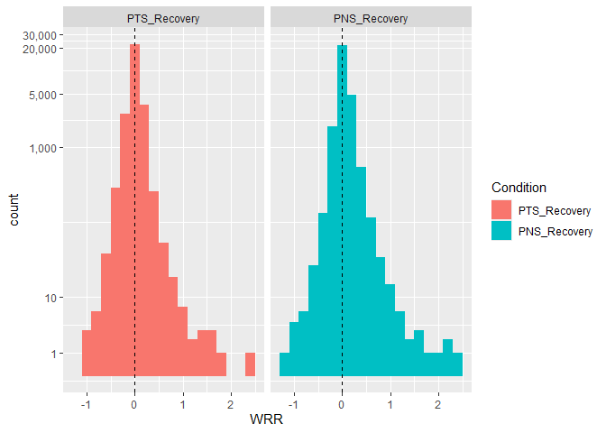
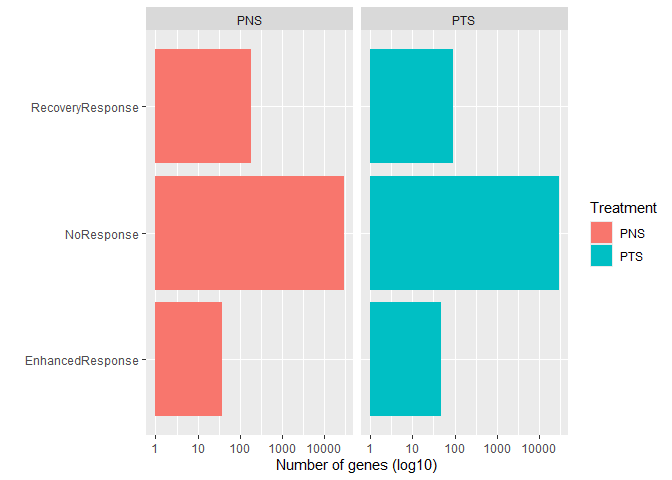
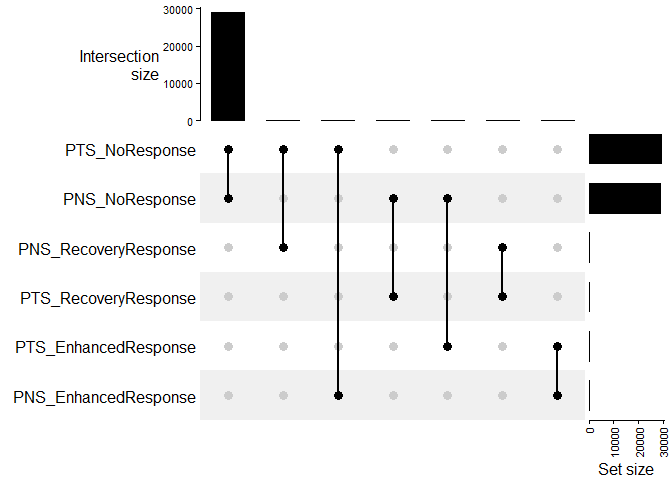

Weighted Recovery Ratios
================
Marco Tello
2024-11-28

# Analysis of RNA-seq data using recovery rates

The goal of the current analysis is to identify:

1)  FA-amplified PTS/PNS targets  
2)  FA-affected PTS/PNS targets  
3)  Unique PTS/PNS targets

``` r
rnaseq_reads <- fread("~/GitHub/RNAseq_amelie/data/salmon_quant/Salmon_EstCount_ENSG.tsv")

ensembl <- useEnsembl(biomart="genes", dataset="hsapiens_gene_ensembl", mirror="asia")
  
bm <- getBM( attributes = c("external_gene_name","ensembl_gene_id"),
             filters    = "ensembl_gene_id",
             values     = rnaseq_reads$ENSG,
             mart       = ensembl)
bm <- as.data.table(bm)

rnaseq_reads <- merge.data.table(x = bm, y = rnaseq_reads, 
                                 by.x = "ensembl_gene_id", by.y = "ENSG", 
                                 all.y = TRUE)
rnaseq_reads[, ensembl_gene_id := NULL]

setnames(rnaseq_reads, "external_gene_name", "ENSG")

rnaseq_reads
```

    ##           ENSG     CTRL1     CTRL2     CTRL3       FA1      FA2       FA3
    ##         <char>     <num>     <num>     <num>     <num>    <num>     <num>
    ##     1:  TSPAN6   490.583   583.318   609.847   592.693  371.778   468.152
    ##     2:    TNMD     0.000     0.000     0.000     0.000    0.000     0.000
    ##     3:    DPM1   931.002   914.061   973.025  1229.374  770.847   863.304
    ##     4:   SCYL3   453.748   366.685   410.694   423.449  296.168   352.447
    ##     5:   FIRRM   561.268   552.955   452.848   655.499  470.701   452.841
    ##    ---                                                                   
    ## 34375:             5.143     2.039     9.691     1.000    3.166     7.014
    ## 34376:    CAST 11330.149 10797.991 10998.020 11540.983 7907.745 10077.132
    ## 34377:             6.213     0.000     6.897     5.014    8.679     0.000
    ## 34378:    PAXX   509.000   432.999   508.001   448.000  363.000   342.000
    ## 34379: FAM174C   660.315   606.245   688.815   633.606  462.903   376.600
    ##            PNS1     PNS2     PNS3     PTS1     PTS2     PTS3
    ##           <num>    <num>    <num>    <num>    <num>    <num>
    ##     1:  476.141  323.643  342.929  456.642  362.562  384.000
    ##     2:    0.000    0.000    0.000    0.000    0.000    0.000
    ##     3: 1022.060  673.441  698.893 1023.782  860.727  776.261
    ##     4:  257.311  245.401  231.095  335.146  250.296  269.706
    ##     5:  563.267  404.051  430.115  672.040  556.716  464.216
    ##    ---                                                      
    ## 34375:    8.873    5.011    7.109    0.000    8.030    0.000
    ## 34376: 8669.940 6459.514 7275.921 9400.876 8382.817 8264.542
    ## 34377:    9.495    0.000    0.000    0.000    0.000    1.566
    ## 34378:  491.000  337.000  366.000  379.000  490.000  383.000
    ## 34379:  361.209  322.561  344.761  459.488  411.349  332.055

## Alternative proposal for log2(FC): Weighted Recovery Ratio

$\text{Weighted Recovery Ratio} = \left(1 - \frac{\text{Treatment} - \text{Ctrl}}{Stress - \text{Ctrl}}\right) \cdot \left|Stress - \text{Ctrl\right|$

Rationale

To quantify the extent to which a treatment (PTS or PNS) restores gene
expression altered by fatty acid (FA) stress back to the healthy
baseline (Ctrl). This metric accounts for both the proportional recovery
(directional reversion toward Ctrl) and the biological significance of
the fatty acid stress-induced changes (magnitude of the FA-Ctrl shift).

Components

Proportional Recovery (Term between parenthesis): This term captures the
relative shift of gene expression under treatment compared to the shift
caused by H₂O₂. A value closer to 1 indicates near-complete recovery to
Ctrl, while values \< 0 indicate expression moving further away from
Ctrl.

Biological Magnitude Weighting \| Absolute term \|: This term weights
the proportional recovery by the magnitude of the expression change
induced by H₂O₂. This means that genes with larger H₂O₂-induced shifts
are given more importance.

Ranges and Interpretation

If you consider x as the Weighted Recovery Ratio of any given gene:

x \< 0 : The treatment pushes expression levels further away from Ctrl
in the same direction as the stress effect. Meaning the treatment
exacerbated the stress-induced dysregulation. This is not necessarily
bad, since a “dysregulation” mechanism could help restore homeostasis.

x ∼ 0: Minimal recovery or no effect of the treatment.

0 \< x \< 1: Partial recovery, the treatment was moderately effective in
reversing oxidative stress-induced dysregulation.

x ≥ 1: Complete or “over-recovery”, the treatment effectively restores
expression to healthy levels, potentially also overshooting healthy
baseline.

## Calculate Recovery Rates

We first calculate average VST values for all genes within each
experimental condition.

``` r
rnaseq_vst <- data.table(ENSG = rnaseq_reads$ENSG,
                         DESeq2:::vst(as.matrix(ceiling(rnaseq_reads[, 
                                                                     .SD, 
                                                                     .SDcols = !"ENSG"]))))
```

    ## converting counts to integer mode

``` r
rnaseq_vst <- melt(rnaseq_vst, id.vars = "ENSG", variable.name = "Condition", value.name = "VST")
rnaseq_vst[, Condition := gsub("[1-3]", "", Condition)]
rnaseq_vst[, VST := mean(VST), by = c("ENSG", "Condition")]
rnaseq_vst <- dcast(unique(rnaseq_vst), formula = ENSG ~ Condition, value.var = "VST")
rnaseq_vst
```

    ## Key: <ENSG>
    ##            ENSG      CTRL        FA       PNS       PTS
    ##          <char>     <num>     <num>     <num>     <num>
    ##     1:           7.379710  7.374581  7.373829  7.369623
    ##     2:  5S_rRNA  7.289850  7.289850  7.289850  7.289850
    ##     3:     A1BG  8.570720  8.507866  8.430727  8.416556
    ##     4:     A1CF  7.396621  7.416653  7.375286  7.358978
    ##     5:      A2M  7.539861  7.480312  7.583222  7.523981
    ##    ---                                                 
    ## 29240: ZYG11AP1  7.289850  7.289850  7.289850  7.289850
    ## 29241:   ZYG11B 10.356800 10.375551 10.278959 10.304424
    ## 29242:    ZYXP1  7.289850  7.289850  7.289850  7.289850
    ## 29243:    ZZEF1 10.825563 11.019492 11.018835 10.968469
    ## 29244:     ZZZ3 10.578216 10.599932 10.531292 10.669332

Next, we calculate the recovery ratios for each experimental condition

``` r
rnaseq_rank <- rnaseq_vst

rnaseq_rank[, AbsoluteEffect := FA - CTRL]
rnaseq_rank[, PTS_Recovery := round((1 - ((PTS - CTRL)/(AbsoluteEffect))) * abs(AbsoluteEffect), 5)]
rnaseq_rank[, PNS_Recovery := round((1 - ((PNS - CTRL)/(AbsoluteEffect))) * abs(AbsoluteEffect), 5)]

rnaseq_rank[, PTS_Recovery := ifelse(AbsoluteEffect == 0, 0, PTS_Recovery)]
rnaseq_rank[, PNS_Recovery := ifelse(AbsoluteEffect == 0, 0, PNS_Recovery)]

rnaseq_rank <- rnaseq_rank[, .SD, .SDcols = c("ENSG", "PTS_Recovery", "PNS_Recovery")]
setorder(rnaseq_rank, PTS_Recovery)
rnaseq_rank
```

    ##          ENSG PTS_Recovery PNS_Recovery
    ##        <char>        <num>        <num>
    ##     1:  CLDN1     -0.92484     -0.50757
    ##     2:  ABCG1     -0.91989     -0.53508
    ##     3:   ASNS     -0.91287     -1.10422
    ##     4: PKD1P3     -0.84338     -0.05288
    ##     5: FGFBP1     -0.81867     -0.59186
    ##    ---                                 
    ## 29240:  PANK4      1.54117      0.52708
    ## 29241: AKR1C3      1.56986      2.13193
    ## 29242: AKR1C2      1.68578      2.41983
    ## 29243:   RRN3      1.70170      1.60170
    ## 29244: DCAF15      2.49393      0.00000

## Visualize Recovery rates

``` r
apply(rnaseq_rank[, .SD, .SDcols = -"ENSG"], MARGIN = 2, summary)
```

    ##         PTS_Recovery PNS_Recovery
    ## Min.    -0.924840000  -1.10422000
    ## 1st Qu. -0.016705000   0.00000000
    ## Median   0.000000000   0.00000000
    ## Mean     0.007973473   0.03113815
    ## 3rd Qu.  0.045287500   0.07102250
    ## Max.     2.493930000   2.41983000

``` r
recovery_dt <- melt(rnaseq_rank, id.vars = "ENSG", variable.name = "Condition", value.name = "WRR")
ggplot(recovery_dt, aes(x = WRR, fill = Condition)) + 
  geom_histogram(binwidth = 0.2) +
  geom_vline(xintercept = 0, colour = "black", linetype = "dashed") +
  scale_y_continuous(trans = "log1p", labels = comma, breaks = c(1, 10, 1000, 5000, 20000, 30000))+
  facet_wrap(~Condition)
```

<!-- -->

The histograms represent the recovery rates calculated on VST counts.
Most genes showed a moderate to large recovery centered at 0. Based on
the summary statistics and histograms, seems like PNS had the highest
recovery while GEN had the strongest effect overall.

## Classification of genes based on WRR

``` r
rnaseq_rank[, PTS_Classification := ifelse(PTS_Recovery < -0.5, "EnhancedResponse", "NoResponse")]
rnaseq_rank[, PTS_Classification := ifelse(PTS_Recovery > 0.5, "RecoveryResponse", PTS_Classification)]

rnaseq_rank[, PNS_Classification := ifelse(PNS_Recovery < -0.5, "EnhancedResponse", "NoResponse")]
rnaseq_rank[, PNS_Classification := ifelse(PNS_Recovery > 0.5, "RecoveryResponse", PNS_Classification)]

setcolorder(rnaseq_rank, c("ENSG", "PTS_Recovery", "PTS_Classification"))
rnaseq_rank
```

    ##          ENSG PTS_Recovery PTS_Classification PNS_Recovery PNS_Classification
    ##        <char>        <num>             <char>        <num>             <char>
    ##     1:  CLDN1     -0.92484   EnhancedResponse     -0.50757   EnhancedResponse
    ##     2:  ABCG1     -0.91989   EnhancedResponse     -0.53508   EnhancedResponse
    ##     3:   ASNS     -0.91287   EnhancedResponse     -1.10422   EnhancedResponse
    ##     4: PKD1P3     -0.84338   EnhancedResponse     -0.05288         NoResponse
    ##     5: FGFBP1     -0.81867   EnhancedResponse     -0.59186   EnhancedResponse
    ##    ---                                                                       
    ## 29240:  PANK4      1.54117   RecoveryResponse      0.52708   RecoveryResponse
    ## 29241: AKR1C3      1.56986   RecoveryResponse      2.13193   RecoveryResponse
    ## 29242: AKR1C2      1.68578   RecoveryResponse      2.41983   RecoveryResponse
    ## 29243:   RRN3      1.70170   RecoveryResponse      1.60170   RecoveryResponse
    ## 29244: DCAF15      2.49393   RecoveryResponse      0.00000         NoResponse

``` r
dt_plot <- rnaseq_rank[, .(ENSG, PTS_Classification, PNS_Classification)]
dt_plot <- melt(dt_plot, id.vars = "ENSG")
dt_plot[, variable := stringr:::str_remove(variable, "_Classification")]

ggplot(dt_plot, aes(x = value, fill = variable)) +
  geom_bar(position=position_dodge()) + 
  facet_wrap( ~ variable) +
  scale_y_continuous(trans = "log10") +
  coord_flip() +
  labs(x = "", y = "Number of genes (log10)",
       fill = "Treatment")
```

<!-- -->

``` r
upset_dt <- dt_plot[, .(ENSG, Class = paste(variable, value, sep = "_"))]
upset_dt <- dcast(upset_dt, ENSG ~ Class, fun.aggregate = length)

upset_mat <- as.matrix(upset_dt[, !"ENSG"])
rownames(upset_mat) <- upset_dt$ENSG

upset_mat <- make_comb_mat(upset_mat)

upset_mat
```

    ## A combination matrix with 6 sets and 7 combinations.
    ##   ranges of combination set size: c(19, 28960).
    ##   mode for the combination size: distinct.
    ##   sets are on rows.
    ## 
    ## Combination sets are:
    ##   PNS_EnhancedResponse PNS_NoResponse PNS_RecoveryResponse PTS_EnhancedResponse PTS_NoResponse PTS_RecoveryResponse   code  size
    ##                      x                                                        x                                     100100    19
    ##                      x                                                                       x                      100010    19
    ##                                     x                                         x                                     010100    29
    ##                                     x                                                        x                      010010 28960
    ##                                     x                                                                             x 010001    33
    ##                                                          x                                   x                      001010   127
    ##                                                          x                                                        x 001001    57
    ## 
    ## Sets are:
    ##                    set  size
    ##   PNS_EnhancedResponse    38
    ##         PNS_NoResponse 29022
    ##   PNS_RecoveryResponse   184
    ##   PTS_EnhancedResponse    48
    ##         PTS_NoResponse 29106
    ##   PTS_RecoveryResponse    90

``` r
UpSet(upset_mat)
```

<!-- -->

``` r
# PNS Recovery & PTS NoResponse
extract_comb(upset_mat, "001010")
```

    ##   [1] "ADM2"           "AKT3"           "ALDH1A3"        "ALDH1L2"       
    ##   [5] "ALDH3A2"        "ANKRD1"         "ASPH"           "ATAT1"         
    ##   [9] "BLOC1S5-TXNDC5" "BOLA2B"         "C1QTNF6"        "C5orf34"       
    ##  [13] "CASTOR2"        "CD24"           "CDC42EP1"       "CDC42EP2"      
    ##  [17] "CDKN1C"         "CHAC1"          "CLN8"           "CNTNAP3C"      
    ##  [21] "CORO7"          "CSF3"           "CSGALNACT1"     "CYP1A1"        
    ##  [25] "CYP4F11"        "DAXX"           "EPB41L4A"       "EPHX1"         
    ##  [29] "ERRFI1"         "ETNK2"          "F3"             "FADS1"         
    ##  [33] "FAM220A"        "FAM83H"         "FAP"            "FLOT1"         
    ##  [37] "FOXO1"          "FOXQ1"          "FTH1"           "FTL"           
    ##  [41] "GFUS"           "GOLGA8B"        "HES1"           "HMOX1"         
    ##  [45] "HRK"            "INTS3"          "ITGB2"          "ITGB4"         
    ##  [49] "KNTC1"          "LTBP1"          "LTBP4"          "MAPK4"         
    ##  [53] "MARF1"          "MARVELD1"       "MCAM"           "MEGF6"         
    ##  [57] "MELTF"          "MLPH"           "MME"            "MT-ATP6"       
    ##  [61] "MT-ATP8"        "MT-CYB"         "MT-ND1"         "MT-ND4"        
    ##  [65] "MT-ND4L"        "MT-ND5"         "MT-ND6"         "MT1X"          
    ##  [69] "MTATP6P1"       "MYC"            "MYZAP"          "NAV3"          
    ##  [73] "NDRG1"          "NIBAN1"         "NLRP1"          "NOXA1"         
    ##  [77] "NPIPA1"         "NPIPA7"         "OPLAH"          "OSGIN1"        
    ##  [81] "PAN2"           "PCDH1"          "PCLO"           "PEDS1-UBE2V1"  
    ##  [85] "PIR"            "PLCH2"          "PPIF"           "PPIP5K1P1"     
    ##  [89] "PPP1R11"        "PPP2R3B"        "PRDX1"          "PRKACA"        
    ##  [93] "PRR5L"          "PRSS23"         "PSMB3"          "PSMC1P1"       
    ##  [97] "RAB7B"          "RAC1P2"         "RGS2"           "RNF39"         
    ## [101] "RPL23AP47"      "RPS9"           "SCNN1A"         "SCNN1G"        
    ## [105] "SERPINB2"       "SH3TC1"         "SIK1"           "SLC1A4"        
    ## [109] "SLC6A9"         "SQSTM1"         "SRGAP3"         "STARD10"       
    ## [113] "SYNRG"          "TGFB2"          "TGM2"           "THBS1"         
    ## [117] "TIMP3"          "TIPARP"         "TKT"            "TNS4"          
    ## [121] "TRIM39"         "TRMT6"          "TXNRD1"         "UNC5B"         
    ## [125] "VGLL3"          "VSTM2L"         "ZBED6"

``` r
# PNS Enhanced & PTS NoResponse
extract_comb(upset_mat, "100010")
```

    ##  [1] "AKAP12"        "CHTF18"        "DBP"           "DCAF11"       
    ##  [5] "EME1"          "F2R"           "FBXO32"        "GBE1"         
    ##  [9] "GPCPD1"        "IFNAR2-IL10RB" "IFNGR2"        "KIF21B"       
    ## [13] "KLF10"         "MAP1B"         "MT-ND2"        "RGPD5"        
    ## [17] "RUFY1"         "TMEM265"       "VPS52"

``` r
# PTS Recovery & PNS NoResponse
extract_comb(upset_mat, "010001")
```

    ##  [1] "ABCC2"          "ANGPTL4"        "AOX1"           "ARMCX5-GPRASP2"
    ##  [5] "BHLHE40"        "CCNA1"          "DCAF15"         "DDIT4"         
    ##  [9] "DST"            "IMPA2"          "ITGB8"          "KANSL1"        
    ## [13] "KPNA2"          "LAMA3"          "NDUFA6"         "NOTCH3"        
    ## [17] "NSF"            "NT5E"           "PDK4"           "PFDN6"         
    ## [21] "PKN1"           "POLR1H"         "PPP1R10"        "RPL13AP7"      
    ## [25] "RPP21"          "RXRB"           "SYNJ2BP-COX16"  "TBC1D3C"       
    ## [29] "TRIM56"         "TRIM61"         "TSC22D1"        "UBALD2"        
    ## [33] "ZBTB22"

``` r
# PTS Enhanced & PNS NoResponse
extract_comb(upset_mat, "010100")
```

    ##  [1] "ARL2-SNX15" "ATF6B"      "C1S"        "CDCA2"      "CDK1"      
    ##  [6] "CELSR2"     "CFB"        "CHI3L1"     "CXCL2"      "DDIT3"     
    ## [11] "DLL1"       "DTL"        "FAM156B"    "GBP2"       "GDF15"     
    ## [16] "GFPT2"      "H2AC19"     "HERPUD1"    "MFSD2A"     "PIGW"      
    ## [21] "PKD1P3"     "S100A14"    "SAA2"       "SERPINB4"   "SYNE2"     
    ## [26] "TMT1A"      "TP63"       "TPX2"       "ZC3H12A"

## Overlap with DEGs

``` r
degs <- fread("~/GitHub/RNAseq_amelie/output/DEG_results.tsv")
degs <- degs[, .(external_gene_name, log2FoldChange, padj, Group)]
degs <- unique(degs[external_gene_name != ""])

# Add Categories of interest
degs[, WRR_category := "None"]
# PNS Recovery & PTS NoResponse
degs[external_gene_name %in% extract_comb(upset_mat, "001010"), 
     WRR_category := "PNS_Recovery"]
# PTS Recovery & PTS NoResponse
degs[external_gene_name %in% extract_comb(upset_mat, "001010"), 
     WRR_category := "PTS_Recovery"]
# PNS Enhanced & PTS NoResponse
degs[external_gene_name %in% extract_comb(upset_mat, "100010"), 
     WRR_category := "PNS_Enhanced"]
# PTS Enhanced & PTS NoResponse
degs[external_gene_name %in% extract_comb(upset_mat, "010100"), 
     WRR_category := "PTS_Enhanced"]

degs
```

    ## Index: <external_gene_name>
    ##        external_gene_name log2FoldChange       padj      Group WRR_category
    ##                    <char>          <num>      <num>     <char>       <char>
    ##     1:             TSPAN6    -0.03000035 0.96302484 FA_vs_Ctrl         None
    ##     2:             TSPAN6    -0.24834562 0.40533655  PNS_vs_FA         None
    ##     3:             TSPAN6     0.07271154 0.87612999  PTS_vs_FA         None
    ##     4:               DPM1     0.11010261 0.68064241 FA_vs_Ctrl         None
    ##     5:               DPM1     0.07936227 0.73411831  PNS_vs_FA         None
    ##    ---                                                                     
    ## 37064:               PAXX     0.33320222 0.09088002  PNS_vs_FA         None
    ## 37065:               PAXX     0.33719849 0.10355064  PTS_vs_FA         None
    ## 37066:            FAM174C    -0.28915878 0.24189752 FA_vs_Ctrl         None
    ## 37067:            FAM174C    -0.16675788 0.53599549  PNS_vs_FA         None
    ## 37068:            FAM174C    -0.11025983 0.74315621  PTS_vs_FA         None

``` r
temp <- degs[padj < alpha & WRR_category != "None" & Group == "PNS_vs_FA", 
             .(external_gene_name, log2FoldChange, WRR_category)]
setorder(temp, "log2FoldChange")
temp
```

    ##     external_gene_name log2FoldChange WRR_category
    ##                 <char>          <num>       <char>
    ##  1:      IFNAR2-IL10RB     -2.5503099 PNS_Enhanced
    ##  2:             CYP1A1     -2.0995992 PTS_Recovery
    ##  3:           SERPINB2     -1.5408698 PTS_Recovery
    ##  4:              RAB7B     -1.3965364 PTS_Recovery
    ##  5:            TMEM265     -1.3819865 PNS_Enhanced
    ##  6:              HMOX1     -1.3418144 PTS_Recovery
    ##  7:             OSGIN1     -1.3014401 PTS_Recovery
    ##  8:             TXNRD1     -1.1695380 PTS_Recovery
    ##  9:                DBP     -1.0134884 PNS_Enhanced
    ## 10:              MYZAP     -1.0038545 PTS_Recovery
    ## 11:                FTL     -0.9853900 PTS_Recovery
    ## 12:                F2R     -0.9265556 PNS_Enhanced
    ## 13:            STARD10     -0.9256923 PTS_Recovery
    ## 14:            CASTOR2     -0.8634654 PTS_Recovery
    ## 15:             IFNGR2     -0.8623068 PNS_Enhanced
    ## 16:             TIPARP     -0.7937898 PTS_Recovery
    ## 17:            ALDH1A3     -0.7700318 PTS_Recovery
    ## 18:                PIR     -0.7427852 PTS_Recovery
    ## 19:              EPHX1     -0.7388137 PTS_Recovery
    ## 20:            ALDH3A2     -0.7280825 PTS_Recovery
    ## 21:               GBE1     -0.7223938 PNS_Enhanced
    ## 22:            CYP4F11     -0.7211072 PTS_Recovery
    ## 23:               FTH1     -0.6814890 PTS_Recovery
    ## 24:             SQSTM1     -0.6681184 PTS_Recovery
    ## 25:               ASPH     -0.6399054 PTS_Recovery
    ## 26:               PPIF     -0.5699182 PTS_Recovery
    ## 27:              PRDX1     -0.5691040 PTS_Recovery
    ## 28:              ZBED6     -0.5550368 PTS_Recovery
    ## 29:                TKT     -0.5179192 PTS_Recovery
    ## 30:              NDRG1     -0.5063685 PTS_Recovery
    ## 31:              SYNE2     -0.4776296 PTS_Enhanced
    ## 32:            S100A14      0.3906778 PTS_Enhanced
    ## 33:              FOXO1      0.4806567 PTS_Recovery
    ## 34:              ITGB4      0.4840766 PTS_Recovery
    ## 35:             SRGAP3      0.5563220 PTS_Recovery
    ## 36:             SCNN1G      0.5609662 PTS_Recovery
    ## 37:             SCNN1A      0.5644595 PTS_Recovery
    ## 38:           MARVELD1      0.5885082 PTS_Recovery
    ## 39:              FADS1      0.5939059 PTS_Recovery
    ## 40:             MT-ND2      0.6100625 PNS_Enhanced
    ## 41:               TNS4      0.6166902 PTS_Recovery
    ## 42:              PCDH1      0.6183864 PTS_Recovery
    ## 43:             VSTM2L      0.6327052 PTS_Recovery
    ## 44:             MT-ND6      0.6453495 PTS_Recovery
    ## 45:                 F3      0.6630910 PTS_Recovery
    ## 46:              LTBP1      0.6680282 PTS_Recovery
    ## 47:              THBS1      0.6777544 PTS_Recovery
    ## 48:              KLF10      0.6784106 PNS_Enhanced
    ## 49:             ERRFI1      0.6825614 PTS_Recovery
    ## 50:              MAP1B      0.6969336 PNS_Enhanced
    ## 51:            MT-ATP6      0.6975553 PTS_Recovery
    ## 52:                MYC      0.6995759 PTS_Recovery
    ## 53:               MCAM      0.7100014 PTS_Recovery
    ## 54:              TRMT6      0.7321211 PTS_Recovery
    ## 55:               MT1X      0.7439617 PTS_Recovery
    ## 56:              ITGB2      0.7565859 PTS_Recovery
    ## 57:           CDC42EP1      0.7605947 PTS_Recovery
    ## 58:             AKAP12      0.7766232 PNS_Enhanced
    ## 59:            ALDH1L2      0.7841555 PTS_Recovery
    ## 60:             MT-ND5      0.8026528 PTS_Recovery
    ## 61:               EME1      0.8690194 PNS_Enhanced
    ## 62:              OPLAH      0.8836899 PTS_Recovery
    ## 63:              TIMP3      0.8968137 PTS_Recovery
    ## 64:               HES1      0.9138324 PTS_Recovery
    ## 65:              MELTF      0.9169871 PTS_Recovery
    ## 66:                MME      0.9224943 PTS_Recovery
    ## 67:               CSF3      0.9453199 PTS_Recovery
    ## 68:           CDC42EP2      0.9522013 PTS_Recovery
    ## 69:             GPCPD1      0.9657324 PNS_Enhanced
    ## 70:                FAP      0.9849859 PTS_Recovery
    ## 71:              UNC5B      1.0108047 PTS_Recovery
    ## 72:              NLRP1      1.0338529 PTS_Recovery
    ## 73:              PRR5L      1.0385074 PTS_Recovery
    ## 74:             SLC6A9      1.0464054 PTS_Recovery
    ## 75:             KIF21B      1.0919150 PNS_Enhanced
    ## 76:              ETNK2      1.1144992 PTS_Recovery
    ## 77:            C5orf34      1.1207504 PTS_Recovery
    ## 78:               TGM2      1.1280750 PTS_Recovery
    ## 79:               ADM2      1.1369477 PTS_Recovery
    ## 80:               RGS2      1.1896050 PTS_Recovery
    ## 81:             SLC1A4      1.2017860 PTS_Recovery
    ## 82:              NOXA1      1.2140588 PTS_Recovery
    ## 83:               CD24      1.2596074 PTS_Recovery
    ## 84:         CSGALNACT1      1.2670386 PTS_Recovery
    ## 85:             ANKRD1      1.3254609 PTS_Recovery
    ## 86:            C1QTNF6      1.3628243 PTS_Recovery
    ## 87:              TGFB2      1.4624056 PTS_Recovery
    ## 88:            PPP2R3B      1.4884728 PTS_Recovery
    ## 89:              CHAC1      1.5040152 PTS_Recovery
    ## 90:             CDKN1C      1.6370961 PTS_Recovery
    ## 91:             PRSS23      1.6540853 PTS_Recovery
    ## 92:              FOXQ1      1.8320865 PTS_Recovery
    ## 93:             NIBAN1      2.0618429 PTS_Recovery
    ## 94:              MAPK4      2.5253892 PTS_Recovery
    ##     external_gene_name log2FoldChange WRR_category

``` r
temp <- degs[padj < alpha & WRR_category != "None" & Group == "PTS_vs_FA", 
             .(external_gene_name, log2FoldChange, WRR_category)]
setorder(temp, "log2FoldChange")
temp
```

    ##     external_gene_name log2FoldChange WRR_category
    ##                 <char>          <num>       <char>
    ##  1:             CHI3L1     -3.0568706 PTS_Enhanced
    ##  2:              CXCL2     -1.2794920 PTS_Enhanced
    ##  3:              HMOX1     -1.1721186 PTS_Recovery
    ##  4:              GFPT2     -1.1132523 PTS_Enhanced
    ##  5:             MFSD2A     -0.9134585 PTS_Enhanced
    ##  6:               GBP2     -0.8803815 PTS_Enhanced
    ##  7:              MYZAP     -0.8629877 PTS_Recovery
    ##  8:            ZC3H12A     -0.8397250 PTS_Enhanced
    ##  9:               SAA2     -0.8059998 PTS_Enhanced
    ## 10:                DBP     -0.8046242 PNS_Enhanced
    ## 11:             CELSR2     -0.7976462 PTS_Enhanced
    ## 12:            CASTOR2     -0.7703810 PTS_Recovery
    ## 13:               TP63     -0.6895281 PTS_Enhanced
    ## 14:              TMT1A     -0.6671090 PTS_Enhanced
    ## 15:                F2R     -0.6479069 PNS_Enhanced
    ## 16:              SYNE2     -0.6386403 PTS_Enhanced
    ## 17:           SERPINB2     -0.6262761 PTS_Recovery
    ## 18:                PIR     -0.6051421 PTS_Recovery
    ## 19:              ZBED6     -0.5737138 PTS_Recovery
    ## 20:            ALDH3A2     -0.5314117 PTS_Recovery
    ## 21:              EPHX1     -0.5252508 PTS_Recovery
    ## 22:                FTL     -0.4848527 PTS_Recovery
    ## 23:               GBE1     -0.4824456 PNS_Enhanced
    ## 24:               PPIF     -0.4572243 PTS_Recovery
    ## 25:               ASPH     -0.4061442 PTS_Recovery
    ## 26:                TKT     -0.2989342 PTS_Recovery
    ## 27:              ITGB4      0.2761689 PTS_Recovery
    ## 28:               CSF3      0.3180721 PTS_Recovery
    ## 29:            ALDH1L2      0.3819002 PTS_Recovery
    ## 30:             SCNN1A      0.3913543 PTS_Recovery
    ## 31:             GPCPD1      0.4407487 PNS_Enhanced
    ## 32:           CDC42EP1      0.4986176 PTS_Recovery
    ## 33:             VSTM2L      0.5022145 PTS_Recovery
    ## 34:            S100A14      0.5114353 PTS_Enhanced
    ## 35:            HERPUD1      0.5274431 PTS_Enhanced
    ## 36:             AKAP12      0.5343742 PNS_Enhanced
    ## 37:              ITGB2      0.5526326 PTS_Recovery
    ## 38:               TPX2      0.5675151 PTS_Enhanced
    ## 39:              CDCA2      0.6347934 PTS_Enhanced
    ## 40:               ADM2      0.6499851 PTS_Recovery
    ## 41:              GDF15      0.6506341 PTS_Enhanced
    ## 42:               TGM2      0.7018658 PTS_Recovery
    ## 43:              DDIT3      0.7421596 PTS_Enhanced
    ## 44:             KIF21B      0.7828338 PNS_Enhanced
    ## 45:                FAP      0.7942365 PTS_Recovery
    ## 46:              MELTF      1.0006436 PTS_Recovery
    ## 47:              TGFB2      1.0096860 PTS_Recovery
    ## 48:                DTL      1.0773611 PTS_Enhanced
    ##     external_gene_name log2FoldChange WRR_category
